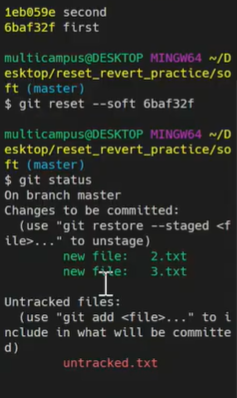
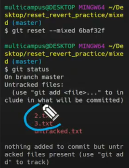
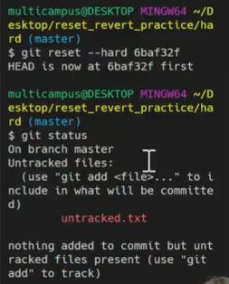

# git 

## undoing things

파일의 수정 상태를 수정전으로 변경한다

수정전으로 덮어씌우는 것이기 때문에 수정했던 사항은 다시 회복할 수 없음

```bash
git restore test.md
```


staging area 에 올라온 것을 다시 working directory로 빼온다

```bash
1. 아직 커밋 안한 상태
git rm --cached test.md
2. 커밋 한 후
git restore --staged test.md
```


직전에 완료한 커밋 한거 수정

1. 마지막 커밋하고 나서 수정한 것이 없을 떄

   git commit --amend: 커밋 메세지만 수정

2. staging area에 새로 올라온 내용이 있을 때

   git commit --amend: 이전 커밋 덮어씌우기


### git commit --amend

git commit --amend 하면 vim editor가 뜸

맨 위에 뜬게 커밋 메세지 그리고 밑에는 커밋의 정보들

`i`: 끼워넣기로 바뀌고 키보드로 수정 가능하게끔 상황이 바뀜

`esc`: 입력모드 종료 

`:wq` 수정하고 나가줘!

커밋 메세지도 변경하지만 커밋 해쉬값도 변경됨


여러개의 파일 중에 특정 부분만 git add를 했음, 그러나 함께 다시 올리고 싶음 

1. 나머지 파일들도 git add 해줘서 staging area에 올라감
2. `git commit --amend`
3. 그럼 나머지 파일들도 new file로 올라가는 것을 볼 수 있음
4. `:wq`
5. `git log`를 확인해보면 다같이 한 커밋에 올라간 걸 볼 수 있음


## reset& revert

### git reset

특정 커밋 상태로 되돌아감(과거)

```bash
$ git reset [옵션] <커밋 id>
```

대신 해당 커밋 이후로 쌓아놨던 커밋들은 전부 사라짐

이전 커밋으로 돌아가고, 돌아간 커밋 이후의 내역을 사라짐


* 옵션

1. `--soft`

   - **돌아가려는 커밋으로 되돌아가고**,
   - 이후의 commit된 파일들을 `staging area`로 돌려놓음 (commit 하기 전 상태)
   - 즉, 다시 커밋할 수 있는 상태가 됨

2. `--mixed`

   - **돌아가려는 커밋으로 되돌아가고**,
   - 이후의 commit된 파일들을 `working directory`로 돌려놓음 (add 하기 전 상태)
   - 즉, unstage 된 상태로 남아있음
   - 기본 값

3. `--hard`

   - **돌아가려는 커밋으로 되돌아가고**,
   - 이후의 commit된 파일들(`tracked 파일들`)은 모두 working directory에서 삭제
   - 단, Untracked 파일은 그대로 Untracked로 남음


1. soft



add 가 된 상태


2. mixed



3. 

untracked는 commit이 한번되 되지 않아서 위에 옵션들에 의해 전혀 관리 받지 않고 있다


이미 삭제한 커밋으로 다시 복구

```bash
git reflog
```

과거에 있었던 모든 커밋들 다 나옴

```bash
git reset --hard <해쉬id>
```

이렇게 하면 다시 복구 가능!

원상 복구할 때는 hard 만 가능


### git revert

```bash
$ git revert <커밋id>
```

특정 사건을 없었던 일로 만드는 행위, 이전 커밋을 취소한다는 새로운 커밋


## git workflow

