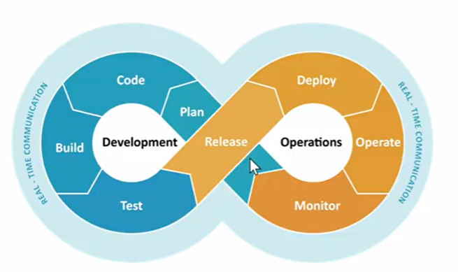
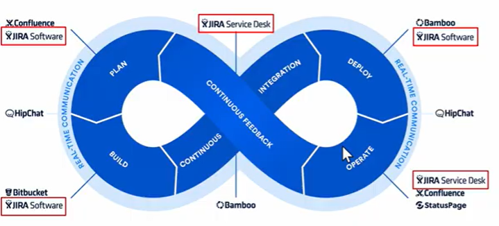
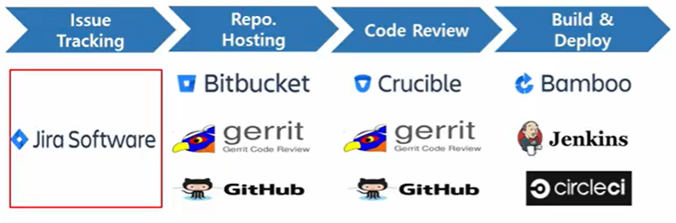

# Jira 및 JQL 활용

issue tracking tools!

ex) kanboard, jira, whiteSource, azure devops ..

project management

프로젝트가 잘 흘러가게끔 관리! 

ex) 의사소통, 팀워크, 분석, 예산, 계획, 문제 해결, 위험, goals, deadlines 등등

## scrum & kanban

* scrum : 2주에서 3주정도 할일을 전부 담아두고, 백로그에서 가져다가 어떤 일을 하자 ! sprint!

* kanban : 전체적인 프로젝트를 관리만!, scrum 보다는 자율성!

## devops

* 잘 수행하기 위한 조건
  * 반복적인 작업들을 tool을 이용해서 자동화
  * 팀원 모두가 알고 있는 하나의 공유된 지표가 필요
  * 장애나 이슈가 있을 때 혼자만 알지 말고 팀원들과 공유 필요

=> Jira!

## SRE

신뢰성 공학 - 소프트웨어가 얼마나 장애없이 지속하고 있는지!

소프트웨어를 장애없이 끌고 갈 수 있을까?

운영팀은 여기에 더 집중하자!

장애를 관리하려면, 장애 책임을 모두가 공유함으로써 장애가 발생하지 않는 것에 초점을 두는 CULTURE를 활성화

## JIRA start

1. create Issue
   1. 필드가 상당히 많음
   2. 프로젝트, issue type(소프트웨어에만 사용하는 것이 아니라 영업 등 다른 분야에도 사용 가능), 

## JQL

jira query language

jira issue를 구조적으로 검색하기 위해 제공하는 언어

* operators
  * = , !=, >, >=
  * in, not in
  * ~(contains), !~(not contains)
  * is empty, is not empty, is null, is not null
  * AND, OR, NOT, EMPTY, NULL, ORDER BY

