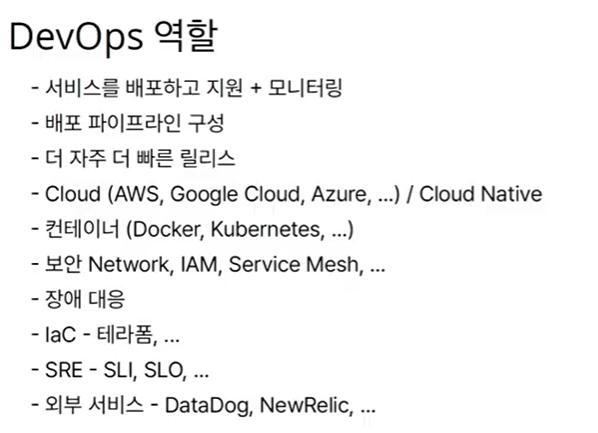

# devops

소프트웨어 개발+ 운영의 합성어

소프트웨어 개발자와 정보기술 전문가 간의 소통, 협업 및 통합을 강조하는 개발 환경 이나 문화

목적: 조직이 소프트웨어 제품과 서비스를 빠른 시간에 개발 및 배포하는 것


개발과 배포는 복잡하다 ...


도커 쿠버네티스를 사용하면 개발과 배포가 빨라질까요??

사실 데브옵스는 철학, 방법론 즉 문화임

따라서 서비스의 빠른 개발 & 배포가 주요하고 여러가지 방법을 사용해서 개선하고 싶은 행위가 데브옵스


## 도커 쿠버네티스

새로운 기술을 배우는 이유는 개발과 배포를 개선하기 위함

새로운 도구를 도입했는데 개발과 배포가 개선되지 않는다면 재검토

(적절한 시점, 규모를 잘 생각해야함)

도입하는게 좋을지 안좋을지 알아보자!


### 서버를 관리한다는 것

과거: 자체 서버 운영, 설정관리 도구 등장

- 서버주문, 등등 많은 노력과 관리 복잡

현재: 가상머신 등장, 클라우드 등장, PaaS 등장, 도커 등장, 쿠버네티스 등장, 서비스메시 등장

=> 서버를 운영하는 것을 편리하게 하기 위해서!


도커의 등장으로 인해 어떤 프로그램도 컨테이너로 만들어놓음!

```                                                                                                                                                                                                                                                                                                                                                   
컨테이너: 격리된 환경에서 작동하는 프로세스
```

가상머신처럼 독립적으로 실행되지만

가상머신보다 빠르고, 쉽고, 효율적!


### 컨테이너 오케스트레이션

컨테이너 관리도구 춘추전국시대,, 

=> 쿠버네티스 오픈소스 플랫폼


### 쿠버네티스

컨테이너를 쉽고 빠르게 배포/ 확장하고 관리를 자동화해주는 오픈소스 플랫폼


