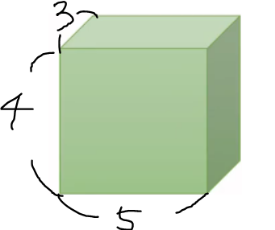

# tensor manipulation

[tensor manipulation](https://wikidocs.net/52460)


## tensor 만들기

* tensor 란

  * 1차원: 벡터

    2차원: 행렬(matrix)

    3차원: tensor라고 칭함

* tensor 만들기

  ```python
  import torch
  X = torch.rand(4)
  print(X)
  # tensor([0.5241, 0.9659, 0.2661, 0.2697])
  
  Y = torch.rand(3,4,5)
  print(Y)
  # tensor([[[0.0071, 0.0844, 0.4046, 0.0291, 0.9589],
  #         [0.3678, 0.2570, 0.6830, 0.8867, 0.2560],
  #         [0.6957, 0.1671, 0.5374, 0.5010, 0.2823],
  #         [0.2932, 0.9868, 0.0891, 0.6729, 0.2799]],
  
  #        [[0.1396, 0.2159, 0.4716, 0.2365, 0.2974],
  #         [0.2329, 0.7094, 0.4175, 0.2014, 0.9341],
  #         [0.0705, 0.5069, 0.6659, 0.2500, 0.7969],
  #         [0.5779, 0.3783, 0.4967, 0.7786, 0.0022]],
  
  #        [[0.8019, 0.6511, 0.1107, 0.9222, 0.0806],
  #         [0.4416, 0.6767, 0.7514, 0.1435, 0.0906],
  #         [0.9167, 0.2487, 0.5094, 0.3282, 0.6094],
  #         [0.1239, 0.4226, 0.0358, 0.9424, 0.5932]]])
  ```



* torch.rand
  * random numbers from a uniform distribution on the interval [0, 1)


## tensor의 차원과 형태

* dim: 차원

  ```python
  import torch
  X = torch.rand(4)
  print(X.dim())
  # 1
  
  Y = torch.rand(3, 4, 5)
  print(Y.dim())
  # 3
  ```

* shape, size(): 텐서의 모양

  shape는 attribute이고 size는 함수

  두 개가 출력하는 것은 동일

  ```python
  print(X.shape)
  print(X.size())
  # torch.Size([4])
  # torch.Size([4])
  
  print(Y.shape)
  print(Y.size())
  # torch.Size([3, 4, 5])
  # torch.Size([3, 4, 5])
  ```


## Mul과  Matmul의 차이

* X.matmul(Y) : 행렬 곱 (내적)

  ```python
  X = torch.rand(3, 2, 5)
  Y = torch.rand(3, 5, 3)
  
  D = X.matmul(Y)
  print(D.shape)
  # torch.Size([3, 2, 3])
  ```

* X.mul(Y): 각 원소 별로 곱하는 연산

  ```python
  X = torch.rand(3,2,5)
  Y = torch.rand(3,5,3)
  
  D = X.mul(Y)
  # RuntimeError: The size of tensor a (5) must match the size of tensor b (3) at non-singleton dimension 2
  ```

  각 원소 별로 곱하는 연산이라 행과 열 사이즈가 동일해야함!


## view()

텐서의 shape를 바꿔야할 경우 사용함

```python
X = torch.rand(3,2,5)
print(X.shape)
# torch.Size([3, 2, 5])

print(X.view(3,10).shape)
# torch.Size([3, 10])
```


## axis

다차원 텐서에 해당 함수 연산을 어떤 축으로 적용할지 결정하는데 사용

```python
res01=v.sum(axis=0)
# axis = 0 기준 합계
```


## squeeze & unsqueeze

특정 차원이 1인 경우 축소시키거나 차원을 확장시킬 때 사용

`torch.squeeze(X) # X: [100,1,20] => [100,20]`


## type casting

type이 같지 않으면 수치적인 문제가 발생할 수 있기 때문에 항상 유의!


## concatenate

두 개 이상의 텐서들을 지정된 축으로 쌓아서 더 큰 텐서를 만드는 함수

하나의 텐서로 합치기 위한 입력 텐서들은 concatenate하는 축을 제외하고는 모두 같은 크기를 가져야 함