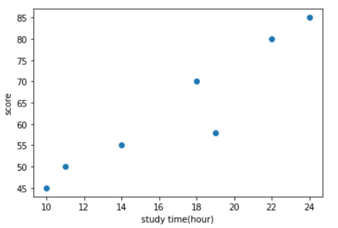
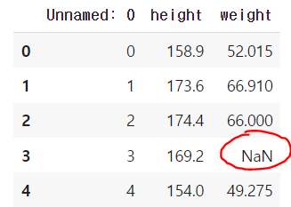
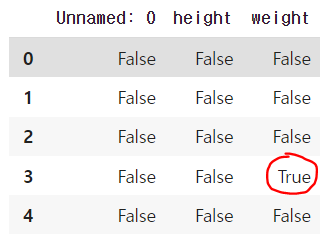
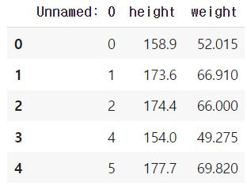
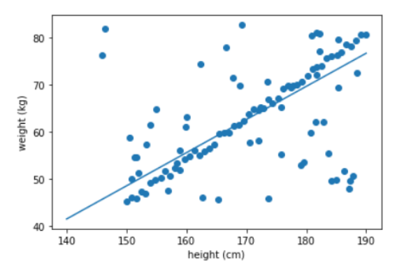

# learnable parameter 탐색

𝑓(𝑥)=𝑊𝑥+𝑏에 대해서, Weight 𝑊와 Bias 𝑏를 찾는 방법의 예제 


| study time | grade |
| ---------- | ----- |
| 10         | 45    |
| 11         | 50    |
| 14         | 55    |
| 18         | 70    |
| 19         | 58    |
| 22         | 80    |
| 24         | 85    |


* 텐서 만들기

  **study time과 Grade 각각을 torch.FloatTensor로 작성하시고, shape는 [7, 1], dimension은 2로 만들어 보세요.**

```python
Time = torch.FloatTensor([[10], [11], [14], [18], [19], [22], [24]])
Grade = torch.FloatTensor([[45], [50], [55], [70], [58], [80], [85]])

print(Time.shape, '|', Time.dim())
# torch.Size([7, 1]) | 2
print(Grade.shape, '|', Grade.dim())
# torch.Size([7, 1]) | 2
```


* 텐서 시각화 => [matplotlib](https://kongdols-room.tistory.com/91)

```python
%matplotlib inline 
import matplotlib.pyplot as plt

# plot 입력
plt.scatter(x_train, y_train)
# x축 제목 설정
plt.xlabel('study time(hour)')
# y축 제목 설정
plt.ylabel('score')
# 플롯 출력
plt.show()
```




* GDrive와 Colab의 csv 파일 읽어오는 법

  [코랩에서 구글 드라이브의 디렉토리에 접근](https://starrykss.tistory.com/1029)

  ```python
  from google.colab import drive
  drive.mount('/content/gdrive')
  
  # Mounted at /content/gdrive
  
  import pathlib
  import pandas as pd
  path = pathlib.Path('/content/gdrive/My Drive/health_data.csv') 
  
  data_file = pd.read_csv(path)
  data_file.head()
  ```




* 불완전한 데이터 처리하기

  1. 데이터 셋 안에 NaN 혹은 null 있는지 체크

     `data_file.isnull()`

     

  2. 미완성 되어있는 행 제거

     ```python
     data_file = data_file.dropna(axis = 0).reset_index(drop=True)
     data_file.head()
     ```

     

     ```
     python pandas의 dropna() method를 사용
      - 결측값이 들어있는 행 전체 제거
        data_file.dropna(axis=0)
      - 결측값이 들어있는 열 전체 제거
        data_file.dropna(axis=1)
      - 특정 행 또는 열만을 대상으로 결측값이 들어있으면 제거
        data_file['C1'].dropna()
     ```
  
     ```
     reset_index(): 행 인덱스 초기화
     drop=True 옵션을 주면 기존 인덱스를 버리고 재배열 해줌
     ```
  
  3. tensor의 형태로 바꾸기
  
     아직 data_file은 tensor의 형태가 아님 -> pytorch에서 사용 불가능
  
     ```
     torch.tensor() 사용하기
     data = [[1, 2], [3, 4]]
     x_data = torch.tensor(data)
     ```
  
     ```python
     height = torch.tensor(data_file.height)
     weight = torch.tensor(data_file.weight)
     ```
  
  4. shape와 dim 맞추고, 자료형 타입에 맞게 변환
  
     ```python
     print(height.shape)
     # 50
     print(weight.shape)
     # 50
     
     x_train = height.view([height.shape[0],1]).float() 
     y_train = weight.view([weight.shape[0],1]).float() 
     ```
  
* 데이터를 기존 데이터에 추가

  랜덤으로 만든 데이터를 기존 데이터에 추가

  x_train dataset의 경우 145부터 190사이의 랜덤한 숫자 50개

  y_train dataset의 경우 45부터 85 사이의 랜덤한 숫자 50개를 생성 후 concatenate

  ```
  랜덤 생성 함수 : torch.rand()
  ([출력범위] = 크기*[입력범위] + 오프셋)
  concatenate: torch.cat(추가하는 데이터, 기존 데이터)
  ```

  ```python
  x_train = torch.cat((torch.rand(50,1)*45+145,x_train), axis = 0)
  y_train = torch.cat((torch.rand(50,1)*40+45,y_train), axis = 0)
  ```

* 데이터 확인

  ```python
  x = x_train
  y = y_train
  
  plt.scatter(x, y)
  plt.xlabel('height (cm)')
  plt.ylabel('weight (kg)')
  plt.show()
  ```

  

## 회귀선 찾기

1. ℎ𝑦𝑝𝑜𝑡ℎ𝑒𝑠𝑖𝑠=𝑊𝑥+𝑏

2. hypothesis 직선이 데이터에 잘 fitting 되었는지 확인하는 방법

   - L2 loss:  Error  (ℎ𝑦𝑝𝑜𝑡ℎ𝑒𝑠𝑖𝑠−𝑦)2의 합

   - L1 loss:  Error  |ℎ𝑦𝑝𝑜𝑡ℎ𝑒𝑠𝑖𝑠−𝑦|의 합 - 거짓 데이터에 강인

3. 이전에 구했던 loss의 값보다 더 작은 loss가 나올 경우 

   min_loss <= 현재의 loss

   min_W과 min_b <=  현재 𝑊와 𝑏를 저장

4. 50000번을 반복하여 생성된 직선을 matplotlib으로 시각화하여 얼마나 현재 training dataset에 얼마나 잘 fitting 되었는지 확인


```python
iter = 50000       # loss값을 구하는 횟수 총 50000번
iteration = 0
min_loss = 1000000 # 업데이트 된 가장 작은 값의 loss 저장
weight_max = 100   # 우리가 설정하는 값: weigth는 100은 넘지 마라
bias_max = 150     # 우리가 설정하는 값: bias는 150은 넘지 마라
min_W = 0
min_b = 0

# 데이터 넣기
x = x_train
y = y_train

# loss값 찾는 함수
def loss_fn(hypo, GT):
  return sum(abs(hypo - GT))

# loss값 총 50000번동안 찾기
for i in range(iter):
  W = (torch.rand(1)-0.5) * weight_max       # -50 ~ 50
  b = (-torch.rand(1)) * bias_max            # -150 ~ 0
  hypothesis = x * W + b

  cur_loss = loss_fn(hypothesis, y)          # error 값 찾기
  
  if cur_loss < min_loss:                    # 현재 loss가 min loss보다 작다면
    min_loss = cur_loss
    min_W = W
    min_b = b

  iteration += 1
  print("iteration : ",iteration)
  print("min_loss : " , min_loss)
  print("min_W : " ,min_W,"min_b : " ,min_b)
```

5. data에 직선을 잘 fitting 시켰는지 시각화

```python
%matplotlib inline
import matplotlib.pyplot as plt
import numpy as np

x = x_train
y = y_train

plt.scatter(x, y)

#140.0에서 190.0까지 0.001 단위로 숫자들 나열
t = np.arange(140.,190.,0.001)

plt.plot(t, min_W*t+min_b)
plt.xlabel('height (cm)')
plt.ylabel('weight (kg)')
plt.show()
```


