# 지도학습


* 에포크

  * 전체 데이터에 대한 한번의 훈련 횟수

* 배치란

  * 가중치 등의 매개 변수의 값을 조정하기 위해 사용하는 데이터의 양

* 배치 크기에 다른 경사 하강법

  * 배치 경사 하강법
    * 한 번의 에포크에 대한 모든 매개변수 업데이트를 단 한 번 수행
    * 전체 데이터를 고려해서 학습
  * 확률적 경사 하강법
    * 랜덤으로 선택한 하나의 데이터에 대해서만 계산하는 방법
    * 배치 경사 하강법보다는 정확도가 낮을 수 있지만 하나의 데이터만 저장하면 되므로 자원이 적은 컴퓨터에서도 쉽게 사용 가능
  * 미니 배치 경사 하강법
    * 배치 크기를 지정하여 해당 데이터 개수만큼에 대해서 계산
    * 매개 변수의 값 조정

* 옵티마이저

  * 모멘텀

    * 경사 하강법에서 계산된 접선의 기울기에 한 시점 전의 접선의 기울기 값을 일정한 비율만큼 반영

      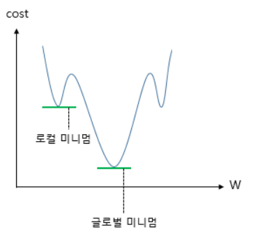

    * 관성의 힘을 빌려 로컬 미니멈을 만났을 때 멈추지 않고 글로벌 미니멈을 계속 찾으려고 노력

    * `torch.optim.SGD(params, lr=required parameter, momentum=0, dampening=0, weight_decay=0, nesterov=False)`

  * 아다그라드(Adagrad)

    * 각 매개변수에 서로 다른 학습률 적용
    * `torch.optim.Adagrad(params, lr=0.01, lr_decay=0, weight_decay=0, initial_accumulator_value=0)`

  * 알엠에스프롭(RMSprop)

    * 아다그라드의 점차 학습률이 떨어지는 것을 보완
    * `torch.optim.RMSprop(params, lr=0.01, alpha=0.99, eps=1e-08, weight_decay=0, momentum=0, centered=False)`

  * 아담(Adam)

    * RMSprop과 Momentum 두 가지 합친 방식
    * `torch.optim.Adam(params, lr=0.001, betas=(0.9, 0.999), eps=1e-08, weight_decay=0, amsgrad=False)`


## linear regression

독립변수 x와 종속변수 y의 관계를 선형 모델로 모델링

-> 임의의 독립변수 x를 넣었을 때의 출력을 예측

데이터를 잘 설명하는 파란색 선을 예측

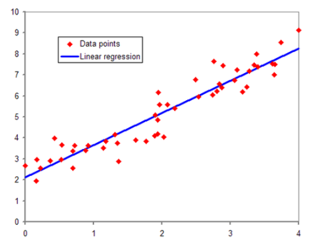

### hypothesis (가설 세우기)

선형적일 것이라는 가정: 𝐻(𝑥)=𝑊𝑥+𝑏 `hypothesis = x_train * W + b`


### cost function

가설의 결과와 답의 차이를 줄이기 위한 함수 (MSE)

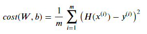

`cost = torch.mean((hypothesis - y_train) ** 2)`


### gradient decent

위에서 구한 cost function을 미분 


이때 a(알파)는 Learning rate로 한번 update 할때, 해당 기울기로 얼만큼 업데이트 할지를 결정하는 하이퍼파라메터, 사용자가 임의로 설정하는 값


### health_data로 실습

1. google drive에서 가져오기

   ```python
   from google.colab import drive
   drive.mount('/content/gdrive')
   
   import pathlib
   path = pathlib.Path('/content/gdrive/My Drive/health_data.csv') 
   ```

2. NaN 행 제거하고, shape 만들기

   ```python
   df = pd.read_csv(path)
   df = df.dropna(axis = 0).reset_index(drop=True)
   height = torch.tensor(df.height)
   weight = torch.tensor(df.weight)
   x_train = height.view([height.shape[0],1]).float() 
   y_train = weight.view([weight.shape[0],1]).float()
   df.head()
   ```

3. 시각화하기

   ```python
   %matplotlib inline
   import matplotlib.pyplot as plt
   
   x = x_train
   y = y_train
   
   plt.scatter(x, y)
   plt.xlabel('height (cm)')
   plt.ylabel('weight (kg)')
   plt.show()
   ```

4. 데이터 정규화

   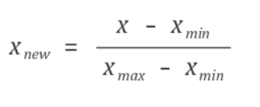

   ```python
   # data normailization
   x_min, x_max = x_train.min(), x_train.max() # x의 최대, 최솟값
   y_min, y_max = y_train.min(), y_train.max() # y의 최대, 최솟값
   x = (x_train-x_min)/(x_max-x_min)
   y = (y_train-y_min)/(y_max-y_min)
   
   # 가중치와, 편향 모두 0으로 초기화
   # requires_grad = True: 이 변수는 학습을 통해 계속 값이 변경되는 변수임
   W = torch.zeros(1, requires_grad=True)
   b = torch.zeros(1, requires_grad=True)
   
   # optimizer 설정
   optimizer = optim.Adam([W, b], lr=0.1)
   
   # 경사 하강법을 반복할 횟수 설정
   epochs = 1000
   
   for epoch in range(epochs + 1):
       hypothesis = W*x + b
       cost = torch.mean((hypothesis - y) ** 2)
       
       # cost로 H(x) 개선을 위한 update 
       optimizer.zero_grad()
       cost.backward()
       optimizer.step()
       
       # 1000번마다 로그 출력
       if epoch % 1000 == 0:
           print('Epoch {:4d}/{} W: {:.3f}, b: {:.3f} Cost: {:.6f}'.format(
               epoch, epochs, W.item(), b.item(), cost.item()
           ))
   ```

5. 데이터 시각화

   ```python
   # 직선 시각화
   %matplotlib inline
   import matplotlib.pyplot as plt
   import numpy as np
   
   x = x_train
   y = y_train
   plt.scatter(x, y)
   
   t = np.arange(140.,190.,0.001)
   
   # t를 normalize한 뒤 y값 예측
   t_norm = (t-x_min.numpy())/(x_max.numpy()-x_min.numpy())
   output = W.item()*t_norm+b.item()
   
   # y를 denormalize
   y_denorm = (output)*(y_max.numpy()-y_min.numpy())+y_min.numpy()
   
   plt.plot(t, y_denorm)
   plt.xlabel('height (cm)')
   plt.ylabel('weight (kg)')
   plt.show()
   ```

   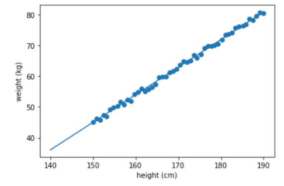

   


```
cost로 H(x) 개선을 위한 update
1. gradient를 0으로 초기화
   미분을 통해 얻은 기울기를 0으로 초기화 -> 새로운 가중치 편향에 대해서 새로운 기울기를 구할 수 있음
   optimizer.zero_grad()
   
2. 비용함수를 미분하여 gradient 계산
   가중치 W와 편향 b에 대한 기울기 계산
   cost.backward()
   
3. W와 b를 업데이트
   인수로 들어갔던 W와 b에서 리턴되는 변수들의 기울기에 학습률 0.01을 곱하여 빼줌 -> 업데이트
   optimizer.step()
```


## logistic regression

0 or 1에 가까운 값을 찾는 분류 모델

training data를 잘 구분하는 경계인 초록색 선을 찾는 것!

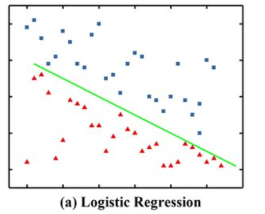

sigmoid 함수 도입

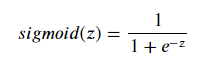

### hypothesis

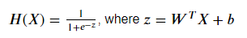

`hypothesis = 1 / (1 + torch.exp(-(x_train.matmul(W) + b)))`


### cost function

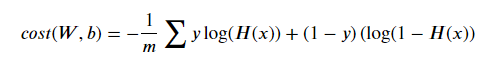

linear regression의 경우 MSE를 이용하여 loss를 구함

logistic regression은 binary cross-entropy를 이용하여 loss 구함

`losses = -(y_train * torch.log(hypothesis) + (1 - y_train) * torch.log(1 - hypothesis))`

`cost = losses.mean()`


### gradient decent

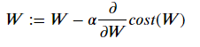

### 실습

1. 데이터 초기화 및 parameter 찾기

```python
x_data = [[1, -4], [1, 2], [2, 3], [3, 1],[4, -2], [4, 3], [5, 3], [6, 2], [3, 8], [6, -2]]
y_data = [[0], [0], [0], [0], [0], [1], [1], [1], [1], [1]]

# torch.Tensor()의 기본 텐서 타입: torch.FloatTensor
x_train = torch.FloatTensor(x_data)
y_train = torch.FloatTensor(y_data)

# 모델 초기화
W = torch.zeros((2, 1), requires_grad=True)
b = torch.zeros(1, requires_grad=True)

# optimizer 설정
optimizer = optim.Adam([W, b], lr=0.01)

# 반복할 횟수 정하기
nb_epochs = 5000

for epoch in range(nb_epochs + 1):

    # hypothesis 계산
    hypothesis = 1 / (1 + torch.exp(-(x_train.matmul(W) + b)))

    # Cost 계산
    cost = -(y_train * torch.log(hypothesis) + (1 - y_train) * torch.log(1 - hypothesis)).mean()

    # optimizer와 cost를 이용해 모델 파라메터 W,b를 개선
    optimizer.zero_grad()
    cost.backward()
    optimizer.step()
    
    # 100번마다 로그 출력
    if epoch % 100 == 0:
        print('Epoch {:4d}/{} Cost: {:.6f}'.format(epoch, nb_epochs, cost.item()))
        
# Epoch 5000/5000  Cost: 0.008265
# Cost가 0.01 이하로 작아질 경우 학습이 잘 된것으로 볼 수 있음

print(W)
# tensor([[4.2946],[1.6587]], requires_grad=True)
print(b)
# tensor([-18.1555], requires_grad=True)
```


2. 시각화 하기

```python
%matplotlib inline
import matplotlib.pyplot as plt
import numpy as np

x_data = [[1, -4], [1, 2], [2, 3], [3, 1],[4, -2], [4, 3], [5, 3], [6, 2], [3, 8], [6, -2]]
y_data = [[0], [0], [0], [0], [0], [1], [1], [1], [1], [1]]
x_train = torch.FloatTensor(x_data)
y_train = torch.FloatTensor(y_data)

x = x_train
y = y_train

# grad 정보가 포함된 경우 numpy array로 변환 : detach().numpy()
W_x = W[0][0].detach().numpy()
W_y = W[1][0].detach().numpy()
b = b.detach().numpy()

for i in range(len(x_data)):
  # 결과가 0이라면
  if y_data[i][0]:
    plt.scatter(x_data[i][0], x_data[i][1], color='1', edgecolor="r")
  # 결과가 1이라면
  else:
    plt.scatter(x_data[i][0], x_data[i][1], color='0.75', edgecolor="b")

    
t = np.arange(0.,7.,0.001)
plt.plot(t, -(W_x/W_y)*t- b/W_y)
plt.show()
```

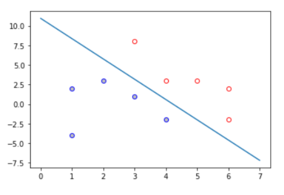