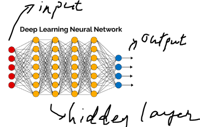
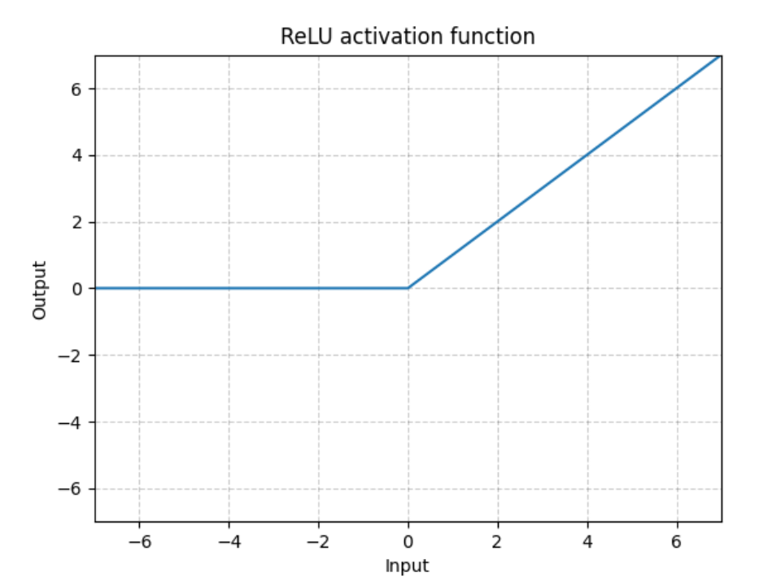
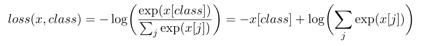
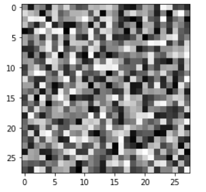
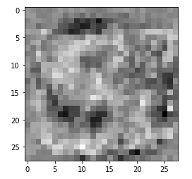

# AI 모델 학습과정

구글 코랩 상단의 메뉴 -> 런타임 -> 런타임 유형 변경 -> 하드웨어 가속기: GPU or TPU


## 목표

Linear Layer만을 쌓은 Fully connected image classification model을 통해 모델이 학습 되는 과정 체험


* 필요한 라이브러리 import

  ```python
  import torch
  # pytorch의 모든 neural network의 base class
  # 모듈은 다른 모듈 포함 가능, 트리 구로 형성 가능
  import torch.nn as nn
  # 널리 사용되는 데이터 셋, 아키텍쳐 모델 computer vision에서의 일반적인 이미지 변환으로 구성
  import torchvision.datasets
  # 다양한 이미지 변환 기능들을 제공
  import torchvision.transforms as transforms
  # 신경망 학습을 지원하는 PyTorch의 자동 미분 엔진
  from torch.autograd import Variable
  # variable class는 각 tensor의 값을 볼 수 있는 data, 미분을 보는 grad, backward를 통한 미분을 계산한 함수 정보인 grad_fn 함수 사용 가능
  ```

* data 넣어주기

  ```python
  input_size = 784 # img_size = (28,28) ---> 28*28=784 in total
  hidden_size = 500 # hidden layer의 노드 개수
  num_classes = 10 #  [0,9]까지 class의 개수
  num_epochs = 10
  batch_size = 100
  lr = 1e-3 # learning rate로 backpropagation시 움직이는 스텝의 크기를 결정 
  ```

  * input_size
    * 28*28 = 784 pixel
  * hidden_size
    * hidden layer의 노드의 개수
    * hidden layer
      * input과 output 사이에 있는 layer
      * 
      * the function applies weights to the inputs and directs them through an [activation function](https://deepai.org/machine-learning-glossary-and-terms/activation-function) as the output
  * num_classes
    * 0~9까지 class의 개수
    * 우리는 숫자를 판별할 것이기 때문에 숫자의 개수
  * num_epochs
    * 전체 트레이닝 셋이 신경망을 통과한 횟수
  * batch_size
    * 전체 트레이닝 데이터 셋을 여러 작은 그룹을 나누었을 때 batch size는 하나의 소그룹에 속하는 데이터 수 의미
    * 전체 트레이닝 셋을 작게 나누는 이유
      * 트레이닝 데이터를 통째로 신경망에 넣으면 비효율적 -> 학습 시간이 오래 걸림
  * lr
    * learning rate(학습률)
    * 너무 크면
      * parameter W가 발산해버림
    * 너무 작으면
      * 하나 최종 값을 찾을 때까지 너무 많은 반복을 해야함

* MNIST data를 다운로드 -> 저장

  ```python
  train_data = torchvision.datasets.MNIST(root = './data', train = True, transform = transforms.ToTensor(), download = True)
  test_data = torchvision.datasets.MNIST(root = './data', train = False, transform = transforms.ToTensor())
  ```

* Data를 Loading하여 우리의 리소스 자원(GPU)에 적절한 batch size를 정하며, train dataset의 경우 dataset의 순서자체를 모델이 학습하는 것을 막기 위해 shuffle

  [torch.utils.data](https://pytorch.org/docs/stable/data.html)

  ```
  torch.utils.data를 사용하여
  map-style and iterable-style datasets,
  customizing data loading order,
  automatic batching,
  single- and multi-process data loading,
  automatic memory pinning 가능
  ```

  ```python
  train_gen = torch.utils.data.DataLoader(dataset = train_data, batch_size = batch_size, shuffle = True)
  test_gen = torch.utils.data.DataLoader(dataset = test_data, batch_size = batch_size, shuffle = False)
  ```

* model class 정의

  * reLu activation function 사용

    

  * nn.Module

    * Base class for all neural network modules

    * 기본 형태

      ```python
      import torch.nn as nn
      import torch.nn.functional as F
      
      class Model(nn.Module):
          def __init__(self):
              super().__init__()
              self.conv1 = nn.Conv2d(1, 20, 5)
              self.conv2 = nn.Conv2d(20, 20, 5)
      
          def forward(self, x):
              x = F.relu(self.conv1(x))
              return F.relu(self.conv2(x))
      ```

    ```python
    class Net(nn.Module):
      #init을 하는 부분에서 layer를 쌓을때 필요한 블럭들을 정의
      def __init__(self, input_size, hidden_size, num_classes):
        super(Net,self).__init__()
        # 선형 함수
        self.fc1 = nn.Linear(input_size, hidden_size)
        # relu activation function
        self.relu = nn.ReLU()
        # 선형 함수
        self.fc2 = nn.Linear(hidden_size, num_classes)
      
      #위에서 정의한 블럭들을 쌓아 원하는 모델을 정의하게 됩니다.
      def forward(self,x):
        out = self.fc1(x)
        out = self.relu(out)
        out = self.fc2(out)
        return out
    ```

* model build 하기

  * net.cuda()
    * CUDA
      * NVIDIA에서 개발한 GPU 개발 툴
      * 많은 양의 연산을 동시에 처리
    * 딥러닝 모델을 만들다 보면, **GPU**에서 학습을 하기 위해 모델을 **GPU device**에 할당
    * net.to(device)라는 방법도 있음
    * 차이점
      * net.cuda(): cuda가 unavailable -> assertion Error 발생
      * net.to(device): cuda가 unavailable -> 'cpu'로 device가 초기화

  ```python
  net = Net(input_size, hidden_size, num_classes)
  if torch.cuda.is_available():
    net.cuda()
  ```

* loss-function과 optimizer 정하기

  * loss function

    * pytorch의 nn 모듈 내에 있는 loss 클래스 중 하나인 CrossEntropyLoss() 사용
    * 다중분류를 위한 대표적인 손실함수
      * 다중분류 : **규칙에 따라 입력된 값을 세 그룹 이상으로 분류하는 작업**을 의미
    * 수식이 간소화되어 역전파가 더 안정적으로 이루지므로 실제 사용에 권장
    * 

  * [optimizer](https://pytorch.org/docs/stable/optim.html)

    * torch.optim.Optimizer(params, defaults)
    * Adam 사용
      * 빠르기도 하면서 성능도 좋고 무난
      * 가장 많이 활용

    ```python
    loss_function = nn.CrossEntropyLoss()
    optimizer = torch.optim.Adam(net.parameters(), lr=lr)
    ```

* 학습 되기 전의 weight를 시각화

  * 무질서한 random 값들

  * 모델과 옵티마이저의 state_dict 접근하기

    * state-dict: 각 게층을 매개변수 텐서로 매핑되는 python 사전 객체

      * 쉽게 저장, 업데이트, 변경 및 복원 가능

    * 모델의 state_dict 출력

      * ```python
        for param_tensor in net.state_dict():
            print(param_tensor, "\t", net.state_dict()[param_tensor].size())
        ```

    * 옵티마이저의 state_dict 출력

      * ```python
        for var_name in optimizer.state_dict():
            print(var_name, "\t", optimizer.state_dict()[var_name])
        ```

  ```python
  import matplotlib.pyplot as plt
  
  for param_tensor in net.state_dict():
      if(param_tensor == 'fc1.weight'):
          # 이미지맵
          # 원하는 사이즈의 픽셀을 원하는 색으로 채워서 만든 그림
          plt.imshow(net.state_dict()[param_tensor][0].cpu().reshape(28,28), cmap='gray')
  ```

  

* 모델 train하기

  ```python
  for epoch in range(num_epochs):
    for i ,(images,labels) in enumerate(train_gen):
      images = images.view(-1,28*28).cuda()
      labels = labels.cuda()
      
      optimizer.zero_grad()
      outputs = net(images)
      loss = loss_function(outputs, labels)
      loss.backward()
      optimizer.step()
      
      if (i+1) % 100 == 0:
        print('Epoch [%d/%d], Step [%d/%d], Loss: %.4f' %(epoch+1, num_epochs, i+1, len(train_data)//batch_size, loss.data))
  ```

* 모델 정확도 평가하기

  ```python
  correct = 0
  total = 0
  
  # torch.no_grad(): gradient 계산 context를 비활성화
  # PyTorch의 autograd engine을 비활성화 시켜서 더 이상 gradient 트래킹 하지 x -> 필요한 메모리 ↓ 연산 속도 ↑
  with torch.no_grad():
    for images,labels in test_gen:
      images = images.view(-1,28*28).cuda()
      labels = labels.cuda()
      
      output = net(images)
      # torch.max는 최댓값과 최댓값의 위치를 산출
      # 최댓값은 필요하지 않으므로 _: 해당 출력값은 저장 x
      # predicted에 최댓값의 위치만 저장하겠다!
      # 1: 각 열/ 0: 각 행
      _, predicted = torch.max(output,1)
      correct += (predicted == labels).sum()
      total += labels.size(0)
  
  print('Accuracy of the model: %.3f %%' %((100*correct)/(total+1)))
  ```

  Accuracy of the model: 97.940 %

* 학습된 weight를 visualize

  ```python
  for param_tensor in net.state_dict():
      if(param_tensor == 'fc1.weight'):
          plt.imshow(net.state_dict()[param_tensor][0].cpu().reshape(28,28), cmap='gray')
  ```

  

[결과 학습하기](https://ml4a.github.io/ml4a/ko/looking_inside_neural_nets/)


## crop한 image로 dataset 구성 -> classifier의 결과 변화

28x28의 원본 이미지에서 22x22 부분만 random crop을 한 후 28x28로 resize한 것들로 새로운 test dataset을 구성


* transform_test의 내부 구상

  ```python
  # 우리가 원하는 대로 데이터 핸들링 - PyTorch에서 제공하는 Compose 기능 사용 가능
  transform_test = transforms.Compose([
      # Desired output size of the crop
      transforms.RandomCrop(22),
      # Desired output size
      transforms.Resize(28),
      # tensor로 변환
      transforms.ToTensor()
  ])
  
  test_data_crop = torchvision.datasets.MNIST(root = './data', train = False, transform = transform_test)
  cropped_test_gen = torch.utils.data.DataLoader(dataset = test_data_crop, batch_size = batch_size, shuffle = False)
  ```

* 모델의 정확도 평가

  ```python
  correct = 0
  total = 0
  for images,labels in cropped_test_gen:
    images = Variable(images.view(-1,28*28)).cuda()
    labels = labels.cuda()
  
    output = net(images)
    _, predicted = torch.max(output,1)
    correct += (predicted == labels).sum()
    total += labels.size(0)
  
  print('Accuracy of the model: %.3f %%' %((100*correct)/(total+1)))
  ```

  ```
  Accuracy of the model: 41.496 %
  ```

  이러한 문제는 convolution 과 pooling 연산의 합성을 통해 정확성이 떨어지는 한계 극복 가능! [합성곱, pooling](https://wikidocs.net/62306)