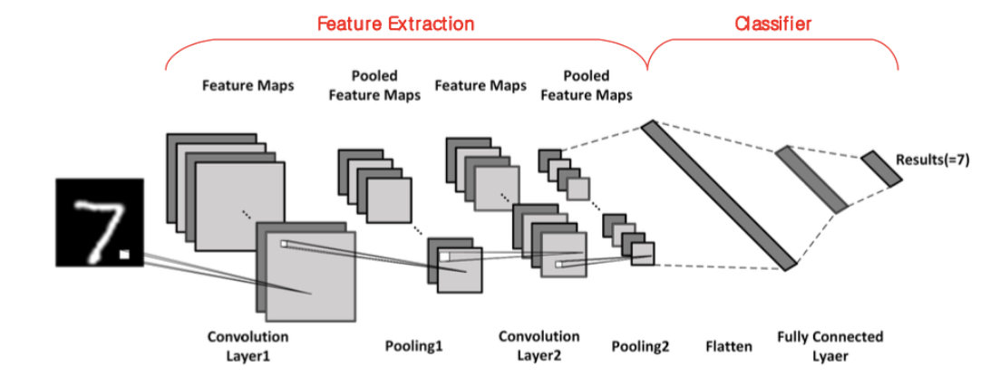

# Mnist convolutional nn classifier 직접 만들어보기



cnn model을 블럭들 쌓아 만들어보기!


## 정보

### Feature extraction

Convolition Layer1 : input channel = 1, output channel = 10, kernel_size = 5

Pooling Layer1 : kernel_size = 2, stride = 1

Activation Function 1 : ReLU


Convolition Layer2 : input channel = 10, output channel = 20, kernel_size = 5

Pooling Layer2 : kernel_size = 2, stride = 1

Activation Function 2 : ReLU


### Classifier

Flatten : (320,1) 짜리 vector로 reshape - pytorch는 view function 이용

Fully connected layer : input = 320 , output = 50

Activation Function : ReLU & Dropout

Fully connected layer : input = 50 , output = 10


## import

```python
import torch, torchvision
from torchvision import datasets, transforms
from torch import nn, optim
from torch.nn import functional as F
import torch.nn as nn
import numpy as np
```


## CNN 모델 구성

```python
batch_size = 128
num_epochs = 4
device = 'cuda' if torch.cuda.is_available() else 'cpu'

class CNN(nn.Module):
    def __init__(self):
        super(CNN, self).__init__()
        self.conv_layers = nn.Sequential(
            nn.Conv2d(1, 10, kernel_size=5),
            nn.MaxPool2d(2),
            nn.ReLU(),
            nn.Conv2d(10, 20, kernel_size=5),
            nn.Dropout(),
            nn.MaxPool2d(2),
            nn.ReLU()
        )
        self.fc_layers = nn.Sequential(
            nn.Linear(320, 50),
            nn.ReLU(),
            nn.Dropout(),
            nn.Linear(50, 10)
        ) 
    def forward(self, x):
        x = self.conv_layers(x)
        x = x.view(-1, 320)
        x = self.fc_layers(x)
        return x
```


## DATA

```python
train_data = torchvision.datasets.MNIST(root = './data', train = True, transform = transforms.ToTensor(), download = True)
test_data = torchvision.datasets.MNIST(root = './data', train = False, transform = transforms.ToTensor())
```


## TRAIN FUNCTION

```python
criterion = nn.CrossEntropyLoss()

def train(model, device, train_loader, optimizer, epoch):
    model.train()
    for batch_idx, (data, target) in enumerate(train_loader):
        data, target = data.to(device), target.to(device)
        # [Do it yourself] Forward 단계: 모델에 data를 전달하여 예상되는 output 값을 계산합니다.
        output = model(data)

        # [Do it yourself] Loss를 계산 합니다.
        loss = criterion(output, target)

        # [Do it yourself] 변화도를 0으로 만들고(zero_grad), 역전파 단계를 수행하고(backward), 가중치를 갱신합니다(step).
        optimizer.zero_grad()
        loss.backward()
        optimizer.step()

        if batch_idx % 100 == 0:
            print('Train Epoch: {} [{}/{} ({:.0f}%)]\tLoss: {:.6f}'.format(
                epoch, batch_idx * len(data), len(train_loader.dataset),
                100. * batch_idx / len(train_loader), loss.item()))
```


## TEST FUNCTION

```python
def test(model, device, test_loader):
    model.eval()
    test_loss = 0
    correct = 0
    with torch.no_grad():
        for data, target in test_loader:
            data, target = data.to(device), target.to(device)
            output = model(data)
            criterion = nn.CrossEntropyLoss()
            test_loss += criterion(output, target).item() # sum up batch loss
            pred = output.max(1, keepdim=True)[1] # get the index of the max log-probability
            correct += pred.eq(target.view_as(pred)).sum().item()

    test_loss /= len(test_loader.dataset)
    print('\nTest set: Average loss: {:.4f}, Accuracy: {}/{} ({:.0f}%)\n'.format(
        test_loss, correct, len(test_loader.dataset), 100. * correct / len(test_loader.dataset)))
```


## TRAIN, TEST DATASET

```python
train_loader = torch.utils.data.DataLoader(dataset = train_data, batch_size = batch_size, shuffle = True)
test_loader = torch.utils.data.DataLoader(dataset = test_data, batch_size = batch_size, shuffle = False)
```


## MODEL, OPTIMIZER

```python
model = CNN().to(device)
optimizer = optim.SGD(model.parameters(), lr=0.01, momentum=0.5)
```


## EPOCH - DATA TRAIN

```python
for epoch in range(1, num_epochs + 1):
    train(model, device, train_loader, optimizer, epoch)
    test(model, device, test_loader)
```


## size crop

```python
transform_test = transforms.Compose([
    transforms.RandomCrop(22),
    transforms.Resize(28),
    transforms.ToTensor()
])  

cropped_test_loader = torch.utils.data.DataLoader(datasets.MNIST('mnist_data', train=False, transform=transform_test),
    batch_size=batch_size, shuffle=True)

test(model, device, cropped_test_loader)
```


