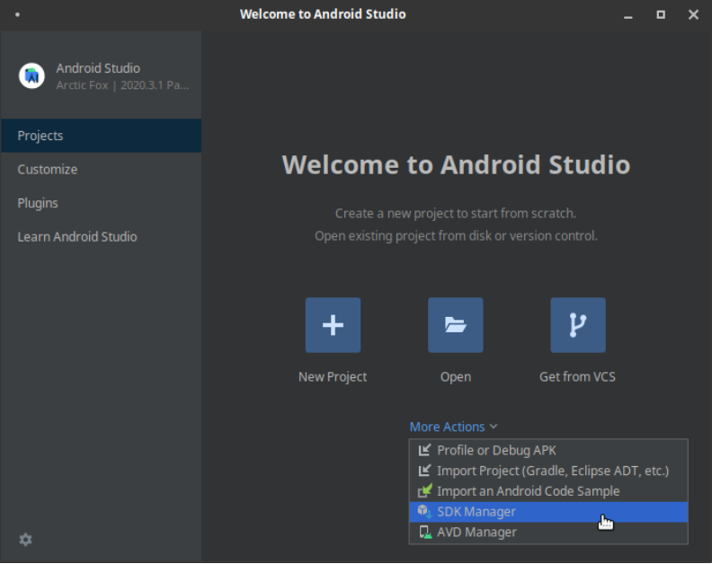
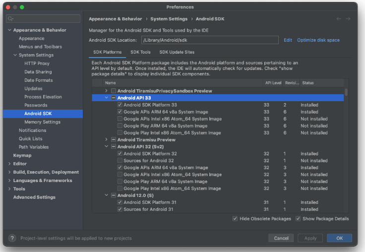
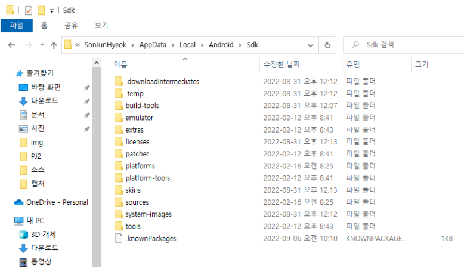
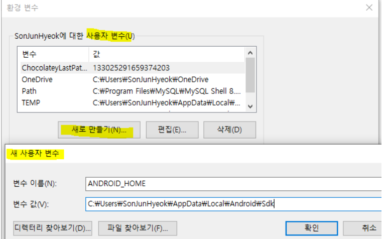
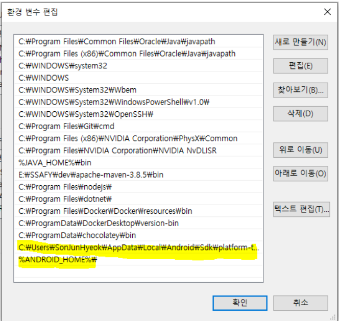
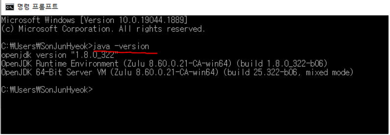
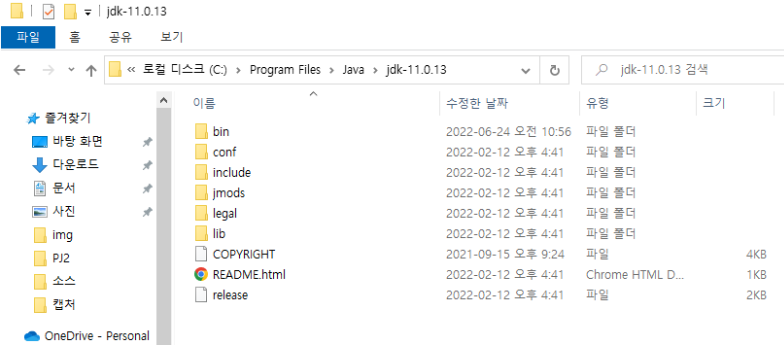
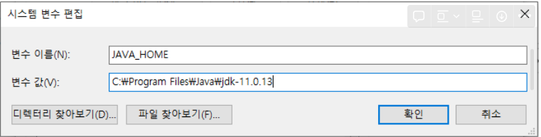
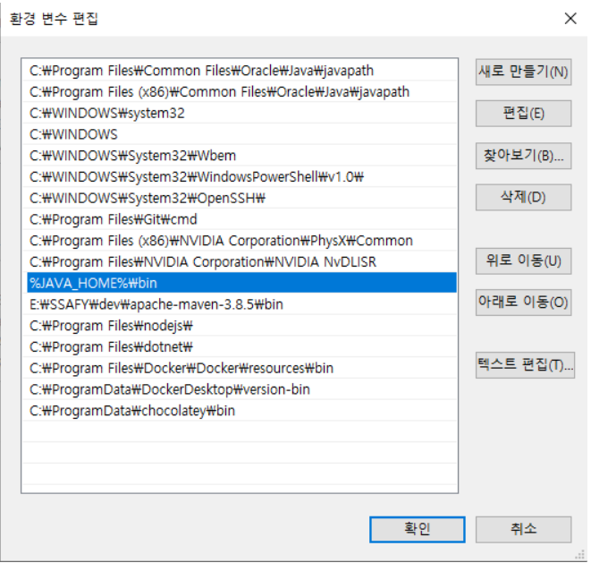
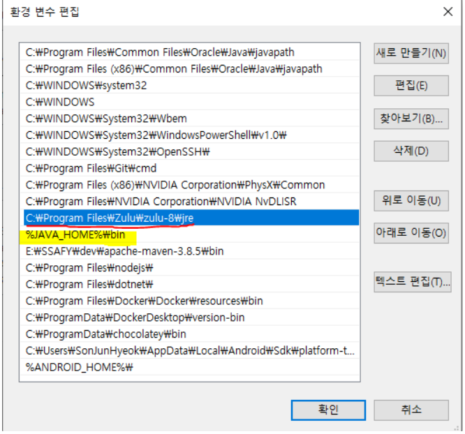

# 프로젝트 준비사항

# 준비해야 할 요소

1. React-Native
2. Android Studio(SDK, AVD)
3. ADB(Android Debug Bridge)
   1. 원래 Android Studio 설치하면서 같이 되는데 혹시 안되는 몇몇 경우 대비 수동 설치 가이드
4. Java 11
   1. 필수는 아니나, 로그가 계속 발생하므로 설정할 사람은 참고

(node.js, react 등은 패스)

## React-Native

1. 원하는 폴더에 아래 명령어로 React-Native 생성

   ```json
   npx react-native init samplepj
   ```

? 질문사항 ?

```python
지은 - 위에 코드를 작성하면
C:\\Users\\SSAFY\\AppData\\Roaming\\npm\\node_modules\\react-native-cli\\index.js:302
  cli.init(root, projectName);
TypeError: cli.init is not a function
이런 에러가 계속 뜸 ㅠㅠ 

찾아본 해결방법 - 0.69.0 이 새로운 버전이라 이런 에러가 자꾸 뜨는 듯
npx react-native init samplepj --version 0.68.2
와 같이 버전 명시하면 됨
```

## Android Studio(SDK, AVD)

1. 아래 링크에서 안드로이드 스튜디오 설치

   [안드로이드 스튜디오](https://developer.android.com/studio?hl=ko)

2. 설치 후 실행시 아래 화면이 보일텐데 여기서 SDK Manager 선택

   

   Android Stuido 버전에 따라 조금씩 다르게 보일 수 있음

3. SDK platforms에서 원하는 API 버전(OS 버전) 선택 이후 설치 - 여러개도 선택 가능

   

   Android Studio 버전에 따라 조금씩 다르게 보일 수 있음 (위 사진은 Mac OS 버전)

4. SDK 설치된 장소 확인 하여 정상적으로 설치 되었는지 확인

   

   AppData 폴더는 숨겨진 폴더이기에 직접 링크를 쳐야 접속 가능

   - 별도의 설치과정에 수정을 하지 않았다면 아래처럼 구성되어 있음
     - C:\Users\사용자\AppData\Local\Android\Sdk
     - 싸트북 기준은 : C:\Users\SSAFY\AppData\Local\Android\Sdk

5. 환경 변수 설정

   1. 설정 - 정보 - 고급 시스템 설정 - 시스템 속성 - 고급 - 환경 변수 이동 (윈도우 10 기준)

   2. 사용자 변수에서 새로 만들기 이후 아래처럼 설정

      

      변수 값은 위에 설치한 sdk 폴더값

6. 시스템 변수에서 Path에 아래 두개 추가

   1. Sdk 폴더 설정한 ANDROID_HOME

   2. Sdk 폴더 아래 있는 platform-tools

      

7. 저장 후 재부팅 다음에 cmd 창에 adb 실행하여 잘 작동 하는지 확인


## ADB(Android Debug Bridge)

1. 아래 링크에서 windows 버전으로 다운로드 및 원하는 위치에 압축해제

   [ADB](https://developer.android.com/studio/releases/platform-tools)

2. 해당 폴더 주소를 환경변수에 추가

   1. 설정 - 정보 - 고급 시스템 설정 - 시스템 속성 - 고급 - 환경 변수 이동 (윈도우 10 기준)
   2. 시스템 변수 - Path에 폴더 주소 추가

3. 끝.


## Java 11

1. 우선 본인의 JAVA 버전 상태를 확인

   

   자바 버전이 1.8.0_322로 나오는 모습

2. 버전이 11이 아니면 아래 링크로 접속 후 밑으로 스크롤을 내려 11을 다운로드 및 설치

   [Download the Latest Java LTS Free](https://www.oracle.com/java/technologies/downloads/)

3. 자바가 설치 된 폴더를 검색하여 정상적으로 설치 되었는지 확인 및 주소 확인

   

   여기선 C:\Program Files\Java\jdk-11.0.13 이렇게 주소가 설정되었음을 알 수 있다.

4. 환경 변수 설정

   1. 설정 - 정보 - 고급 시스템 설정 - 시스템 속성 - 고급 - 환경 변수 이동 (윈도우 10 기준)

   2. 기존에 시스템 변수에 JAVA_HOME이 있으면(혹은 java 환경 변수 관련 변수 데이터) 해당 값 수정 없을 경우 새로 만들기로 진행

   3. 아래 사진처럼 데이터를 수정 및 생성하고 확인

      

   4. 시스템 변수 에서 Path 선택해서 편집, 이후 JAVA_HOME 추가

      

   5. 다 완료 되면 재부팅 이후 자바 버전 확인


# 실행

### 준비 다 끝났는지 확인 내용

1. JAVA 버전이 11이 맞는가? (JAVA 버전 에러가 있는 경우)
2. SDK 설치 및 환경 변수는 잘했는가?
3. SDK 하위 폴더 Platform-tools도 환경 변수가 잘 추가 하였는가?


### 준비 과정이 다 끝났다면 실행

1. React-Native 설치된 폴더에서 아래 명령어로 실행

   ```BASH
   npx react-native init baepjt --version 0.68.2
   
   cd baepjt
   npm run android # 애뮬레이터가 뜨면서 생성 완료
   ```


### 다 했는데 안됩니다?

1. 자바 새로 설치하고 환경변수 설정 및 재부팅 해도 버전 변경이 안됩니다.

   1. 환경 변수 에서 리스트 순서는 우선순위를 의미합니다. 고로 아래 사진처럼 있을 경우 Zulu가 먼저 읽혀서 힘들게 세팅한 JAVA_HOME이 우선순위에서 밀려서 안읽히는겁니다

      

      고로 이럴 때는 두 환경 변수 데이터 순서를 변경해주면 됩니다 (우측 위로이동 버튼 사용)

2. Platform-tools는 뭔데 해줘야 하나요?

   1. 얘가 ADB입니다. 즉 에뮬레이터랑 React-Native간 통신을 하기 위한 통로입니다 그래서 꼭 해줘야 합니다.

   2. 잘 작동하는지 확인하는 법은 cmd창에 adb 치면 아래 사진처럼 안뜨고 도움말 창 뜨면 정상입니다

      

3. Sdk 설치 폴더를 탐색기로 클릭해서 들어가는데 안보여요 설치가 안된건가요?

   1. AppData는 숨겨진 폴더라서 직접 주소를 쳐서 들어가야합니다.

4. 환경변수 했는데 반영이 바로 안됩니다

   1. 재부팅을 해보시는걸 적극 권장합니다. 환경변수 관련 변경사항은 재부팅 이후 적용되는게 대부분입니다.


