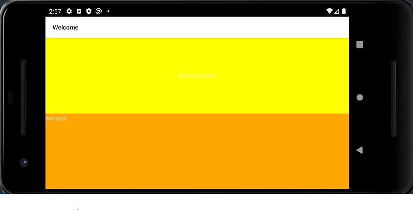
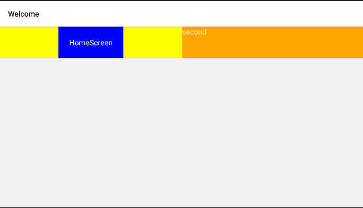

# flex와 요소배치

```js
const HomeScreen = ({navigation}) => {
  return (
    <>
      <View
        style={{
          flex: 1,
          backgroundColor: 'yellow',
          alignItems: 'center',
          justifyContent: 'center',
        }}>
        <TouchableHighlight onPress={onClick}>
          <Text>Home Screen</Text>
        </TouchableHighlight>
      </View>
      <View style={{flex: 1, backgroundColor: 'orange'}}>
        <Text>second</Text>
      </View>
    </>
  );
};
```

flex는 하나씩 차지 즉, 지금 flex가 두개있으므로 반 씩 나누어 가져있음



* justifyContent: 세로 중앙 배열 (가로가 아님 주의)

* alignItems: 가로 중앙 배열

* button 의 종류

  * Pressable

    ```js
    <Pressable onPress={onClick} style={{padding: 20, backgroundColor: 'blue'}}>
        <Text>HomeScreen</Text>
    </Pressable>
    ```

    

  * Button

  * TouchableNativeFeedback

  * TouchableWithoutFeedback

  * TouchableHighlight: 클릭하면 꺼매짐 - underlayColor를 따로 설정

  * TouchableOpacity: 클릭하면 투명해짐

* onPress : 콜백 함수 등록 가능
  * 앱이기 때문에 onClick이 아닌 onPress

* text color는 <text>안에다가 줘야함!

* button의 padding은 함축이 불가능
  * paddingTop, paddingBottom, paddingLeft, paddingRight는 각자 줘야함!
  * paddingHorizontal: left & right
  * paddingVertical: top & bottom
  
* 가로로 하고 싶다면 flexDirection:'row'로 주면 됨!

  