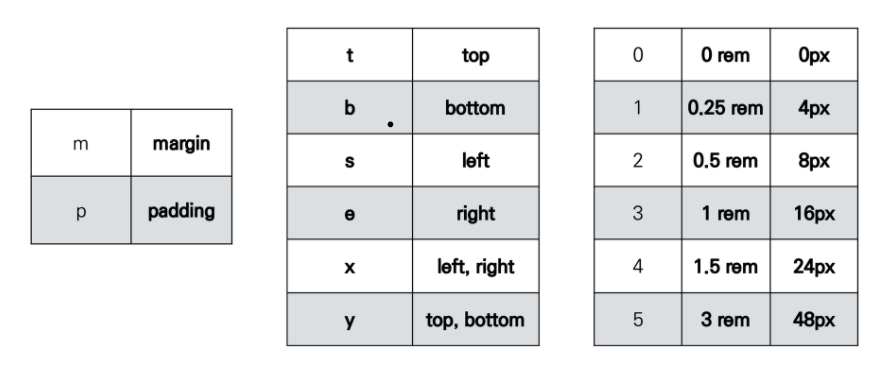

# bootstrap

: 세계에서 가장 유명한 프론트엔드 오픈 소스 툴킷


## CDN

Content Delivery Network: 컨텐츠를 효율적으로 전달하기 위해 여러 노드에 가진 네트워크에 데이터를 제공하는 시스템

사용하기 위해서

```html
<!-- head에 -->
<link href="https://cdn.jsdelivr.net/npm/bootstrap@5.1.3/dist/css/bootstrap.min.css" rel="stylesheet" integrity="sha384-1BmE4kWBq78iYhFldvKuhfTAU6auU8tT94WrHftjDbrCEXSU1oBoqyl2QvZ6jIW3" crossorigin="anonymous">
<!-- body에 -->
<script src="https://cdn.jsdelivr.net/npm/bootstrap@5.1.3/dist/js/bootstrap.bundle.min.js" integrity="sha384-ka7Sk0Gln4gmtz2MlQnikT1wXgYsOg+OMhuP+IlRH9sENBO0LRn5q+8nbTov4+1p" crossorigin="anonymous"></script>
```

를 복사해와야함


### utilities

 #### spacing

* .mt-1:  margintop

``` css
.mt-1 {
    margin-top: 0.25rem !important;
} /* 16 * 0.25 = 4px*/
```

class name           rem        px

m-1                        0.25        4

m-2						0.5          8

m-3						1             16

m-4						1.5          24

m-5 						3            48

* .mx-0: x축으로 margin

```css
.mx-0 {
    margin-right: 0 !important;
    margin-left: 0 !important;
}
```

* .mx-auto: 수평 중앙 정렬

```css
.mx-auto {
    margin-right: auto !important;
    margin-left: auto !important;
}
```

* .py-0: 패딩 top bottom을 padding을 0으로 

```css
.py-o {
    padding-top: 0 !important;
    padding-bottom : 0 !important;
}
```



만약에 margin에 음수를 넣어주고 싶으면 mx-n1: 4px을 음수로(negative)

* gap: 부모grid container에 넣어주면 자식 item들이 따로따로 margin을 안 넣을 수 있게 도와줌

``` html
<div class = "d-grid gap-3">
    <div class = "bg-light border">1</div>
    <div class = "bg-light border">2</div>
    <div class = "bg-light border">3</div>
</div>
```

gap-o은 gap-auto와 똑같음


#### sizing

* width 조절 

  * width 25% <div class= "w-25"></div>
  * width 50% <div class= "w-50"></div>
  * width 75% <div class= "w-75"></div>
  * width 100% <div class= "w-100"></div>
  * width auto <div class= "w-auto"></div>

* height 조절

  * height 25% <div class= "h-25"></div>

  * height 50% <div class= "h-50"></div>

  * height 75% <div class= "h-75"></div>

  * height 100% <div class= "h-100"></div>

  * height auto <div class= "h-auto"></div>

* max를 줄수도 있음
  * mw-100(max width)
  * mh-100(max height)


#### text (class안에 넣기)

* text-alignment
  * text-start
  * text-center
  * text-end
  * text-sm-start
  * text-md-start
  * text-lg-start
* text wrapping and overflow
  * text-wrap: 상자 안에 텍스트 가둬놓기
* text transform
  * text-lowercase : 소문자화
  * text-uppercase: 대문자화
  * text-caplitalize: 각 단어의 맨 앞 글자만 대문자화
* fontsize
  * fs-폰트사이즈
* fontweight: 폰트 굵기
  * fw-bold / fw-bolder/ fw-normal/ fw-light/ fw-lighter
* fontstyle: 폰트 스타일
  * fst-italic/ fst-normal
* line height: 줄글 사이의 간격
  * lh-1/ lh-sm/ lh-base/ lh-lg 등
* text decoration
  * text-decoration-underline: 밑줄치기
  * text-decoration-line-through: 취소선
  * text-decoration-none: 글자 꾸미기 취소


#### color

--primary, secondary, success, info, warning, danger, light, dark

```html
<div class = "bg-primary"></div>
<div class = "text-info"></div>
```

* 투명도도 조절 가능

```html
<div class = "bg-opacity-75">1</div>
<div class="text-primary text-opacity-25">2</div>
```


#### border

* border: 4면이 다 테두리
* border-top/end/bottom/start: 지정 가능
* border-0/top-0/end-0/bottom-0/start-0:으로 빼고 싶은 면만 뺄수 있음
* border-primary : 색깔 지정도 가능
* border-1: 테두리의 두께 지정 가능
* 테두리 둥글게
  * class = "rounded" :쪼금 둥글게
  * class = "rounded-top": 위에만 둥글게
  * class = "rounded-circle" : 완전 둥글게 원모양
  * class = "rounded-0": 둥근 정도


#### display

: 모든 display에 맞게 설정 가능

* 포맷
  * d-{value} for xs
  * d-{breakpoint}-{value} for sm, md, lg, xl, xxl 
  * {value}: none, inline, inline-block, block, grid, table, table-cell, table-row, flex, inline-flex

```html
<h2>
    display
</h2>
<div class = "d-inline text-white bg-primary">
    d-inline
</div>
<span class = "d-block">d-block</span>
```

* 특정 너비에서만 볼 수 있게
  * 모든 곳에서 숨기기 : d-none
  * xs에서만 숨기기:d-none d-sm-block
  * sm에서만 숨기기: d-sm-none d-md-block
  * 순서: xs < sm < md < lg < xl < xxl 
* 보이는 곳 지정
  * 모든곳에서 보이게: d-block
  * xs에서만 보이게: d-block d-sm-none
  * sm에서만 보이게: d-none d-sm-block d-md-none
  * md에서만 보이게: d-none d-md-block d-lg-none

``` html
<div class = "d-none d-sm-block bg-warning">sm이상에서 보임</div>
<div class = "d-none d-sm-block bg-warning">sm이상에서 보임</div>
```


### 그리드 시스템

기본요소: column(실제 컨텐츠를 포함하느 부분), gutter(칼럼과 칼럼 사이의 공간), container(column을 담고 있는 공간)

원칙: 12개의 column, 6개의 grid breakpoints


grid opition: xs (phones), sm (tablets), md (desktops), and lg (larger desktops)

.col- .col-sm- .col-md- .col-lg- .col-xl- .col-xxl-


하나하나 행을 row로 묶으면 됨

```html
<div class = "row">
    <div class = "box col">1</div>
    <div class = "box col">2</div>
</div>
<div class = "row">
    <div class = "box col">3</div>
    <div class = "box col">4</div>
</div>
```


12칸을 1: 2: 1로 칸을 나누고 싶다면 => 3: 6:3

```html
<div class = "row">
    <div class = "box col-3">1</div>
    <div class = "box col-6">2</div>
    <div class = "box col-3">1</div>
</div>
```


띄고 싶으면 offset

```html
<div class = "box offset-2 col-3">1</div>
<div class = "box col-3">2</div>
```


<div class ="row"> -> col-breakpoint(sm,ml,lg,xl,xxl)-숫자