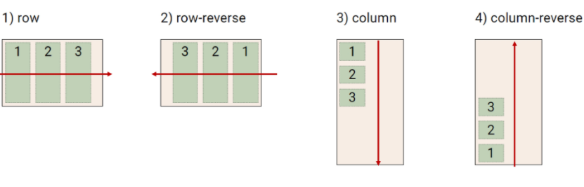
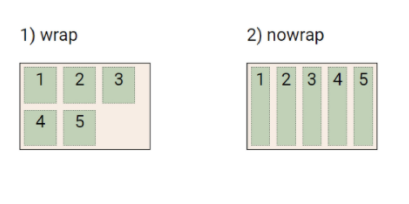
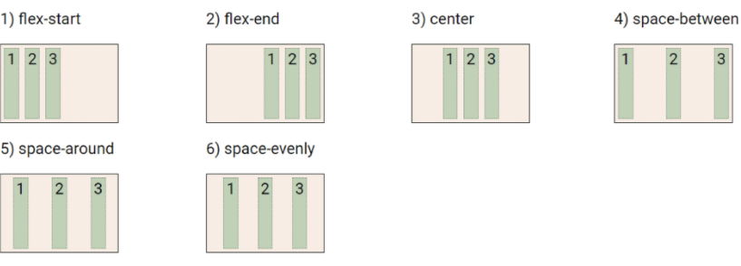
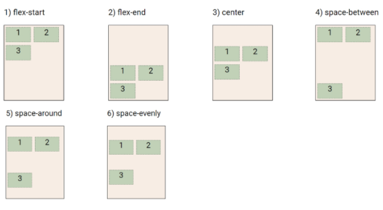
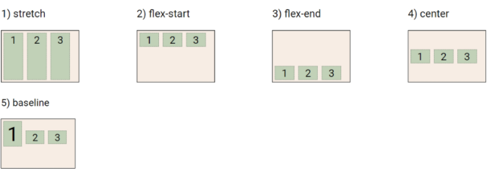
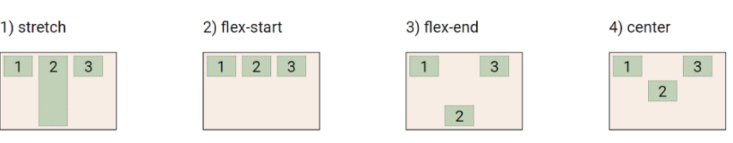

# web

block: <div> h1, p태그 등 

inline: <span> img, 등


## css layout

:display, position, float, flexbox, grid, responsive web design, media queries


### float

: 텍스트를 포함 인라인 요소들이 주변을 wrapping하도록 함

``` html
<body>
   <h1>float</h1>
   <div class = "box left">float left</div>
   <div class = "box right">float right</div>
   <p>
       lorem ipsum
    </p>
</body>
```

```css
.box{
    width: 10rem;
    height: 10rem;
    border: 1px solid black;
    background-color: cornflowerblue;
    margin-right: 30px; /*텍스트와 박스간의 사이를 띄어줌*/
}

.left {
    float: left;
} /* 텍스트가 박스 옆으로 올라와서 왼쪽으로 둥둥 떠있는 것을 알 수 있음 */

.right{
    float: right;
} /* 텍스트가 박스 옆으로 올라와서 오른쪽으로 둥둥 떠있는 것을 알 수 있음 */
```

** lorem ipsum은 dummy text, 마음대로 만들어지는 뜻이 없는 긴 문장


#### clearing float

float를 지정해준 요소의 그 다음 요소에 대하여 float 속성이 적용되지 않도록 clearing 필수!

```html
<header class = "clearfix">
    <div class = "box1 left">float left</div>
</header>
<div class = "box2">
    div
</div>
```

``` css
.clearfix::after { 
    content: "";
    display: block;
    clear: both; /* */
}
```

 ::after: 맨 마지막 자식으로 의사 요소를 하나 생성 

비어있는 content""를 만들고 clear를 넣어주면 다음 요소에 대해서 float가 적용되지 않음!


### flex

flex가 나오기 전: 수동값을 부여하지 않고는 수직정렬이 너무 어려웠고, 아이템의 너비와 높이 혹은 간격을 동일하게 배치하는 것이 어려웠음(직접 padding값 계산 없이).

행과 열 형태로 아이템들을 배치하는 1차원 레이아웃 모델

```css
.flex-container {
    display: flex;
} /*부모 요소에 display:flex혹은 inline-flex 넣어주기*/
```


flexbox가 나오면서 실질적으로 어떠한 내부 영역안에서의 배치가 가능하게 됨

* 축
  * 메인축: 메인축을 기점으로 배치하므로 1차원이라 함
  * 교차축
  
* 구성요소
  * 부모요소(flex container): flex item들이 놓여있는 영역
  * 자식요소(flex item): 컨테이너에 속해있는 컨텐츠

* flex-direction(main axis 기준 방향 설정)

  - row:  가로가 main축, 세로가 cross 축 -> 가로를 기점으로 배치
  
  


  - row-reverse: 가로가 main 축이지만 오른쪽에서 왼쪽으로


  - column: 세로가 main축 -> 수직으로 배치
  - column-reverse: 세로가 main 축이지만 아래쪽에서 위쪽으로 배치

* flex-속성

  * 배치 설정

    * flex-direction
    * flex-wrap: 아이템이 컨테이너를 벗어나는 경우 해당 영역 내에 배치되도록
  
      * wrap: 넘치면 그 다음줄로 배치
      * nowrap(기본값): 한줄에 배치
  
    
  
    * flex-flow: direction과 wrap 합친거의 shorthand
  
       ex) flex-flow : row nowrap;
  
  * 공간 나누기
  
    * justify-content(main axis): main axis를 기준으로 공간 배분
      * flex-start, flex-end, center, space-between, space-around, space-evenly
  
    
  
    * align-content(cross axis): cross axis를 기준으로 공간 배분
      * flex-start, flex-end, center, space-between, space-around, space-evenly
  
    
  
  * 정렬
  
    * align-items(모든 아이템을 cross axis기준으로): 모든 아이탬들을 cross axis를 기준정렬
    
    
    
    * align-self(개별 아이템):개별 아이탬들을 cross axis를 기준정렬
  
  
  
  ``` css
  .container{
      display: flex;
      justify-content: center;
      align-items : center;
  } /*를 하면 수직 수평 딱 가운데에 쉽게 정렬 가능 */
  ```
  
  
  
  * 기타 속성
    * flex-grow: 남은 영역을 아이템에 분배
    * order: 배치순서

```html
<div class = "flex_item grow-1 order-3">1</div>
<div class = "flex_item grow-1">2</div>
<div class = "flex_item order-1">3</div>
<div class = "flex_item order-2">4</div>
```

1. order: 오더는 부여하지 않는게 가장 먼저 나오고 그 다음에 순서대로 들어감

   따라서, 2 -> 3 -> 4 -> 1 순서로 나오게됨

2. grow: 남은영역을 1, 2에 배치하게 되는데 각각 1을 갖고 있으므로 남은 영역을 1:1로 분배하도록 하는 것이기 때문에 2와 1은 같은 넓이를 갖게 됨