1. color

   ```css
   - black : #000000, rgb(0, 0, 0)
   - blue : #0000ff, rgb(0, 0, 255)
   - red : #ff0000, rgb(255, 0, 0)
   - yellow : #ffff00, rgb(255, 255, 0)
   - white : #ffffff, rgb(255, 255, 255)
   ```

---


2. 시맨틱 태그 & 태그들 속성 >> MDN보고 정리 !

```css
# semantic
<header>: 제목, 로고, 검색폼 등 / 문서 전체나 섹션의 헤더(머리말부분)
<nav>: header 안의 메뉴들 구분
<main>
<aside>: 사이드에 위치한 공간, 메인 콘텐츠와 관련성이 적은 콘텐츠
<article>: 문서, 페이지, 사이트 안에서 독립적으로 구분되는 영역
<footer>: 문서 전체나 섹션의 푸터(마지막 부분) - 영역 구분 (저작권)
<section>: <header>, <footer>와 함께 문서의 구역을 정의.
	<section>안에 <section>을 넣을 수도 있고, <article>을 이용해 내용을 넣는다.

- h1, table 태그들도 시맨틱 태그로 볼 수 있음

# non-semantic
<div>
<span>
<b>
```

**div, span 차이** 

- div 는 박스 형태로 영역이 설정되고 그 안에 정렬
  하지만, span 은 줄 단위로 영역이 설정

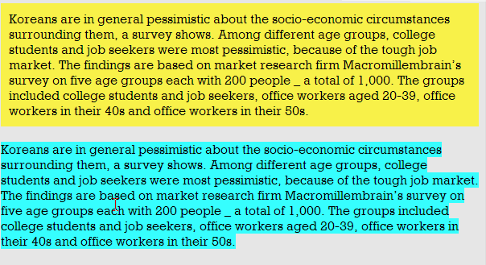

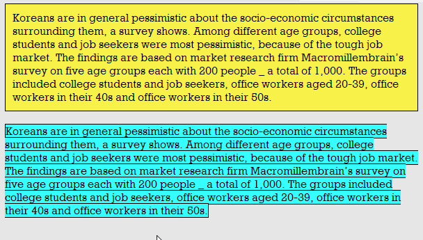

- div 는 하나씩 표현될 때마다 앞 뒤로 줄 바꿈이 일어나서 아래에 내려감.

 	span 태그는 옆으로 배열이 됩니다. 

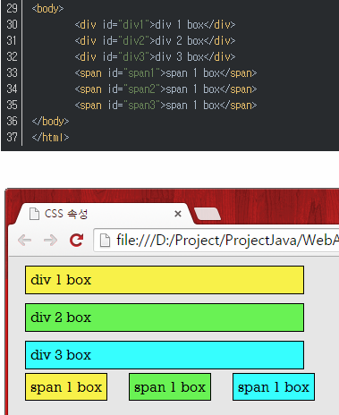

- div 의 margin 은 4방향 모두 적용이 되며 위 아래 겹쳐지는 여백은 상쇄

  여백의 크기가 더해서 2배가 되는 것이 아니라 겹쳐지는 것 !

- 그런데 span 의 margin 은 양 옆으로만 적용되며 겹쳐지지 않습니다. 그래서 넓어 보입니다.margin 은 양 옆에만 있고 여백이 겹쳐지지 않아서 div 보다 더 넓어짐 !

- https://mainia.tistory.com/3289

---


3. bootstrap : background-color

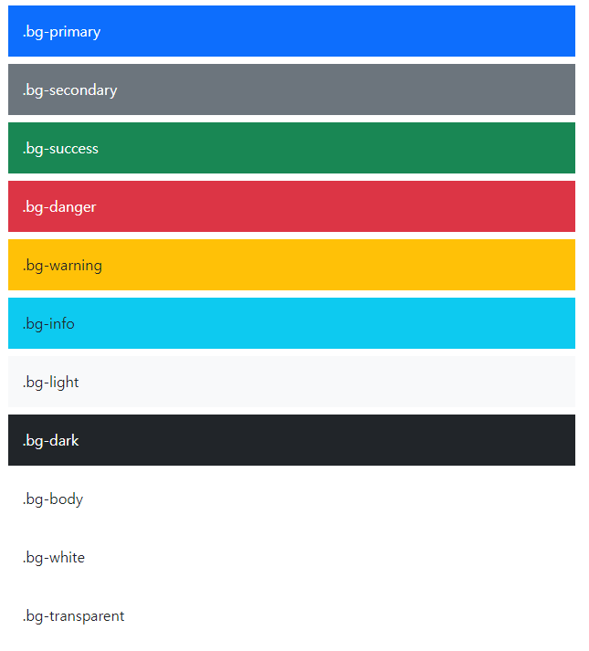

```html
<div class="p-3 mb-2 bg-primary text-white">.bg-primary</div>
<div class="p-3 mb-2 bg-secondary text-white">.bg-secondary</div>
<div class="p-3 mb-2 bg-success text-white">.bg-success</div>
<div class="p-3 mb-2 bg-danger text-white">.bg-danger</div>
<div class="p-3 mb-2 bg-warning text-dark">.bg-warning</div>
<div class="p-3 mb-2 bg-info text-dark">.bg-info</div>
<div class="p-3 mb-2 bg-light text-dark">.bg-light</div>
<div class="p-3 mb-2 bg-dark text-white">.bg-dark</div>
<div class="p-3 mb-2 bg-body text-dark">.bg-body</div>
<div class="p-3 mb-2 bg-white text-dark">.bg-white</div>
<div class="p-3 mb-2 bg-transparent text-dark">.bg-transparent</div>
```

​	➕ `bg-gradient` : 입체감 추가 !!

​	➕ `bg-success bg-opacity-50` : 불투명도 50%, 낮을수록 투명해짐 !


---


4. CSS 원칙

   : **모든 요소는 네모(박스모델)**이고, 위에서부터 아래로, 왼쪽에서 오른쪽으로 쌓인다.

   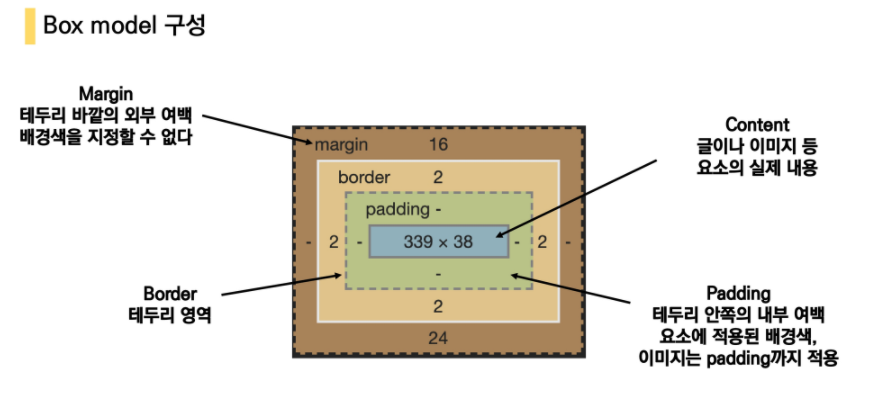

​	**🔥 상 우 하 좌 !**     >> border도 가능 !

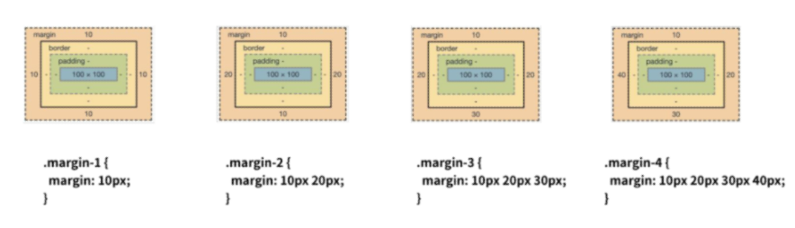


- `border-radius` : 깎아줘 !! 

  - 50% : 원 / 4px로 조정하면 부드럽게 ~

    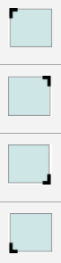

- `mx-auto` : 수평 중앙정렬 !

---


5. position

- 문서 상에서 요소를 위치를 지정

- `static` : 모든 태그의 기본 값 (기준 위치)

  - 일반적인 요소의 배치 순서에 따름(좌측 상단)
  - 부모 요소 내에서 배치 될 때는 부모 요소의 위치를 기준으로 배치 됨.

  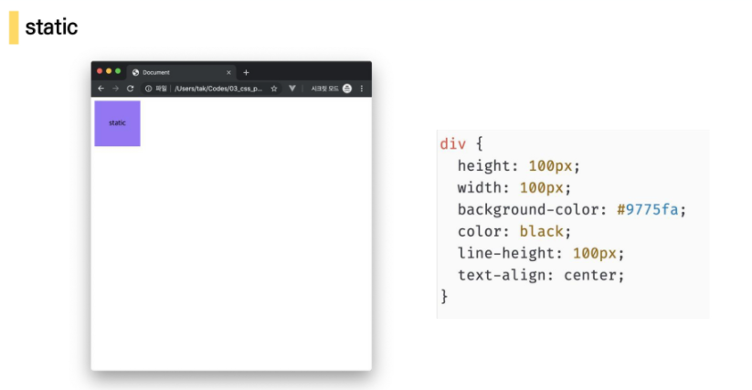

  

- 좌표 프로퍼티를 이용해 이동 가능 

  - `relative` : 상대 위치
    - **자기 자신의 static 위치를 기준**으로 이동(noraml flow 유지)
    - 레이아웃에서 요소가 차지하는 공간은 static일 때와 같음 (normal flow 대비 offset)

  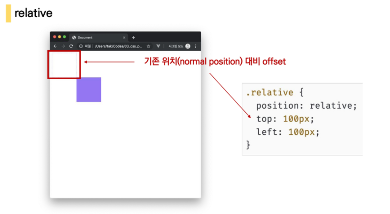

  - `absolute` : 절대 위치
    - 요소를 일반적인 문서 흐름에서 제거 후 레이아웃에 공간을 차지하지 않음(noraml flow에서 벗어남)
    - static이 아닌 **가장 가까이 있는 부모/ 조상 요소를 기준**으로 이동(없는 경우 **body**)
    - 겹칠 수 있다 !

  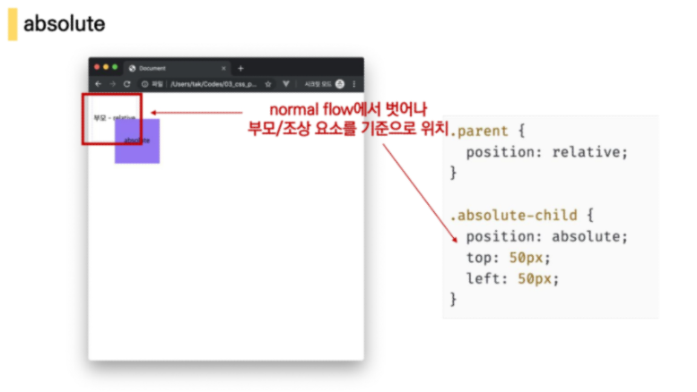

  - `fixed` : 고정 위치
    - 요소를 일반적인 문서 흐름에서 제거 후 레이아웃에 공간을 차지하지 않음(normal flow에서 벗어남)
    - 부모 요소와 관계없이 viewport를 기준으로 이동
      - 스크롤 시에도 항상 같은 곳에 위치함

  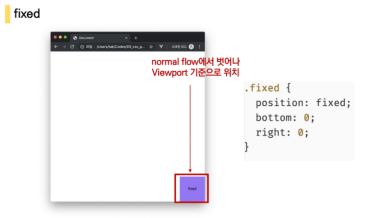

😈 **absolute VS relative**

 -  absolute : 절대 위치를 기준으로 움직인다 = 내 원래 위치가 기준으로 움직이는데 남들 상관없는 불도저

 -  relative : 부모요소를 기준으로 움직인다 = 엄마아빠가 지켜보니까 다른 사람한테 불도저 못함 .

    (즉, 다른 사람들도 움직인다 !)

---


6. flex 속성

   -  **Flexbox**

     : 행과 열 형태로 아이템들을 배치하는 1차원 레이아웃 모델

     - 축 : main axis + cross axis
     - 구성요소 : Flex Container(부모 요소) + Flex item(자식 요소)

     **🗝 메인 축의 방향은 바뀔 수 있다 !! 축을 잘 파악하는 것이 핵심 !!!!**

     **(수동 값 부여 없이)**

     1. 수직정렬
     2. 아이템의 너비와 높이 혹은 간격을 동일하게 배치

✔ CSS에서 !

```css
display: flex;

#1. flex-direction
>> row, row-reverse, column, column-reverse
>> main axis 기준 방향 설정

#2. flex-wrap
>> wrap, nonwrap(default)
>> 넘치면 다음줄로 바꿈 !

#3. flex-flow
>> direction + wrap

#4. justify-content
>> Main Axis를 기준으로 공간 배분

1) flex-start(default): 아이템들을 axis 시작점으로
2) flex-end: 아이템들을 axis 끝점으로
3) center: 아이템들을 axis 중앙으로
4) space-between: 아이템 사이의 간격을 균일하게 분배
5) space-around: 아이템을 둘러싼 영역을 균일하게 분배          >> 양팔 벌려 !
6) space-evenly: 전체 영역에서 아이템 간 간격을 균일하게 분배   >> 한팔 벌려 !


#5. align-items
>> 모든 아이템은 Cross axis기준으로 정렬

1) stretch(default): 컨테이너를 가득 채움
2) flex-start: 위
3) flex-end: 아래
4) center: 가운데
5) baseline: 텍스트 baseline에 기준선을 맞춤

#6. align-self
>> 개별 아이템을 Cross axis기준으로 정렬
>> ❗ 컨테이너가 아니라, 개별 아이템에 적용 ❗


- flex-grow : 남은 영역을 아이템에 분배
- order : 배치 순서 ( default = 0 )
```


✔ bootstrap 에서 !

```css
d-flex

#1. flex
	1) row, row-reverse, column, column-reverse
	2) wrap, nonwrap(default)
	3) direction-wrap

#2. justify-content
>> Main Axis를 기준으로 공간 배분
>> space 안써도 됨 !
    1) justify-content-start
    2) justify-content-end
    3) justify-content-center
    4) justify-content-between
    5) justify-content-around
    6) justify-content-evenly

#3. align-items
>> 모든 아이템은 Cross axis기준으로 정렬
    1) align-items-start
    2) align-items-end
    3) align-items-center
    4) align-items-baseline
    5) align-items-stretch

#4. align-self
>> 개별 아이템을 Cross axis기준으로 정렬
>> ❗ 컨테이너가 아니라, 개별 아이템에 적용 ❗


- flex-grow : 남은 영역을 아이템에 분배
- order : 배치 순서 ( default = 0 )
```


---


7. `container` : 시야를 편하게 해줌 !

- container
- container-fluid
- container-{breakpoint}

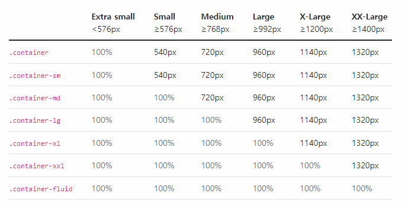

```html
<div class="container">
  <div class="row">
    <div class="col">
      One of three columns
    </div>
    <div class="col">
      One of three columns
    </div>
    <div class="col">
      One of three columns
    </div>
</div>
```


```html
<div class="container">
  <div class="row row-cols-3">     <!--행에 열이 3개-->
    <div class="col">
      One of three columns
    </div>
    <div class="col">
      One of three columns
    </div>
    <div class="col">
      One of three columns
    </div>
</div>
```


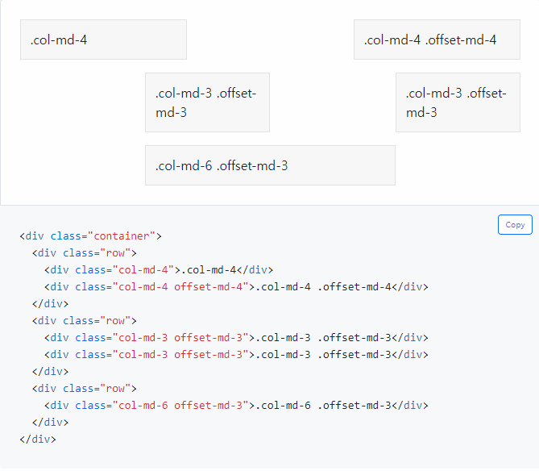

---


8. breakpoint

   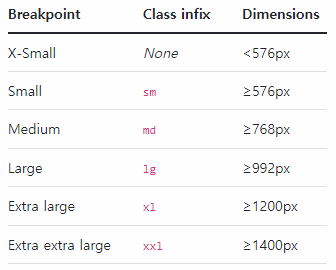


---


9. 자식 자손 결합자 중에서

   ```html
   <div>
       <body>
           <ul>
               <li></li>
           </ul>
       </body>
   </div>
   ```

   가 있을 때 바로 div에서 li에 있는 요소에 속성 줄 수 있을까? 답은 nope!

   div > body > ul> li를 사용해서 속성을 줄 수는 있음!

   

https://ofcourse.kr/css-course/%EB%B6%80%EB%AA%A8-%EC%9E%90%EC%8B%9D-%EC%84%A0%ED%83%9D%EC%9E%90

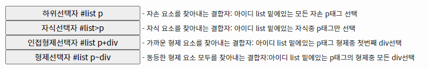


https://connieya.tistory.com/35


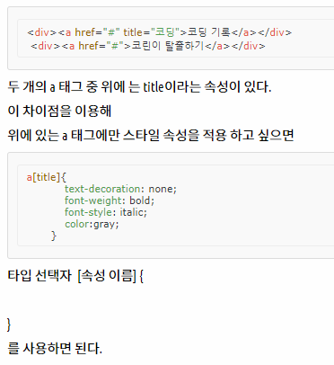

---


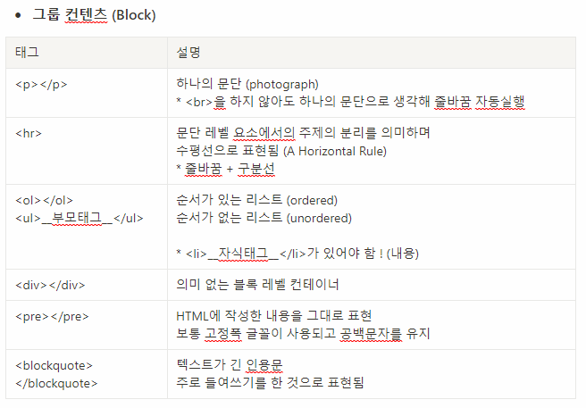

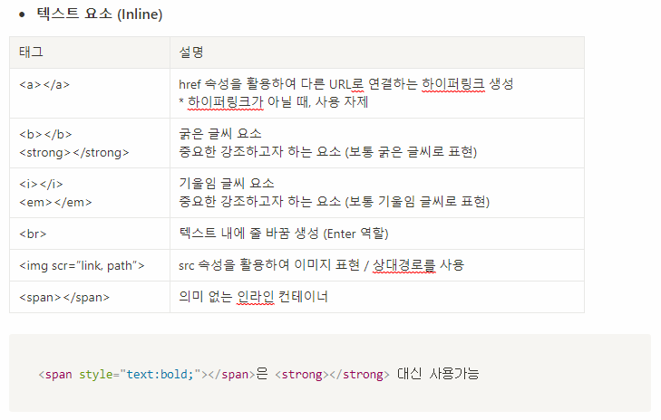


- 내용이 없는 태그들 : `br`, `hr`, `img`, `input`, `link`, `meta`


- **Inline / Block 요소**

  - 한 줄 띄기가 자동으로 되는지

    - 가능 : Block
    - 불가능 : Inline

    

- **HTML 기본구조**

  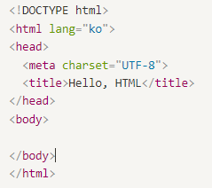


- !important & 우선순위

  https://developer.mozilla.org/ko/docs/Web/CSS/Specificity


- em VS rem

  https://www.daleseo.com/css-em-rem/

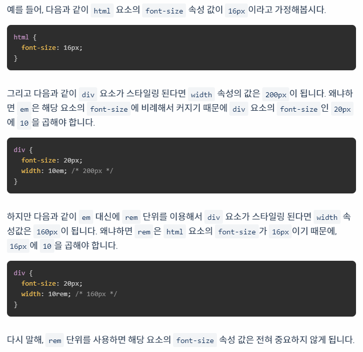


✔**em 단위는 "부모 요소의 글꼴 크기"** 

✔**rem 단위는 "루트 요소의 글꼴 크기"**


- 상대 길이 단위

  도건 say : vw, vh 탁희 교수님이 언급

   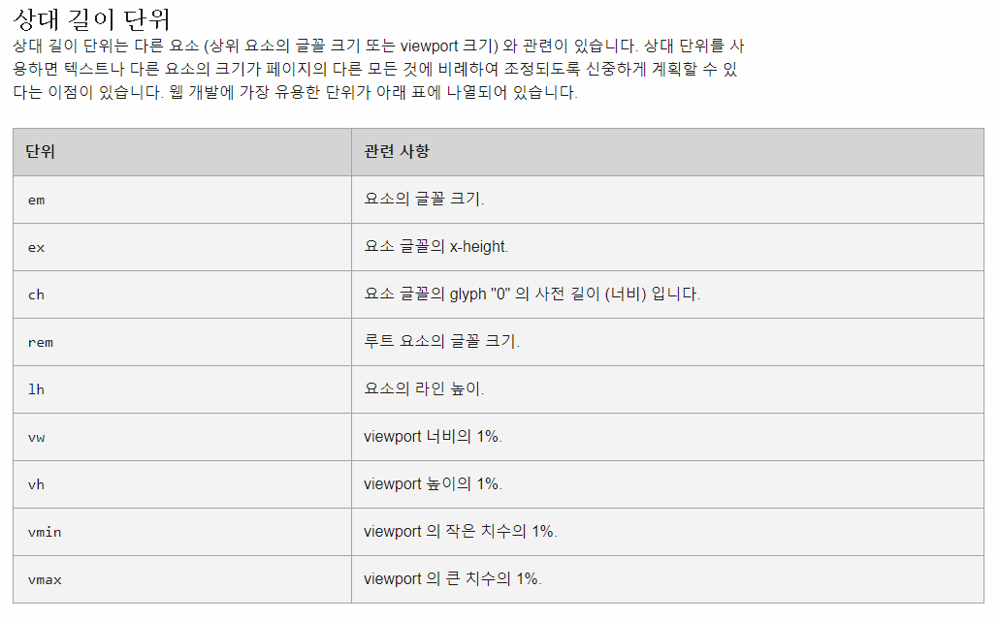 