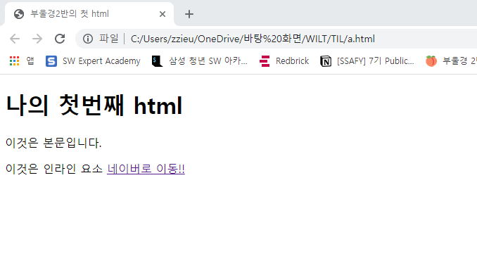

# WEB

배우는 이유: 웹 어플리케이션 개발을 통해 SW 개발 방법 및 학습 과정을 익히기 위해


표준: 웹에서 사용하는 기술과 규칙이 적용되는 것, 많이 사용하고 있고 표준적인 것을 사용하고 있는 웹을 사용

비표준: 특정 브라우저에만 적용하는 것 


## 들어가기전에

WHATWG

[WHATWG](https://whatwg.org/) 표준을 알기 위해서는 이 사이트 많이 사용할 예정 - ***즐겨찾기 눌러놓기!***

- 이걸 기준으로 개발을 많이 하고 있음


모든 언어의 공식문서

[mdn](https://developer.mozilla.org/ko/) - 파이썬 뿐만 아니라 자바 등등 모든 언어들의 공식문서

그 중에서

[html mdn](https://developer.mozilla.org/ko/docs/Web/HTML) 이 사이트는 특별히 html 공식문서이기 때문에 ***즐겨찾기 눌러놓기!***

[w3school](https://www.w3schools.com/) html을 어떻게 사용하는지 , 어떻게 쓰는 거였더라 헷갈릴 때 사용! ***즐겨찾기 눌러놓기!***


가장 먼저 visual studio 켜기

ctrl+shift+p ->  setting에 들어가기 -> 

```
{

  "editor.tabSize": 2,

  "[python]": {

​    "editor.insertSpaces": true,

​    "editor.tabSize": 4

  },

  "python.languageServer": "Pylance",

  "python.analysis.extraPaths": [

​    "./sources"

  ],

  "workbench.startupEditor": "none",

  "workbench.editorAssociations": {

​    ".ipynb": "jupyter-notebook"

  },

  "notebook.cellToolbarLocation": {

​    "default": "right",

​    "jupyter-notebook": "left"

  },

  "terminal.integrated.defaultProfile.windows": "Git Bash",

  "explorer.confirmDelete": false,

  "editor.renderWhitespace": "all",

  "editor.fontFamily": "Fira Code",

  "liveServer.settings.donotShowInfoMsg": true,

  "files.associations": {

​    "**/.html": "html",

​      "/templates//.html": "django-html",

​    "/templates//": "django-txt",

​    "/requirements{/,*}.{txt,in}": "pip-requirements"

  },

  "emmet.includeLanguages": {

​    "django-html": "html"

  },

  "window.zoomLevel": 1,

  "security.workspace.trust.untrustedFiles": "open",

  "diffEditor.renderSideBySide": false,

  "extensions.ignoreRecommendations": true,

  "workbench.iconTheme": "material-icon-theme",

  "explorer.confirmDragAndDrop": false,

}
```

로 설정 변경! -> ctrl+s


네이버에 들어가서 f12를 눌러보자!

그리고 <head>를 누르면 md파일 처럼 decoration이 빠진 문서처럼 보이게 됨!

이렇게 웹을 꾸미는 것을 배워보자


## HTML

웹 페이지를 작성하기 위한 언어

(hyper text markup language) - 글자 위에 마우스를 올리면 화살표에서 손가락 모양으로 변경되고 누르면 사이트가 이동하는 것처럼 언어를 통해서 어디로 이동한다는 의미를 가지고 있음.

기본적인 언어는 영어로 되어있기 때문에 영어로 바꿀 때는 따로 번역이 필요가 없지만 영어에서 한국어나 다른 언어로 바꾼다면 번역이 필요하기 때문에 번역할까요? 라는 팝업창이 뜸!


heading <h1>은 대주제를 뜻하기 때문에 단순히 글자를 키운다는 의미가 아니라 큰 틀의 주제를 보여줄 때 쓰는 거임 - 개요에서 보면 heading 볼 수 있음! - 이거는 확장자가 html일 때 가능!

```
<body>
  <h1> ---- </h1>
  <h2> ---- </h2>
  <ul>
    <li> ---- </li>
    <li> ---- </li>
  </ul>
</body>
** 이때는 들여쓰기가 두칸!
```


HTML 기본 구조

* html: 문서의 최상위 요소
* head: 문서 메타 데이터 요소(데이터를 설명하는 데이터 - 예를들어, 사진의 GPS, 노출 정도, 촬영 일자, 기종 등등 )
  * 문서 제목, 인코딩, 스타일, 외부 파일 로딩 등
  * 일반적으로 브라우저에 나타나지 않는 내용
* body: 문서 본문 요소
  * 실제 화면 구성과 관련된 내용

```html
<!DOCTYPE html>
<html lang ="ko">
<head>
    <meta charset ="UTF-8">
    <title>Document</title>
    </head>
</html>
</!doctype>
```

```
헤드 예시
<title>: 브라우저 상단 타이틀
<meta>: 문서 레벨 메타데이터 요소
<link>: 외부 리소스 연결 요서(css, favicon)  <link href = "style.css" rel = "stylesheet">
<script>: 스크립트 요소
<style>: css 직접 작성 - css 파일을 불러올 수 있지만 급작스럽게 변경해야할 때 사용 - 지양
```


DOM(document object model)트리

: 텍스트 파일인 html 문서를 브라우저에서 렌더링(어떻게 만들고 표현할지) 하기 위한 구조 - 구조를 체계화하기 위함

![문서 객체 모델 - 위키백과, 우리 모두의 백과사전](data:image/png;base64,iVBORw0KGgoAAAANSUhEUgAAAN0AAADkCAMAAAArb9FNAAABzlBMVEX////m5ub/3VXp3a8AAACqzP/i2+P01+7l1f/s7Oz09PT5+fn8/Pz/4lgpKSn/4Fbc3N5JSUnu47aw0v9BADNVVVX73vXr3P9Ab8R0WQDi4uPm4Op0VgB8YADZ0NCewvgyY72ciFmknITdyvt2UcMANKOGawDz0k2zsKaejmGTh7PHqC+hjEbNy8amiRTj16fYuDvDy+OShWKxvd3AwMArAKJ5TG+np6eAgICTiJC1tbWknY2QkJDVyqDm4taLchaIX3+5qG7SxI+vs79ra2uxpH9iitWyoosARK+BaiCljzeenp6RtvFsfK+PcQBWIbSWtOHBp0B/mL7Fu5R1b1jGv9hyiauMqNKxmjvIrUPpyk5KRjfix9yvo8PNv+UAH6BQYHhkeJaKeC4dHR21rIg/Pz+JgmdbVkRVIkosABeEdIFlWWLOtsmxnK2QhqByan9jNr1BPUldVmgdVbhJV2243f9mWCIzMCYyPEs+Oi6hfJluPmNJQEetmal2aHOAZHk6ACtlRF1BMD1/ZcCjksyki9rDreutld+GfZUAAC6Ab61uR79xWqpHNXI3I2cAACWVnbFRaqnSyrdQRhs3LxJ6oOEcEwDZ0sCFcz1dUzdfy6XAAAAW5ElEQVR4nO2djV/aWLrHedUmGomhQuW1ZUbR21JoJy6RmnbbgWmBmQ4Cy5svFUSYsYrT1lo703Z2d+7u7b1z797dvtx2/tt7zgE0CQEORoT0Mz+rCYm1fHuenPOcJ78cNRoNufjdeWz97NKoSq7vf1wdxdbu+Z8H/YZ7Efn9jgUfbtRi+enloN9yD1r8sRc4oNXvifFBv2lsfddDWNZb76fg2KDfNLbO9wg3avnjonoa7yR0WhXS7XShOqazqY7OYnkBv8BPyyj6QDo6Znm5alEv3cPtF6OrDx+uWrZfvVzdtbwc3V18uPtq0bIDjq1ub78anXi1o1Y6y+5LyyZsvRc7i5bRnW3Lq9FXOzsPLROWidWdh6sPLQ9Xt9XbdpaXO5YX4MPyYnfXYkF026DJwJHN3d0dsPMK0Kn3ult98dJgWdzefjn6Yvfl6MSuYfTV6g6k297e3V19BegWG3hqpBtdXV0dtazC6NtBr0YBC/xiWd1p7OyomA5bv9MNjc73nGf+QUV0P+/2OEewnA+ph87VY2hafvyLTz15pmb7u1ULvkZ/PB/ykYN+z/giF//83R9w9dOf/xJiteqZ32kILR1cbNGLv/619eDiYjzE+mwqggN0Npr2SeSa2jSwjX3aJpSWUBMcoAOySURMGgxNKvXMxGWE6KRCdI39cfsvC/j6xT5oIJG60RH/vvC3z/D1t4X1QRMJ1YWOWFv4zHoOyHoObcBOfbt+Tqzm2c8Wrg0aSaBudAt/r8M9XqtZEePaOtrsWY+I0PZ145X1P34don6nC93IQuNN760B7a3V9mq1c9ba2t5reOTR69pj615t7dHe+uP1tQbrAj08eF3o/vRtk279NQCqnavV1hHq63OP1tZfr6+/PvcYbNfW96zN2FxghyeZwaVbs9bWa2vnagAFXHS1tTXrWm19bX0dHK+dA9tas+2sC18Sg4Y6Uls6GwHVpEO9ihX1Kdbmq/qBRjfTvAZVQhcMQdW+PXrbmFIHXV3/+cMnSLf1SdOxSw297kbXcnr46bREU39que5ALylkeS09rwK6I4nprNZ16xpIVqyPQFcJcpZ1K9hbt1o/BTrrudrjmnXtUe3RumFv3VB79PrxGqADB4XxqVa6NQNoJtB2lkeWR6DRLHsgUwF0oEENgmhVFd2C4H2v7+2BFAW2F6SzNujW9vbWVdp22oXPRB0konsMonH9sRVkmTWwvybuN/++4FMNHfHL561DQiMLswpmfcfnfvgv9dBptd9+Dliw9dmvP7D0kM8RxK238OvnuPph4b9DviGqM3WlI8fptX+T6n/+8Y+WY1C1kM81TNXc7nSaMUJaEtRubRpayoRINPjfGDSSQBh0Gs34mFiaCYNB09gfHyYaqbDoWgTpGiKvfYGra2fe3Sil++bBxQu4uvjgmzMkg1JI9+SC0Ywv44WLZxvHyuiyF83GY7kzmWwCMMA/RiPaJoTnwbGLSRXRPXAL33o2+zSZSGTc2UwiY05kjMmM8TCbEOG5H5zpaKiIzj5jFtEVk8nEfnJjw1jMuA+TxY1EsmgW05lnzrTaqYzunpguaUwmNhJGRLfhNm4kMhtGCd29M51BnCKd0ZjNgkjNuhPGBNwCMLc7++nQdReg06qBLhQMBv/5ydJB/e+T3+nUSMcCfdkSmW63+HVCcl4tdHAj6VVArpXMoFwFpiros5hFL9RPZzZm9s1gKM+Ys2A8T2zsu83Fjf0EGN4FfGqlS2wUQY6ZLD6dMB8aQY5izG4k9p/ug7bLbhQ/AbqNLIrMQ+NEBiSaG5mNRPEpiExjUqV05ANRZCb3Ed3TfZBuboA003yY3QSRmRVG5gyrGjrNxfeiLsMM+kyQNoPJAkrIQHQm6t3L0Xe8f3Km1U5ldNceuFtGvGZ/2dwRnnLP/PNM7Z0K5+ZfPPjqazeuvv5qJsOeqZtFaV1l5Jt7MzK6d0/m8L1/fXnGhWqldOOkTeruhAqHw3KHfbazLXcqrviNj5FEi0iQhMocJsgzrlMrppOXods3nI1+p2uV+ungddIfOmLeOY2nj2+UsHWgc0EzjqsfdB8cl706b1PHey3SeQOz8/2hs9E0a+tH25EOL6VriKIor0knEiV8YaLul/tCpyXC4bivD3SRy8dwpeV8iTLpIGDj0xTTiXEdSorXhFZmWEJXHMEtsSHi9OmcXp2ALlCiSrHA21IuaiqV8gfRwkFhWYhHXZ1TMEYSxBInozigjm+F+xGZDkpAR1El78FyoZQvlArR5UAs5wWHRIF69YaCSQVBTBhkFCZs6GGSPtBNC+hyuXwOfPHmAoUcFcsVlvPemLTtbiiYELalc8W3lrb6cd0J6HSUyUSBrgVsdWhrMsFDkrZT8LwfoguH2JBYLLjgwuMhJdcd20bTosjrplOgA3wsSUp7lTjHKbnu2ulM6bREKIz+Vc5HiIYHgoV9i9rpwJBgiyMj9FbcJgAkpsg4qyAy4W0UObXQmepDuMnUFzpIQtJLmxBwKnTER0zZOLbPvQpkMhWoQkxXoJbzJggoTV1OgQ4lzWw9QsO+xgF6iVUSmTh0FBUI6N4VdLrAgTe3TAWWTVQOdqCnTocmBaEpNBqgPDMMBvU+jwje2AFotXe5Qmn57TIY+mL5AyofLQVMfaCDAeoDeFz9GGAj+5urUIYYRZmot1ShBFKUXP6gVHoH8uqCIWc6dTqCdNWvvaX6MZI2hE4cmT6fr92paUHD5KPRAvWOgmkYoAP7Ogo0p5c65bYT9Zv1GdAk56NPnIl10CVB4Jkob4GKRUEaVorl87pSNEcFJHmmc04hXfOCA0HpOuoybfF4/OSz1w76cF8yJMDohF9McLon6TOpyx9ZJVk07Cy5emfJioZzRZWHTrp0FWLgKTA9p6Q0D2ZA9YEuqCUkM1kCHTl9Ok3EcRVTzugcq2RxAoIAcJNx7VhLnklyJBs8aa7SUeP03I22qvz2W+XoxZzClRdQFr01IdFmmCC4LS5M96XtNGNg9thGtqDBED8+a1O28kLb+R3IoklXn+g041Iv8rEpOWQwBJuuZMW2ZIKQTeQhXZg8eV2ld4FLA2oc0o2TndTDDyW0smUjVBOLT/Wr7VpUnnY05JyddTo6ax4bsFOlPWjrT5/ZojHnFT+DLf9tx03MH9yxnhk88QyoN5VuM3qpGNFGfOqOA7P1BHlmMySbr7mlk9dVetJNZwsD76mm/Iyf0Vf8cnhX7uJ1pc08k/QF4Y2DEE0ezV6DUxxOZNqvYatNTlWWaTp9xVNOR6rlaqosw3fnI16FGrEQNu6ot5yI1xuQpmEBqyvdtZl7F7H14KLs4jIRWbpquaw3MGlGLjbvRPHMBSiVDIqHAzgl19KuEMuGOKKL52Hm6x6eRzC/fyCHJ0sX4a+nPHykXJZtuyieuwClXGjqw8WDwaUwGtuDaESIhzmiy3VnF/tVEtlE1mhumlaa7hWhYeX9PZmIkqWDHQoj26n0REfE4ehNN9JMNDtHrYdTrX3/lchrBH3s5mzCjSCziUTWnSkaRY5N85NrrXht6DoIn46GNKRgig5oN8Hh+Fa8a6X94teit76fdBeTmf1Mcj+RySQPM9mNbNaYFX3LV8nWH9hHOgLEZUg06sFIDdbz3G5z8ydiuuJTczGTTCQTRXOxmE1kjMWsiA3SfdM61e4n3aZhitSKRMA8kwiGw0vdRgQJXTKTyJqTSRCaRrDNJkC7ZdyStvumdUojpGP0ohGc0evlRnRsOrrRiQjpOBCatjBJxruNCGK6uumt6XwzN7sXbLoUn9JXeKZcbuDwPFPheT1TRb0LD872TOczGHxSOjBCEDRHEp16FVhIn5PQdVcnOsaTqjCGNPOsqvfr/YCqUuH9+mpZv8LoIykmAs72TMceL/t2RAdmIfCe7FK4Q2QizZwmHWi7sj69kqpU9c+ZdArQpVNpvlrhV5gVPl2GZ0/Sdqy07UCvCUYKG92patQHOqiqx+BfYar8MxCN5QiT9oNQXfE/q6QrwqsPf0QAM30pXdgwAed99R60DR2603g6kSnMM6v+KrPC8IYIoIt4mDSf5pnn4IMRZSx3PuL2mVsIRSi6PjcPEXS38U7aqxjNh8fPImwkmhbbLnQfZo/pKmACBz4NcN+fjnj8fBpcb6l0mhfAMVeu49KBMOREQwI5BYOViE8Gw93u3wnpzGZ3MWs+zBTNxmLRbUYPF5rNSeNGQuj6lqPTRI8bD40ITCMOGZhCow5TlEuD+V0IN4uGJT/ueGJHaAEcHAHpEE33Mt4l0QMJBmMxWcy6D9375sMEGNH3zcbMRqYLHeG4LZ6b853m5vrbjhssXvkd1r7gvCdYXx2NoJdgbwF7UWhk6SEyzfsADkTm00QRROdhNvO0mDAewoZzZw4Tnek0xLxjFluO6ByuAZmoDwAQcCocnkJ1aYOrXjUaI7u13QWBYx8+KZM1GxIb2WIme2g8dG8mzBuHZiOiPvqmCxnZmCJpdg5XLOujMQ3IiIM+Wj8MVfvqd4GIze5t98VFyfMIIA+DF1vGaE5ksm5zJmmWuPZnvpS/YloXk2gv/MVzG91+464ymB3U70kiPF/3+wgz76Wp1nGfaTZnDyXTO/OFf7VdTHscX5hsgvt3BKw0+ASmB6yamH3mQofnEeDzeEK9f3LxbBfTFt83F+fSODUxQv55BHk9ybBnuw56h3omXk2M1Pp8rOSpA5Z99nyq5VkE+F302a43fRyZ8KkJl/Amni8Yx7n3Kvc8AkjvJuWeRyDOeG2ZhhuHDW82Cn6cqwk81X1u3k7jgK4vb7dH1UeESdGI0CDmWPakd0k60429mcfUG6V3uCBcfSyYDE/Vx72tRtuFgu3oDEroPjiuBjB1Fft+SHs6GJRxun5h+GBxExVaCK69K8BG0yemu+nwUqam4J1/k0ii11RBGR7IM5dgax0Pc3Sjnkl0cFJ1Uye6SwGBdTiWC8QgIPxE1g7KWxCa/ajLl5QEJwErYAbRSOACjQfpgqFQu8jspg50Yw6hkyha0JVMsVghFovlvbFYIJZbjnqFxmiTQ8kASWhZaVEMVjjhcxasrx9td/O+lG45FsvloXE/V8oVSoW8yGxEzSr0q4ibDuaX9dB00UvtcpVTo4Nu/UJpOQ/pCqU8fCVuO2pWkdeICBsmpXUVVGoh4vG2LrjTokNPj4Dr7OgTfRVZqRTSTTYHuGO6LehiJOIkqygyZQ0LYzelNrHOUko30bQsHtNNNRwdbbPobhqTtYnUdXXQdGFEF+faPimjgO7/hoNO6+OCJ73uAN3mlLyqMnTydvY+0ZH1tpsiltpV/LoJu1epwxUKEM8rA3cKdBztEomeOkM66DzNLYNcJfY2D7pMSurYV0wnI0jnOnlk4o8I0BpNLR9ESwAvb/IelAJivj7REb4w1/fxzpR/B1ITajlHvUN0OkqXe1cwnSJdWO7aXyJAYJJt/ZmnRafz5qCFHUTmW0AHmq1QiuZPMzLbPRlKx0mirYNRAd24Qxx5VKFE5WDb5d8eFLwAVXLhTSujayN6i+Om+kCnmb/c0q3ojh7/kfan1OXrSpab6fw0fR+uOw3pCGBb2qnAdEjJmiUnWwlBCZ3m5vT9y5i675zDvNsjrwHQaci56211cHAgeHVDqad9AHTjpLadpZ3empgQvVboaR8AHVpypo2jG4y+wnNjykp+g6Frr9N17Q4L3c3I7LQTaHoabdpq+lakhxFiSOjeOG77MXXbgb/oynDQfZj2i61uTY+DjPmP8eNXcIeD7tYdMQZ/PZ1C/gaPHN7tj73dWR4wHTktheAjEY+nUomspCKteHoH7i+yHgq6m7da6arlSDtLO4NdwR1WunLZk6qUyxW5tmOwZ0VDSof6FaaNp52ZnVM7XQf9Tvc73WDo2j6upl46nvfr/ci1zouHcCZV9gtsw9Dkrjo6Ju3hGQ+y1KaglZ3heUgMqFKRCLSfwmMpaEwFQ6D66Dxlnnnugc3GP4s8YyqVdMQPshVmJbIS4dN+Q/1YmgGs6qODl1YKWdn1fJpJ6w2VygrAWdFXAQ+gSzMV/jkDTsFBUGV0yPYNgrO8wgO6CpP2P4Pu7zKys1eO6VJp9I1OVeUqGgfy41cZBj4vAugq/lQ1XU5VK2nGk06X+QroVyo8eg2+z49dwR0OusiV5tNN9c+Gix2FYdPXDrDLadTBlK6rKovWaKJX9BhPmqeg111/JYrp1x8aOnLeUbqCpZLjOv6vRxwSOg3pm/Ng6UaI9WH/esRhoRsn269KIl2kBL+COyx0nVYlkaiHAu7w0PVDg6C7OR/tWJE9VjRy9M+nSph/B+jSh8HRpRyX268RLdFlR/2Nks5LPhe25pyXBkX3YVpwhxVaaaW3W4XuTKrgQGmJ86595Fh2+wj8EBwYEclu/xgZEF1U6GnwHiznY437rKb6ZlknNtfOgx7yzUcRS3DRHgcfdnsoztohWxDsiwEdN8cHQUeK1s+Eyynn8rFSLBYtFXI5sJOL5goi/mkwdF+aE9GFwyOToUl26ksuyIXZIMdOubjFUFD4LfN3yUHQSRwdMaqQiy4vQ/Np/iAPtzGxbYxygLTrlk/YLq6pMMvZOXvYzgVZLhTiRpZGJoMh0X/A3Xl4R3rQdKVcYLkQA9EZK+TzsQDY5mOitqMcIGUW0dnjrpHFRZZjF+1LocXFES5sD7uW4i5R2929Dm9JD5hOh/z5aJnCoy0laTspHexDGv2KHe00tiNiOrqfdFvSJagbmuvNWytHh6G+0nXy1vZKN80txZ2fLt2EweAYKjoQmRPygRm6cfp0dplDfabrwVuLvGIm+JBFS+IC6YIsPSuls4fZRt8C/nCca3jpQCcJxrlAKUbpopJVa3XtehU7Fwd8wcUQ2Lg248PbdsiTadJ5qdgypctFY15MupFJu2EkvmjfGtka4sg0LR/kdBRVih7kKMobOyiYsOhY+5Z90s6FOQ5gDg/dbGtkBkol6p03GjMdlArSS88E6UrydFv2UBhk0FvDQ6dxtHQc8MozFWKBgqnlqgNxG3WRmshdKUAIzBTswRE7uxSyB1vgRuylG32k25oMtzsXkX+YRJKAHQXmfQ+gu+mQ6/brHLIH55xs//LMjuTRy/jeWt3Vj+i3HZadPnsPmnPMoZrn2dNpyEvY60VfRaVZ+JfeTN+6hC2nc67+GyAHQKcZ89240a4W+9tvv90QlWZd9brzOIFZzYWag2uUaAZE12G9aNvW5qbonLa5ukAnQ27bgu5A6OQrs2htEeg+bbfYCDrQU0F3MHSyxGi5aIlzWNFq0cND9ybqQIXWW7duda7EOkofuv+0poaEbn72Du5y0Xec+L8Sbzjo3kjMRn6e59sYc4Cc2Nbh4aCblqy8y0fSfIrhGbjOXSvdnSjumxoKOqJlOWyAV05HVvi0X86f6RjsneUeJeM+9VRTPD+k3toeJUOX4j0pD18ul4fQW9ujZB2MbReL/iTo2mvQTqoe9Tvdp0LHCL5+OnRlPgVHN2ikBR+V+urQZeYIF+yWy2qlAzwRHnr4eDDalSFdGTpRU0y5AhIzJgV2/XWPnxrp9GD4hnR8VW/wr/gr5U3QevzzVKTif84886zoAV0qpda2g0J0aX0VtJzHgFLMKpNOV6oMSFuYFUal153zmI5p0FU8z2Bq/ZypeEA6vZKuMM+P6AbsPu1VzTmCP51O8xG9hynzZZ6H3YsHumsjqQhT0aeaa0bfceKuHzAcdEfzO+SmFf4uoIa7tm63bQYmLOBiaTjoNPO38Ofms5dYVc2AgO46nXirRTudHhZ7YYuuFbQzWqx0zObDWy06xLI0rnF4eIS9YLT2rJeHPR2d+nLR/w+ggjsz4b5VRgAAAABJRU5ErkJggg==)


### 시맨틱 태그

: 변치 않는 태그 - 구조화

과거에는 규칙이 없이 div 태그를 사용 

그 후에는 규칙을 세우기 위해 새로운 태그가 등장

* header: 머릿말, 중요한 내용들, 브랜드 - 보이지 않은 데이터들이 숨겨져있음
* nav: 상단 혹은 좌측, 우측에 있는 이동할 수 있게 해놓은 탭 창 ex) 부울경2반 > member > 노션 
* aside: 사이드에 위치한 공간, 메인 콘텐츠와 관련성이 적은 콘텐츠
* section: 바디 안에서도 중요한 부분들, 문서의 일반적인 구분, 컨텐츠의 그룹을 표현
* article: 문서, 페이지, 사이트 안에서 독립적으로 구분되는 영역
* footer: 문서 전체나 섹션의 푸터(마지막 부분) - 저작권, 나의 입장, 전화번호 등등 영역 표시

``` 
* 과거 
<div>
  <div></div>
</div>
----등등

* 현재
<header>
  <nav></nav>
</header>
----등등
```

h1, table 태그들도 시맨틱 태그로 볼 수도 있지만 실제로 구조화 시키는 것은 아님


#### 속성(attribute)

속성: **id**(고유 식별자), **class**(공통적인 식별자), data-*, **style**, title, tabindex 등등

```
<a href="https://google.com"></a>
href = 속성명
https~ .com = 속성값
```


#### 요소(element)

요소(태그): HTML 요소는 시작태그와 종료 태그 그리고 태그 사이에 위치한 내용으로 구성 

-> 컨텐츠(내용)을 감싸는 것으로 그 정보의 성격와 의미를 정의

* 요소 중에서도 내용이 없는 태그들도 존재: br, hr, img, input, link, meta 등등 닫는 태그 없음
* 요소는 중첩 될 수 있음

<br></br>이런게 없이 하나의 <>만 필요/ 쌍이 필요없음

<br>: 한줄 띄기

<hr> : 

```
<hr> 한줄 띄면서 줄 표시하기
```

 : 이미지 가져오기

<input>

<link> 등등의 요소가 있음


a.html 파일에서 

! emmet을 누르면 구조가 한꺼번에 나옴

```html
<!DOCTYPE html>
<html lang="en">
<head>
  <meta charset="UTF-8">
  <meta http-equiv="X-UA-Compatible" content="IE=edge">
  <meta name="viewport" content="width=device-width, initial-scale=1.0">
  <title>부울경2반의 첫 html</title>
</head>
<body>
  <!-- 이것은 주석입니다.  -->
  <h1>나의 첫번째 html</h1>
  <p>이것은 본문입니다.</p>
  <span>이것은 인라인 요소</span>
  <a href="https://www.naver.com">네이버로 이동!!</a>
</body>
</html>
ctrl+/를 누르면 주석이 나옴 !
```



이렇게 나옴!!


** 장애인을 위한 네이버 사이트 [널리](https://nax.naver.com/index)


#### 인라인/ 블록 요소

인라인요소: 띄어지지 않고 한줄에 써있는 요소

블록요소: 띄어달라고 하지 않았는데 자동적으로 띄어주는 요소


##### 텍스트 요소 :: 인라인요소

```
<a href="link"></a>: 하이퍼링크 생성 - href 속성 활용, 왠만하면 하이퍼링크 할 때만 사용해라!

<b></b> : 굵은 글씨 요소(bold)
<strong></strong> : a태그 안에서 부분 강조하고 싶을 경우
                    <a>안녕하세요. <strong>최지은입니다.</strong> </a>
<i></i> : 기울임 글씨 요소(italic)
<em></em>: a태그 안에서 부분 기울임하고 싶을 경우(emphasize)
            <a>안녕하세요. <em>최지은입니다.</em> </a>
            
 : src 속성을 활용하여 이미지 표현

 : 상대 경로 - 직접적인 경로가 아님 나중에 활용할 때 공부

<span style = "text:bold;"></span>: span 안에 속성값을 넣어줌, 의미 없는 인라인 컨테이너
```

모르는 거 있으면 mdn <요소> 로 검색해서 찾아보기


##### 그룹 컨텐츠 :: 블록요소

```
<p></p> : 하나의 문단

<hr> : 문단 레벨 요소에서의 주제의 분리를 의미하며 수평선으로 표현

<ol></ol> : 순서가 있는 리스트
<ul></ul> : 순서가 없는 리스트
<li></li> : ol과 ul 사이에 있는 요소, 리스트로 만들고 싶은 것들을 만듦 - 
            ul이 부모 태그, li는 자식태그
            
<pre></pre> : HTML에 작성한 내용을 그대로 표현, 보통 고정폭 글꼴이 사용되고 공백문자를 유지

<blockquote> : 텍스트가 긴 인용문

<div></div> : 의미 없는 블록 레벨 컨테이너
```

[테이블요소](https://www.w3.org/TR/2016/WD-html52-20161206/grouping-content.html#grouping-content) 참고


#### 테이블

표를 보면 위에는 header, 중간에는 body, 밑에는 footer이라고 함

따라서 맨 위에 행은 th, 각 열은 td, 각 행을 tr

```html
<table>
    <thead>
        <tr>
            <th>ID</th>
            <th>NAME</th>
            <th>MAJOR</th>
        </tr>   
    </thead>
    
    <tbody>
        <tr>
            <td>1</td>
            <td>지은</td>
            <td>베트남어</td>
        </tr>
        <tr>
            <td>2</td>
            <td>상현</td>
            <td>심리학과</td>
        </tr>
        
    </tbody>
    
    <tfoot>
        <tr>
            <td>total</td>
            <td colspan="2">2명</td>
        </tr>
    </tfoot>
    <caption>반짝이는 2반</caption>
</table>
```

* 병합할때 colspan, rowspan 속성을 활용하여 셀 병합
* ★ 열이 합쳐졌을 때는 colspan="", 행이 합쳐졌을 때는 rowspan=""
* caption을 통해서 표 설명 또는 제목을 나타냄(필수는 아니지만 가시적이기 위해서는 쓰는게 좋음)

[rowspan 예제](https://www.w3schools.com/html/tryit.asp?filename=tryhtml_table_rowspan2)


#header > div > div.new-gnb > nav > ul.gnb1depth > li:nt-child

부모태그 > 자식태그 (깊이를 보여줌)


#### FORM

:정보를 서버에 제출하기 위한 영역

사이트에 ''검색결과를 요청하는 것 -> 엔터를 치면 ''에 대한 검색결과를 볼 수 있음

클라이언트가 서버에게 요청을 보냄 


user가 편하게 볼 수 없는 데이터가 모여있는 곳이 백엔드, 서버

사람들이 편하게 볼 수 있는 곳이 바로 프론트 엔드, 클라이언트

* 기본속성
  * action: form을 처리할 서버의 url - 어디로 보낼건지
  * method: form을 제출할 때 사용할 http 메서드(get/ post) - 어떤 방식으로 보낼건지
  * enctype: method가 post인 경우 데이터의 유형 - 어떤 값을 보낼건지

``` html
<form action= "/search" method="GET">
    <input type="text" name="q">
</form>
```


#### INPUT

:다양한 타입을 가지는 입력 데이터 유형과 위젯이 제공됨

* 대표적인 속성
  * NAME: form control에 적용되는 이름
  * value: form control에 적용되는 값
  * readonly(읽기만 가능), autofocus

``` html
<form action="/search" method="GET">
  <input type="text" name="q">
</form>
-> https://www.google.com/search?q=검색할내용 이렇게 하면 구글에서 검색한것처럼 검색 가능
```

```html
<!DOCTYPE html>
<html lang="en">
<head>
  <meta charset="UTF-8">
  <meta http-equiv="X-UA-Compatible" content="IE=edge">
  <meta name="viewport" content="width=device-width, initial-scale=1.0">
  <title>부울경2반의 첫 html</title>
</head>
<body>
    <h1>Form 활용 실습</h1>
    <form action="">
      <!-- autofocus 및 label 확인 -->
      <div class = "input-group">
        <label for = "username">아이디</label>
        <br>
        <input type="text" name="username" id="username" autofocus>
      </div>

      <!-- disalbed 및 value 확인 -->
      <div class = "input-group">
        <label for = "name">이름</label>
        <br>
        <input type="text" name="name" value= "홍길동" id="name" disabled>
      </div>

      <!-- label 확인 -->
      <div class = "input-group">
        <label for = "agreement">개인정보 수집에 동의합니다.</label>
        <br>
        <input type="checkbox" name="agreement" id="agreement">
      </div>
      <div class = "input-group">
        <label>최종 제출을 확인합니다.</label>
        <br>
        <input type="checkbox">
      </div>

      <input type = "submit" value = "제출">
    </form>
</body>
</html>
```

**label의 for과 input의 id**가 상호 연관이 되어야함

* type
  * text
  * password
  * email
  * number
  * file
  * checkbox: 다중선택
  * radio: 단일 선택


* 마크업 해보기

```html
<!DOCTYPE html>
<html lang="en">
<head>
  <meta charset="UTF-8">
  <meta http-equiv="X-UA-Compatible" content="IE=edge">
  <meta name="viewport" content="width=device-width, initial-scale=1.0">
  <title>Document</title>
</head>
<body>
  <header>
    <a href = "https://www.ssafy.com/">
      
    </a>
    <h1>SSAFY 학생 건강설문</h1> 
  </header>
  <section>
    <form action = "#">
      <!-- 이름 -->
      <div>
        <label for= "name">이름을 기재해주세요.</label><br>
        <input type = "text" id = "name" name = "name" autofocus>
      </div>
      <hr>
      <!-- 지역 -->
      <div>
        <label for="region">지역을 선택해주세요.</label><br>
        <select name = "region" id = "region" required>
          <option value = "">선택</option>
          <option value = "부울경">부울경</option>
          <option value = "서울">서울</option>
          <option value = "대전">대전</option>
          <option value = "광주">광주</option>
          <option value = "구미">구미</option>
          <option value = "강원" disabled>강원</option>

        </select>
      </div>
      <hr>
      <!-- 체온 -->
      <div>
        <p>오늘의 체온을 선택해주세요.</p>
        <input type = "radio" name = "body-heat" id = "normal" value = "normal" checked>
        <label for= "normal">37도 미만</label><br>
        <input type = "radio" name = "body-heat" id = "warning" value = "warning">
        <label for= "warning">37도 이상</label>
      </div>
      <hr>
      <input type = "submit" value = "제출">

    </form>
  </section>
</body>
<footer>
  Google 설문지를 통해 비밀번호를 제출하지 마시오.
</footer>
</html>
```

* type radio와 checkbox에 차이

radio는 단일 선택/ checkbox는 다중 선택

[radio type 더보기](https://developer.mozilla.org/ko/docs/Web/HTML/Element/Input/radio)

* form action = "URL"

: <form> 태그의 action 속성은 폼 데이터(form data)를 서버로 보낼 때 해당 데이터가 도착할 URL을 명시합니다.


# CSS

cascading style sheets: 스타일을 표현하기 위한 시트, 스타일을 지정하기 위한 언어

```html
<!-- 외부참조: 분리된 css 파일 --> 
h1 {
color: red;
font-size: 15px;
}
인 값을 html 파일 외부에 style.css 파일로 저장하고 
본 html에 
<head>
----
  <link rel="stylesheet" href="style.css">
    ----
</head> 넣으면 style 참조 가능

<!-- 내부참조: <style> -->
<head>
-----
    <style>
      h1 {
color: red;
font-size: 15px;
}
    </style>
</head>

또는
<body>
    <h1 style= "color: blue; font-size: 100px;">hello</h1>
</body>
이렇게 같은 html 파일 안으로 넣어도 style 참조 가능

원하는 부분만 색깔도 변경 가능! 같은 색상으로 하는 것들을 class로 묶음
.e02_del{
  color:blue;

}

#jieun{
  color:purple
}
이렇게 새로운 style.css로 저장하고 
<body>
  <div class="container">
    <div class="row mt-3">
      <h1 id = "jieun">최지은</h1>
      <h1 class = "e02_del">부울경1반</h1>
      <h1 class = "e02_del">부울경2반</h1>
    </div>
    </div>
</body>
로 html에 넣으면 정의된 class대로 색깔 지정 가능 
css 작성할 때 .은 class   #은 id
```

id는 부모 태그와 관계없이 개별적으로 스타일을 적용하려고 할 때 사용하고

class는 여러 개의 태그에 동일한 속성을 지정할 때 각각의 태그에 동일한 이름의 class를 지정하여 사용한다.


[붓스트랩](https://getbootstrap.com/docs/5.1/getting-started/introduction/)에 다양한 css style sheets가 있음: 프론트엔드 오픈 소스 툴킷

```html
<link href="https://cdn.jsdelivr.net/npm/bootstrap@5.1.3/dist/css/bootstrap.min.css" rel="stylesheet" integrity="sha384-1BmE4kWBq78iYhFldvKuhfTAU6auU8tT94WrHftjDbrCEXSU1oBoqyl2QvZ6jIW3" crossorigin="anonymous">
```

를 복사해서 <head>안에 붙여넣기 하면 붓스트랩 내에 있는 css style sheets를 사용할 수 있음


## CSS 기본 스타일

* 크기 단위

  * px(픽셀) : 모니터 해상도의 한 화소, 픽셀의 크기는 변하지 않기 때문에 고정적인 단위

  * %(백분율단위): 가변적인 레이아웃에서 자주 사용

  * em: 바로 위에 있는 부모 요소에 대한 상속의 영향을 받음, 상대적인 사이즈를 가짐 - 가변적인 레이아웃

  * rem: 상속의 영향을 받지 않음, 최상위 요소(html)의 사이즈를 기준으로 배수 단위를 가짐 

  * inch

  * viewport

    * em , rem을 가장 많이 사용하고 지향함

    * em, rem의 차이점!
  
      ```
      rem는 16px를 기준으로 함 -> 1.5rem 이면 16px * 1.5 = 24px
      em은 부모 요소에 대한 상속의 영향을 받기 때문에 부모의 크기 * 1.5가 크기가 됨
      따라서 1.5em이더라도 1.5rem과 다름
      ```


## selector(선택자)

: 문서의 위치를 지정하는 것, 속성과 값들을 매칭시켜서 사용 가능 

* 요소 선택자
* 클래스 선택자
* 아이디 선택자

* 결합자(combinators) - selector 심화

  * 자손결합자 : selectorA 하위의 모든 selectorB 요소 | selectorA selectorB {}
  * 자식 결합자: selectorA 하위의 바로 밑에 selectorB 요소 |  selectorA > selectorB {}
  * 일반형제 결합자: selectorA 형제 요소 중 모든 selectorB 요소 | selectorA 물결 selectorB {}
  * 인접형제 결합자: selectorA 형제 요소 중 바로 뒤의 selectorB 요소 | selectorA + selectorB {}

  ```
  div.group_nav >
  ul.list--- > ul은 div의 자식
  li1: ------ >li는 ul의 자식
  li2: ------ >li1과 li2는 형제 태그
  a >
  span
  ```

* 예시

* ```html
  ♠ 자손결합자
  div span {
    color: red;
  }
  
  <body>
    <div>
      <span> 이건 빨강입니다.</span>
      <p>이건 빨강이 아닙니다.</p>
      <p>
        <span>이건 빨강입니다.</span>
      </p>
    </div>
  </body>
  
  
  ♠ 자식결합자
  div > span {
    color: red;
  }
  
  <body>
    <div>
      <span> 이건 빨강입니다.</span>
      <p>이건 빨강이 아닙니다.</p>
      <p>
        <span>이건 빨강이 아닙니다.</span>
      </p>
    </div>
  </body>
  
  ♠ 일반형제 결합자
  p ~ span {
    color: red;
  }
  
  <body>
    <div>
      <span> p태그의 앞에 있기 떄문에 이건 빨강이 아닙니다.</span>
      <p>여기 문단이 있습니다.</p>
      <b>그리고 코드도 있습니다.</b>
      <span>p태그와 형제이기 때문에 이건 빨강입니다!</span>
      <b>더 많은 코드가 있습니다</b>
      <span>이것도 p태그와 형제이기 떄문에 빨강입니다!</span>
    </div>
  </body>
  
  ♠ 인접형제 결합자
  p + span {
    color: red;
  }
  
  <body>
    <div>
      <span> p태그의 앞에 있기 떄문에 이건 빨강이 아닙니다.</span>
      <p>여기 문단이 있습니다.</p>
      <span>p태그와 인접한 형제이기 때문에 이건 빨강입니다!</span>
      <b>그리고 코드도 있습니다.</b>
      <span>p태그와 인접한 형제가 아니기 떄문에 빨강이 아닙니다</span>
    </div>
  </body>
  ```

div는 한 블럭으로 묶고, span은 한 인라인으로 묶음


## BOX model

css 원칙: 모든 것은 네모고, 위에서 아래로 내려감

margin - border- padding - content


box sizing : content-box(내용물을 크기로 봄 - default)/ border-box(내용물이 안에 있는 보더를 크기로봄)


## CSS 상속

부모 요소의 속성을 자식 요소로 상속 시킴

상속되는게 있고 상속이 되지 않는게 있음

상속되는 것: TEXT 관련 요소, opacity, visibility

상속되지 않는 것: box model 관련 요소, position 관련 요소


## CSS display

* display: block
  * 줄 바꿈이 일어나는 요소
  * 너비를 가질 수 없다면 자동으로 부여되는 margin
  * 수평 정렬은 왼쪽, 오른쪽에 margin을 넣어서 가운데로 정렬시킴
  * 블록은 한줄 다 먹는다 - 비어있다면 margin 으로 채움
* display: inline
  *  자체의 너비 만큼만 가짐
  * 너비, 높이, margin - top ,bottom을 지정할 수 없다.
  * why? 컨텐츠 영역만 가질 수 있게 함
  * 인라인은 정해져있는 너비만 먹는다


## CSS Position

* relative: 기존 위치 대비 상대 위치 - 자기 자신의 static 위치를 기준으로 이동  normal flow
* absolute: 절대 위치 - static이 아닌 가장 가까이 있는 부모/ 조상 요소를 기준으로 이동
* fixed: 
