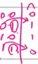
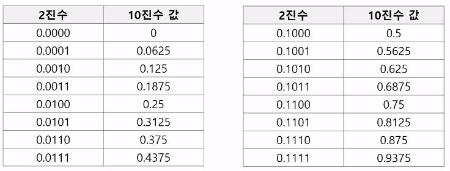
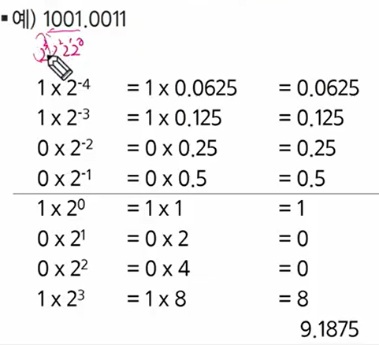
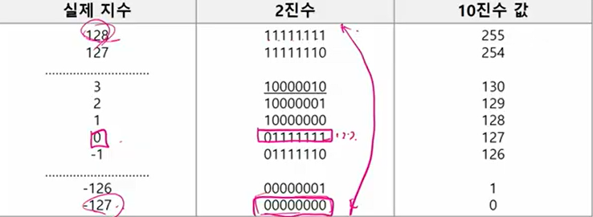
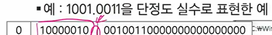
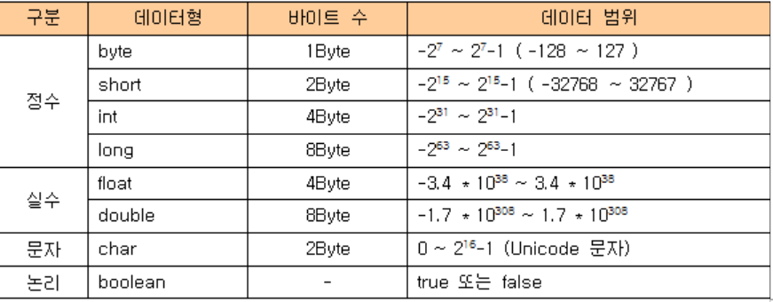

# start

## 표준 입출력 방법

### python 3 표준입출력


입력

* raw값의 입력: input()
  * 받은 입력값을 문자열로 취급
* evaluated된 값 입력: eval(input())
  * 받은 입력값을 평가된 데이터 형으로 취급

출력

* print()
  * 표준 출력 함수,
* print('text', end = "")
  * 출력 시 마지막에 개행문자 제외할시
* print('%d' % number)
  * formatting 된 출력


파일의 내용을 표준 입력으로 읽어오는 방법

```python
import sys
sys.stdin = open('a.txt','r')
sys.stdout = open('output.txt','w')
```


## 비트 연산

 

* & : 둘다 1일 때 1
  *  비트 조사 : 특정비트가 1인지 확인하고 싶다
  * ex) 10110001 & 00010000 (확인하고 싶은 자리에만 1)
    * & 연산자해서 != 0이면 그 자리는 1 맞네
  * 비트클리어: 특정 비트를 0으로 만들고 싶다
  * ex) 10110001 뒤에서 5번째 1을 영으로 만들고 싶어 그러면
  * ​      10101111과 & 연산자해서 영으로 만들어버림

* |: 하나라도 1이면 1
  * 비트셋: 특정비트를 1로 바꾸고 싶을때
    * ex) 10000001 | 00010000 => 10010001
* ^: 같으면 0 다르면 1
  * 특정비트가 같은지 검사
  * 10110001 ^ 10110001 => 0 다 같군!
  * 10110001 ^ 10100001 => 1 다르군!
  * 비트 토글: 비트를 반전시킬 수 있음



* ~: 피연잔사의 모든 비트를 반전시킴
* << : 피연산자의 비트 열을 왼쪽으로 이동시킴
  * num << 2: 00000001 -> 00000100
  * 2만큼 2를 곱해주는 것과 같다
  * a | 1<< 3 : a의 3번 비트를 1로 바꿔
  * a | 1<< 1 | 1 << 4| 1<< 5 : a의 1, 4, 5, 번 비트를 1로 바꿔
  * a의 3번 비트 클리어: a & ~ (1<<3)
  * a & ~(1<<3 | 1<<5) : a의 비트 3, 5를 클리어
* `>>` : 피연산자의 비트 열을 오른쪽으로 이동시킴


* 1<< n:
  * 2^n 의 값을 가진다
  * 원소가 n개일 경우의 모든 부분집합의 수를 의미한다
  * powerset: (모든 부분집합)
    * 공집합과 자기자신을 포함한 모든 부분집합
* i & (1<<j): i의 j번째 비트틀 검사 (j : 0~7 / i : 0~ 1<<n -1)


* 비트 연산 예제2

```
x= 0x01020304
=> 0x01 0x02 0x03 0x04로 표현됨
(b31~b24) (b23~b16) (b15~b8) (b7~b0)
0x04를 보면 00000010 
0xff는      11111111 (굳이 안해도 되긴함) - 마스킹을 해야 깔끔해짐
& 하면      00000010
이때는 >> 오른쪽 쉬프트 했으므로 00000100이 제일 먼저 나오게 됨
```


### 엔디안

```python 
import sys
print(sys.byteorder)
```


정수 12을 8bit little edian으로 표기하기

```python
a = 1234
n = int.to_bytes(a, byteorder = 'little', length= 4)
print(n)
```

```
b'|xd2|x04|x00|x00'
```


```python
a = 1234
n = int.to_bytes(a, byteorder = 'little', length= 4)
print(n)
```

```
b'|x00|x00|x04|xd2'
```


```python
print(int.from_bytes(n, byteorder = 'big'))
print(int.from_bytes(n, byteorder = 'little'))
```


비트 열의 위치를 바꾸는 연산

```python
def ce(n):
    p = []
    for i in range(0, 4):
        p.append((n>> (24 - i*8)) & 0xff)
    return p

x = 0x01020304
p = []
for i in range(0, 4):
    p.append((x >> ( i*8)) & 0xff)
print("x = %d%d%d%d" % (p[0], p[1], p[2], p[3]))
p = ce(x)
print("x = %d%d%d%d" % (p[0], p[1], p[2], p[3]))
```

``` python
def ce1(n):
    return (n << 24 & 0xff000000) | (n<< 8 & 0xff0000) | (n>> 8 & 0xff00) | 

# 0x01 0x02 0x03 0x04
# 1. 0x04 0x00 0x00 0x00
# 0x04 0000 0000 0000
# 2. 0x02 0x03 0x04 0x00
# 0000 0x03 0000 0000
# 3. 0x00 0x01 0x02 0x03
# 0000 0000 0x02 0000
# 4. 0x00 0x00 0x00 0x01
# 0000 0000 0000 0x01

# 0x04 0x03 0x02 0x01
```


## 진수

컴퓨터에서의 음의 정수 표현 방법

1의 보수: 부호와 절대값으로 표현된 값을 부호 비트를 제외한 나머지 비트들을 0을 1로 , 1은 0으로 변환

* 부호와 절댓값 표현: -6 : 1000000000000110
* 1의 보수 표현: -6: 1111111111111001


```python
num = 10
binary = ''
while num != 0:
    binary = str(num % 2) + binary
    num = num // 2
print(binary)

result = 0
for i in range(len(binary)):
    result = result * 2 + int(binary[i])
    print(result)
```


```python
num = 10 
# 2진법
binary = bin(num)
print(binary)
# 0b1010
# 얘는 문자열로 받아옴

# 0b 없애고 싶으면
print(binary.replace('0b',''))
# 1010

#8진법
octal = oct(num)
print(octal.replace('0o',''))
# 12

# 16 진법
hexa = hex(num)
print(hexa.replace('0x',''))
# a

# 2진법을 10진법으로 변환
dec = int(binary, base = 2)
print(dec)
# 10
```


## 실수







### 실수를 저장하기 위한 형식

#### 단정도 실수 (32비트)

#### 배정도 실수(64비트)


1010.1001 => 1.0101001 * 2^3

(mantissa)가수부: 실수의 유효 자릿수들을 부호화된 고정 소수점으로 표현하는 것 1.01020

(exponent)지수부: 실제 소수점의 위치를 지수 승으로 표현한 것  2^3


[struct](https://docs.python.org/ko/3/library/struct.html)쓰는 방법


익세스 표현법:





```python
import struct
a = 9.187500
bits, = struct.unpack('I', struct.pack('f',a))
print(f'{bits:032b}')
```


컴퓨터는 실수를 근사적으로 표현

실수형에서는 if a== b: 이런게 아니라 if |a-b| <= 어느정도 값: 

이정도의 오차는 넘어갈 수 있음


실수 자료형의 유효 자릿수! --- 이게 뭔소리지??

32비트 실수형 유효자릿수(십진수) -> 6

64비트 실수형 유효자릿수(십진수) -> 15





유효자릿수가 뜻하는 것은 정밀도를 뜻함. 즉, 몇자리까지 오차없이 표현할 수 있는 가

float의 정밀도보다 더 높은 정밀도가 필요하다면 double을 사용


```python
a = 1.1

print(f'{a:.30f}') # 소수 30점까지 찍어줘
# 1.10000000000000000000000008881723434
```


## 재귀

```python
def f(i, N):
    if i== N:
        print(A)
    else:
        A[i] = 0
        f(i+1, N)
        A[i] = 1
        f(i+1, N)
    return 

N = 3
A = [0]*N
f(0,N)

def f(i, N):
    if i== N:
        print(A)
    else:
        for j in range(2):
        	A[i] = j
        	f(i+1, N)
    return

N = 3
A = [0]*N
f(0,N)
```


1, 2, 3중복사용해 3자리수 만들기

```python
def f(i, N):
    if i== N:
        print(A)
    else:
        for j in range(1, 4):
            A[i] = j
            f(i+1, N)
    return

N= 3
A= [0] *N
f(0,N)
```


1, 2, 3, 4, 5를 중복사용해서 3자리수 만들기 (k =5)

```python
def f(i, N, k):
    if i== N:
        print(A)
    else:
        for j in range(1, k+1):
            A[i] = j
            f(i+1, N, k)
    return

N = 3
k = 5
A = [0] * N
f(0, N, k)
```


1~k를 중복사용하여 3자리수 만들기

v값을 만들 수 있으면 중단하고 1리턴 

없으면 0리턴

111<= v

```python
def f(i,N, K, v):
    if i == N:
        s = A[0]*100 + A[1]* 10 + A[2]
        print(s)
        if s == v:
            return 1
        else:
            return 0
    else:
        for j in range(1, K+1):
            A[i] = j
            if f(i+1, N, K, v) ==1:
                return 1
        return 0
    
N = 3
K = 5
A = [0]* N
v = 123
f(0, N, K, v)
```


A의 부분집합중 합이 K인 부분집합의 개수 구하기

```python
def f(i, N, s, K):
    global cnt
    if i == N:
        if s== K:
            cnt +=1
    else:
        f(i+1, N, s+A[i], K)
        f(i+1, N, s, K)

A = [1, 2, 3, 4, ,5, 6, 7, 8, 9, 10]
N = len(A)
K = 55
cnt = 0
f(0, N, 0, K)
print(cnt)
```

