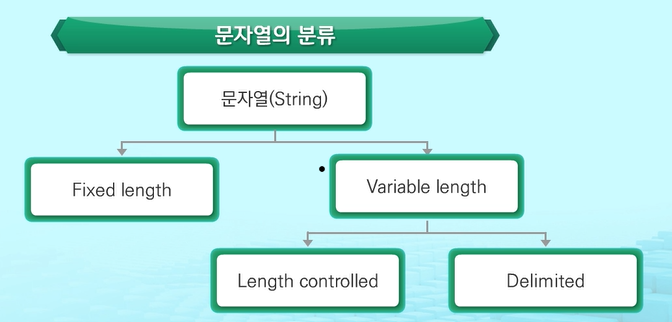
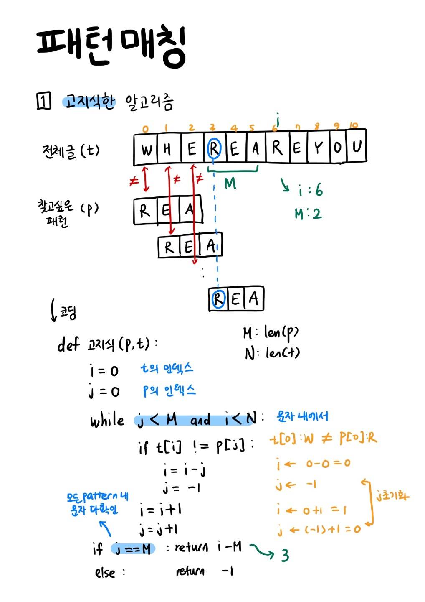
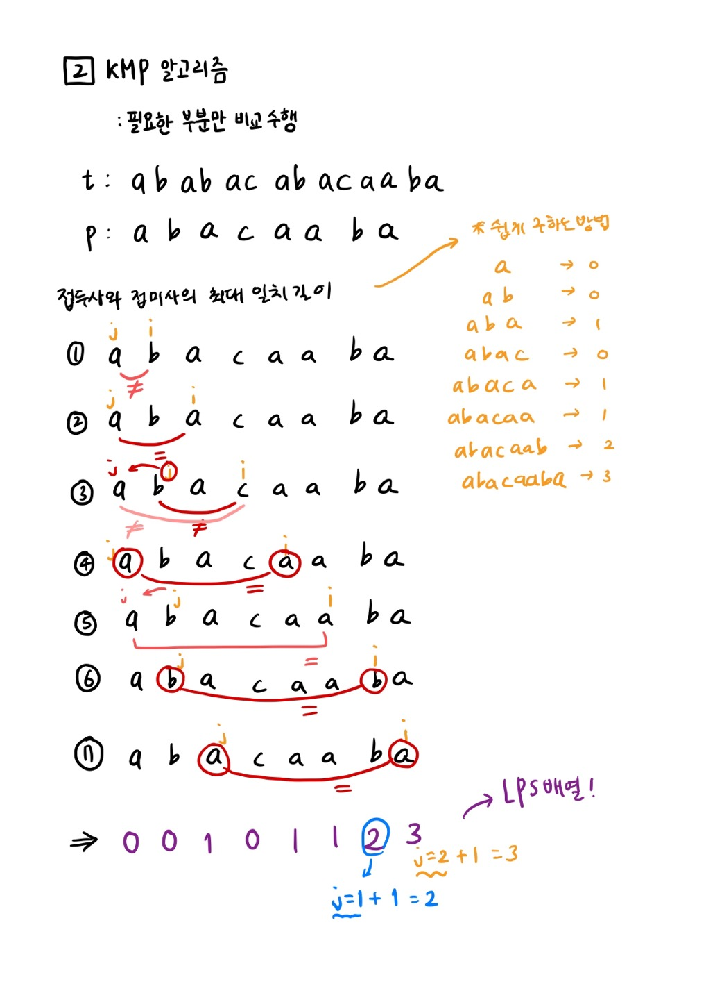
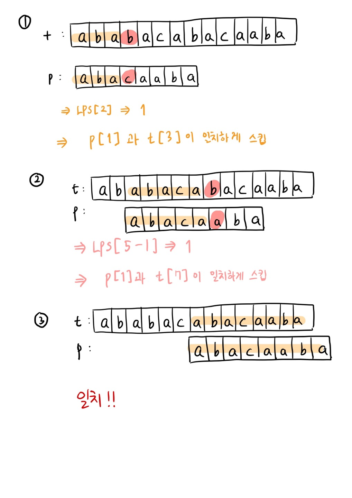
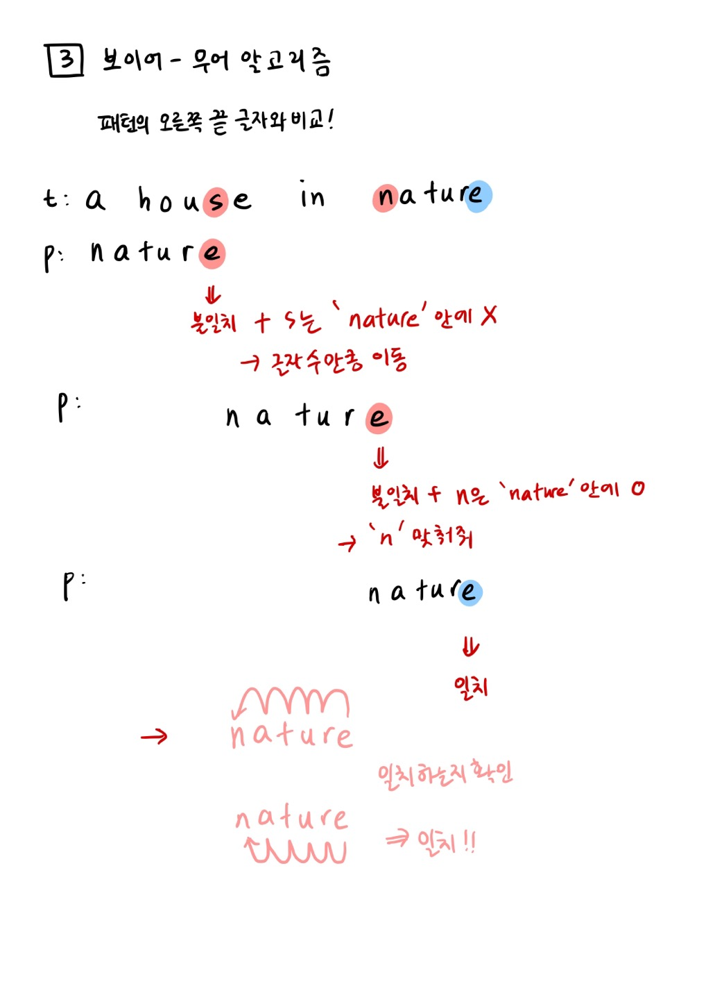

# STRING

## 문자 표현

컴퓨터에서 글자 A를 메모리에 저장하는 방법에는 두가지가 있음

1) A라는 글자의 모양 그대로 비트맵으로 저장하는 방법

2) 각 문자에 대해서 대응되는 술자를 정해놓고 이것을 메모리에 저장하는 방법

   => 코드 체계! (표준안: ASCII)


### ASCII

문자 인코딩 표준으로 7bit 인코딩으로 128문자를 표현하며 33개의 출력 불가능한 제어 문자들고 공백을 비롯한 95개의 출력 가능한 문자들로 이루어져있음


### 확장 ASCII 코드

표준 문자 이외의 악센트 문자, 도형 문자, 특수 문자, 특수 기호 등 부가적인 문자를 128개 추가할 수 있게 하는 부호

일반 ASCII코드가 7bit로 사용하는 것에 비해 확장 아스키코드는 8bit 전부 다 사용함으로써 추가적인 문자 표현 가능!

단점: 컴퓨터 생산자와 소프트웨어 개발자에게 개별적으로 할당된 확장 부호는 서로 다른 프로그램, 컴퓨터 사이에서 호환 불가능

​          → 따라서 프로그램이나 컴퓨터/ 프린터가 그것을 해독할 수 있도록 설계되어 있어야만 올바르게 해독 가능


### 유니코드

* 유니코드의 발현:

  대부분의 컴퓨터는 문자를 읽고 쓸 때, 아스키 코드 형식 사용

  -> 많은 국가에서 컴퓨터가 발달함에 따라 각 국가들은 자국의 문자를 표현하기 위하여 코드체계를 만들어서 사용

  우리나라도 한글 코드 체계를 만들어 사용 -> 조합형/ 완성형 두 종류!

  자국의 코드 체계를 타 국가가 가지고 있지 않으면 잘못 해석 -> 다국어 처리를 위해 표준 마련

  결국! 유니코드를 만듦

* UCS-2, UCS-4로 나뉘는데 파일을 인식 시 이 파일이 어떤 종류에 해당하는지 인식하고 각 경우를 구분하고 모두 다르게 구현해야 하는 문제 발생

* 따라서 유니코드 인코딩인 UTF가 나왔고 UTF-8, UTF-16, UTF-32로 나뉘어짐

  * UTF-8(in web): 한문자에 대해서 최소 8bit 최대 32bit까지 가능
  * UTF-16(in windows, java): 최소 16bit 최대 32bit까지 가능
  * UTF-32(in unix): 최소 32bit 최대 32bit까지 가능

* 파이썬 3.x 버전은 유니코드 UTF-8로 사용

  * 만약 2.X버전이라면 밑에 코드로 지정해야함

  * ```
    #-*- coding: utf-8 -*-
    ```


## 문자열의 분류



1. 고정 길이(fixed length): 문자열의 길이가 고정되어있음
2. 가변 길이(variable length): 문자열의 길이가 변경 가능 
   1) 길이 조절 문자열(length controlled) - java 언어에서의 문자열
   2) 구분자 문자열(delimited) - c언어에서의 문자열


* C언어에서의 문자열 처리
* JAVA에서의 문자열 처리
* 파이썬에서의 문자열 처리: 
  * 하나의 문자를 표현하는 char 타입이 없고, 텍스트 데이터 취급방법이 통일된다는 장점이 있음
  * 문자열 기호 ', ", ''', """ 이 있음
  * `+` 연결: 문자열 + 문자열 이어 붙여주는 역할
  * `*` 반복: 문자열 * 수 : 수만큼 문자열 반복
  * 문자열은 시퀀스 자료형으로 분류됨 → 인덱싱, 슬라이싱 연산들 사용 가능 
  * .replace(), .split(), .isalpha(), .find()등 메소드 사용 가능
  * immutable이라 요소값 변경 불가능


## string length

my_strl_len 함수를 만들어서 문자열 길이 세보기

```python
def my_str_len(a):
    i = 0
    while s[i] != '\0':
        i +=1
    return i

a = ['a','b', 'c', '\0']
print(my_str_len(a)) # 3
```


## 문자열 뒤집기

1. 자기 문자열 내에서 뒤집기
2. 새로운 빈 문자열 만들어서 소스의 뒤에서부터 읽어서 타깃에 쓰는 방법


## 문자열 비교

== 연산자와 is 연산자 제공

```python
s1 = 'abc'
s2 = 'abc'
s3 = 'def'
s4 = s1
s5 = s1[:2] + 'c'
print(s1==s2)    #True
print(s1 is s2)  #True
print(s5)        #abc
print(s1 == s5)  #True
print(s1 is s5)  #False
```


<> 부등호 표시

```python
a = 'abc'
b = 'Abc'
print(a>b) # True
print(a<b) # False
print(a == b) # False
```


## 문자열 숫자를 정수로 변환하기

숫자와 문자 변환 함수 제공

int(), float(), str(), repr() 존재

```python
# int()와 같은 atoi()함수 만들기

def atoi(s):
    i = 0
    for x in s:
        i = i* 10 + ord(x) - ord('0')
    return i

a = '123'
print(atoi(a)) # 123
#ord(): 그 문자에 해당하는 아스키 코드로 변환
```


## 패턴 매칭

: 본문에서 특정한 문자열 찾는 것

* 패턴 매칭에 사용되는 알고리즘들
  * 고지식한 패턴 검색 알고리즘(brute force)
  
    * 본문 문자열을 처음부터 끝까지 차례대로 순회하면서 패턴 내의 문자들을 일일이 비교하는 방식으로 동작
  
    ```python
    #N개의 문자열 내에서 M개의 패턴을 찾으려면
    
    for i in range(0, N-M+1):
        for j in range(0,M):
            text[i+j] == pattern[j]
        
            
    def BruteForce(p,t):
        i = 0
        j = 0
        while j < M and i <N: #M: p의 길이 / N; t의 길이
            if t[i] != p[j]:
                i = i-j
                j = -1
            i = i+1
            j = j+1 # 불일치 하는 경우 다시 j=0으로 돌림
        if j ==M :
            return i -M
        else:
            return -1
    print(BruteForce('is', 'This is a book'))
    ```
  
  * KMP
  
    * 불일치가 발생한 텍스트 스트링의 앞 부분에 어떤 문자가 있는지를 미리 알고 있으므로, 불일치가 발생한 앞 부분에 대하여 다시 비교하지 않고 매칭을 수행
    * 패턴을 전처리 하여 배열 next[M]을 구해서 잘못된 시작을 최소화함
    * next[M]: 불일치가 발생했을 경우 이동할 다음 위치
  
    ```python
    def kmp(t,p):
        N = len(t)
        M = len(p)
        lps = [0] * (M-1)
        
        j = 0
        lps[0] = -1
        for i in range(1,M):
            lps[i] = j 
            if p[i] == p[j]:
                j +=1
            else:
                j = 0
        lps[M] = j
        i = 0
        j = 0
        while i < N and j <= M:
            if j == -1 or t[i] == p[j]: # 첫 글자가 불일치 했거나, 일치하면
                i +=1
                j +=1
            else:                       # 불일치
                j = lps[j]
            if j ==M:                   # 패턴을 찾을 경우
                print(i-M, end = ' ')   # 패턴의 인덱스 출력
                j = lps[j]
    ```
  
    
  
  * 보이어 -무어
  
    * 오른쪽에서 왼쪽으로 비교
    * 대부분의 상용 소프트웨어에서 채택하고 있는 알고리즘
    * 보이어-무어 알고리즘은 패턴에 오른쪽 끝에 있는 문자가 불일치 하고 이 문자가 패턴 내에 존재하지 않는 경우, 이동 거리는 무려 패턴의 길이만큼이 된다.
    * 텍스트 문자를 다 보지 않아도 되는 장점
  









