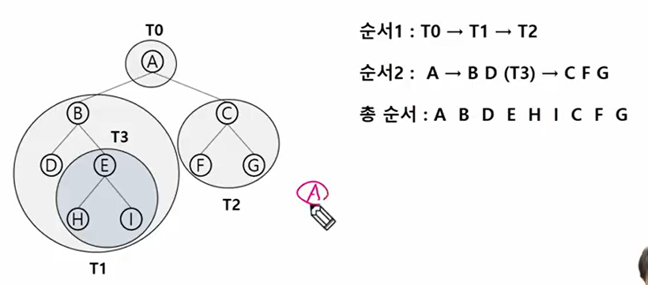
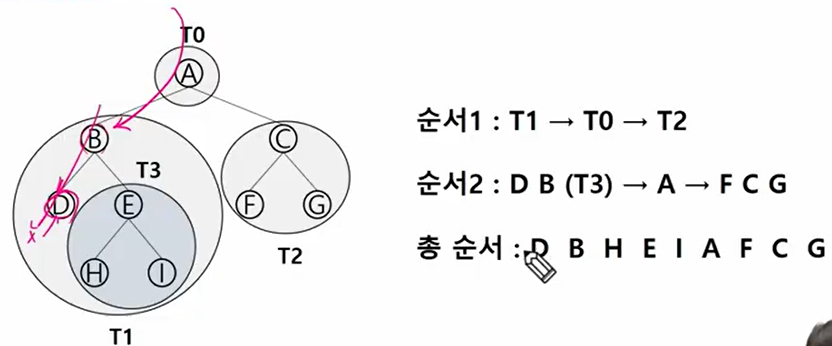

# 트리

비선형 구조

원소들 간에 계층 관계를 가지는 계층형 자료구조

상위원소에서 하위원소로 내려가면서 더 많은 데이터를 가짐


## 정의

한개 이상의 노드로 이루어진 집합

노드 중 최상위 노드를 루트라고 한다

나머지 노드들을 분리집합으로 분리되어도 각 루트의 부 트리라고 한다

이파리는 단말 노드 또는 잎 노드라고 부름

간선 - 노드를 연결하는 선, 부모 노드와 자식 노드를 연결


형제 노드 - 같은 부모 노드의 자식 노드들

조상 노드 - 간선을 따라 루트 노드까지 이르는 경로에 있는 모든 노드들

서브 트리 - 부모 노드와 연결된 간선을 끊었을 때 생성되는 트리

자손 노드 - 서브 트리에 있는 하위 레벨의 노드들

* 차수
  * 노드의 차수: 노드에 연결된 자식 노드의 수
  * 트리의 차수: 트리에 있는 노드의 차수 중에서 가장 큰 값
  * 단말 노드(리프노드): 차수가 0인 노드, 자식 노드가 없는 노드

* 높이 
  * 노드의 높이: 루트에서 노드에 이르는 간선의 수, 노드의 레벨
  * 내려갈수록 레벨이 높아짐
  * 트리의 높이: 트리에 있는 노드의 높이 중에서 가장 큰 값, 최대 레벨


# 이진트리

모든 노드들이 2개의 서브트리를 갖는 특별한 형태의 트리

각 노드가 자식 노드를 최대한 2개까지만 가질 수 있는 트리


레벨 i에서의 노드의 최대 개수는 2^i개

높이가 h인 이진트리가 가질 수 있는 노드의 최소 개수는 h+1개

최대 개수는 2^(h+1) -1개


### 포화 이진 트리

모든 레벨에 노드가 포화상태로 차 있는 이진 트리

루트를 1번으로 하여 2^(h+1)-1까지 정해진 위치에 대한 노드 번호를 가짐

위쪽에서 아래로 같은 레벨에서 오른쪽에서 왼쪽으로 가면 갈 수록 번호가 커짐


### 완전 이진 트리

높이가 h인 노드 수가 n개일 때, 포화 이진 트리의 노드 번호 1번부터 n번까지 빈 자리가 없는 이진 트림


### 편향 이진 트림

높이 h에 대한 최소 개수의 노드를 가지면서 한쪽 방향의 자식 노드만을 가진 이진 트리


## 순회

트리의 각 노드를 중복되지 않게 빠짐없이 전부 방문하는 것

트리는 비 선형 구조이기 떄문에 선형 구조에서와 같이 선후 연결 관계를 알 수 없음 - 특별한 방법 필요


* 3가지 기본적인 순회방법

  * 전위순회(VLR):

    * 부모 노드 방문 후, 자식 노드를 좌, 우 순서로 방문한다

    ```PYTHON
    def preorder_traverse(T):
        if T:
            visit(T) # 현재 노드 n을 방문하여 처리
            # 현재 노드 n의 왼쪽 서브트리로 이동
            preorder_traverse(T.left)
            # 현재 노드 n의 오른쪽 서브트리로 이동
            preorder_traverse(T.right)
    ```

  

  

  * 중위순회(LVR):

    * 왼쪽 자식 노드, 부모노드, 오른쪽 자식 노드 순으로 방문한다

    ```python
    def inorder_traverse(T):
        if T:
            inorder_traverse(T.left)
            visit(T)
            inorder_traverse(T.right)
    ```

    

  * 후위순위(LRV):

    * 자식 노드를 좌우 순서로 방문한 후, 부모노드로 방문한다.