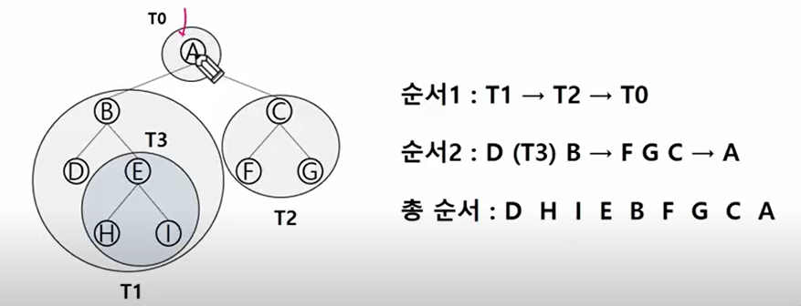
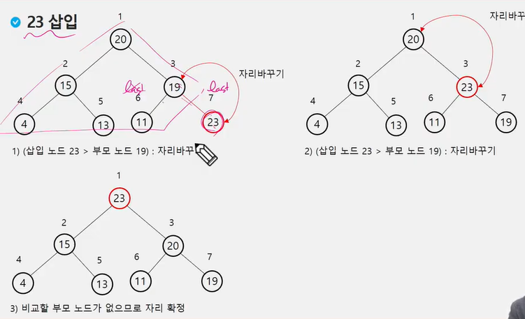

# 트리

비선형 구조

원소들 간에 계층 관계를 가지는 계층형 자료구조

상위원소에서 하위원소로 내려가면서 더 많은 데이터를 가짐


## 정의

한개 이상의 노드로 이루어진 집합

노드 중 최상위 노드를 루트라고 한다

나머지 노드들을 분리집합으로 분리되어도 각 루트의 부 트리라고 한다

이파리는 단말 노드 또는 잎 노드라고 부름

간선 - 노드를 연결하는 선, 부모 노드와 자식 노드를 연결


형제 노드 - 같은 부모 노드의 자식 노드들

조상 노드 - 간선을 따라 루트 노드까지 이르는 경로에 있는 모든 노드들

서브 트리 - 부모 노드와 연결된 간선을 끊었을 때 생성되는 트리

자손 노드 - 서브 트리에 있는 하위 레벨의 노드들

* 차수
  * 노드의 차수: 노드에 연결된 자식 노드의 수
  * 트리의 차수: 트리에 있는 노드의 차수 중에서 가장 큰 값
  * 단말 노드(리프노드): 차수가 0인 노드, 자식 노드가 없는 노드

* 높이 
  * 노드의 높이: 루트에서 노드에 이르는 간선의 수, 노드의 레벨
  * 내려갈수록 레벨이 높아짐
  * 트리의 높이: 트리에 있는 노드의 높이 중에서 가장 큰 값, 최대 레벨


# 이진트리

모든 노드들이 2개의 서브트리를 갖는 특별한 형태의 트리

각 노드가 자식 노드를 최대한 2개까지만 가질 수 있는 트리


레벨 i에서의 노드의 최대 개수는 2^i개

높이가 h인 이진트리가 가질 수 있는 노드의 최소 개수는 h+1개

최대 개수는 2^(h+1) -1개


### 포화 이진 트리

모든 레벨에 노드가 포화상태로 차 있는 이진 트리

루트를 1번으로 하여 2^(h+1)-1까지 정해진 위치에 대한 노드 번호를 가짐

위쪽에서 아래로 같은 레벨에서 오른쪽에서 왼쪽으로 가면 갈 수록 번호가 커짐


### 완전 이진 트리

높이가 h인 노드 수가 n개일 때, 포화 이진 트리의 노드 번호 1번부터 n번까지 빈 자리가 없는 이진 트림


### 편향 이진 트리

높이 h에 대한 최소 개수의 노드를 가지면서 한쪽 방향의 자식 노드만을 가진 이진 트리


## 순회

트리의 각 노드를 중복되지 않게 빠짐없이 전부 방문하는 것

트리는 비 선형 구조이기 떄문에 선형 구조에서와 같이 선후 연결 관계를 알 수 없음 - 특별한 방법 필요


* 3가지 기본적인 순회방법

  * 전위순회(VLR):

    * 부모 노드 방문 후, 자식 노드를 좌, 우 순서로 방문한다

    ```PYTHON
    def preorder_traverse(T):
        if T:
            visit(T) # 현재 노드 n을 방문하여 처리
            # 현재 노드 n의 왼쪽 서브트리로 이동
            preorder_traverse(T.left)
            # 현재 노드 n의 오른쪽 서브트리로 이동
            preorder_traverse(T.right)
    ```

  

  

  * 중위순회(LVR):

    * 왼쪽 자식 노드, 부모노드, 오른쪽 자식 노드 순으로 방문한다

    ```python
    def inorder_traverse(T):
        if T:
            inorder_traverse(T.left)
            visit(T)
            inorder_traverse(T.right)
    ```

    

  * 후위순회(LRV):

    * 자식 노드를 좌우 순서로 방문한 후, 부모노드로 방문한다.
    
    ```python
    def postorder_traverse(T):
        if T:
            postorder_traverse(T.left)
            postorder_traverse(T.right)
            visit(T)    #print(T.item)     
    ```
    
    


## 이진트리의 표현

레벨 n의 노드 번호 시작 번호는 2^n

레벨 n의 노드는 2^n부터 해서 2^(n+1) -1까지 번호 작성


노드 번호가 i인 노드의 왼쪽 자식 노드 번호는 2*i

노드 번호가 i인 노드의 오른쪽 자식 노드 번호는 2*i +1


높이가 h인 이진 트리를 위한 배열의 크기는? 2^(h+1) -1


이진트리 정점 번호 규칙

1. 포화이진트리
2. 그 외


### 이진 트리 저장

부모 번호를 인덱스로 자식 번호 저장

```python
for i : 1 -> N
    read p, c
    if(c1[p] == 0)
        c1[p] = c
    else
        c2[p] = c
```

```python
# 4 간선의 개수
# 1 2 1 3 3 4 3 5 부모 자식간


# 순회
def pre_order(v):
    if v: # 0번 정점이 없으므로 0번은 자식이 없는 경우를 표시 
        print(v)
        pre_order(ch1[v])
        pre_order(ch2[v])
        
def in_order(v):
    if v:
        in_order(ch1[v])
        print(v)
        in_order(ch2[v])

def post_order(v):
    if v:
        post_order(ch1[v])
        post_order(ch2[v])
        print(v)
        
E = int(input()) # 간선의 개수
arr = list(map(int, input().split()))
V = E+1 # 정점 수

# 부모번호를 인덱스로 자식번호 저장
ch1 = [0]*(V+1)
ch2 = [0]*(V+1)
for i in range(E):
    p, c = arr[i*2], arr[i*2+1]
    if ch1[p] == 0:
        ch1[p] = c
    else:
        ch2[p] = c
print(ch1)
print(ch2)

# [0, 2, 0, 4, 0, 0]
# [0, 3, 0, 5, 0, 0]

pre_order(1)
# 1 2 3 4 5
in_order(1)
# 2 1 4 3 5
post_order(1)
# 2 4 5 3 1


# 완전 이진트리에서의 순회
def pre_order(v):
    global last
    if v<= last: #마지막 정점번호 이내이면
        print(v)
        pre_order(v*2) # 왼쪽 자식 정점 방문
        pre_order(v*2+1) # 오른쪽 자식 점정 방문
```


``` python
#자식 번호를 인덱스로 부모번호를 저장
par = [0]*(V+1)
for i in range(E):
    p, c = arr[i*2], arr[i*2+1]
    par[c] = p
    
print(*par)
# 0 2 0 4 2 4

# 루트 찾기
root = 0
for i in range(1, V+1):
    if par[i] == 0:
        root = i
        break
print(root)

# 조상찾기
c = 5 # 5번의 조상을 찾기
anc = [] # 5번의 조상 집어넣기
while par[c] != 0:
    anc.append(par[c])
    c = par[c]
print(*anc)
```


## 연결 리스트

이진트리의 모든 노드는 최대 2개의 자식 노드를 가지므로 일정한 구조의 단순 연결 리스트 노드를 사용하여 구현

배우지는 않을 듯 ㅜ


## 수식트리

수식을 표현하는 이진 트리

수식 이진트리라고 부르기도함

연산자는 루트 노드이거나 가지 노드

피연산자는 모두 잎 노드

- 후위순회 사용!


# 이진탐색트리

모든 원소는 서로 다른 유일한 키를 갖는다

key(왼쪽 서브트리)< key(루트 노드) < key(오른쪽 서브트리)

중위순회하면 오름차순으로 정렬된 값을 얻을 수 있다.


## 탐색연산

루트에서 시작한다

탐색할 키 값 x를 루트 노드의 키 값과 비교

* 키 값 x = 루트노드의 키 값: 원하는 원소를 찾았으므로 탐색 연산 성공
* 키 값 x < 루트노드의 키 값: 루트노드의 왼쪽 서브트리에 대해서 탐색연산 수행
* 키 값 x > 루트노드의 키 값: 루트노드의 오른쪽 서브트리에 대해서 탐색연산 수행


## 삽입연산

* 먼저 탐색 연산 수행
  * 삽입할 원소와 같은 원소가 트리에 있으면 삽입할 수 없으므로, 같은 원소가 트리에 있는지 탐색확인한다
  * 탐색에서 탐색 실패가 결정되는 위치가 삽입위치가 된다
* 탐색 실패한 위치에 원소를 삽입한다


탐색, 삽입, 삭제 시간은 트리(BST)의 높이 만큼 시간이 걸린다

이진 트리가 균형적으로 생성되어 있는 경우 시간 복잡도가 짧음


## 삭제 연산


# HEAP

**완전 이진 트리**에 있는 노드 중에서 키 값이 가장 큰 노드나 키 값이 가장 작은 노드를 찾기 위해서 만든 자료구조

* 최대 힙(max heap)
  * 키 값이 가장 큰 노드를 찾기 위한 완전 이진 트리
  * 부모노드의 키 값 > 자식 노드의 키값
  * 루트 노드: 키값이 가장 큰 노드
* 최소 힙(min heap)
  * 키 값이 가장 작은 노드를 찾기 위한 완전 이진트리
  * 부모노드의 키 값 < 자식 노드의 키값
  * 루트노드: 키값이 가장 작은 노드




```python
# 최대 100개의 자연수가 키로 입력
# 최대힙

# 힙 연산 추가
def enq(key):
    global last
    last += 1
    tree[last] = key # 완전이진트리 유지
    c = last # 새로 추가된 정점을 자식으로
    p = c//2 # 완전이진트리에서의 부모 정점 번호
    while p >= 1 and tree[p] < tree[c]: # 부모가 있고, 자식의 키값이 더 크면 교환
        tree[p], tree[c] = tree[c], tree[p]   
        c = p
        p = c//2
        
        
# 힙 연산 삭제
def deq():
    global last
    tmp = tree[1] # 루트의 key 값
    tree[1] = tree[last] # 마지막 정점의 키를 루트에 복사
    last -= 1 # 마지막 정점 삭제
    
    # 부모> 자식 규칙 유지
    p = 1
    c = p * 2 # 왼쪽 자식 노드 번호
    while c <= last:
        # 오른쪽 자식 노드도 있고 오른쪽 자식이 더 크면
        if c+1 <= last and tree[c] < tree[c+1]: 
            c+=1  #오른쪽 자식 선택
        if tree[p] < tree[c]: # 자식이 더 크면 자리 바꾸기
            tree[p], tree[c] = tree[c], tree[p]
            p = c
            c = p * 2
        else:
            break
    return tmp
        
# 포화이진트리의 정점번호 1~100
tree = [0]*(101)
last = 0  # 마지막 정점번호
enq(3)
enq(2)
enq(4)
enq(7)
enq(5)
enq(1)
enq(9)
while last>0:
    print(deq(), tree[1])
```

