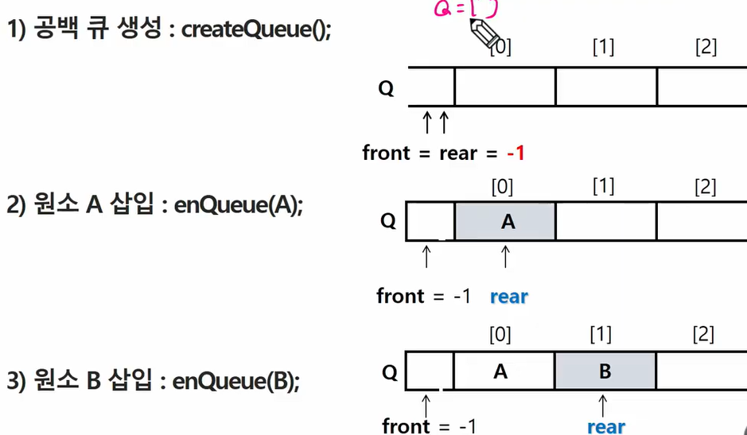
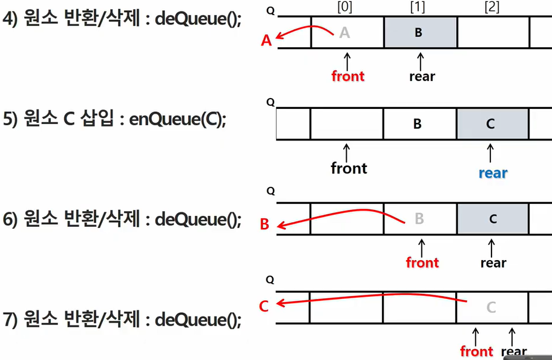
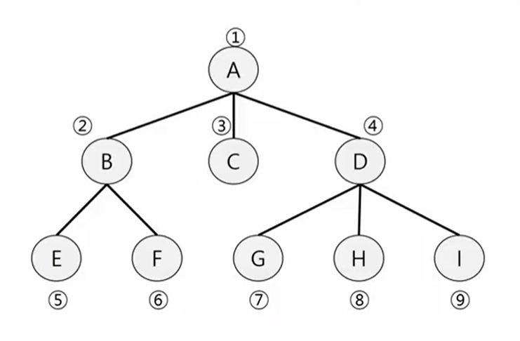

# queue


## queue의 특성

* 스택과 마찬가지로 삽입과 삭제의 위치가 제한적인 자료구조
* 선입선출구조(FIFO); 큐에 삽입한 순서대로 원소가 저장되어, 가장 먼저 삽입된 원소는 가장 먼저 삭제된다.


## QUEUE의 주요 연산

* enqueue(item): 큐의 뒤쪽(rear 다음)에 원소를 삽입하는 연산
* deQueue(): 큐의 앞쪽(front)에서 원소를 삭제하고 반화하는 연산
* createQueue() : 공백 큐 생성
* isEmpty
* isFull
* Qpeek






## 큐의 구현

* 1차원 배열을 이용한 큐

  * 큐의 크기 = 배열의 크기
  * front - 저장된 첫 번째 원소의 인덱스
  * rear - 저장된 마지막 원소의 인덱스

* 상태표현

  * 초기 상태: front = rear = -1
  * 공백 상태 : front == rear
  * 포화상태 : rear == n-1(n: 배열의 크기, n-1: 배열의 마지막 인덱스)

* 초기 공백 큐 생성

  * 크기 n인 1차원

* 삽입(enQueue(item)): 마지막 원소 뒤에 새로운 원소를 삽입하기 위해

  ``` python
  def enQueue(item):
      global rear
      if isFull():
          print("Queue_Full")
      else:
          rear = rear +1
          Q[rear] = item
  ```

* 삭제(deQueue()): 가장 앞에 있는 원소를 삭제하기 위해

  ```python
  def deQueue():
      if isEmpty():
          print("queue_empty")
      else: 
          front = front+1
          return Q[front]
  ```

* 공백상태 및 포화상태 검사: isEmpty(), isFull()

  * 공백상태: front ==rear
  * 포화상태: rear == n-1 (n: 배열의 크기, n-1: 배열의 마지막 인덱스)

  ```python
  def inEmpty():
      return front == rear
  def Full():
      return rear == len(Q) -1
  ```

* 검색: Qpeek() : 가장 앞에 있는 원소를 검색하여 반환하는 연산

  ```python
  def Qpeek():
      if isEmpty():
          print("Queue_Empty")
      else:
          return Q[front+1]
  ```

  

```python
front = -1
rear = -1
Q = [0] * 10
rear +=1
Q[rear] = 1

front +=1
print(Q[front])
front +=1
print(Q[front])
```


## 원형 큐의 구조

* 초기 공백 상태

  front = rear = 0

* 인덱스의 순환

  : front와 rear의 위치가 배열의 마지막 인덱스인 n-1를 가리킨 후, 그 다음에는 논리적 순환을 이루어 배열의 처음 인덱스인 0으로 이동해야함

  이를 위해 나머지 연산자 mod(%)를 사용함

* front 변수

  : 공백 상태와 포화 상태 구분을 쉽게 하기 위해 front가 있는 자리는 사용하지 않고 항상 빈자리로 둠

* 삽입 위치 및 삭제 위치

  |        |       삽입위치        |        삭제위치         |
  | :----: | :-------------------: | :---------------------: |
  | 선형큐 |    rear = rear +1     |     front = front+1     |
  | 원형큐 | rear = (rear+1) mod n | front = (front+1) mod n |

* 공백 상태 및 포화상태 검사: isEmpty(), isFul()

  * 공백상태 : front = rear
  * 포화상태:  삽입할 rear의 다음 위치 == 현재 front
    * (rear+1) mod n == front

  ```python
  def isEmpty():
      return front ==rear
  def isFull():
      return (rear+1) % len(cQ) == front
  ```

* 삽입: enQueue(item): 마지막 원소 뒤에 새로운 원소를 삽입하기 위해

  * rear 값을 조정하여 새로운 원소를 삽입할 자리를 마련 : rear <- (rear+1) mod n;
  * 그 인덱스에 해당하는 배열원소 cQ[rear]에 item 저장

  ```python
  def enQueue(item):
      global rear
      if isFull():
          print("Queue_Full")
      else:
          rear = (rear+1) % len(cQ)
          cQ[rear] = item
  ```

* 삭제: deQueue(), delete()

  * 가장 앞에 있는 원소 삭제
  * front 값 조정하여 삭제할 자리 준비
  * 새로운 front 원소를 리텀함으로써 삭제와 동일한 기능

  ```python
  def deQueue():
      global front
      if isEmpty():
          print("queue_empty")
      else: 
          front = (front+1) % len(cQ)
          return cQ[front]
  ```

  ```python
  # front 만 하나씩 증가시켜주는것 
  def delete():
      global front
      if isEmpty():
          print("queue_empty")
      else: 
          front = (front+1) % len(cQ)
  ```

* 공백상태, 포화상태

  ```python
  def inEmpty():
      return front == rear
  def Full():
      return (rear+1) % len(cQ) == front
  ```

  

## 우선순위 큐

* 우선순위 큐의 특성

  * 우선순위를 가진 항목들을 저장하는 큐
  * FIFO 순서가 아니라 우선순위가 높은 순서대로 먼저 나가게 괸다.

* 우선순위 큐의 적용 분야

  * 시뮬레이션 시스템
  * 네트워크 트래픽 제어
  * 운영체제의 테스크 스케줄링

  

### 배열을 이용한 우선순위 큐

* 배열을 이용하여 우선순위 큐 구현
  * 배열을 이용하여 자료 저장
  * 가장 앞에 최고 우선순위의 원소가 위치하게 됨
  * 원소를 삽입하는 과정에서 우선순위를 비교하여 적절한 위치에 삽입하는 구조
  * 단점: 삽입, 삭제 연산이 일어날 때 원소의 재배치 발생, 이에 소요되는 시간이나 메모리 낭비가 큼


## 큐의 활용: 버퍼

* 버퍼
  * 데이터를 한 곳에서 다른 한 곳으로 전송하는 동안 일시적으로 그 데이터를 보관하는 메모리의 영역
  * 버퍼링: 버퍼를 활용하는 방식 또는 버퍼를 채우는 동작 의미
* 버퍼의 자료 구조
  * 버퍼는 일반적으로 입출력 및 네트워크와 관련된 기능에서 이용된다
  * 순서대로 입력/ 출력/ 전달되어야 하므로 FIFO 방식의 자료구조인 큐가 활용됨.


## BFS(너비우선탐색)

* 너비 우선탬색은 탐색 시작점의 인접한 정점들을 먼저 모두 차례로 방문한 후에, 방문했던 정점을 시작점으로 하여 다시 인접한 정점들을 차례로 방문하는 방식
* 인접한 정점들에 대해 탐색을 한 후, 차례로 다시 너비 우선탐색을 진행해야 하므로, 선입선출 형태의 자료구조인 큐를 활용



```PYTHON
def BFS(G,v):
    # 준비하는 부분
    visited = [0] * (n+1) # n: 정점의 개수
    queue = []
    queue.append(v)
    visited[v] = 1
    
    # 처리하는 부분
    while queue:          # 큐가 비어있지 않을 경우
        t = queue.pop(0)
        visit(t)
        for i in G[t]:
            if not visited[i]: # 줄선적이 없으면
                queue.append(i) # 줄세우고 줄 선 표시
                visited[i] = visited[t] +1
```

* Queue 미로 풀이는 /5105_maze에 있음

bfs는 최단 경로를 계속 찾지만 dfs는 최단경로를 찾아주는게 아니여서 다 구하고 최단 경로를 찾게끔 min 넣어줘야함
