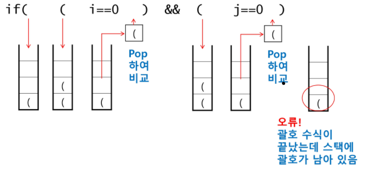

# 스택1

## 스택

물건을 쌓아 올리듯 자료를 쌓아 올린 형태의 자료구조

스택에 저장된 자료를 선형 구조를 갖는다: 자료간의 관계가 1대1의 관계를 갖음

스택에 자료를 삽입하거나 스택에서 자료를 꺼낼 수 있다

마지막에 삽입한 자료를 가장 먼저 꺼낸다 -LIFO


스택의 구현

: 스택을 프로그램에서 구현하기 위해서 필요한 자료구조와 연산

* 자료구조: 자료를 선형으로 저장할 저장소
  * 배열을 사용할 수 있다
  * 저장소 자체를 스택이라 부르기도 한다
  * 스택에서 마지막 삽입된 원소의 위치를 top(stack pointer)이라 부른다.
* 연산
  * 삽입: 저장소에 자료를 저장 - push
  * 삭제: 저장소에서 자료를 꺼냄(삽입한 자료의 역순으로 꺼냄) - pop
  * isEmpty: 스택이 공백인지 아닌지를 확인하는 연산
  * peek: 스택의 top에 있는 원소를 반환하는 연산

``` python
stack = []
stack.append('a')
print(stack.pop)
```


* 스택의 삽입/ 삭제 과정

  * top +=1을 하고 그 자리에 push 
  * pop을 하면 top -=1

  

* 스택의 push 알고리즘

  ```python
  def push(item):
      s.append(item)
  ```

  ```python
  def push(item, size): # 집어넣을 아이템과 스택의 사이즈를 집어넣으면
      global top        # top이라는 변수를 함수 밖에서도 쓸 수 있게끔 하고 
      top +=1           
      if top == size:   #item을 넣을 자리가 스택의 사이즈와 같다면
          print('overflow!') # overflow! 스택에서 넘쳐남!
      else:
          stack[top] = item # 아니라면 stack 끝자리에 item을 넣어줌
  size = 10
  stack = [0] * size
  top = -1
  
  push(10, size)
  top +=1
  stack[top] = 20
  ```

  

* 스택의 pop 알고리즘

  ```python
  def pop():
      if len(s) == 0: #underflow = 스택에 아무것도 없다면
          return      # 빠져나오기
      else:
          return s.pop(-1) # 마지막 것을 빼오기!
  ```

  ``` python
  stack = []
  top = -1
  for i in range(0, 10):
      stack.append(i)
      top +=1
  print(stack, top)
  # [0, 1, 2, 3, 4, 5, 6, 7, 8, 9] 9
  
  def pop():
      global top
      if top == -1:
          print('underflow')
          return 0
      else:
          top -= 1
          return stack[top+1]
  print(pop())
  # 9
  
  # pop 함수 의미
  if top > -1:
      top -= 1
      print(stack[top])
  ```

  

* 스택 구현 고려 사항

  * 1차원 배열을 사용하여 구현할 경우 구현이 용이하다는 장점이 있지만 스택의 크기를 변경하기가 어렵다는 단점이 있음
  * 해결하기 위해 저장소를 동적으로 할당하여 스택을 구현하는 방법이 있다: 동적 연결리스트를 이용하여 구현하는 방법 - 메모리를 효율적으로 사용한다는 장점 - **이건 우리가 하지는 않음**


* 스택의 응용
  * 괄호검사
  
    * 왼쪽 괄호의 개수와 오른쪽 괄호의 개수가 같아야함
    * 같은 괄호에서 왼쪽 괄호는 오른쪽 괄호보다 먼저 나와야한다
    * 괄호 사시에는 포함 관계만 존재한다.
  
    ```python
    # 즉, 
    # (((()())()))
    # 이렇게 되어있을 때 
    # 스택에 (((( 쌓고 )를 하나 만날 때마다 스택에서 (를 하나씩 빼고 결국에는 스택에 아무것도 없어야함
    
    str = '((()((((()()((()())((())))))'
    stack = []
    top = -1
    
    for char in str:
        if char == '(':
            stack.append(char)
            top +=1
        else:
            stack.pop()
            top -=1
    
    if not stack:
        print(1)
    else:
        print(0)
    ```
  
    
  
  * function call (함수 호출): 가장 마지막에 호출된 함수가 가장 먼저 실행을 완료하고 복귀하는 후입선출 구조


## 재귀호출

자기 자신을 호출하여 순환 수행되는 것 

함수에서 실행해야 하는 작업의 특성에 따라 일반적인 호출방식보다 재귀호출방식을 사용하여 함수를 만들면 **프로그램의 크기를 줄이고 간단하게 작성**

* 재귀 호출의 예) factorial

  : factorial(4)라고 하면 f(4) -> f(3) -> f(2) -> f(1)로 호출되지만 f(1)값을 구하고 f(2)값을 구하고 순차적으로 값을 구하다가 마지막에 f(4)를 구하게 됨

  마지막에 구한 하위 값을 이용하여 상위 값을 구하는 작업 반복

* 재귀 호출의 다른 예) fibo(n)

  : (n>=2) fibo(n) = fibo(n-1) + fibo(n-2)


## memoization & dp

### memoization

앞의 재귀호출 구현한 알고리즘은 엄청난 중복 호출이 존재한다는 문제점이 있다.

memoization: 컴퓨터 프로그램을 실행할 때 이전에 계산한 값을 메모리에 저장해서 매번 다시 계산하지 않도록 하여 전체적인 실행속도를 빠르게 하는 기술 - 동적 계획법의 핵심이 되는 기술

```python
#memo를 위한 배열을 할당하고, 모두 0으로 초기화
#memo[0]을 0으로 memo[1]는 1로 초기화

def fibo1(n):
    global memo
    if n>= 2 and len(memo) <= n:
        memo.append(fibo1(n-1) + fibo1(n-2))
        print(memo)
    return memo[n]
N = 10
memo = [0] *(N+1)
memo = [0,1]
print(fibo(N))
# [0, 1, 1]
# [0, 1, 1, 2]
# [0, 1, 1, 2, 3]
# [0, 1, 1, 2, 3, 5]
# [0, 1, 1, 2, 3, 5, 8]
# [0, 1, 1, 2, 3, 5, 8, 13]
# [0, 1, 1, 2, 3, 5, 8, 13, 21]
# [0, 1, 1, 2, 3, 5, 8, 13, 21, 34]
# [0, 1, 1, 2, 3, 5, 8, 13, 21, 34, 55]
# 55
print(memo)
# [0, 1, 1, 2, 3, 5, 8, 13, 21, 34, 55]
```


### DP(Dynamic Programming)

동적 계획 알고리즘은 그리디 알고리즘과 같이 최적화 문제를 해결하는 알고리즘이다.

: 먼저 입력 크기가 작은 부분 문제들을 모두 해결한 후에 그 해들을 이용하여 보다 큰 크기의 부분 문제들을 해결하여, 최종적으로 원래 주어진 입력의 문제를 해결하는 알고리즘 


* 피보나치를 dp에 적용!

  1) 문제를 부분 문제로 분할 

     fibo(n)은 fibo(n-1), fibo(n-2), ..., fibo(0)의 부분집합으로 나뉨

  2) 부분 문제로 나누는 일 후에 가장 작은 부분 문제부터 해를 구함

  3) 그 결과를 테이블에 저장하고, 테이블에 저장된 부분 문제의 해를 이용하여 상위 문제의 해를 구함

```python
N = 10
fibo = [0]*(N+1)
fibo[0] = 0
fibo[1] = 1
for i in range(2, N+1):
    fibo[i] = fibo[i-1] + fibo[i-2]
print(fibo)
```


## DFS(깊이우선탐색)

**비선형 구조**인 그래프 구조는 그래프로 표현된 모든 자료를 빠짐없이 검색하는 것이 중요

두가지 방법:

* 깊이 우선 탐색: DFS - 재귀와 반복이 있는데 그 중 반복이 스택을 사용
* 너비 우선 탐색: BFS


시작 정점의 한 방향으로 갈 수 있는 경로가 있는 곳까지 깊이 탐색 -> 더 이상 갈곳이 없다면, 가장 마지막에 만났던 갈림길 간선이 있는 정점으로 되돌어와서 다른 방향의 정점으로 탐색을 계속 반복 -> 모든 정점 방문 순회

★ 가장 마지막에 만났던 갈림길의 정점으로 되돌아가서 다시 깊이 우선 탐색을 반복해야 하므로 후입선출 구조의 스택 사용!

1) 시작 정점 v를 결정하여 방문

2) 정점 v에 인접한 정점에 대하여

   1) 아직 방문하지 않은 정점 w이 있다면 정점 v를 스택에 push -> 정점 w 방문(계속 반복)

   2) 방문하지 않은 정점이 없으면, 탐색의 방향 바꾸기: 스택 pop하여 받은 가장 마지막 방문 정점을 v로 해서 

      2-1 반복

3) 스택이 공백이 될 때까지 2.반복


초기상태: 배열 visited를 false로 초기화하고, 공백 스택을 생성

정점A를 시작으로 dfs 시작 : a 방문 -> visited[A] <- True

A를 스택에 push -> 인접정점 b와 c 중에서 오름차순에 따라 b를 선택하여 탐색 계속

visited[B] <- True

B를 스택에 push -> 인접정점 D와 E 중에서 오름차순에 따라 D를 선택하여 탐색 계속

visited[D] <- True

D를 스택에 push -> 인접정점 F를 선택하여 탐색 계속

visited[F] <- True

F를 스택에 push -> 인접정점 중 방문하지 않은 E,G 중 오름차순에 따라 E 선택 탐색계속

visited[E] <- True .....


``` python
def dfs(v):
    visited[v] = 1
    for i in graph[v]:
        if visited[i] == 0:
            dfs(i)
```


### 백트레킹

: 해를 찾는 도중에 '막히면' 되돌아가서 다시 해를 찾아가는 기법

최적화 문제와 결정 문제(문제의 조건을 만족하는 해가 존재하는지의 여부를 물어보는 문제) 해결 가능


* 백트래킹과 깊이우선탐색과의 차이
  * 어떤 노드에서 출발하는 경로가 해결책으로 이어질 것 같지 않으면 더 이상 그 경로를 따라가지 않음으로써 시도의 횟수를 줄임
  * 깊이우선탐색이 모든 경로를 추적하는데 비해 백 트래킹은 불필요한 경로를 조기에 차단
  * 깊이우선탐색을 가하기에는 경우의 수가 너무나 많음. 즉 N! 가지의 경우의 수를 가진 문제에 대해 깊이우선탐색을 가하면 당연히 처리 불가능한 문제
  * 백트래킹 알고리즘을 적용하면 일반적으로 경유의 수가 줄어들지만 이 역시 최악의 경우에는 여전히 지수함수 시간을 요하므로 처리 불가능

```PYTHON
def checknode(v):
    if promising(v): #조건을 만족하면 그 곳에 놔!
        if there is a solution at v:
            write the solution
        else: #조건을 만족하지 않으면
            for u in each child of v: # 현재 놓은 그 칸의 다음 칸들 
                checknode(u)
```


* 백트레킹을 이용해 부분집합 구하기 {1, 2, 3}

```python
def backtrack(a, k, input):
    global MAXCANDIDATES
    c = [0] * MAXCANDIDATES
    
    if k == input:
        process_solution(a, k) #답이면 원하는 작업을 함
    else:
        k+=1
        ncacdidates = construct_candidates(a, k, input, c)
        for i in range(ncandidates):
            a[k] = c[i]
            backtrack(a,k,input)
            
def construct_candidates(a, k, input, c):
    c[0] = True
    c[1] = False
    return 2

MAXCANDIDATES = 2
NMAX = 4
a = [0]* NMAX
backtrack(a,0,3)
```

```python
def f(i, N, K): # i 부분집합에 포함될지 결정할 원소의 개수, N 전체원소개수, k 부분집합의 합
    if i == N:  # 한개의 부분집합 완성
        print(bit, end = ' ')
        for j in range(N):
            if bit[j] == 1:
                s += a[j]
                print(a[j], end = ' ')
        if s==K: #부분집합의 합이 k이면 돌아봐라
            for j in range(N):
                if bit[j] == 1:
                    print(a[j], end = ' ')
            print()
    else:
        bit[i] = 1
        f(i+1, N, K)
        bit[i] = 0
        f(i+1, N, K)
    return

a = [1, 2, 3]
N= len(a)
bit = [0] * N
f(0,3,5)

i== N: # 더이상 고려할 원소가 없으면
s> t:  # 고려한 원소릐 합 s가 이미 목표를 초과한다면
return # 하면 함수를 반복하는 횟수가 줄어듦
```


``` python
#순열

def f(i, N):
    if i == N:
        print(p)  
    else:
        for j in range(i, N):
            p[i], p[j] = p[j], p[i]
            f(i+1, N)
            p[i], p[j] = p[j], p[i]
            
p = [1, 2, 3]
N = 3
f(0, N)
```


## 분할정복 알고리즘

거듭제곱

```python
def power(Base, Exponent):
    if Base == 0:
        return 1
    result = 1
    for i in range(Exponent):
        result *= Base
    return result

#n가 짝수
n/2 + n/2
#n가 홀수
(n-1)/2 + (n-1)/2 +1

def power(Base, Exponent):
    if Exponent == 0 or Base == 0:
        return 1
    if Exponent %2 ==0:
        NewBase = Power(Base, Exponent/2)
        return NewBase* NewBase
    else:
        NewBase = Power(Base, (Exponent-1)/2)
        return (NewBase * NewBase) * Base
```


퀵정렬

: 주어진 배열을 두개로 분할하고, 각각을 정렬한다.

``` python
def quickSort(a, begin, end):
    if begin < end:
        p = partition(a, begin, end)
        quickSort(a, begin, p-1)
        quickSort(a, p+1, end)
        
def partition(a, begin, end):
    pivot = (begin+ end)//2
    L = begin
    R = end
    while L < R:
        while (L<R and a[L] < a[pivot]):
            L += 1 # L이 오른쪽으로 이동하면서 피봇보다 크거나 같은 원소를 찾음
        while (L<R and a[R] >= a[pivot]):
            R -= 1 # R이 왼쪽으로 이동하면서 피봇보다 작은 원소를 찾음
        if L<R:
            if L == pivot:
                pivot = R
            a[L], a[R] = a[R], a[L]
    a[pivot], a[R] = a[R], a[pivot]
    return R
```

