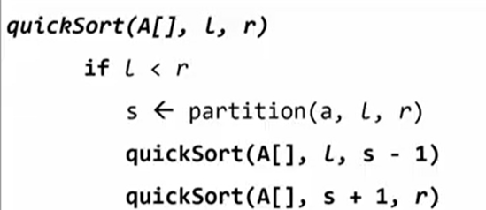
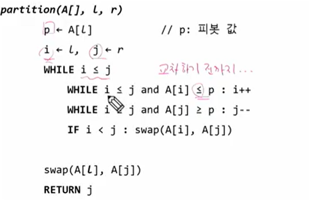
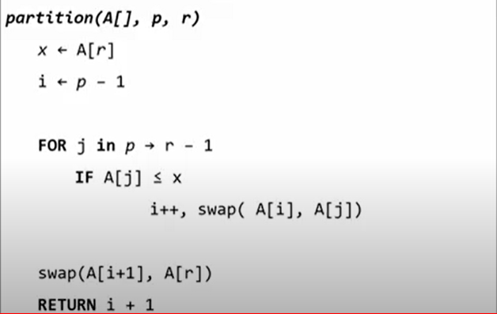
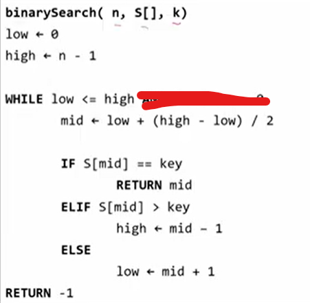
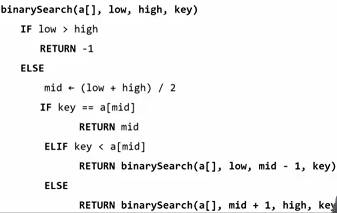

# 분할정복/백트래킹

## 분할정복

해결할 문제를 여러 개의 작은 부분으로 나눈다

나눈 작은 문제를 각각 해결

해결된 해답 모음


예를 들어 

x^n을 할 때

```python
def iterative_power(x, n):
    result = 1
    for i in range(n):
        result = result * x
    return result
```

이렇게 쭉 할 수 잇는 반면 분할정복을 사용한다면

```python
def recursive_power(x,n):
    if n== 1:
        return x
    if n % 2 == 0 :
        y = recursive_power(x, n/2)
        return y*y
    else:
        y = recursive_power(x, (n-1)/2)
        return y*y*x
    
```


병합정렬

분할: 전체 자료 집합에 대하여, 최소 크기의 부분집합이 될 때까지 분할

병합: 2개의 부분집합을 정렬하면서 하나의 집합으로 병합


```python
# 분할과정
def merge_sort(lst):
    if length(lst) ==1:
        return lst
    left = []
    right = []
    middle = length(lst) //2
    for x in range(0, middle):
        left.append(x)
    for y in range(middle, len(lst)):
        right.append(y)
    left = merge_sort(left)
    right = merge_sort(right)
    
    return merge(left, right)
```

```python
# 병합과정
def merge(left, right):
    result = []
    while len(left)>0 or len(right)> 0:
        if len(left)>0 and len(right)>0:
            if left[0] <= right[0]:
                result.append(left.pop(0))
            else:
                result.append(right.pop(0))
        elif len(left)>0:
            result.append(left.pop(0))
        elif len(right)>0:
            result.append(right.pop(0))
    return result
```


퀵정렬

def quicksort()




def partition



다른 partition 방법




이진검색 - 반복구조



이진검색 - 재귀구조




## 백트래킹

상태 공간 트리의 깊이 우선 검색을 실시한다

각 노드가 유망한지를 점검한다

만일 그 노드가 유망하지 않으면, 그 노드의 부모 노드로 돌아가서 검색을 계속한다


## 트리

싸이클이 없는 무향 연결 그래프

한개 이상의 노드로 이루어진 유한 집합


차수

노드의 차수: 노드에 연결된 자식의 수

트리의 차수: 트리에 있는 노드의 차수 중에서 가장 큰 값

단말 노드: 차수가 0인 노드, 자식 노드가 없는 노드


높이

노드의 높이: 루트에서 노드에 이르는 간선의 수, 노드의 레벨

트리의 높이: 트리에 있는 노드의 높이 중에서 가장 큰 값, 


이진트리: 모든 노드들이 최대 2개의 자식을 가질 수 있는 트리

꽉 찬거 -> 포화 이진 트리

포화 이진트리의 노드 번호 1번부터 N번까지 빈 자리가 없는 이진 트리 -> 완전 이진트리

한쪽 방향의 자식 노드만 가진 이진 트리 -> 편향 이진트리


전위순회 : V->L->R

중위순회: L->V->R

후위순회: L->R->V


코드는 p3참고

