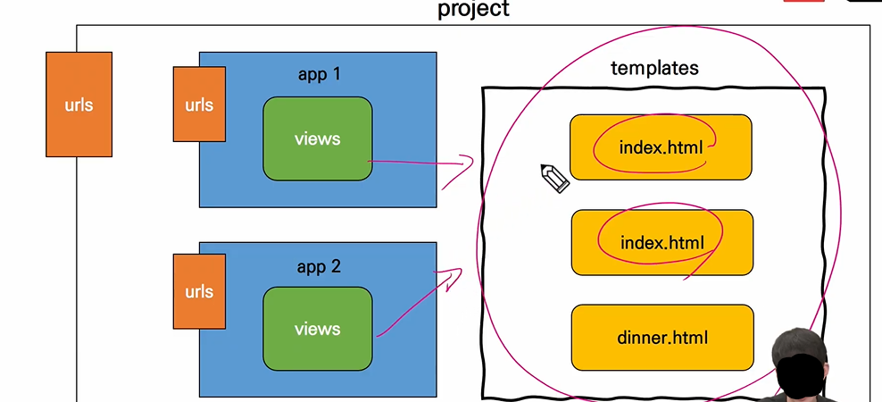
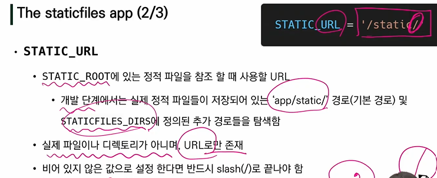
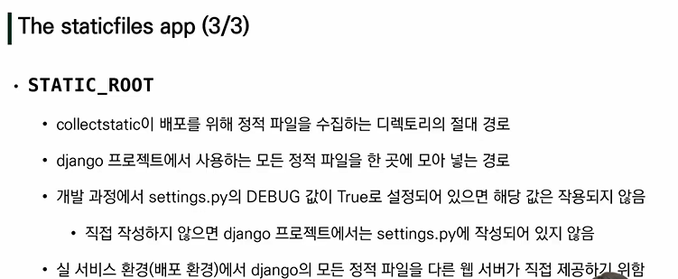

# django - pjt4

장고 작성 순서: url -> view -> temp(데이터 흐름 순서)

## name space

 프로그래밍 하다보면 모든 변수명과 함수명 등 이들 모두를 겹치지 않게 정의하는 것은 매우 어려운 일 

앱 이름이 다르지만 url 이름이 같을 때는 앱이 등록된 순서에 따라서 장고가 읽을수 있음

* 서로 다른 app의 같은 이름을 가진 url name은 이름공간을 설정해서 구분
* templates, static 등 django는 정해진 경로 하나로 모아서 보기 때문에 **중간에 폴더를 임의로 만들어 줌**으로써 이름공간을 설정

views 함수를 작성할 때

```
def dinner(request):
    render(request, 'articles/dinner.html'(사실 여기는 경로를 적는 곳))
```

urls.py에

```python
app_name = 'articles'
urlpatterns= [
    path('index/', views.index, name = 'index'),
    path('greeting/', views.greeting, name = 'greeting'),
]
```

app_name 설정한 후

index.html에

```html
<a href = "">greeting</a>
<a href = "">pages앱의 index 페이지로 이동</a>
```

그러고 templates 안에 pages 폴더를 만들고 index.html을 넣어주기




## static files

정적 파일

웹서버는 특정 위치에 있는 자원을 요청 받아서 제공하는 응답을 처리하는 것을 기본 동작으로 함

이는 자원과 접근 가능한 주소가 정적으로 연결된 관계 - 사진파일은 자원/ 파일 경로는 웹주소

웹 서버는 요청 받은 url로 서버에 존재하는 정적 자원을 제공


1. settings.py에STATIC_URL을 정의

2. 템플릿에서 static 템플릿 태그를 사용하여 지정된 상대경로에 대한 url을 빌드

```html


```

3. 앱의 static 디렉토리에 정적 파일을 저장

   my_app/static/my_app/example.jpg






장고 단계: 개발 단계 -> 배포 단계

settings.py에 debug 를 false로 하면 배포 단계로 바뀜


static_root는 개발 단계에서 사용되진 않고 배포 단계에서 사용됨

```python
STATIC_ROOT = BASE_DIR / 'staticfiles'
```

```bash
python manage.py collectstaitc
```

하면 staticfiles 폴더에 지금까지 모아놓은 정적 파일들을 보여줌


django template tag

미리 내장되어있는 태그가 아니기 때문에 로드를 해줘야함

* load
  * 사용자 정의 템플렛 태그 세트를 로드
  * 로드하는 라이브러리, 패키지에 등록된 모든 태그와 필터를 불러옴
* static
  * static_root에 저장된 정적 파일에 연결

settings.py에서

```python
STATIC_URL = '/static/'
```

```html


```

extends는 다른 것들보다 무조건 최상단에 있어야 하기 때문에 extends 밑에 static 로드

이거 부를 때 head 부분에 

```html
<link rel = "stylesheet" href = ""> 
```


## pjt 시연

