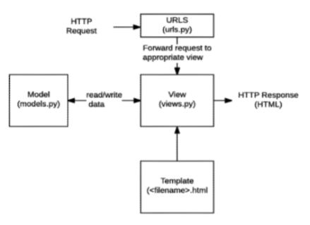

# Django

## web framework

: 웹 페이지를 개발하는 과정에서 겪은 어려움을 줄이는 것이 주 목적 

-데이터베이스 연동, 템플릿 형태의 표준, 세션관리 등


### django

: high-level **python web framework** 

검증된 python 언어 기반 web framework


### web

world wide web

인터넷에 연결된 컴퓨터를 통해 정보를 공유할 수 있는 전 세계적인 정보 공간


#### static web page

:정적 웹페이지

* 서버에 미리 저장된 파일이 사용자에게 그대로 전달되는 웹 페이지
* 모든 상황에서 모든 사용자에게 동일한 정보를 표시
* 클라이언트 -요청-> 서버/ 서버 -응답-> 클라이언트
* 클라이언트: 웹브라우저(크롬)
* 서버: django
* flat page라고도 함


#### dynamic web page

: 동적 웹페이지

* 웹 페이지에 대한 요청을 받은 경우 서버는 추가적인 처리 과정 이후 클라이언트에게 응답을 보냄
* 페이지 내용은 그때그때 다름


### framework

재사용할 수 있는 수많은 코드를 프레임워크로 통합함으로써 개발자가 새로운 애플리케이션을 위한 표준 코드를 다시 작성하지 않아도 같이 사용할 수 있도록 도움

프로그래밍에서 특정 운영 체제를 위한 응용 프로그램 표준 구조를 구현하는 클래스와 라이브러리 모임


### framework architecture

MVC Design Pattern(model - view- controller)

장고에서는 MTV 패턴이라고 함(model -template - view): 내용은 똑같은데 명칭만 다름


#### mtv 패턴

* model
  * 응용 프로그램의 데이터 구조 정의, 데이터 베이스의 기론 관리
* template
  * 파일의 구조나 레이아웃을 정의
  * 실제 내용을 보여주는데 사용
* view
  * http요청을 수신하고 http응답을 반환
  * model을 통해 요청을 충족시키는데 필요한 데이터에 접근
  * template에게 응답의 서식 설정을 맡김




## django routine

1. 가상환경 생성 및 활성화 `python -m venv venv`
2. django 설치 `pip install django==3.2.12`
3. 프로젝트 생성 `django-admin startproject firstpjt . `
4. 서버켜서 로켓 확인 
5. 앱 생성 `python manage.py startapp applications`
6. 앱 등록


* project

  manage.py는 django 프로젝트와 다양한 방법으로 상호작용하는 커맨드라인 유틸리티

  

- application생성

: application 명은 복수형으로 하는 것을 권장

** apps.py: 앱의 정보가 작성된 곳(dont touch)

** models.py: 앱에서 사용하는 model을 정의하는 곳

** tests.py: 프로젝트의 테스트 코드를 작성하는 곳(dont touch)

** views.py: view 함수들이 정의 되는 곳

```python
python manage.py startapp articles
```


### project & application

* project
  * 프로젝트는 앱의 집합
  * 프로젝트에는 여러 앱이 포함될 수 있음
  * 앱은 여러 프로젝트에 있을수 있음
* application
  * 앱은 실제 요청을 처리하고 페이지를 보여주고 하는 등의 역할을 담당
  * 하나의 프로젝트는 여러 앱을 가짐
  * 일반적으로 앱은 하나의 역할 및 기능 단위로 작성함
* application을 project 에 등록하는 방법이 필요
  * project 폴더를 열어보면 settings.py로 들어가면 installed_apps를 보면 됨

앱은 반드시 생성 후 등록!

```python
INSTALLED_APPS = [
#local apps
'articles',

#third party apps
'djangorestframework',

#django apps
'django.contrib.admin',
'',
'',
]
```


** 추가 설정

settings.py에 들어가면 최하단에 language code와 timezone이 있음

language_code = 'ko-kr'

time_zone = 'Asia/Seoul'  - 시간을 출력할 때


## 요청과 응답

### 코드 작성 순서

URL -> VIEW -> TEMPLATE

이유: 데이터의 흐름에 따라서 작성


### URLs

```python
# from 어플리케이션명 import views
from articles import views

path('index/', views.index),
```


### view

```python
def index(request):
    return render(request, 'index.html')
```


### templates

: 데이터 표현을 제어하는 도구이자 표현에 관련된 로직

built-in system : django template language


### django template language(DTL)

조건, 반복, 변수 치환, 필터 등의 기능을 제공

단순히 python이 HTML에 포함된 것이 아니며 프로그래밍적 로직이 아니라 프레젠테이션을 표현하기 위한것

파이썬처럼 일부 프로그래밍 구조를 사용할 수 있지만, 해당 파이썬으로 실행되는것이 아님


#### 1. VARIABLE(변수)

* render()를 사용하여 views.py에서 정의한 변수를 template 파일로 넘겨 사용하는 것
* 변수명은 공백, 구두점 문자로 사용할 수 없고, 밑줄로 시작할 수 없음
* dot을 사용하여 변수 속성에 접근할 수 있음
* render()의 세번째 인자로, 딕셔너리 형태로 넘겨주며, 여기서 정의한 key에 해당하는 문자열이 template에서 사용가능한 변수명이 됨

urls.py에서 새로운 변수 만들기

path를 정의해주고

views.py에 들어가서 path 함수 생성 

```python
def greeting(request):
    return render(request, 'greeting.html')
```

다시 urls.py로 돌아가서

```python
path('greeting/', views.greeting), 
```

templates에 greeting.html 만들고

! 자동완성 만들어서 html 작성


★ html 중간을 변수로 작성하고 싶다면

def greeting(request):

여기에 return 3번쨰 인자로 {'name': 'Alice'} 딕셔너리를 줌

그걸 html 파일에서 `저는 {{ 변수 이름 }} 입니다!` 로 집어넣음


변수가 많아지면

``` python
def greeting(request):
    foods = ['apple', 'banana','coconut',]
    info = {
        'name' = 'Alice',
    }
    context = {
        'foods': foods,
        'info': info,
    }
    return render(request, 'greeting.html', context)
```

이러면 구조가 바꼈기 때문에 info 안에있으므로 html에서

`저는 {{ info.name }} 입니다. `라고 적어야함

리스트를 출력할 때 `제가 가장 좋아하는 음식은 {{ foods.0 }}을 가장 좋아합니다 `라고 리스트 인덱스 접근이 가능


#### 2. filter(필터)

표시할 변수를 수정할 때 사용 

ex) name 변수를 모두 소문자로 출력 - name|lower

django template tag로 검색을하면 filter 60여개를 사용 가능

```html
<p>{{ foods|join:', ' }} </p>
```

을 넣으면 리스트 값을 ,으로 이어줌

변수 쓰고 필터 2개이상 쓸수도 있음 variable|filter1|filter2 

랜덤하게 출력

```python
def dinner(request):
    foods = ['족발','햄버거','치킨','초밥']
    pick = random.choice(foods)
    context = {
        'pick' : pick,

    }
    return render(request, 'dinner.html', context)
```

```django
<p>
    {{ pick }}은 {{ pick|length }}글자
</p>
<p>
    {{ foods|join:", " }}
</p>
```


#### 3. tag(태그)

: 출력 텍스트를 만들거나, 반복 또는 논리를 수행하여 제어 흐름을 만듦

변수보다 복잡한 일들을 수행

일부태그는 시작과 종료 태그가 필요 - 24개의 tag 제공



```html
<p>
    메뉴판
</p>
<ul>
    
        <li>{{ food }}</li>
    
</ul>
```

* 연산 : add(더하기만 있음)

{{ 4|add:6 }}

* 다양한 날짜 표현

                    # 2022년 3월 2일 3:26 오후

     # 2022-3-2 15:26

                            # 2022년 3월 2일

              # 2022-3-2


#### 4. comments

`{# #}`

* django template에서 라인의 주석을 표현하기 위해 사용

* 한 줄 주석에만 사용할 수 있음

  ```html
  {# 이것은 주석입니다. #}
  ```

  

* 여러 줄 주석은 

  ```django
  
  ..
  ..
  
  ```

  

### 상속

부모 HTML를 상속 받아서 자식 TEMPLATE 사용 가능

코드의 재사용성에 초점을 맞춤

템플릿 상속하면

- 사이트의 모든 공통 요소 포함
- 하위 템플릿이 재정의 할 수 있는 블록을 정의하는 기본 'SKELETON' 템플릿을 만들 수 있음

* extends와 block 태그
  * extends: 자식 템플릿이 부모 템플릿을 확장한다는 것을 알림
    * 반드시 템플릿 최상단에 작성되어야함
  * block: 하위템플릿에서 재지정할 수 있는 블록을 정의 - 하위 템플릿이 채울 수 있는 공간


`projects > settings.py`로 들어가면 TEMPLATES = []가 있음

여기에 경로를 추가해야 `app> templates` 디렉토리 외 템플릿 추가 경로를 설정해서 django가 읽을 수 있게 지정

```python
TEMPLATES = [
   'DIRS': [BASE_DIR/ 'templates',],
]
```

☆ BASE_DIR: 시작점을 잡아준 것

그리고 templates 폴더 안에 base.html을 만들어주고 그 곳에 상속할 공통 요소 집어넣기

여기에 bootstrap cdn 복사해서 작성해도 됨


block 요소 이름 -content로 지정했다면

```html
<body>
    <nav class = "navbar navbar-dark bg-dark">
        <a class = "navbar-brand" href = "#"> Navbar</a>
    </nav>
    
    
</body>
# endblock에 content안써도 됨
```

그 후에 `applications 폴더 > templates 폴더 > .html`에서 

`<p>`만 빼고 모두 다 삭제 후 맨 앞에 

```html



 <p>  </p>
 <p>  </p>
 <p>  </p>

```

로 하면 상속 받아서 가능 {% block }부분만 새롭게 지정 가능

 block 이름 맞춰서 상속시켜야함


* include: 템플릿을 로드하고 현재 페이지로 렌더링

만약에 navbar 앞 부분이 너무 더럽다 싶으면 `project > templates > _nav.html`을 만들어서 navbar 복붙!

하고 base.html에 `<body>`부분에 로 하면 그 부분이 상속되어서 코드가 깔끔해짐

변수명 앞에 _를 붙인 이유는 따로 없음, 다른 변수와 다르게 include주는 html이라는 것을 알려주기 위함임.
