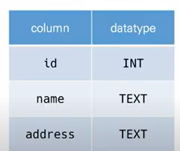
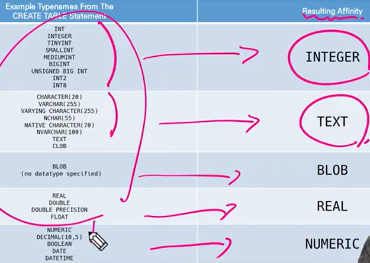

# 데이터베이스 (DB)

* 데이터 베이스는 체계화된 데이터의 모임
* 몇 개의 자료 파일을 조직적으로 통합하여 자료 항목의 중복을 없애고 자료를 구조화하여 기억시켜 놓은 자료의 집합체


데이터베이스 사용의 장점들
데이터 중복 최소화, 데이터 무결성, 데이터 일관성, 데이터 독립성, 데이터 표준화, 데이터 보안유지


## RDB(관계형 데이터베이스)

: relational database

key와 value들의 간단한 관계를 표 형태로 정리한 데이터 베이스 


* 스키마

  : 데이터베이스에서 자료의 구조, 표현 방법, 관계등 전반적인 명세 기술



* 테이블

  : 열과 행의 모델을 사용해 조직된 데이터 요소들의 집합

* 열

  : 데이터의 속성

* 행(로우, 레코드)

  : 실제 데이터가 저장되는 형태

* 기본키(primary key)

  : 각 행의 고유 값


## RDBMS

RDB를 관리하는 시스템

관계형 데이터 베이스 관리 시스템

MySQL, SQLite(장고에 내장되어있음), postgreSQL, ORACLE, MS SQL 등등


SQLite : 서버 형태가 아닌 파일 형식으로 응용 프로그램에 넣어서 사용하는 비교적 가벼운 데이터 베이스, 오픈소스 프로젝트이기 때문에 자유롭게 사용 가능

동적인 데이터 타입을 가지고 있음 - 실제로 데이터 타입을 지정하지 않아도 다양한 선호도를 가진 타입들로 자동적으로 변경 가능

### SQLite data type

1. NULL
2. INTEGER: 부호 있는 정수

3. REAL

4. TEXT
5. BLOB


### SQLite type affinity

데이터 타입 선호도



왼쪽에 있는 데이터 타입을 따로 쓰지 않고 오른쪽에 있는 데이터 타입만 사용


# SQL

structured query language

관계형 데이터 베이스 관리 시스템의 데이터 관리를 위해 설계된 특수 목적으로 프로그래밍 언어

데이터 베이스 스키마 생성 및 수정

자료의 검색 및관리

데이터베이스 객체 접근 조정 관리


* sql 분류
  *  ddl - 데이터 정의 언어 - create, drop, alter
  * dml - 데이터 조작(crud) 언어 - insert. select, update, delete
  * dcl - 데이터 제어 언어 - 사용자의 권한 제어를 위해 사용하는 명령어


조회

```SQL
SELECT * FROM examples;
```

```terminal
.schema classmates
# 를 하면 classmate 테이블의 스키마를 볼 수 있음
```


INSERT: 새로운 데이터 삽입

```SQL
CREATE TABLE classmates (
  id INTEGER PRIMARY KEY,
  name TEXT
);
```


SELECT


UPDATE


DELETE

```SQL
DROP TABLE classmates;
```


## 테이블 생성 및 삭제

1. SQLite 설치하기

2. csv 파일 다운로드

3. 데이터 베이스 생성하기

   ```bash
   sqlite3 tutorial.sqlite3
   .database
   # .은 sqlite 프로그램의 기능을 실행하는 것 
   ```

4. csv 파일을 table로 만들기

   ```bash
   .mode csv
   .import hellodb.csv examples
   # hellodb.csv를 받아와서 exaples라는 테이블에 만들어줘!
   .tables
   # 하면 examples라는 테이블이 만들어짐
   ```

5. tutorial sqlite3를 오른쪽 마우스 클릭해서 open database를 클릭하면 sqlite explorer에 tutorial.sqlite3가 뜸(sqlite 확장 프로그램 사용하기)

6. sqlite 작성

   ```bash
   # 조회: 특정 테이블의 레코드 정보를 반환
   SELECT * FROM examples;
   # ;까지 하나의 명령으로 간주
   # examples에서 모든것을 가져와라
   
   # 생성
   CREATE TABLE classmates (
     id INTEGER PRIMARY KEY,
     name TEXT
   );
   #테이블 생성 - 스키마 생성
   # ☆ 새롭게 테이블을 생성하거나 삭제할때  SQLITE EXPLORER 옆에 있는 새로고침 버튼을 눌러야 UPDATE
   ```

7. 터미널 view 변경하기

   ```bash
   .headers on 
   # 테이블의 id, name, 등 헤더가 보임
   .mode column
   # 하면 헤더와 데이터가 분리한 채 보임
   ```

8. tutorial sqlite3 오른쪽 버튼 클릭하면 new query를 클릭하면 파일이 하나 생성 됨 

   sql 확장자 생성됨

   이런 확장자에 코드 작성하면 자동완성, colorizing이 가능함

9. 확장자 생성된 것에 아무곳에나 오른쪽 버튼 클릭하면 

   run query: 쿼리 전체 실행

   run selected query: block 처리 된 곳이나 마우스가 클릭되어있는 부분만 실행

10. run selected query를 클릭하면 tutorial.sqlite 클릭 하면 sqlite화면 결과를 보여줌


# CRUD

## CREATE

### insert

: 테이블에 단일 행 삽입

```sql
INSERT INTO 테이블 이름 (컬럼1, 컬럼2, ..) VALUES (값1, 값2, ..);
```

```SQL
INSERT INTO classmates (name, age) VALUES ('홍길동', 23);
SELECT * FROM classmates;
```

데이터 삽입하기

```sql
INSERT INTO classmates Values('홍길동', 30, '서울');
```


* 프라이머리 키 

sqlite는 사실 rowid를 포함하고 잇다. 따라서 primary key를 설정하지 않더라도 값이 자동으로 증가하는 pk 옵션을 가진 rowid 컬럼을 정의

``` sql
SELECT rowid, * FROM classmates;
```

* null 값일 때 NOT null을 설정해야한다 -> 스키마 설정할 때 설정해야함

```sql
CREATE TABLE classmates (
id INTEGER PRIMARY KEY,
name TEXT NOT NULL,
age INT NOT NULL,
address TEXT NOT NULL
);

# 무조건 PRIMARY KET에는 INTEGER이라고 작성!

# 이후에
INSERT INTO classmates Values('홍길동', 30, '서울');
# 를 넣으면 4개의 열 테이블에 3개의 열만 들어가있으니 ERROR 가 뜸!

# 해결방법
# 1. ID를 포함한 모든 VALUE 작성
INSERT INTO classmates Values(1, '홍길동', 30, '서울');
# 2. 각 VALUE에 맏는 COLUMN들을 명시적으로 작성
INSERT INTO classmates (name, age, address) VALUES ('홍길동', 23, '서울');
```


## READ

### SELECT문

: 테이블에서 데이터를 조회 - 다양한 절과 함께 사용

* LIMIT
  - 쿼리에서 반환되는 행 수를 제한
  - 특정 행부터 시작해서 조회하기 위해 OFFSET 키워드와 함께 사용하기도 함

```SQL
#모든 컬럼 값이 아닌 특정 컬럼만 조회하기
SELECT 컬럼1, 컬럼2, ... FROM 테이블이름;

#특정 컬럼 중에서 행 개수 지정
SELECT 컬럼1, 컬럼2, ... FROM 테이블이름 LIMIT 숫자;

#특정 부분에서 원하는 수 만큼 데이터 조회하기
SELECT 컬럼1, 컬럼2, ... FROM 테이블이름 LIMIT 숫자 OFFSET 숫자;
# 세번쨰에 있는 값이면 OFFSET 3
```


* WHERE
  * 쿼리에서 반환된 행에 대한 특정 검색 조건을 지정

```SQL
SELECT 컬럼1, 컬럼2, ... FROM 테이블이름 WHERE 조건;
# WHERE address = '서울'
```


* SELECT DISTINCT
  * 조회 결과에서 중복 행을 제거
  * DISTINCT 절은 SELECT 키워드 바로 뒤에 작성해야함

```sql
SELECT DISTINCT age FROM classmates;
```


## DELETE

조건을 통해 특정 레코드 삭제하기

```SQL
DELETE FROM 테이블이름 WHERE 조건;
# WHERE rowid = 5;
```

row id 를 재사용함


AUTOINCREMENT : SQLite 가 이전에 삭제된 행의 값을 재사용하는 것을 방지

```SQL
# classmates 테이블 작성할때 
id INTEGER PRIMARY KEY AUTOINCREMENT,
```


## UPDATE

기존 행의 데이터를 수정

**SET** clause에서 테이블의 각 열에대해 새로운 값 설정

```sql
UPDATE 테이블이름 SET 컬럼1=값1, 컬럼2=값2, ... WHERE 조건;
```


## WHERE

USERS테이블에서 AGE가 30 이상인 유저의 모든 컬럼 정보를 조회하려면?

```SQL
SELECT * FROM users WHERE age >= 30;
```


USERs테이블에서 AGE가 30 이상인 유저의 이름만 조회하려면?

```sql
SELECT first_name FROM users WHERE age >= 30;
```


USERs테이블에서 AGE가 30 이상이고 성이 '김'인 사람의 나이와 성만 조회하려면?

```sql
SELECT age, first_name FROM users WHERE age >= 30 AND last_name='김';
```


# SQLite Aggregate Functions

"집계함수"

select  구문에서만 사용

여러행으로부터 하나의 결과값을 반환하는 함수

AVG, SUM, MIN, MAX 가능 - INTEGER일때만 가능


users테이블의 레코트 총 개수를 조회한다면?

```sql
SELECT COUNT(*) FROM users;
```


30살 이상인 사람들의 평균 나이는?

```SQL
SELECT AVG(age) FROM users where age >= 30;
```


계좌 잔액이 가장 높은 사람과 그 액수를 조회하려면?

```SQL
SELECT first_name, MAX(balance) FROM users;
```


# LIKE

와일드카드 캐릭터

유사하지만 동일한 데이터가 아닌 데이터를 조회

`%` : 이자리에 문자열이 있을수도, 없을수도 있음

`-`: 반드시 이자리에 한개의 문자가 존재해야함


```SQL
SELECT * FROM 테이블 WHERE 컬럼 LIKE '와일드카드패턴';
```


USERS테이블에서 나이가 20대인 사람만 조회한다면

```SQL
SELECT * FROM users WHERE age LIKE '2_';
```


users 테이블에서 지역 번호가 02인 사람만 조회한다면?

```sql
SELECT * FROM users WHERE phone LIKE '02-%';
```


users테이블에서 이름이 '준'으로 끝나는 사람만 조회한다면?

```sql
SELECT * FROM users WHERE first_name LIKE '%준';
```


users 테이블에서 중간 번호가 5114 인 사람만 조회한다면?

```SQL
SELECT * FROM users WHERE phone LIKE '%-5114-%';
```


중첩된 SQL 문

```SQL
SELECT first_name, last_name, balance FROM usersWHERE balance = (SELECT MAX(balance) FROM users);
```


# ORDER BY

SELECT 문에 추가하여 사용 

ASC - 오름차순(디폴트)

DESC - 내림차순


```SQL
SELECT * FROM 테이블 ORDER BY 컬럼 ASC:
```


users에서 나이 순으로 오름차순 정렬하여 상위 10개만 조회한다면?

```SQL
SELECT * FROM users ORDER BY age ASC LIMIT 10;
```


users에서 나이 순, 성 순으로 오름차순 정렬하여 상위 10개만 조회

```SQL
SELECT * FROM users ORDER BY age, last_name ASC LIMIT 10;
```


계좌 잔액 순으로 내림차순 정렬하여 해당 유저와 성과 이름을 10개만 조회한다면?

```SQL
SELECT first_name, last_name FROM users ORDER BY balance DESC LIMIT 10;
```


# GROUP BY

SELECT 문의 optional 절

선택된 행 그룹을 하나 이상의 열 값으로 요약 행으로 만듦

문장에 where 절이 포함된 경우 반드시 where 절 뒤에 작성해야함

```sql
SELECT 컬럼1, aggregate_function(컬럼2) FROM 테이블 GROUP BY 컬럼1, 컬럼2;
```


users에서 각 성씨가 몇 명씩 있는지 조회한다면?

```sql
SELECT last_name, COUNT(*) FROM users GROUP BY last_name;
```


count(*)라는 이름을 쓰기 싫다면 -> as 사용

```sql
SELECT last_name, COUNT(*) AS name_count FROM users GROUP BY last_name;
```


# ALTER TABLE

TABLE 이름 변경

```SQL
ALTER TABLE 기존테이블이름 RENAME T0 새로운테이블이름;
```


테이블에 새로운 COLUMN 추가

```SQL
ALTER TABLE 데이블이름
ADD COLUMN 컬럼이름 데이터타입 설정;
ALTER TABLE news
ADD COLUMN created_at TEXT NOT NULL;
```

NOT NULL하면 추가할 수 없는 에러가 뜸

해결방법

1. NOT NULL 설정 없이 추가하기

```SQL
ALTER TABLE news ADD COLUMN created_at TEXT;
INSERT INTO news VALUES('제목','내용',datetime('now'));
```

2. 기본값 설정하기

```sql
ALTER TABLE news ADD COLUMN subtitle TEXT NOT NULL 
DEFAULT '소제목';
```


COLUMN 이름 수정

```SQL
ALTER TABLE table name
RENAME COLUMN current_name TO new_name;
```


DROP COLUMN(column 삭제)

```SQL
ALTER TABLE news
DROP COLUMN subtitle;
```

