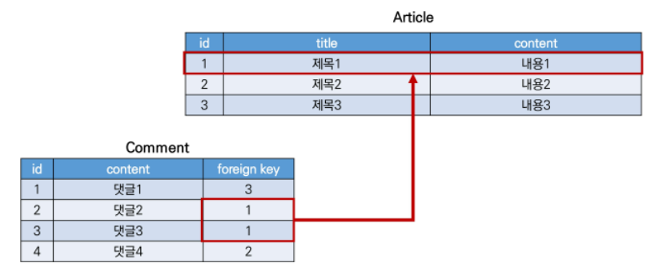

# DB

db는 현상의 일을 2차원으로 옮겨놓은 것

아주 획기적!

유형: 관계없음, 1:1, 1:N, M:N


## MODEL RELATIONSHIP 1

### FOREIGN KEY

외래 키

관계형 데이터베이스에서 한 테이블(참조하는)의 필드 중 다른 테이블(참조되는)의 행을 식별할 수 있는 키

참조하는 테이블에서 속성(필드)에 해당하고, 이는 참조되는 테이블의 기본 키를 가리킴


ARTICLE(1): COMMENT(N)



comment의 foreign key는 하나의 article에 대응

그렇다면 comment는 참조하는 테이블/ article은 참조되는 테이블

따라서 외래키는 1:N 관계에서는 N이 가지고 있음


키를 사용하여 부모 테이블의 유일한 값을 참조(참조 무결성)

```
참조무결성
: 외래키가 선언된 테이블의 외래 키 속성(열)의 값은 그 테이블의 부모가 되는 테이블의 기본 키 값으로 존재해야함
```

외래 키의 값이 반드시 부모 테이블의 기본키일 필요는 없지만 유일한 값이어야함


FOREIGN KEY 필드(1:N 관계)

필수 인자: 참조하는 model class, on_delete

```python
# articles/models.py
class Comment(models.Model):
    article = models.ForeignKey(Article, on_delete = models.CASCADE)
    content = models.CharField(max_length = 200)
    created_at = models.DateTimeField(auto_now_add = True)
    updated_at = models.DateTimeField(auto_now = True)
    
    def __str__(self):
        return self.content
```


on_delete 옵션

데이터 무결성을 위해서 매우 중요한 설정

외래 키가 참조하는 객체가 사라졌을 때 외래키를 가진 객체를 어떻게 처리할지를 정의

```
CASCADE: 부모 객체(참조된 객체)가 삭제되었을 때 이를 참조하는 객체도 삭제
PROTECT
SET_NULL
SET_DEFAULT
SET()
DO_NOTHING
RESTRICT
```


```
데이터 무결성:
데이터의 정확성과 일관성을 유지하고 보증하는 것을 가리킴
유형 
- 개체 무결성: 모든 테이블이 pk를 가져야하며 pk로 선택된 열은 고유한 값, 빈값 허용 x
- 참조 무결성: fk 값이 데이터 베이스의 특정 테이블의 pk 값을 참조하는 것
- 범위 무결성: 정의된 형식(범위)에서 관계형 데이터베이스의 모든 컬럼이 선언되도록 규정
```


migrations , migrate 생성 후 migration  파일 확인 -> articles_comment 테이블의 외래 키 컬럼 확인

(필드 이름에 _id가 추가됨)

장고가 외래키를 만들면 만든 클래스 이름에 _id를 붙여서 컬럼이 나옴

명시적인 모델 관계 파악을 위해 1:N 관계에서는 참조하는 클래스의 이름을 소문자로 작성하는 것이 바람직함 


댓글에서 필요한거 댓글의 내용, 어떤 게시글에 달린 건지가 필요

```BASH
$ python manage.py shell_plus
```

```shell
comment = Comment()

comment
<Comment:>

# 게시글 먼저 생성
article = Article.objects.create(title = 'title', content= 'content')

comment.content = 'first content'
comment.article = article

# 댓글 저장
comment.save()

comment.article.pk
# 1
comment.article.content
# 'content'

# 두번째 댓글 작성
comment = Comment(content = 'second comment', article= article)
comment.save()
comment.pk
# 2
comment.article.pk
# 1
comment.article_id
# 1 위에랑 똑같은 코드임
```


admin 사이트에서 작성된 댓글 확인

```python
# articles/admin.py
from .models import Comment
admin.site.register(Comment)
```

```bash
$ python manage.py createsuperuser
```


■ Comment는 Article을 참조할 때 comment.article로 하면 됨

■ 그렇다면 역참조(Article에서 Comment)는 가능할까? 

   article.comment_set으로 가능

- article은 comment가 있을 수도 있고, 없을 수도 있음
- article클래스에는 comment와의 어떠한 관계도 작성되어 있지 않음 -> article.comment 가 절대 안됨


```bash
$ python manage.py shell_plus
```

```shell
article = Article.objects.get(pk=1)
article
dir(article) # 이 인스턴스가 쓸수 있는 메소드가 다 나옴

#aricle입장에서 모든 댓글 조회하기
article.comment_set.all()
for comment in comments:
    print(comment.content)
comment = Comment.objects.get(pk=1)
comment.article
```


related_name

역참조시 사용할 이름을 변경할수 있음 옵션

```python
# articles/models.py
class Comment(models.Model):
    article = models.ForeignKey(Article, on_delete=models.CASCADE, related_name = 'comments')
```

위와 같이 변경하면 article.comment_set은 더이상 하용할 수 없고 , article.comments로 대체됨

이름 수정한 후에는 migration 필요!

단, 1:N 관계에서는 권장하지 않음


#### COMMENT CREATE & READ

```python
# articles/forms.py
from .models import Article, Comment

class CommentForm(forms.ModelForm):
    class Meta:
        model = Comment
        # 이렇게 받으면 외래키 필드를 직접 작성하게 해야됨
        # 그러면 2번 게시글에서 1번 게시글 댓글을 달 수 있게 만들어줌
        # fields = '__all__'
        # 따라서 content만 직접 지정할 수 있도록 해야함
        exclude = ('article',)
```

```python
# articles/views.py
from .form import ArticleForm, CommentForm

def detail(request,pk):
    article = get_object_or_404(Article, pk= pk)
    comment_form = CommentForm()
    # 조회한 article의 모든 댓글을 조회
    comments = article.comment_set.all()
    context = {
        'article': article,
        'comment_form': comment_form,
        'comments':comments,
    }
    return render(request, 'articles/detail.html', context)
```

```html
<!--articles/detail.html -->


<form action = "" method = "POST">
    
    {{ comment_form }}
    <input type = "submit">
</form>
<hr>
<h4>댓글 목록</h4>
<ul>
   
    <li>{{ comment.content }}</li>
   
</ul>

```

```python
# articles/urls.py
app_name= 'articles'
urlpatterns = [
    path('<int:pk>/comments/', views.comments_create, name = 'comments_create'),
]
```

```python
# articles/views.py
@require_POST
def comments_create(request,pk):
    if request.user.is_authenticated:
        article = get_object_or_404(Aritlce, pk=pk)
        comment_form = CommentForm(request.POST)
        if comment_form.is_valid():
            comment = comment_form.save(commit = False)
            comment.article = article
            comment.save()
        return redirect('articles:detail', article.pk)
    return redirect('articles:login')
```

```
commit= False
create, but don't save the new instance
아직 데이터 베이스에 저장되지 않은 인스턴스를 반환
저장하기 전에 객체에 대한 사용자 지정 처리를 수행할 때 유용하게 사용
```


#### COMMENT DELETE

```python
# articles/urls.py
path('<int:article_pk>/comments/<int:comment_pk>/delete/', views.comments_delete, name ='comments_delete'),
```

```python
# articles/views.py
from .models import ArticleForm, Comment

@require_POST
def comments_delete(request, article_pk, comment_pk):
    if request.user.is_authenticated:
        comment = get_object_or_404(Comment, pk= comment_pk)
        comment.delete()
    return redirect('articles:detail', article_pk)
```

```html
<!--articles/detail.html -->
<h4>댓글 목록</h4>
<ul>
   for comment in comments
    <li>{{ comment.content }}
    <form action = "" method = "POST">
        csrf _token
        input type = "submit" value = "삭제"
    </form>
    </li>
    end for
</ul>
```


### CUSTOMIZING AUTHENTICATION IN DJANGO

#### SUBSTITUTING A CUSTOM USER MODEL

[substitution a custom user model](https://docs.djangoproject.com/en/4.0/topics/auth/customizing/#substituting-a-custom-user-model)

user대신 email을 식별 토근으로 사용하는 것이 더 적합한 사이트가 존재

그렇다면 django의 내장 user 모델이 제공하는 인증 요구사항이 적절하지 않을 수 있음

django는 user를 참조하는데 사용하는 auth_user_model값을 제공하여 default user model을 재정의 할 수 있도록함

커스텀 유저 모델을 설정하는 것을 강력하게 권장!

단, 프로젝트의 모든 migrations 혹은 첫 migrate를 실행하기 전에 이 작업을 마쳐야함

따라서 user model migrate한 이후에는 auth_user_model 못함


auth_user_model

프로젝트가 진행되는 동안 변경할 수 없음

```
프로젝트 중간에 진행했다면
데이터 베이스를 초기화한 후 마이그레이션 진행
1. db.sqlite3 파일 삭제
2. migrations 파일 모두 삭제(파일명에 숫자가 붙은 파일만 삭제)
3. 다시 makemigrations와 migrate 실행
```

auth.User(auth 앱의 User 모델)

AUTH_USER_MODEL = 'auth.User'


custom user 모델 정의하기

```python
# accounts/models.py
# 관리자 권한과 함께 완전한 기능을 갖춘 User 모델을 구현하는 기본 클래스인 AbstractUser를 상속받아 새로운 User 모델 작성

from django.contrib.auth.models import AbstractUser

class User(AbstractUser):
    pass
```

* user 모델이 상속받는 abstractuser을 살펴보자 [abstractuser](https://github.com/django/django/blob/main/django/contrib/auth/models.py)

```python
# settings.py
# 원래는 AUTH_USER_MODEL = 'auth.User'으로 되어있는데 이젠 내가 custom한걸로 사용할거야!
AUTH_USER_MODEL = 'accounts.User'
```

```python
# accounts/admin.py
from django.contrib import admin
from django.contrib.auth.admin import UserAdmin
from .models import User

admin.site.register(User, UserAdmin)

# 이거 만든 다음에는 언제나 createsuperuser 해줘!
```


#### CUSTOM USER & BUILT IN AUTH FORMS

위에처럼 하고 다시 회원가입하면 attribute error 가 뜸!

'auth.User' has been swapped for 'accouts.User'

```
로그인할 때 사용했던 UserCreationForm과 UserChangeForm은 기존 내장 User 모델을 사용한 ModelForm이기 떄문에 커스텀 User 모델로 대체해야함
따라서 UserCreationForm, UserChangeForm을 변경해야함!
```

```python
# acconts/forms.py
from django.contrib.auth.forms import UserChangeForm, UserCreationForm
# get_user_model : 현재 장고 프로젝트에서 메인으로 활성화되어있는 user들을 보여줌

class CustomUserCreationForm(UserCreationForm):
    class Meta(UserCreationForm.Meta):
        model = get_user_model()
        # 이메일까지 받고 싶어!
        fields = UserCreationForm.Meta.fields + ('email',)
```

```
get_user_model()
현재 프로젝트에서 활성화된 사용자 모델을 반환
이 떄문에 django는 user 클래스를 직접 참조하는 대신
django.contrib.auth.get_user_model()을 사용하여 참조해야 한다고 강조
```

```python
# accounts/views.py
from .forms import CustomUserChangeForm, CustomUserCreationForm

# signup view 함수 코드 수정
if request.method == "POST":
    form = CustomUserCreationForm(request.POST)
else:
    form = CustomUserCreationForm()
```


## MODEL RELATIONSHIP 2

### 1:N 관계 설정

A HAS MANY B

BUT B BELONGS TO A

#### USER- ARTICLE

사용자는 여러개의 게시글을 작성할 수 있음

```python
#articles/models.py
from django.conf import settings
class Article(models.Model):
    # 참조하는 모델의 단수형
    user= models.ForeignKey(settings.AUTH_USER_MODEL, on_delete = models.CASCADE)
```

```
User 모델 참조하기
* settings.AUTH_USER_MODEL
 - User 모델에 대한 외래 키 또는 다대다 관계를 정의할 때 사용해야함
 - ★models.py에서 User모델을 참조할 때 사용 
 - return 이 string
 
* get_user_model()
 - 현재 활성화된 User 모델을 반환
  - 커스터마이징한 User모델이 있을 경우는 Custom User 모델, 그렇지 않으면 User를 반환
  - User를 직접 참조하지 않는 이유
 - ★models.py가 아닌 다른 모든 곳에서 유저 모델을 참조할때 사용
 - return이 object
```

그리고 migrations 하면 선택하는 것이 나옴 = null값이 허용되지 않은 user_id 필드가 별도의 값없이 article에 추가하려하기 떄문

(1) 현재 화면에서 기본 값을 설정하겠다 -> (1)기존 테이블에 추가되는 user_id 필드의 값을 1로 설정하겠다

```python
# ArticleForm의 출력 필드 수정 후 게시글 작성 재시도
# articles/forms.py
class ArticleForm(forms.ModelForm):
    class Meta:
        model = Article
        fields = ('title', 'content',)
        # exclude = ('user',)
```

```python
# 누가 쓴건데?
# articles/views.py
def create(request):
    if form.is_valid():
        article = form.save(commit = False)
        article.user = request.user
        article.save()
        
```

```python
# 내가 쓴 게시글만 삭제 가능하도록 설정
# articles/views.py
def delete(request,pk):
    article = get_object_or_404(Article, pk=pk)
    if request.user.is_authenticated:
        if request.user == article.user:
            article.delete()
            return redirect('articles:index')
    return redirect('articles:detail', article.pk)
```

```python
# 내가 쓴 게시글만 수정 가능
# articles/views.py
def update():
    if request.user == article.user:
        if:
        else:
    else:
        return redirect('articles:index')
    context = {
        'form': form,
    }
    return render(request, 'articles/update.html', context)
```

```html
<!--index.html -->
block
for article in articles
작성자: {{ article.user }}
```

```html
<!--detail.html -->


```


#### USER-COMMNET

user와 comment 간 모델 관계 정의 후 migration

```python
# articles/models.py
class Comment(models.Model):
    user = models.ForeignKey(settings.AUTH_USER_MODEL, on_delete= models.CASCADE)
```

migration 진행

```python
# articles/forms.py
class CommentForm(forms.ModelForm):
    class Meta:
        model = Comment
        exclude = ('article', 'user',)
```

```python
@require_POST
def comments_create(request,pk):
    if request.user.is_authenticated:
        article = get_object_or_404(Aritlce, pk=pk)
        comment_form = CommentForm(request.POST)
        if comment_form.is_valid():
            comment = comment_form.save(commit = False)
            comment.article = article
            comment.user = request.user
            comment.save()
        return redirect('articles:detail', article.pk)
    return redirect('articles:login')
```


비로그인 유저에게는 댓글 form 출력 숨기기

```html
<!-- articles/detail.html -->


 <a href  = url'accounts:login' >[댓글을 작성하려면 로그인하세요.]</a>

```


댓글 작성자 출력하기 & 자신이 작성한 댓글만 삭제 버튼을 볼 수 있게

```html
<!-- articles/detail.html -->
<li>
  {{ comment.user }} - {{ comment.content }}
  
    <form action="" method = "POST">
      
      <input type="submit" value = "DELETE">
    </form>
  
</li>
```

자신이 작성한 댓글만 삭제할 수 있도록 수정

```python
# articles/views.py
def comments_delete():
    if:
        if request.user == comment.user:
            comment.delete()
    return redirect('')
```

