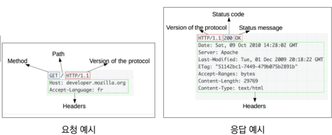
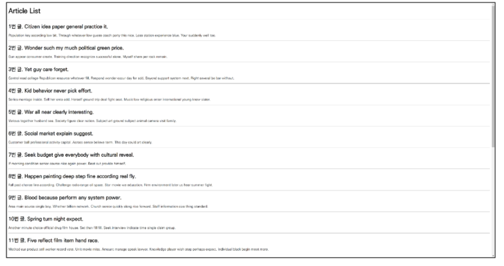
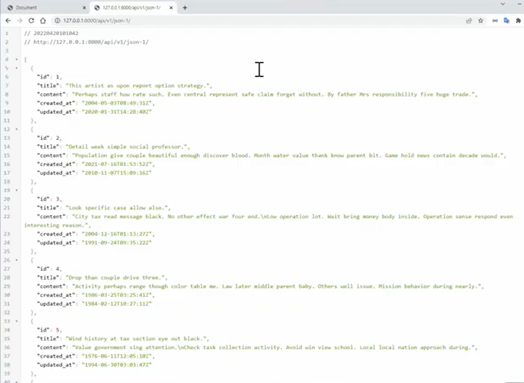
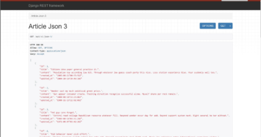
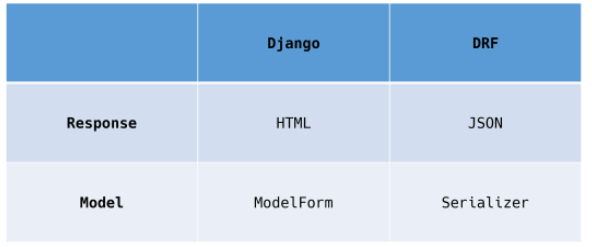
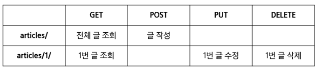

# REST-API

## HTTP

hyper text transfer protocol

웹상에서 컨텐츠를 전송하기 위한 약속

HTML 문서와 같은 리소스들을 가져올 수 있도록 하는 프로토콜

웹에서 이루어지는 모든 데이터 교환의 기초

```
요청: 클라이언트에 의해 전송되는 메시지
응답: 서버에서 응답으로 전송되는 메시지
```


기본 특징

* Stateless
* connectionless

쿠키와 세션을 통해 서번 상태를 요청과 연결하도록 함




http request methods

자원에 대한 행위를 정의, 주어진 리소스에 수행하길 원하는 행동을 나타냄

GET(조회), POST(작성), PUT(수정), DELETE(삭제)


HTTP response status codes

```
1xx informational responses
2xx successful responses
3xx redirection responses
4xx client error responses
5xx server error responses
```


웹에서의 리소스 식별

HTTP 요청의 대상을 리소스라고 함

리소스는 문서, 사진 또는 어떤 것이든 될 수 있음

각 리소스는 리소스 식별을 위해 http 전체에서 사용되는 uri로 식별된


URL, URN

* URL
  * 통합자원 위치
  * 네트워크 상에 자원이 어디있는지 알려주기 위한 약속
  * 과거에는 실제 자원의 위치를 나타냈지만 현재는 추상화된 의미론적인 구성
  * 웹주고, 링크라고도 불림
* URN
  * 통합자원이름
  * URL로 달리 자원의 위치에 영향을 받지 않는 유일한 이름 역할을 함
  * 예시) ISBN

* URI
  * 통합자원 식별자
  * 인터넷의 자원을 식별하는 유일한 주소(정보의 자원을 표현)
  * 인터넷에서 자원을 식별하거나 이름을 지정하는데 사용되는 간단한 문자열
  * 하위개념: URL, URN
  * URI는 URN과 URL로 나눌 수 있지만, URN을 사용하는 비중이 매우 작기 때문에 일반적으로 URL은 URI와 같은 의미처럼 사용하기도 함

URI의 구조(https://www.example.com:80/path/to/myfile.html/?key=value#quick-start)

* scheme(protocol)
  * 브라우저가 사용해야 하는 프로토콜
  * http(s), data, file, ftp, mailto
  * htts://
* Host(Domain name)
  * 요청을 받은 웹 서버의 이름
  * IP address를 직접 사용할수도 있지만, 실 사용시 불편하므로 웹에서 그리 자주 사용되지는 않음
  * www.example.com
* port
  * 웹 서버 상의 리소스에 접근하는데 사용되는 기술적인 문
  * http 프로토콜의 표준 포트
    * http 80
    * https 443
  * :80
* path
  * 웹 서버 상의 리소스 경로
  * 초기에는 실제 파일이 위치한 물리적 위치를 나타냈지만, 오늘날은 물리적인 실제 위치가 아닌 추상화 형태의 구조로 표현
  * /path/to/myfile.html
* Query
  * query string parameters
  * 웹 서버에 제공되는 추가적은 매개 변수
  * &로 구분되는 key-value 목록
  * ?key=value
* fragment
  * anchor
  * 자원 안에서의 북마크의 한 종류를 나타냄
  * 브라우저에서 해당 문서의 특정 부분을 보여주기 위한 방법
  * 브라우저에게 알려주는 요소이기 떄문에 fragment identifier 라고 부르며 # 뒤의 부분은 요청이 서버에 보내지지 않음
  * #quick-start


## RESTful API

REST:

"REpresentational State Transfer" 의 약자로, 

자원을 이름(자원의 표현)으로 구분해 해당 자원의 상태(정보)를 주고 받는 모든 것을 의미합니다.

즉, **자원(resource)**의 **표현(representation)**에 의한 **상태 전달**을 뜻합니다.


**자원** **:** 해당 소프트웨어가 관리하는 모든 것 ( 문서, 그림, 데이터, 해당 소프트웨어 자체 등 )

**표현 :** 그 자원을 표현하기 위한 이름 ( DB의 학생 정보가 자원이면, 'students'를 자원의 표현으로 정함 )

**상태 전달 :** 데이터가 요청되는 시점에 자원의 상태를 전달한다. ( JSON 혹은 XML을 통해 데이터를 주고 받는 것이 일반적 )


REST는 기본적으로 웹의 기존 기술과 HTTP 프로토콜을 그대로 활용하기 때문에,

**웹의 장점을 최대한 활용할 수 있는 아키텍처 스타일**

REST는 네트워크 상에서 Client와 Server 사이의 통신 방식 중 하나


RESTful services, simply REST services라고도 부름

프로그래밍을 통해 클라이언트의 요청에 json을 응답하는 서버를 구성

지금까지 사용자의 입장에서 썼던 API를 제공자의 입장이 되어 개발해보기


* API
  * application programming interface
  * API는 응용 프로그램에서 사용할 수 있도록, 운영 체제나 프로그래밍 언어가 제공하는 기능을 제어할 수 있게 만든 인터페이스
    * 애플리케이션과 프로그램으로 소통하는 방법
    * CLI는 명령줄, GUI는 그래픽, API는 프로그래밍을 통해 특정한 기능 수행
  * WEB API
    * 웹 애플리케이션 개발에서 다른 서비스에 요청을 보내고 응답을 받기 위해 정의된 명세
    * 여러 OPEN API사용
  * 응답 데이터 타입
    * HTML, XML, JSON등
  * YOUTUBE API, Kakao Map API 등,,,


* REST
  * REpresentational State Transfer
  
  * API server를 개발하기 위한 일종의 소프트웨어 설계 방법론
  
  * 네트워크 구조 원리의 모음
    * 자원을 정의하고 자원에 대한 주소를 지정하는 전반적인 방법
    
  * REST 원리를 따르는 시스템을 RESTful 이란 용어로 지칭함
  
  * 자원을 정의하는 방법에 대한 고민
    * 정의된 자원을 어디에 위치 시킬 것인가
    
  * **REST의 자원과 주소의 지정 방법**(핵심규칙)
    
    * 자원: URI
    * 행위: HTTP method
    * 표현
      * 자원과 행위를 통해 궁극적으로 표현되는 결과물
      * JSON으로 표현된 데이터를 제공
        * json: 자바스크립트의 표기법을 따른 단순 문자열
        * 쉽게 변화할 수 있는 key-value 형태의 구조를 갖고 있음
    
  * 핵심 규칙
    * 정보는 URI로 표현
    * 자원에 대한 행위는 HTTP method로 표현(GET, POST, PUT, DELETE)
    * 설계방법론을 지키지 않더라도 동작 여부에 큰 영향을 미치지는 않지만 설계 방법론은 지키지 않았을 때 잃는 것보다 지켰을 때 얻는 것이 훨씬 많음
    
  * 특징
  
    * server-client(서버-클라이언트 구조)
  
      ```
      자원이 있는 쪽이 Server, 자원을 요청하는 쪽이 Client가 됩니다.
      REST Server는 API를 제공하고 비즈니스 로직 처리 및 저장을 책임지고,
      Client는 사용자 인증이나 context( 세션, 로그인 정보 ) 등을 직접 관리하고 책임집니다.
      역할을 확실히 구분시킴으로써 서로 간의 의존성을 줄입니다.
      ```
  
    * stateless(무상태)
  
      ```
      HTTP 프로토콜은 Stateless Protocol이므로 REST 역시 무상태성을 갖습니다.
      Client의 context를 Server에 저장하지 않습니다.
      즉, 세션과 쿠키와 같은 context 정보를 신경쓰지 않아도 되므로 구현이 단순해집니다.
      
      Server는 각각의 요청을 완전히 별개의 것으로 인식하고 처리합니다.
      각 API 서버는 Client의 요청만을 단순 처리합니다.
      즉, 이전 요청이 다음 요청의 처리에 연관되어서는 안됩니다. ( DB에 의해 바뀌는 것은 허용 )
      Server의 처리 방식에 일관성을 부여하기 때문에 서비스의 자유도가 높아집니다.
      ```
  
    * 캐시처리 기능
  
      ```
      웹 표준 HTTP 프로토콜을 그대로 사용하므로 웹에서 사용하는 기존의 인프라를 그대로 활용할 수 있습니다.
      즉, HTTP가 가진 가장 강력한 특징 중 하나인 캐싱 기능을 적용할 수 있습니다.
      HTTP 프로토콜 표준에서 사용하는 Last-Modified Tag 또는 E-Tag를 이용해 캐싱을 구현합니다.
      대량의 요청을 효율적으로 처리할 수 있습니다.
      ```
  
    * 계층구조
  
      ```
      Client는 REST API Server만 호출합니다.
      REST Server는 다중 계층으로 구성될 수 있습니다.
      보안, 로드 밸런싱, 암호화 등을 위한 계층을 추가하여 구조를 변경할 수 있습니다.
      Proxy, Gateway와 같은 네트워크 기반의 중간매체를 사용할 수 있습니다.
      하지만 Client는 Server와 직접 통신하는지, 중간 서버와 통신하는지는 알 수 없습니다.
      ```
  
    * 인터페이스 일관성
  
      ```
      URI로 지정한 Resource에 대한 요청을 통일되고, 한정적으로 수행하는 아키텍처 스타일을 의미합니다.
      HTTP 표준 프로토콜에 따르는 모든 플랫폼에서 사용이 가능하며, Loosely Coupling(느슨한 결함) 형태를 갖습니다. 
      즉, 특정 언어나 기술에 종속되지 않음
      ```
  
    * 자체 표현
  
      ```
      요청 메시지만 보고도 쉽게 이해할 수 있는 자체 표현 구조로 되어있습니다.
      ```
  
      
  
* JSON
  * JSON is a lightweight data - interchange format
  * javascript의 표기법을 따른 단순 문자열
  * 특징
    * 사람이 읽거나 쓰기 쉽고 기계가 파싱하고 만들어내기 쉬움
    * 파이썬의 dictionary, 자바스크립트의 object처럼 C계열의 언어가 갖고 있는 자료 구조로 쉽게 변화할 수 있는 key-value 형태의 구조를 갖고 있음


**URI는 정보의 자원만 표현해야 하며, 자원의 행위는 HTTP Method에 명시!**


## Response

가상환경 설정

```bash
$ python -m venv venv
$ source venv/Scripts/activate
$ pip install -r requirements.txt
```

```python
# settings.py
INSTALLED APPS = [
    'articles',
    'django_seed' ]
```

```python
# my_api/urls.py
urlpatterns = [
    path('api/v1/', include('articles:urls')),
]
```

```python
# articles/urls.py
urlpatterns = [
    path('html/', views.article_html),
    path('json-1/', views.article_json_1),
    path('json-2/', views.article_json_2),
    path('json-3/', views.article_json_3),
]
```

```python
# models.py
class Article(models.Model):
    title = models.CharField(max_length = 100)
    content = models.TextField()
    created_at = models.DateTimeField(auto_now_add = True)
    updated_at = models.DateTimeField(auto_now = True)
```

```bash
$ python manage.py seef articles --number=20
```

```python
# urls.py
from rest_framework.decorators import api_view
from rest_framework.response import Response
from django.shortcuts import render
from django.http.response import JsonResponse, HttpResponse
from django.core import serializers
from .serializers import ArticleSerializer
from .models import Article

# Create your views here.
def article_html(request):
    articles = Article.objects.all()
    context = {
        'articles': articles,
    }
    return render(request, 'articles/article.html', context)


def article_json_1(request):
    articles = Article.objects.all()
    articles_json = []

    for article in articles:
        articles_json.append(
            {
                'id': article.pk,
                'title': article.title,
                'content': article.content,
                'created_at': article.created_at,
                'updated_at': article.updated_at,
            }
        )
    return JsonResponse(articles_json, safe=False)


def article_json_2(request):
    articles = Article.objects.all()
    data = serializers.serialize('json', articles)
    return HttpResponse(data, content_type='application/json')
# 주어진 모델 정보를 활용하기 때문에 이전과 달리 필드를 개별적으로 직접 만들어줄 필요없음
```

```html
<!--article.html-->
<body>
  <h1>Article List</h1>
  <hr>
  <p>
    
      <h2>{{ article.pk }}번 글. {{ article.title }}</h2>
      <p>{{ article.content }}</p>
      <hr>
    
  </p>
</body>
```


api/v1/html




api/v1/json-1




```
* content-type(개발자 도구에서 확인)
데이터의 media type을 나타내기 위해 사용됨
응답 내에 있는 컨텐츠의 컨텐츠 유형이 실제로 무엇인지 클라이언트에게 알려줌

* JsonResponse objects
json-encoded response를 만드는 HTTPresponser의 서브 클래스
'safe' parametrer(기본값: true)
 - dict 이외의 객체를 직렬화하려면 false로 설정해야함
```


serialization(직렬화)
: 데이터 베이스로부터 사용자에게 json으로 줘야된느데 바로 변환이 불가능하다. 다른 데이터 타입으로 용이하게 바꿔주기 위한 과정. 

데이터 구조나 객체 상태를 동일하거나 다른 컴퓨터 환경에 저장하고, 나중에 재구성할 수 있는 포맷으로 변환하는 과정


serializers in django
queryset 및 model instance와 같은 복잡한 데이터를 json, xml 등의 유형으로 쉽게 변환할 수 있는 **python 데이터 타입**으로 만들어줌


DRF(Django REST framework) 라이브러리

[rest framework](https://www.django-rest-framework.org/)

```python
# settings.py
INSTALLED_APPS = [
    'rest_framework',
]
```

```python
# serializers.py
from rest_framework import serializers
from .models import Article


class ArticleSerializer(serializers.ModelSerializer):

    class Meta:
        model = Article
        fields = '__all__'
```

게시글에 대한 정보 쿼리셋을 serialize 하는 도구

```python
# views.py

# @api_view(['GET'])
@api_view()
def article_json_3(request):
    articles = Article.objects.all()
    # default: many = False(단일객체)
    serializer = ArticleSerializer(articles, many=True)
    return Response(serializer.data)
```




```python
$ pip install requests
import requests
reponse = requests.get('http://127.0.0.1:8000/api/v1/json-3/')
pprint(response.json())
# 우리가 직접 만들어본걸로 data 가져오기!
```


DRF




## Single Model

DRF with single model

단일 모델의 data를 직렬화하여 json으로 변환하는 방법에 대한 학습

단일 모델을 두고 CRUD 로직을 수행가능하도록 설계

API 개발을 위한 핵심 기능을 제공하는 도구 활용

​	DRF built-in form

​	Postman

* API를 구축하고 사용하기 위해 여러 도구를 제공하는 API 플랫폼
* 설계, 테스트, 문서화 등의 도구를 제공함으로써 API를 더 빠르게 개발 및 생성 할 수 있도록 도움


```python
INSTALLED_APPS = [
    'articles',
    'django_seed',
    'django_extensions',
    'rest_framework',
```

```python
# urls.py
from django.contrib import admin
from django.urls import path, include

urlpatterns = [
    path('admin/', admin.site.urls),
    path('api/v1/', include('articles.urls')),
]
```

```python
# urls.py
from django.urls import path
from . import views


urlpatterns = [

]
```

```python
#models.py
from django.db import models

# Create your models here.
class Article(models.Model):
    title = models.CharField(max_length=100)
    content = models.TextField()
    created_at = models.DateTimeField(auto_now_add=True)
    updated_at = models.DateTimeField(auto_now=True)
```


model serializer

모델 필드에 해당하는 필드가 있는 serializer클래스를 자동으로 만들 수 있는 shorcut

모델정보에 맞춰 자동으로 필드생성, serializer에 대한 유효성 검사기를 자동으로 생성, .create() & .update()의 간단한 기본 구현이 포함됨

model필드를 어떻게 직렬화 할지 설정하는 것이 핵심

이 과정을 django에서 model의 필드를 설정하는 것과 동일함

인자: many

단일 인스턴스 대신 queryset 등을 직렬화하기 위해서는 serializer를 인스턴스화 할 때 many = True 키워드 인자로 전달해야됨

```python
# serializers.py
from rest_framework import serializers
from .models import Article

class ArticleListSerializer(serializers.ModelSerializer):
    class Meta:
        model = Article
        fields = '__all__'
```


```bash
pip install ipython
python manage.py shell_plus
from articles.serializers import ArticleListSerializer
serializer = ArticleListSerializer()
serializer
article = Article.objects.get(pk=1)
serializer = ArticleListSerializer(article)
serializer.data
articles = Article.objects.all() # 단일객체가 아님
serializer = ArticleListSerializer(articles, many = True)
serializer.data()
```




### GET - ARTICLE LIST

```python
# urls.py
urlpatterns = [
    path('articles/', views.article_list)
]
```

```python
# views.py
from rest_framework.response import Response
from .models import Article
from .serailizers import ArticleListSerializer
from django.shortcuts import render, get_list_or_404

def article_list(request):
    articles= Article.objects.all()
    serializer = ArticleListSerializer(articles, many = True)
    return Response(serializer.data)
```

500에러가 뜸! 

데코레이터가 필요!

```
api_view decorator
기본적으로 GET 메서드만 허용되며 다른 메소드 요청에 대해서는 405 method not allowed로 응답
view 함수가 응답해야하는 http 메소드의 목록을 리스트의 인자로 받음
drf 에서는 선택이 아닌 필수적으로 작성해야 해당 view 함수가 정상적으로 동작
```

```python
@api_view(['GET'])
def article_list(request):
    articles= get_list_or_404(Article)
    serializer = ArticleListSerializer(articles, many = True)
    return Response(serializer.data)
```

```
get_list_or_404는 만족하는 queryset이 없다면 404를 return
그래서 우리 article index에는 지금까지 필요가 없었
그러나 
이제는 조회하고자 없는 데이터가 없다면 404를 return 이 필요함!
```

Article List와 Article Detail을 구분하기 위해 추가 serializer정의


### GET- ARTICLE DETAIL

```python
# serializers.py
class ArticleSerializer(serailizers.ModelSerializer):
    class Meta:
        model = Article
        # 모든 필드 직렬화하기 위해 all 옵션
        fields = '__all__'
```

```python
# urls.py
path('articles/<int:article_pk>/', views.article_detail),
```

```python
# views.py
@api_view(['GET'])
def article_detail(request, article_pk):
    article = get_object_or_404(Article, pk = article_pk)
    serializer = ArticleSerializer(article)
    return Response(serializer.data)
```


### CREATE

POST방식

게시글 작성 

게시글 작성 되었다면 201 상태 코드 및 메시지 응답

article_list 함수로 게시글을 조회하거나 생성하는 행위를 모두 처리 가능

따라서 view 함수 안에서 post인지만 따로 분리를 한다면 create기능도 처리 가능!

```python
# views.py
from rest_framework import status

@api_view(['GET', 'POST'])
def article_list(request):
    if request.method == "GET":
    	articles= get_list_or_404(Article)
    	serializer = ArticleListSerializer(articles, many = True)
    	return Response(serializer.data)
    # 게시글 작성
    elif request.method == "POST":
        serializer = ArticleSerializer(data = request.data)
        if serializer.is_valid():
            serializer.save()
            # status를 지정하지 않으면 200으로 들어감
            # 201로 들어가게 status 지정!
            return Response(serializer.data, status = status.HTTP_201_CREATED)
        return Response(serializer.errors, status = status.HTTP_400_BAD_REQUEST)
```


만약 serializer가 유효하지 않다면

return Response(serializer.errors, status = status.HTTP_400_BAD_REQUEST)를 게속 반복해야되는데 너무 귀찮아~ -> raise_exception인자

drf에서 제공하는 기본 예외 처리기에 의해 자동으로 처리되며, 기본적으로 http status code 400을 응답으로 반환

```python
@api_view(['GET', 'POST'])
def article_list(request):
    if request.method == "GET":
    	articles= get_list_or_404(Article)
    	serializer = ArticleListSerializer(articles, many = True)
    	return Response(serializer.data)
    # 게시글 작성
    elif request.method == "POST":
        serializer = ArticleSerializer(data = request.data)
        if serializer.is_valid(raise_exception = True):
            serializer.save()
            # status를 지정하지 않으면 200으로 들어감
            # 201로 들어가게 status 지정!
            return Response(serializer.data, status = status.HTTP_201_CREATED)
        # return Response(serializer.errors, status = status.HTTP_400_BAD_REQUEST)
```


### DELETE

204 no content 상태 코드 및 메시지 응답

article_detail 함수로 상세 게시글을 조회하거나 삭제하는 행위 모두 처리 가능

```python
# views.py
@api_view(['GET'])
def article_detail(request, article_pk):
    article = get_object_or_404(Article, pk = article_pk)
    if request.method == "GET":
    	serializer = ArticleSerializer(article)
    	return Response(serializer.data)
    elif request.method == "DELETE":
        article.delete()
        data = {
            'delete':f'데이터 {article_pk}번이 삭제되었습니다',
        }
        return Response(data, status = status.HTTP_204_NO_CONTENT)
```


### PUT(update)

article_detail 함수로 상세 게시글을 조회하거나 삭제, 수정하는 행위 모두 처리 가능

```python
# articles/views.py
@api_view(['GET', 'DELETE','PUT'])
def article_detail(request, article_pk):
    article = get_object_or_404(Article, pk = article_pk)
    if request.method == "GET":
    	serializer = ArticleSerializer(article)
    	return Response(serializer.data)
    elif request.method == "DELETE":
        article.delete()
        data = {
            'delete':f'데이터 {article_pk}번이 삭제되었습니다',
        }
        return Response(data, status = status.HTTP_204_NO_CONTENT)
    elif request.method == "PUT":
        serializer = ArticleSerializer(article, data= request.data)
        if serializer.is_valid(raise_exception = True):
            serializer.save()
            return Response(serializer.data)
```


## 1:N relation

1:n 관계에서의 모델 data를 직렬화하여 JSON으로 변환하는 방법에 대한 학습

데이터 베이스 초기화 후 Comment 모델 작성


```python
# articles/models.py
class Comment(models.Model):
    article = models.ForeignKey(Article, on_delete = models.CASCADE)
    content = models.TextField()
    created_at = 
    updated_at = 
```


### GET - COMMENT LIST

```bash
python manage.py seed articles --number=20
```

```python
# serializers.py
class CommentSerializer(serializers.ModelSerializer):
    class Meta:
        model = Comment
        fields = '__all__'
```

```python
# urls.py
path('comments/', views.comment_list),
```

```python
# views.py
from .models import Comment
from .serializers import CommentSerializer
@api_view(['GET'])
def comment_list(request):
    comments = get_list_or_404(Comment)
    serializer = CommentSerializer(Comments, many = True)
    return Response(serializer.data)
```


### GET - COMMENT DETAIL

```python
# articles/urls.py
path('comments/<int:comment_pk>/', views.comment_detail),
```

```python
# views.py
@api_view(['GET'])
def comment_detail(request, comment_pk):
    comment = get_object_or_404(Comment, pk = comment_pk)
    serializer = CommentSerializer(Comment)
    return Response(serializer.data)
```


### POST - CREATE

```python
# urls.py
path('articles/<int:article_pk>/comments/', views.comment_create),
```

```python
# views.py
@api_view(['POST'])
def comment_create(request, article_pk):
    article = get_object_or_404(Article, pk= article_pk)
    serializer = CommentSerializer(data = request.data)
    if serializer.is_valid(raise_exception = True):
        serializer.save()
        return Response(serializer.data, status = status.HTTP_201_CREATED)
```

이렇게 하면 계속 400 에러가 뜸

왜냐

어떤 게시글에 작성하는 댓글인지에 대한 정보를 form-data로 넘겨주지 않았기 때문에 직렬화하는 과정에서 article 필드가 유효성 검사(is_valid)를 통과하지 못함

이때는 읽기 전용 필드 설정을 통해 직렬화하지 않고 반환 값에만 해당 필드가 포함되도록 설정할 수 있음 

```python
# serializers.py
class CommentSerializer(serializers.ModelSerializer):
    class Meta:
        model = Comment
        fields = '__all__'
        read_only_fields = ('article',)
```

```
read_only_fields는 특정 필드를 override 혹은 추가한 경우 read_only_fields shortcut으로 사용 불가
따라서 그 다음에 나올 comment_count혹인 comment_set은 read_only_fields는 shortcut 안됨!
```


### DELETE, UPDATE COMMENT

```python
@api_view(['GET', 'DELETE','PUT'])
def comment_detail(request, comment_pk):
    comment = get_object_or_404(Comment, pk = comment_pk)
    if request.method == "GET":
    	serializer = CommentSerializer(comment)
    	return Response(serializer.data)
    elif request.method == "DELETE":
        comment.delete()
        data = {
            'delete':f'댓글 {comment_pk}번이 삭제되었습니다',
        }
        return Response(data, status = status.HTTP_204_NO_CONTENT)
    elif request.method == "PUT":
        serializer = CommentSerializer(comment, data= request.data)
        if serializer.is_valid(raise_exception = True):
            serializer.save()
            return Response(serializer.data)
```


## 역참조

1. 특정 게시글에 작성된 댓글 목록 출력하기(기존 필드 override)

   기존 필드를 override하거나 추가 필드를 구성할 수 있음

   두가지의 방법 존재

   * PrimaryKeyRelatedField
     * pk를 사용하여 관계된 대상을 나타내는데 사용할 수 있음
     * comment_set 필드 값을 form-data로 받지 않으므로 read_only = True 설정 필요

   ```python
   class ArticleSerializer(serailizers.ModelSerializer):
       comment_set = serializers.PrimaryKeyRelatedField(many= True, read_only = True)
       class Meta:
           model = Article
           # 모든 필드 직렬화하기 위해 all 옵션
           fields = '__all__'
   ```

   만약에 related_name으로 이름 변경하고 싶으면 꼭꼭 여기도 변경해야돼!

   

   * Nested relationships

     * 모델 관계상으로 참조됨 대상은 참조하는 대상의 표현에 포함되거나 중첩 될 수 있음
     * 이러한 중첩된 관계는 serializers를 필드로 사용하여 표현할 수 있음
     * 두 클래스의 상하위치 변경

     ```python
     class ArticleSerializer(serailizers.ModelSerializer):
         comment_set = CommentSerializer(many= True, read_only = True)
         class Meta:
             model = Article
             # 모든 필드 직렬화하기 위해 all 옵션
             fields = '__all__'
     ```

     

2. 특정 게시글에 작성된 댓글의 개수 구하기(새로운 필드 추가)

comment_set 매니저는 모델 관계로 인해 자동으로 구성되기 때문에 커스텀 필드를 구성하지 않아도 comment_set이라는 필드명을 fields 옵션에 작성만 해도 사용할 수 있었음

하지만 지금처럼 별도의 값을 위한 필드를 사용하려는 경우 자동으로 구성되는 매니저가 아니기 때문에 직접 필드를 작성해야함

```python
# serializers.py
class ArticleSerializer(serializers.ModelSerializer):
    comment_set = CommentSerializer(many = True, read_only = True)
    comment_count = serializers.IntegerField(source = 'comment_set.count', read_only = True)
    class Meta:
        model = Article
        fields = '__all__'
```

```
'source'인자
필드를 채우는데 사용할 속성의 이름
점 표기법을 사용하여 속성을 탐색할 수 있음
comment_set이라는 필드에 .을 통해 전체 댓글의 개수 확인 가능
.count()는 built-in Queryset API중 하나
```

