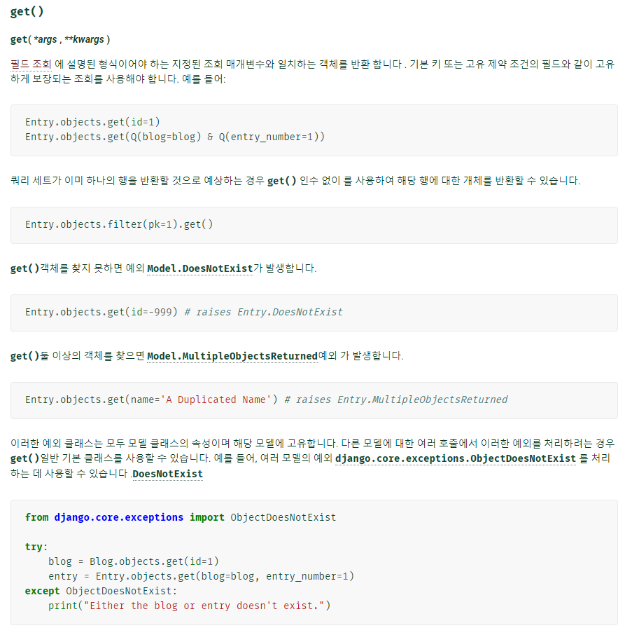
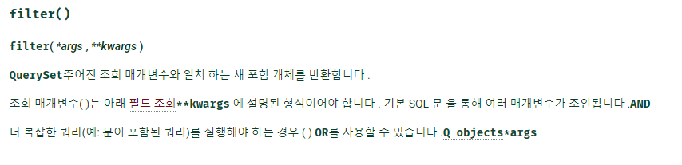
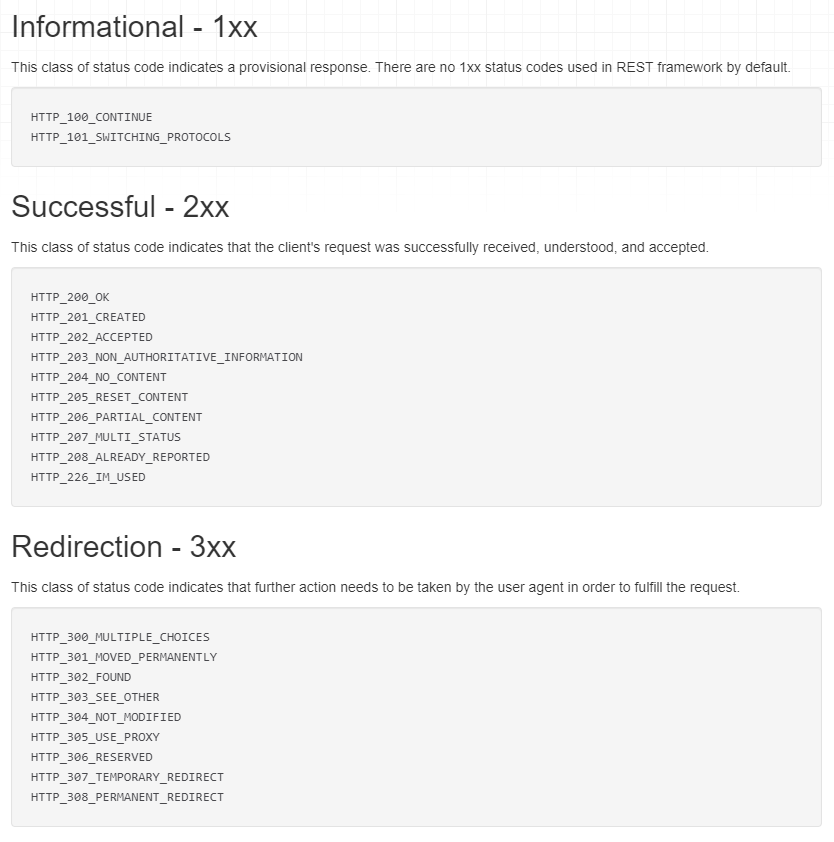
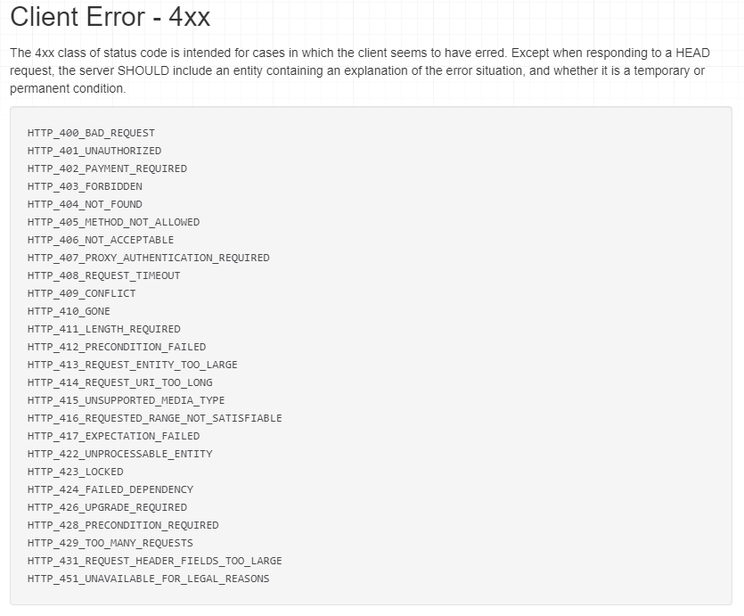
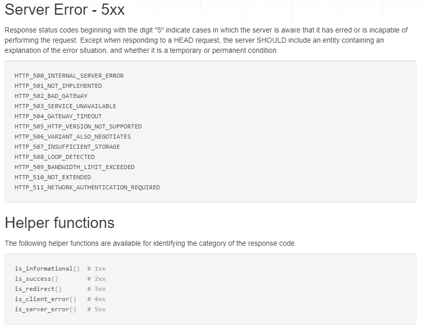

# Framework 마지막 정리


## 01. 시간설정

- LANGUAGE_CODE = 'ko-kr'
- TIME_ZONE = 'Asia/Seoul'


---


## 02. MTV ( 서술형 )

- Model : 데이터를 저장하는 장소

- Template : 뷰에서 받은 정보들을 클라이언트에게 보여주는 곳

- View : M, T의 요청을 받아서 동작하는 것


| MTV      | Model-Template-View                                         |                                                              |
| -------- | ----------------------------------------------------------- | ------------------------------------------------------------ |
| Model    | Data 저장                                                   | - 응용프로그램의 데이터 구조를 정의하고 데이터베이스의 기록을 관린(추가, 수정, 삭제) |
| Template | (유저가 보고 있는 것) 뷰에서 받은 것을 client에게 보여준다. | - 파일의 구조나 레이아웃을 정의 <br />- 실제 내용을 보여주는 데 사용 |
| View     | 내부적으로 어떤 모듈을 사용하지 않음                        | -   HTTP 요청을 수신하고 HTTP 응답을 반환 <br />- Model을 통해 요청을 충족시키는데 필요한 데이터에 접근 <br />- template에게 응답의 서식 설정을 맡김 |

➕ MVC ( Model, View, Controller ) -> 스프링에서 사용

➕ model - model / view - template / controller - view


---


## 03. urls.py

1.  app 내부에 urls.py를 불러오는 경우

```python
# crud/urls.py

from django.urls import path, include

urlpatterns = [
    path('admin/', admin.site.urls),
    path('articles/', include('articles.urls')),
]

----------------------------------------------------------------

# articles/urls.py
from django.urls import path
from . import views

app_name='articles'

urlpatterns = [
    path('', views.index, name='index'),
    path('new/', views.new, name='new'),
    path('create/', views.create, name='create'),
    path('<int:pk>/', views.detail, name='detail'),
    path('<int:pk>/delete/', views.delete, name='delete'),
    path('<int:pk>/edit/', views.edit, name='edit'),
    path('<int:pk>/update/', views.update, name='update'),
]

```

2. app안에 urls.py를 사용하지 않는 경우

```python
from django.urls import path
from pages import views

urlpatterns = [
    path('admin/', admin.site.urls),
    path('dinner/<str:menu>/<int:member_num>/', views.dinner)
]
```


---


## 04. startproject/ startapp

https://docs.djangoproject.com/ko/4.0/intro/tutorial01/

```bash
$ django-admin startproject mysite
```

```
mysite/
    manage.py
    mysite/
        __init__.py
        settings.py
        urls.py
        asgi.py
        wsgi.py
```


```bash
$ python manage.py startapp polls
```

```
polls/
    __init__.py
    admin.py
    apps.py
    migrations/
        __init__.py
    models.py
    tests.py
    views.py
```


💡 **app 에서 urls.py는 자동으로 생성이 되지 않는다. 따라서 형태를 직접 구현해줘야 한다.**

```python
# articles/urls.py
from django.urls import path
from . import views

app_name='articles'

urlpatterns = [
    path('', views.index, name='index'),
    path('new/', views.new, name='new'),
    path('create/', views.create, name='create'),
    path('<int:pk>/', views.detail, name='detail'),
    path('<int:pk>/delete/', views.delete, name='delete'),
    path('<int:pk>/edit/', views.edit, name='edit'),
    path('<int:pk>/update/', views.update, name='update'),
]

```


- ##### startproject 썼을 때 자동으로 생기는 건 뭘까?

  - 'django-admin startproject crud'하고 난 뒤

  - ##### 자동으로 생기는 건 -> crud/, manage.py

  - ##### 새로 만들어야 하는 건 -> urls, templates, base.html 등


- ##### startapp 썼었을 때 자동으로 생기는 건 뭘까?

  - 'python manage.py startapp articles' 하고 난 뒤

  - ##### 자동으로 생기는 건 -> `__init__.py` , admin.py, apps.py, models.py, tests.py, views.py

  - ##### 새로 만들어야 하는 건 -> urls.py, templates 등

  - python manage.py makemigrations 하면 migrations 생김


---


## 05. Django - Template 문법

```python
# for문

	<a href="">{{ movie.title }}</a>
	<p>{{ movie.score }}</p>



# if문

	<option selected="selected" value="romance">로맨스</option>
	<option value="horror">공포</option>
	<option value="comedy">코미디</option>

	<option value="romance">로맨스</option>
	<option selected="selected" value="horror">공포</option>
	<option value="comedy">코미디</option>

	<option value="romance">로맨스</option>
	<option value="horror">공포</option>
	<option selected="selected" value="comedy">코미디</option>



# extend - 무조건 제일 위에, 주석이 위에 있어도 에러가 남
 


```


- datetime

```
2022년 3월 19일 (Mon) AM/PM
#요일은 괄호 안에 , 시간은 영어로 표시됨
```


---


## 06. app 등록 > settings.py 에 있는 INSTALLED_APPS 수정하기

```python
# settings.py

INSTALLED_APPS = [
    'articles',
    'django_extensions',
    'django.contrib.admin',
    'django.contrib.auth',
    'django.contrib.contenttypes',
    'django.contrib.sessions',
    'django.contrib.messages',
    'django.contrib.staticfiles',
]
```


---


## 07. models.py

```python
# PJT05/movies/models.py

from django.db import models

class Movie(models.Model):
    title = models.CharField(max_length=20)
    audience = models.IntegerField()
    release_date = models.DateField()
    genre = models.CharField(max_length=30)
    score = models.FloatField()
    poster_url = models.TextField()
    description = models.TextField()

    def __str__(self):
        return self.title
```

```python
# CRUD/articles/admin.py

from django.db import models

class Article(models.Model):
    title = models.CharField(max_length=10)
    content = models.TextField()
    created_at = models.DateTimeField(auto_now_add=True)
    updated_at = models.DateTimeField(auto_now=True)

    def __str__(self):
        return self.title
```


- 라이브러리 불러오는 구문 외우기 : `from django.db import models`
- from줄 / class줄 / content에 어떻게 적는지 보기
- id, pk값을 가져오는 형식을 묻는 단답형 문제 예상

🗝 **id, pk 값은 지정하지 않아도, 자동으로 지정된다.**


---


## 08. get, filter 의 차이







🗝 **get()은 객체를 받아오는 메소드이고, filter()는 쿼리셋을 반환하는 메소드**

- **get** : 객체를 가져오는 것(하나)
  - 제목이 2개 있으면 오류가 남
- **filter** : 쿼리셋을 가져오는 것(전체, 여러개 있으면)
  - 제목이 2개 있으면 2개다 가져옴


---


## 09. ORM - Object Relation Mapping

- ORM : Object Relation Maping
  - 객체 지향 프로그래밍 언어를 사용하여 호환되지 않는 유형의 시스템 간에(Django - SQL) 데이터를 변환하는 프로그래밍 기술
- ORM 프레임워크 종류
  - MYSQL
  - SQLite
  - PostgreSQL
  - ORACLE
  - MS SQL...


---


## 10. Error

- `forbidden error` : **403 Error** - model의 값이 제대로 전달되지 않았다 
- **404 Error** : url 지정이 잘못 되었을 때 발생
- `Operation Error` : migrate를 잘못해서 ( 하지 않거나, 테이블이 잘못된 경우 )  >> 테이블을 고친다


```
- 200 번대 : 성공
  200 : 서버 요청 처리 성공
  201 : 작성, 서버가 요청 접수 후 새 리소스를 작성함.
  
- 300번대 : 요청을 마치기 위해 추가 조치가 필요
  301 : 영구 이동, 요청 페이지가 새 위치로 영구적으로 이동
  302 : 임시 이동, 페이지가 현재 다른 위치에서 요청을 응답하지만 요청자는 원래 위치를 계속 사용해야 함.
  
- 400번대 : 클라이언트 오류
  400 : 잘못된 요청
  401 : 권한없음
  403 : Forbidden, 필요한 권한을 가지고 있지 않음. 요청 거부
  404 : 서버에서 요청한 리소스를 찾을 수 없음.
  405 : 허용되지 않은 방법. (ex: post 방식 지원 뷰에 get요청 시)
  
- 500번대 : 서버 오류
  500 : 서버 내부 오류 발생
```









---


## 11. base.html > settings.py의 TEMPLATES에 추가

```python
# settings.py

TEMPLATES = [
    {
        'BACKEND': 'django.template.backends.django.DjangoTemplates',
        'DIRS': [BASE_DIR/'templates'],
        'APP_DIRS': True,
        'OPTIONS': {
            'context_processors': [
                'django.template.context_processors.debug',
                'django.template.context_processors.request',
                'django.contrib.auth.context_processors.auth',
                'django.contrib.messages.context_processors.messages',
            ],
        },
    },
]
```


---


## 12. 자동 생성 및 수정

- ##### auto_now_add : 데이터를 생성(추가)

  - created_at

- ##### auto_now : 데이터를 수정

  - updated_at

```python
# models.py

from django.db import models

class Article(models.Model):
    title = models.CharField(max_length=10)
    content = models.TextField()
    created_at = models.DateTimeField(auto_now_add=True)
    updated_at = models.DateTimeField(auto_now=True)
```


---


## 13. Migration

- python manage.py makemigrations(만들어 주기)
- python manage.py migrate(반영)
- python manage.py sqlmigrate articles(앱이름) 0001(테이블 넘버)


---


## 14. admin.py - 로켓페이지(templates 아무것도 수정안했을 때) 수정하는 것

- createsuperuser 하는 법

  - python manage.py createsuperuser
    - 닉네임 입력
    - 이메일 입력
    - 패스워드 입력(안 보임)
    - 패스워드 확인(안 보임)
    - 한 후 admin 페이지 가서 입력

  

```python
# PJT05/movies/admin.py

from django.contrib import admin
from .models import Movie

@admin.register(Movie)
class MovieAdmin(admin.ModelAdmin):
    list_display = ('title' , 'audience', 'release_date', 'genre', 'score', 'poster_url', 'description')
```

```python
# CRUD/articles/admin.py

from django.contrib import admin
from .models import Article

class ArticleAdmin(admin.ModelAdmin):
    list_display = ('pk', 'title', 'content', 'created_at', 'updated_at')
    
admin.site.register(Article)
```


---


## 15. 내림차순

```python
# way1
articles = Article.objects.order_by('-pk')

# way2
articles = Article.objects.all()[::-1]
```


---


## 16. get, all 타입

```python
# get() : 단일 행 반환
article = Article.objects.get(pk=1)

# all() : 쿼리셋반환
articles = article.objects.all()
```


---


## 17. 값들을 불러오는 방법(pk, title 등)

- request.get( ) : 하나의 객체만 불러올 때
- request.POST.get( ) : 불러오고 나서 수정해야 할 때

```python
# PJT05/movies/views.py

from django.shortcuts import redirect, render
from .models import Movie


def index(request):
    movies = Movie.objects.order_by('-pk')
    context = {
        'movies' : movies,
    }
    return render(request, 'movies/index.html', context)


def new(request):
    genres = ['로맨스', '공포', '코미디']
    context = {
        'genres' : genres,
    }
    return render(request, 'movies/new.html', context)


def create(request):
    title = request.POST.get('title')
    audience = request.POST.get('audience')
    release_date = request.POST.get('release_date')
    genre = request.POST.get('genre')
    score = request.POST.get('score')
    poster_url = request.POST.get('poster_url')
    description = request.POST.get('description')

    movie = Movie(
        title = title,
        audience = audience,
        release_date = release_date,
        genre = genre,
        score = score,
        poster_url = poster_url,
        description = description,
    )
    movie.save()

    return redirect('movies:detail', movie.pk)


def detail(request, pk):
    movie = Movie.objects.get(pk=pk)
    context = {
        'movie' : movie,
    }
    return render(request, 'movies/detail.html', context)


def edit(request, pk):
    movie = Movie.objects.get(pk=pk)
    genres = ['로맨스', '공포', '코미디']
    context = {
        'movie' : movie,
        'genres' : genres,
    }
    return render(request, 'movies/edit.html', context)


def update(request, pk):
    movie = Movie.objects.get(pk=pk)
    movie.title = request.POST.get('title')
    movie.save()
    return redirect('movies:detail', movie.pk)


def delete(request, pk):
    movie = Movie.objects.get(pk=pk)
    movie.delete()
    return redirect('movies:index')
    # POST
    # if request.method == 'POST':
    #     movie.delete()
    #     return redirect('movies:index')
    # else: # GET
    #     return redirect('movies:detail', movie.pk)
```


### 18. render와 redirect의 차이

- render는 페이지를 전환하는 것
- redirect는 데이터를 전달하는 것