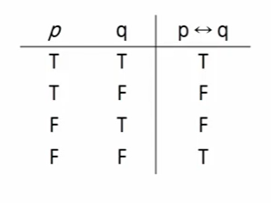
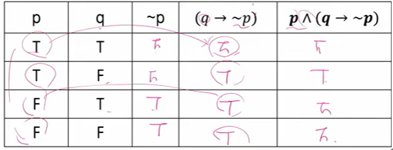
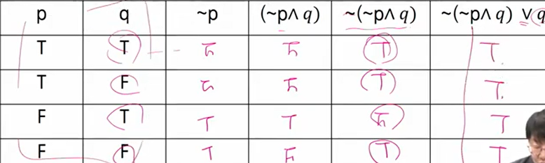
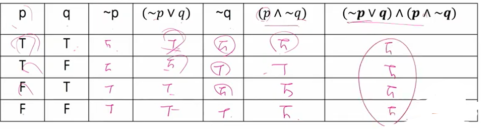
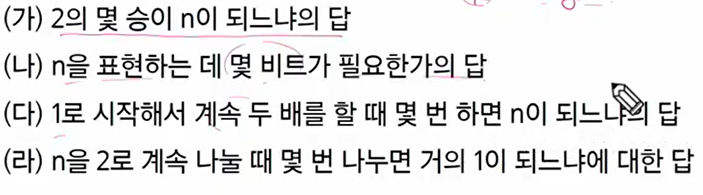
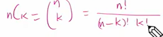
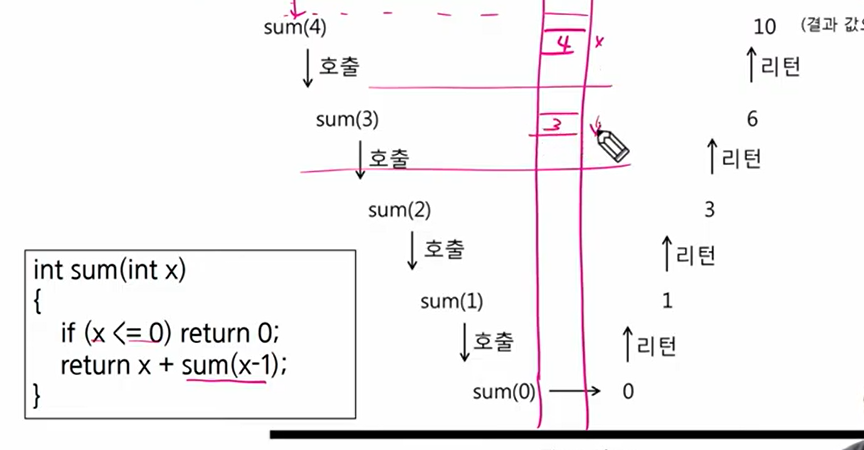

# computaional thinking

## 프로그래밍과 논리 /수학

* inclusive or: 합격하기 위해서는 토플 500점 이상 혹은 토익 600점 이상 필요
* exclusive or: 합격하면 천만원 혹은 자동차를 줌

* 일상생활에서는 soft logic이 빠르기 떄문에 유용
* 프로그래밍은 hard logic을 사용

* 명제 : 참이나 거짓을 알 수 있는 식이나 문장
  * p, q, r로 표현
* 진릿값: 참이나 거짓을 표현
  * True, False
* 연산
  * 부정 not
    * ~p
  * 논리곱 and
    * p ^ q
    * 둘다 참일 때만 p^q가 참
    * 하나라도 false이면 false
  * 논리합 or
    * p V q
    * 모두 거짓일 때만 거짓
    * 하나만 true라고 true
  * 배타적 논리합 XOR
    * 두개 논리가 다르면 FALSE
    * 두개 논리가 같으면 true
* 조건 명제
  : p,q가 명제일 때, 명제 p가 조건, q가 결론으로 제시되는 명제 

​         p -> q(p이면 q이다)

* 쌍방 조건 명제
  : p,q 가 명제일 때, 명제 p와 q가 모두 조건이면서 결론인 명제

  p <-> q

* 조건 명제의 역, 이, 대우
  * 역: q -> p
  * 이: ~p -> ~q
  * 대우: ~q -> ~p

## 논리 연습

1. 만약 0이 홀수라면, 미국에서 2080년 월드컵이 열린다.

   : 0이 홀수 라면 = false -> 따라서 전체 문장은 true

2. p- >q 가 거짓이라고 하자. 다음 명제식의 창 거짓은?

   `따라서 p는 true고 q는 false`

   1. ~p -> q `f-> f 는 true`
   2. p V q `t V f는 TRUE`
   3. q -> p `f -> t는 true`

3. 명제식의 진리표 만들기

   1. p^ (q-> ~p)

      

## 수학적 귀납법

수학적 귀납법의 기본형: p(1)이 참이고, p(n) -> p(n+1)이 참이면 p(n)은 모든 자연수 n에 대해서 참이다

## 명제

### 항진명제

~(~p^q) V q 가 항진명제라는 것을 보이시오

### 모순명제

(~p V q ) ^ (p ^ ~q)

## 수와 표현

x = log(n) 과 2^x =n 은 같은 식

log(n)이란

x가 더 작고, n이 커질수록 엄청나게 달라진다

100자리로 표현할 수 있는 10진수 값은 읽을 수도 없을 정도로 큰 값이다

컴퓨터 분야에서 로그의 밑은 항상 2

 ## 집합과 조합론

### 집합

a가 b의 부분집합이고, b가 a의 부분집합이면 집합 a와 b는 같다

### 조합론

경우의 수를 따지는 문제들을 보통 말한다

귀류법: 현명제가 참인 것을 증명

명제의 부정을 참이라 가정 -> 모순을 증명해서 원래의 명제가 참임을 보임

## 기초 수식

시간 복잡도 구하기

밑에!

## 재귀

수학적 귀납법 증명 사용 가능

피보나치 수열 시간 복잡도 구하는 방법

## 동적 프로그래밍

재귀함수에서 동일한 입력의 함수호출이 반복적으로 일어날 때 그 결과값을 저장해두고 불러 쓰는것 - memoization

최초 입력에서 파생되는 모든 가능한 입력에 대한 답을 모두 저장할 수 있는 메모리가 있어야함

