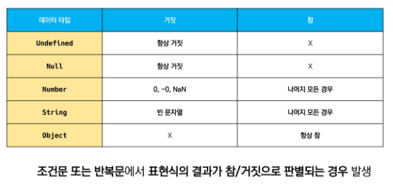

# javascript

## intro

javascript의 필요성

브라우저 화면을 '동적'으로 만들기 위함

브라우저를 조작할 수 있는 유일한 언어


## 브라우저(browser)

* DOM 조작
  * 문서(HTML) 조작
  * 문서가 객체로 구조화되어있으며 key로 접근 가능
  * 문서를 프로그램으로 조작할 수 있다!
  * 
  * DOM 해석
    * 파싱: 구문분석, 해석
    * 브라우저가 문자열을 해석하여 DOM TREE로 만드는 과정
* BOM 조작
  * navigator, screen, location, frames, history, XHR
  * 자바스크립트가 브라우저와 소통하기 위한 모델
  * 버튼, URL 입력창, 타이틀 바 등 브라우저 윈도우 및 웹 페이지 일부분을 제어 가능
* JavaScript Core(ECMA Script)
  * 브라우저를 조작하기 위한 명령어 약속(언어)
  * data structure(object, array), conditional expression, iteration


자바스크립트는 세미콜론을 선택적으로 사용 가능

세미콜론이 없으면 ASI에 의해 자동으로 세미콜론이 삽입됨


코딩 스타일 가이드

[자바스크립트 코딩 스타일 가이드](https://github.com/airbnb/javascript)


## 변수 

식별자는 변수를 구분할 수 있는 변수명

* 카멜 케이스(camelCase) - 변수, 객체, 함수에 사용
  * 두번째 단어의 첫글자부터 대문자
* 파스칼 케이스(PascalCase) - 클래스, 생성자에 사용
  * 모든 단어 첫번쨰 글자 대문자
* 대문자 스네이크 케이스(SNAKE_CASE) - 상수에 사용
  * 모든 글자 대문자 작성


식별자는 반드시 문자, 달러 또는 밑줄로 시작

대소문자를 구분하며, 클래스명 외에 모두 소문자로 시작

예약어 사용 불가능(for, if, function)


변수 선언 키워드

* let
  * **재할당 할** 예정인 변수 선언시 사용
  * 변수 재선언 불가능
  * 블록 스코프

```javascript
let foo // 선언
console.log(foo)

foo = 1 // 할당
console.log(foo)

let bar = 0 // 선언+ 할당
console.log(bar)
```

```javascript
let number = 10
number = 10
console.log(number) // 가능
```

```javascript
let number = 10
let number = 50 // 불가능
```


* const
  * **재할당 할 예정이 없는** 변수 선언시 사용
  * 변수 재선언 불가능
  * 블록스코프

```javascript
const number = 10
number = 10 // 불가능
```

```javascript
const number = 10
const number = 50 // 불가능
```


블록 스코프 

if, for, 함수 등의 중괄호 내부를 가리킴

블로 스코프를 가진 변수는 블록 바깥에서 접근 불가능

```javascript
let x= 1
if (x===1) {
    let x = 2
    console.log(x) //2
}
console.log(x) //1
```


변수 선언 키워드 var

구버전 자바스크립트는 var로 변수를 선언함

문제(hoisting 등)들이 계속해서 나와서 이제는 쓰지않고 지양함


## 데이터 타입

원시 타입/ 참조 타입으로 분류됨


원시타입

* 객체가 아닌 기본 타입
* 변수에 해당 타입의 값이 담김
* 다른 변수에 복사할 때 실제 값이 복사됨

1. 숫자(number)타입

   : 정수, 실수 구분 없는 하나의 숫자 타입, 부동소수점 형식을 따름

     NaN(계산 불가능한 경우 반환되는 값

2. 문자열(string)

   : ${expression}  형태로 표현식 삽입 가능

   따옴표 대신 ``으로 표현

3. undefined(값이 없긴 한데 개발자 의도 없어)

   변수의 값이 없음을 나타내는 데이터 타입, 변수 선언 이후 직접 값을 할당하지 않으면, 자동으로 undefined가 할당됨

4. null(변수의 값이 없는데 의도적으로 표현할 때)

   ```javascript
   lef firstName = null
   console.log(firstName) // null
   typeof null // object
   ```

5. boolean타입

   true, false 표현

   toBoolean Conversions 자동 형변환




참조타입

* 객체 태입의 자료형
* 변수에 해당 객체의 참조 값이 담김
* 다른 변수에 복사할 때 참조 값이 복사됨

1. 함수
2. 배열
3. 객체


## 연산자

1. 할당연산자

   ```javascript
   let x= 0
   x += 10
   console.log(x) //10
   
   x++  // += 연산자와 동일
   console.log(x) //11
   
   x--  // -= 연산자와 동일
   console.log(x) // 10
   ```

   

2. 비교 연산자

   문자열은 유니코드 값을 사용하며 표준 사전 순서를 기반으로 비교

   ```javascript
   const numOne = 1
   const numTwo = 10
   console.log(numOne < numTwo) // true
   
   const charOne = 'a'
   const charTwo = 'z'
   console.log(charOne > charTwo) // false
   ```

3. 동등 비교 연산자(==)

   두 피연산자가 같은 값으로 평가되는지 비교 후 boolean 값 반환

   비교할 때 암묵적 타입 변환을 통해 타입을 일치시킨 후 같은 값인지 비교

   두 피연산자가 모두 객체일 경우 메모리의 같은 객체를 바라보는지 판별

   ```javascript
   const a = 1004
   const b = '1004'
   console.log(a==b) //true 

4. 일치 비교 연산자(===)

   두 피연산자가 같은 값으로 평가되는지 비교 후 boolean 값 반환

   엄격한 비교가 이뤄지며 암묵적 타입 변환이 발생하지 않음

   두 피연산자가 모두 객체일 경우 메모리의 같은 객체를 바라보는지 판별

   ```javascript
   const a = 1004
   const b = '1004'
   console.log(a === b) // false
   ```
   
5. 논리 연산자

   and: $$

   or: ||

   not: !

6. 삼항연산자

   세 개의 피연산자를 사용하여 조건에 따라 값을 반환하는 연산자

   가장 왼쪽의 조건식이 참이면 콜론 앞의 값을 사용하고 그렇지 않으면 콜론 뒤의 값을 사용

   ```javascript
   console.log(true ? 1 : 2) //1
   console.log(false ? 1: 2) //2
   
   const result = Math.PI > 4 ? 'Yes' : 'No'
   console.log(result) // NO
   ```

   

   

## 조건/반복

if: 조건 표현식의 결과값을 boolean 타입으로 변환 후 참 / 거짓을 판단

```javascript
if (condition) {
    // do something
} else if (condition) {
    // do something
} else {
    // do something
}

const nation = 'Korea'

if (nation === 'Korea') {
    console.log('안녕하세요!')
} else if (nation === 'France') {
    console.log('Bonjour!')
} else {
    console.log('Hello!')
}
```

switch : 조건 표현식의 결과값이 어느 값에 해당하는지 판별

```javascript
switch(expression) {
    case 'first value':{
        // do something
        [break]
    }
    case 'second value':{
        // do something
        [break]
    }
    [default: {
         // do something
    }]
}

const nation = 'Korea'
switch(nation) {
    case 'Korea':{
        console.log('안녕하세요!')
        break
    }
    case 'France':{
        console.log('Bonjour!')
        break
    }
    default: {
         console.log('Hello!')
    }
}
```


반복문

while

```javascript
let i = 0
while (i<6) {
    console.log(i) // 0, 1, 2, 3, 4, 5
    i +=1
}
// while 문에서 break 문은 선택적으로 작성 가능
```


for

```javascript
for (initialization; condition; expression) {
    //do something
}
// initialization: 최초 반복문 진입 시 1회만 실행되는 부분
// condition: 매 반복 시행 전 평가되는 부분
// expression: 매 반복 시행 이후 평가되는 부분


for (let i = 0; i<6; i++) {
    console.log(i) // 0, 1, 2, 3, 4, 5
}
```


for .. in: 주로 객체(딕셔너리)의 속성(KEY)들을 순회할 때 사용

반복 가능한 객체 순회 뿐만 아니라 객체 순회에도 사용가능, 객체의 속성값 순회에 더유용!

```javascript
for (variable in object) {
    // do something
}

const capitals = {
    korea: 'seoul',
    france: 'paris',
    USA: '워싱텅 디씨'
}
for (let capital in capitals) {
    console.log(capital) // korea, france, USA
}

딕셔너리는 for of 불가능
```


for .. of: 반복 가능한 객체를 순회하며 값을 꺼낼 때 사용

객체 순회에 사용할 수 없으며, 객체의 속성값 순회에 유용한 구문은 for in!

```javascript
for (variable of iterables){
    //do something
}

const fruits = ['딸기','바나나','메론']
for (let fruit of fruits) {
    fruit = fruit + '!'
    console.log(fruit)
}

for (const fruit of fruits) {
    // 재할당 불가능
    console.log(fruit + '!')
}

이때 for of말고 for in을 사용하면 인덱스가 나옴
```


