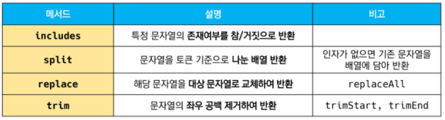
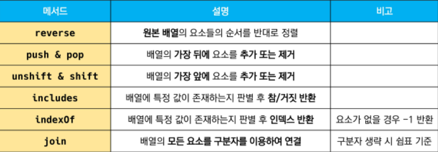
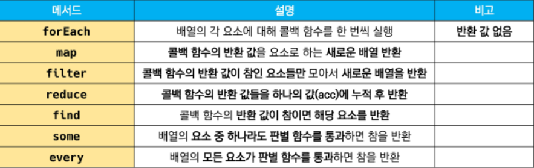

## 함수

javascript의 함수는 일급객체에 해당

```
일급객체
변수에 할당가능/ 함수의 매개변수로 전달 가능/ 함수의 반환 값으로 사용 가능
```


함수를 정의하는 방법 : 함수 선언식/ 함수 표현식

1. 함수 선언식

   데이터 타입, 함수 구성 요소(공통점)

   익명 함수 불가능, 호이스팅 O (차이점)

```javascript
function name(args) { // 1. 함수의 이름(name)  2. 매개변수(args)
    // do something   // 3. 몸통
}
```

2. 함수 표현식 ★

   데이터 타입, 함수 구성 요소(공통점)

   익명 함수 가능, 호이스팅 X (차이점) - 에어비엔비 스타일 가이드 권장 방식

```javascript
const name = function (args) { // 1. 함수의 이름(생략가능) - 익명함수 2. 매개변수 (args)
    // do something            // 3. 몸통
}
```


매개변수와 인자의 개수 불일치 허용

1. 매개변수보다 인자의 개수가 많을 경우

   ```javascript
   const noArgs = function () {
       return 0
   }
   noArgs(1, 2, 3) // 0
   
   const twoArgs = function (arg1, arg2) {
       return [arg1, arg2]
   }
   twoArgs(1, 2, 3) // [1, 2]
   ```

2. 매개변수보다 인자의 개수가 적을 경우

   ```javascript
   const threeArgs = function (arg1, arg2, arg3) {
       return [arg1, arg2, arg3]
   }
   threeArgs()     // [undefined, undefined, undefined]
   threeArgs(1)    // [1, undefined, undefined]
   threeArgs(1, 2) // [1, 2, undefined]
   ```


rest operator - 함수가 정해지지 않은 수의 매개변수를 배열로 받음 (python의 *args와 유사)

```javascript
const restOpr = function (arg1, arg2, ...restArgs) {
    return [arg1, arg2, restArgs]
}
restOpr(1, 2, 3, 4, 5) // [1, 2, [3, 4, 5]]
restOpr(1, 2) // [1, 2, []]
// rest operator로 처리한 매개변수에 인자가 넘어오지 않을 경우에는 빈 배열로 처리
```


spread operator - 배열인자를 전개하여 전달 가능

```javascript
const spreadOpr = function (arg1, arg2, arg3) {
    return arg1 + arg2 + arg3
}

const numbers = [1, 2, 3]
spreadOpr(...numbers) //6
```


## arrow function

화살표 함수

항상 익명

함수를 비교적 간결하게 정의

function 키워드 생략 가능

함수의 매개변수가 단 한개 일 때 ()생략 가능

함수 몸통이 표현식 하나라면 {}과 return 생략가능

```javascript
const arrow1 = function (name) {
    return 'hello, ${name}'
}

const arrow2 = (name) => { return 'hello, ${name}'}

const arrow3 = name => {return 'hello, ${name}'}

const arrow4 = name => 'hello, ${name}'

const pow = x => x*x;
console.log(pow(10)) // 100

const arr = [1, 2, 3]
const pow = arr.map(x => x*x)
console.log(pow) [1, 4, 9]
```


## 문자열




1. includes

   ```javascript
   const str = 'a santa at nasa'
   
   str.includes('santa') // true
   str.includes('asan') // false
   ```


2. split

   ```javascript
   const str = 'a cup'
   str.split()    // ['a cup']
   str.split('')  // ['a', ' ', 'c', 'u', 'p']
   str.split(' ') // ['a','cup']
   ```


3. replace

   ```javascript
   const str = 'a b c d'
   str.replace(' ', '-') // 'a-b c d'    1개만 변환
   str.replaceAll(' ', '-') // 'a-b-c-d' 전부 변환
   ```


4. trim

   공백문자(스페이스, 엔터, 탭 등)제거한 문자열 반환

   ```javascript
   const str = '        hello         '
   str.trim() // 'hello'
   str.trimStart() // 'hello         '
   str.trimEnd()   // '        hello'
   ```

   

## 배열

키와 속성들을 담고 있는 참조 타입의 객체 

순서를 보장한다는 특징

주로 대괄호 이용하여 생성, 0을 포함한 양의 정수 인덱스로 특정 값에 접근 가능

배열의 길이는 array.length 형태로 접근 가능(마지막 원소는 array.length -1)

```javascript
const numbers = [1, 2, 3, 4, 5]
console.log(numbers[0])  //1
console.log(numbers[-1]) // undefined
console.log(numbers.length)  // 5

console.log(numbers[numbers.length -1 ]) // 5
console.log(numbers[numbers.length -2 ]) // 4
```


주요 메서드




1. reverse

   ```javascript
   const numbers = [1, 2, 3, 4, 5]
   numbers.reverse()
   console.log(numbers) // [5, 4, 3, 2, 1]
   ```

2. push & pop

   ```javascript
   const numbers = [1, 2, 3, 4, 5]
   numbers.push(100)
   console.log(numbers) // [1, 2, 3, 4, 5, 100]
   
   numbers.pop()
   console.log(numbers) // [1, 2, 3, 4, 5]
   ```

3. unshift&shift

   ```javascript
   const numbers = [1, 2, 3, 4, 5]
   numbers.unshift(100)
   console.log(numbers) // [100, 1, 2, 3, 4, 5]
   
   numbers.shift()
   console.log(numbers) // [1, 2, 3, 4, 5]
   ```

4. includes

   ```javascript
   const numbers = [1, 2, 3, 4, 5]
   console.log(numbers.includes(1)) // true
   console.log(numbers.includes(100)) // false
   ```

5. indexof

   ```javascript
   const numbers = [1, 2, 3, 4, 5]
   let result
   
   result = numbers.indexOf(3) // 2
   console.log(result)
   
   result = numbers.indexOf(100) // -1
   console.log(result) // 값이 없을 경우 -1반환
   ```

6. join

   ```javascript
   const numbers = [1, 2, 3, 4, 5]
   let result
   
   result = numbers.join()     // 1, 2, 3, 4, 5
   console.log(result)
   
   result = numbers.join('')   // 12345
   console.log(result)
   
   result = numbers.join(' ')  // 1 2 3 4 5 
   console.log(result)
   
   result = numbers.join('-')  // 1-2-3-4-5
   console.log(result)
   ```

```javascript
let vegetables = ['양배추', '순무', '무', '당근']
console.log(vegetables)
// ["양배추", "순무", "무", "당근"]

let pos = 1
let n = 2

let removedItems = vegetables.splice(pos, n)
// 배열에서 항목을 제거하는 방법
// pos 인덱스부터 n개의 항목을 제거함

console.log(vegetables)
// ["양배추", "당근"] (원 배열 vegetables의 값이 변함)

console.log(removedItems)
// ["순무", "무"]
```


spread operator

```javascript
const array = [1, 2, 3]
const newArray = [0, ...array, 4]

console.log(newArray) // [0, 1, 2, 3, 4]
```


심화 메소드



배열을 순회하며 특정 로직을 수행하는 메소드

메소드 호출시 인자로 callback 함수를 받는 것이 특징

(call back - 어떤 함수의 내부에서 실행될 목적으로 인자로 넘겨받는 함수를 말함)

1. forEach

   배열의 각 요소에 대해 콜백 함수를 한번씩 실행

   반환값이 없는 메서드

   ```javascript
   array.forEach((element, index, array) => {
       // do something
   }) 
   
   const fruits = ['딸기', '수박', '사과', '체리']
   
   fruits.forEach((fruit, index) => {
       console.log(fruit, index)
   // 딸기 0
   // 수박 1
   // 사과 2
   // 체리 3
   }) 
   
   fruits.forEach (fruit => {
       console.log(fruit)
   })
   // 딸기
   // 수박
   // 사과
   // 체리
   ```

2. map

   콜백 함수의 반환 값을 요소로 하는 새로운 배열 반환

   ```javascript
   array.map((element, index, array) => {
       // do something
   }) 
   
   const numbers = [1, 2, 3, 4, 5]
   
   const doubleNums = numbers.map((num) => {
       return num *2
   })
   console.log(doubleNums) // [2, 4, 6, 8, 10]
   ```

3. filter

   콜백 함수의 반환 값이 참인 요소들만 모아서 새로운 배열을 반환

   ```javascript
   array.filter((element, index, array) => {
       // do something
   })
   
   const numbers = [1, 2, 3, 4, 5]
   
   const oddNums = numbers.filter((num, index) => {
       return num % 2
   })
   console.log(oddNums) // 1, 3, 5
   ```

4. reduce

   배열의 각 요소에 대해 콜백 함수를 한번 씩 실행

   콜백 함수의 반환 값들을 하나의 값(acc)에 누적후 반환

   acc: 이전 callback 함수의 반환값이 누적되는 변수
   
   initialValue : 최초 callback 함수 호출 시 acc에 할당되는 값, default 값은 배열의 첫번째값

   ```javascript
   array.reduce((acc, element, index, array) => {
       // do something
   }, initialValue)
   
   const numbers = [1, 2, 3]
   const result = numbers.reduce((acc, num) => {
       return acc +num
   },0)
   console.log(result) //6
   ```
   
5. find

   콜백함수의 반환 값이 참이면, 조건을 만족하는 첫번째 요소를 반환

   찾는 값이 배열에 없으면 undefined 반환

   ```javascript
   array.find((element, index, array)) {
       // do something
   }
   
   const avengers = [
       { name: 'Tony Stark', age: 45},
       { name: 'Steve Rogers', age: 32},
       { name: 'Thor', age: 40},
   ]
   
   const result = avengers.find((avenger) => {
       return avenger.name === 'Tony Stark'
   })
   console.log(result) // { name: 'Tony Stark', age: 45}
   ```

6. some

   배열의 요소 중 하나라도 주어진 판별 함수를 통과하면 참을 반환

   빈 배열은 항상 거짓 반환

   ```javascript
   array.some((element, index, array)) {
       // do something
   }
   
   const numbers = [1, 3, 5, 7, 9]
   const hasEvenNumber = numbers.some((num) => {
       return num % 2 === 0
   })
   console.log(hasEvenNumber) //false
   
   const numbers = [1, 3, 5, 7, 9]
   const hasOddNumber = numbers.some((num) => {
       return num % 2 === 0
   })
   console.log(hasOddNumber) //true
   ```

7. every

   배열의 모든 요소가 주어진 판별 함수를 통과하면 참을 반환

   빈 배열을 항상 참 반환

   ```javascript
   array.every((element, index, array)) {
       // do something
   }
   
   const numbers = [2, 4, 6, 8, 10]
   const isEveryNumberEven = numbers.every((num) => {
       return num % 2 === 0
   })
   console.log(isEveryNumberEven) //true
   ```

   

배열 순회 방법

1. for loop

   모든 브라우저 환경에서 지원

   인덱스를 활용하여 배열의 요소에 접근 가능

   break, continue 사용 가능

   ```javascript
   const chars = ['A', 'B', 'C', 'D']
   for (let idx = 0; idx < chars.length; idx ++ ) {
       console.log(idx, chars[idx])
   }
   ```

2. for of

   일부 오래된 브라우저 환경에서 지원 x

   인덱스 없이 배열의 요소에 바로 접근 가능

   break, continue 사용가능

   ```javascript
   const chars = ['A', 'B', 'C', 'D']
   for (const char of chars) {
       console.log(char)
   }
   ```

3. for each ★

   대부분의 브라우저 환경에서 지원

   break, continue 사용 불가능

   ```javascript
   chars.forEach((char, idx) => {
       console.log(idx, char)
   })
   
   chars.forEach(char => {
       console.log(char)
   })
   ```

   

## 객체

객체는 중괄호 내부에 key와 value의 쌍으로 표현

key는 문자열 타입만 가능

value는 모든 타입 가능

객체 요소 접근은 점 또는 대괄호로 가능


```javascript
const me = {
    name: 'jack',
    phoneNumber : '01012345678',
    'samsung products': {
        buds : 'galaxy buds pro',
        galaxy : 'galaxy s20',
    },
}

console.log(me.name)
console.log(me.phoneNumber)
console.log(me['samsung products'])
console.log(me['samsung products'].buds)
```

____

```javascript
const me = {
    firstName: 'John',
    lastName: 'Doe',

    fullName: this.firstName + this.lastName,

    getFullName: function () {
        return this.firstName + this.lastName
    }
}
me.getFullName()
// 'JohnDoe'
```

함수 메소드니까 ()필요함!!!!!!!!1

____


```javascript
const person = {
  name: ['Bob', 'Smith'],
  age: 32,
  gender: 'male',
  interests: ['music', 'skiing'],
  bio: function() {
    alert(this.name[0] + ' ' + this.name[1] + ' is ' + this.age + ' years old. He likes ' + this.interests[0] + ' and ' + this.interests[1] + '.');
  },
  greeting: function() {
    alert('Hi! I\'m ' + this.name[0] + '.');
  }
};
```

```javascript
person.bio()
person.greeting()
```

메소드는 객체의 속성이 참조하는 함수

객체.메소드명() 으로 호출 가능

메소드 내부에서는 this 키워드가 객체를 의미함.


객체 관련 ES6 문법

새로 도입된 문법들로 객체 생성 및 조작에 유용하게 사용 가능

1. 속성명 축약

   : 객체를 정의할 때 key와 할당하는 변수의 이름이 같으면 축약 가능

   ```javascript
   const books = ['Learning JS', 'Learning Python']
   const magazines = ['Vogue', 'Science']
   const bookShop = {
       books,
       magazines,
   }
   console.log(bookShop)
   
   /* const bookShop = {
       books: ['Learning JS', 'Learning Python'],
       magazines: ['Vogue', 'Science'],
   } */
   ```

2. 메서드명 축약

   : 메서드 선언시 function 키워드 생략 가능

   ```javascript
   const obj = {
       greeting() {
           console.log('Hi!')
       }
   }
   obj.greeting()
   
   /*greeting: function () {
           console.log('Hi!')
           }*/
   ```

3. 계산된 속성명 사용하기

   : 객체를 정의할 때 key의 이름을 표현식을 이용하여 동적으로 생성 가능

   ```javascript
   const key = 'regions'
   const value = ['광주', '대전', '구미', '서울']
   
   const ssafy = {
       [key]: value,
   }
   console.log(ssafy) // {regions: Array(4)}
   console.log(ssafy.regions) // ['광주', '대전', '구미', '서울']
   ```

4. 구조 분해할당

   : 배열 또는 객체를 분해하여 속성을 변수에 쉽게 할당할 수 있는 문법

   ```javascript
   const userInformation = {
       name: 'ssafy kim',
       userId: 'ssafyStudent1234',
       phoneNumber: '010-1234-1234',
       email: 'ssafy@ssafy.com'
   }
   
   const {name} = userInformation
   name // 'ssafy kim'
   console.log(name) // ssafy kim
   {name} //  {name: 'ssafy kim'}
   const {name, userId} = userInformation
   userId // 'ssafyStudent1234'
   ```

5. 객체 전개 구문

   : spread operator(...)를 사용하면 객체 내부에서 객체 전개 가능

   ```javascript
   const obj = {b:2, c:3, d:4}
   const newObj = {a:1, ...obj, e:5}
   
   console.log(newObj) // {a:1, b:2, c:3, d:4, e:5}
   ```


JSON

: 자바스크립트의 객체와 유사하게 생겼으나 실제로는 문자열 타입

따라서 JS의 객체로써 조작하기 위해서는 구문분석이 필수

JSON을 조작하기 위한 두가지 내장 메서드 제공


1. JSON.parse()

   : JSON => 자바스크립트 객체

   ```javascript
   const jsonData = JSON.stringify({
       coffee: 'Americano',
       iceCream: 'Cookie and cream',
   })
   const parsedData = JSON.parse(jsonData)
   console.log(parsedData) // {coffee: 'Americano', iceCream: 'Cookie and cream'}
   console.log(typeof parsedData) // object
   ```

   

2. JSON.stringify()

   : 자바스크립트 객체 => JSON

   ```javascript
   const jsonData = JSON.stringify({
       coffee: 'Americano',
       iceCream: 'Cookie and cream',
   })
   console.log(jsonData) // {"coffee":"Americano","iceCream":"Cookie and cream"}
   console.log(typeof jsonData) // string
   ```

   

## this

JS의 this는 실행 문맥에 따라 다른 대상을 가르킴

```javascript
function getFullName() {
    return this.firstName + this.lastName
}

const me = {
    firstName: 'John',
    lastName: 'Doe',
    getFullName: getFullName,
}
const you = {
    firstName: 'Jack',
    lastName: 'Lee',
    getFullName: getFullName,
}
me.getFullName() // JohnDoe  (this === me)
you.getFullName() // JackLee  (this === you)
getFullName() // NaN (this === window)
```


function 키워드와 화살표 함수는 함수 내부에 this 키워드가 존재하지 않을 경우에는 완전히 동일하게 동작

함수 내부에 this 키워드가 존재할 경우에는 다르게 동작

function 키워드 같은 경우에 this를 사용한다면 .bind(this)를 적어야함

```javascript
const obj = {
    PI: 3.14, 
    radiuses: [1, 2, 3, 4, 5],
    printArea : function () {
        this.radiuses.forEach(function (r) {
            console.log(this.PI * r* r)
        }.bind(this))
    },
}

//화살표 함수
const obj = {
    PI: 3.14, 
    radiuses: [1, 2, 3, 4, 5],
    printArea : function () {
        this.radiuses.forEach((r) => {
            console.log(this.PI * r* r)
        })
    },
}
```


## lodash

모듈성, 성능 및 추가 기능을 제공하는 JavaScript 유틸리티 라이브러리

array, object 등 자료구조를 다룰 때 사용하는 유용하고 간편한 유틸리니 함수들을 제공

ex) reverse, sortBy, range, random, cloneDeep


```html
<body>
  <script src = "https://cdn.jsdelivr.net/npm/lodash@4.17.21/lodash.min.js"></script>
  <script>
  
    _.sample([1, 2, 3, 4]) // 3 (random 1 element)
    _.sampleSize([1, 2, 3, 4], 2) // [2, 3] (random 2 element)
    _.reverse([1, 2, 3, 4]) // [4, 3, 2, 1]
    _.range(5) // [0, 1, 2, 3, 4]
    _.range(1, 5) // [1, 2, 3, 4]
    _.range(1, 5, 2) // [1, 3]
    
  </script>
</body>
```


얕은 복사, 깊은 복사

```html
<script src = "https://cdn.jsdelivr.net/npm/lodash@4.17.21/lodash.min.js"></script>

<script>
  const original = {a: {b:1}}
  const ref = original
  const copy = _.cloneDeep(original)
  
  console.log(original.a.b, ref.a.b, copy.a.b) // 1, 1, 1
  ref.a.b = 10
  console.log(original.a.b, ref.a.b, copy.a.b) // 10, 10, 1
  // ref는 참조한는게 같아서 얕은 복사가 일어남
  copy.a.b = 100
  console.log(original.a.b, ref.a.b, copy.a.b) // 10, 10, 100
</script>
```

