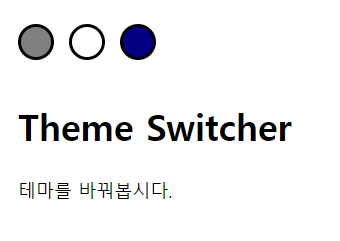
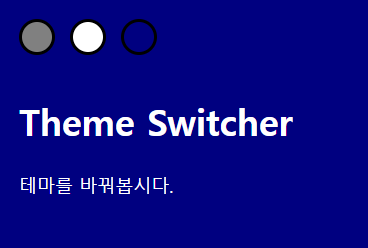
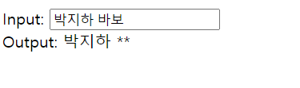
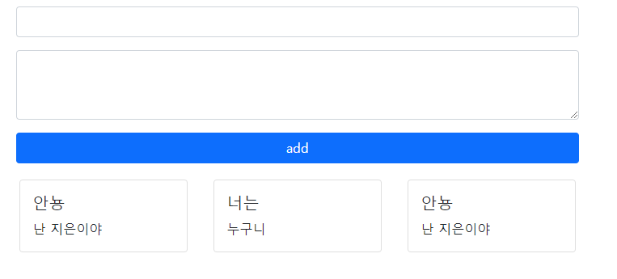
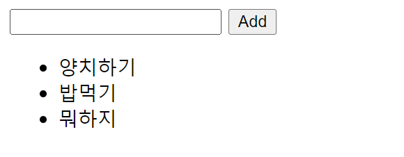

# 0428 workshop

1. 클릭하면 그 색깔대로 테마 변경





```html
<head>
  <title>Document</title>
  <link rel="stylesheet" href="./workshop01.css">
</head>

<body>
  <ul class="switcher">
    <li id="grayButton"></li>
    <li id="whiteButton"></li>
    <li id="navyButton"></li>
  </ul>
  <h1>Theme Switcher</h1>
  <p>테마를 바꿔봅시다.</p>
```

```javascript
<script>

//1. li#grayButton 클릭시 background-color는 gray, color는 white로 변경 
const graybutton = document.querySelector('#grayButton')
graybutton.addEventListener('click', function (event) {
    document.body.style.color = 'white'
    document.body.style.backgroundColor = 'gray'
})

//2. li#whiteButton 클릭시 background-color는 white, color는 black으로 변경
const whiteButton = document.querySelector('#whiteButton')
whiteButton.addEventListener('click', function (event) {
    document.body.style.color = 'black'
    document.body.style.backgroundColor = 'white'
})

//3. li#navyButton 클릭시 background-color는 navy, color는 white로 변경
const navyButton = document.querySelector('#navyButton')
navyButton.addEventListener('click', function (event) {
    document.body.style.color = 'white'
    document.body.style.backgroundColor = 'navy'
})
</script>
```

```
1. 다른 css 파일을 불러올 때 <head>에 
 <link rel="stylesheet" href="./workshop01.css">
 
2. event가 발생할 때 ~게 행동하라 할 때 addEventListener 사용
 const function의 이름 = function (event) {
   function 지정
 }
 원하는행동의주체.addEventListener('어떤 event', '어떤행동을 할 function')
 
3. css를 변경하지 않고 색깔, 배경화면 등 건드리고 싶을 때
 document.변경을원하는주체.style.색깔등 = '따옴표 안에 넣기!'
```


2. input에 입력한 내용 필터링



```html
<div>
    Input: <input id="userInput" type="text" autofocus>
</div>
<div>
    Output: <span id="output"></span>
</div>
```

```javascript
<script>
// 필터링 할 단어들
const badWords = ['바보', '멍청', '메롱',]

const userInput = document.querySelector('#userInput')
const output = document.querySelector('#output')

const filterMessage = function (event) {
    // 내가 input에 작성한 글을 filteredInput에 넣기
    // 나중에 filteredInput에 새로운 값을 다시 넣을거니까 let으로 하자!
    let filteredInput = event.target.value
    
    // 필터링할 단어들 중에서 
    for (let badWord in badWords) {
        // replace해서 바꾸기
        filteredInput = filteredInput.replaceAll(badWords[badWord], '**')
    }

    output.innerText = filteredInput
}

userInput.addEventListener('input', filterMessage)   
</script>
```

```
1. for - of, for - in
 const badWords = ['바보', '멍청', '메롱',]
 for (let badWord in badWords) {
   console.log(badWord)
 }
 하면 0, 1, 2 가 나오고
 
 for (let badWord of badWords) {
   console.log(badWord)
 }
 하면 바보, 멍청, 메롱이 출력된다
 
 이렇게 되는 이유는 for of는 value값을 반환하고
 for in는 key값으로 찾아져서 인덱스를 반환하기 때문이다.
 
2. replace 하면 하나만 대체됨 
   따라서 전부 다 대체하고 싶으면 replaceAll 사용
```


3. title과 text 받아서 실시간으로 카드 생성



```html
<div class="container">

    <form id="form" class="my-3">
      <div class="mb-3">
        <input type="text" class="form-control" id="title">
      </div>
      <div class="mb-3">
        <textarea class="form-control" id="content" rows="3"></textarea>
      </div>
      <div class="d-grid gap-2">
        <button class="btn btn-primary">add</button>
      </div>
    </form>

    <section id="cardsSection" class="row">
      <article class="col-4">
        <div class="card m-1">
          <div class="card-body">
            <h5 class="card-title">Example</h5>
            <p class="card-text">Lorem ipsum dolor sit</p>
          </div>
        </div>
      </article>
    </section>
```

```javascript
<script>
// form 태그 선택
const form = document.querySelector('form')
// section 설정
const cardSection = document.querySelector('section')
// 원래 있던 카드 
const defaultCard = document.querySelector('article')

// 완성 이후 카드 예시는 삭제하기 위해서 
let defaultBool = true
function addCard (event) {
    // ?
    event.preventDefault()
    // input 태그 설정
    const input = document.querySelector('input')
    // title에 input에 작성된 값 넣기
    const title = input.value
    
    
    // textarea 태그 설정
    const textarea = document.querySelector('textarea')
    // content에 textarea에 작성된 값 넣기
    const content = textarea.value

    // 내용이 안에 있는지 확인 , 내용이 안에 있다면
    if (content.trim()) {
        const newArticle = document.createElement('article')
        newArticle.setAttribute('class','col-4')
        const div1 = document.createElement('div')
        div1.setAttribute('class','card m-1')
        const div2 = document.createElement('div')
        div2.setAttribute('class','card-body')
        const newH5 = document.createElement('h5')
        newH5.setAttribute('class','card-title')
        newH5.innerText = title
        const newP = document.createElement('p')
        newP.setAttribute('class','card-text')
        newP.innerText = content

        newArticle.append(div1)
        div1.append(div2)
        div2.append(newH5,newP)

        // 아직까지 예시가 살아있다면 (그러니까 첫번째만)
        if (defaultBool === true) {
            // false로 바꾸고 원래 lorem 예시 삭제
            defaultBool === false
            defaultCard.remove()
        }
        // <section>에 새로운 article 넣기!
        cardSection.append(newArticle)
    // 내용이 없다면 내용 작성하게끔 내용 작성하게 알림 띄우기
    } else {
        alert('please fill out content!')
    }
    // 다 되었다면 form 태그 비우기
    event.target.reset()
}
// form을 submit 하면 add card라는 함수 실행시켜!
form.addEventListener('submit', addCard)

  </script>
```

```
1. 내용이 있는지 확인하기 위해서는 content.trim() 이 true인지 false인지 확인
2. form 태그를 submit 하면 함수 작동하려면
  form.addEventListener('submit', function)
3. event.preventDefault() ??????
```


4. 할일 리스트 추가하기



```html
<form action="/todos/">
    <input type="text">
    <button>Add</button>
</form>
<ul></ul>
```

```javascript
<script>
// form 태그 설정
const form = document.querySelector('form')

function addtodo (event) {
    event.preventDefault()

    const input = document.querySelector('input')
    const content = input.value

    if (content.trim()) {
        const li = document.createElement('li')
        li.innerText = content

        const ul = document.querySelector('ul')
        ul.append(li)
    } else {
        alert('할 일을 입력해주세요.')
    }
    event.target.reset()
}

form.addEventListener('submit', addtodo)
  </script>
```


5. 오후오전 표시해서 시간 표현하기


```html
<div class="parent row justify-content-center align-items-center">
  <div id="time" class="font-weight-bold text-light"></div>
</div>
```

```javascript
<script src="https://cdn.jsdelivr.net/npm/lodash@4.17.21/lodash.min.js"></script>
  <script>
// lodash 를 활용하여 1.jpg ~ 6.jpg 중 랜덤한 이미지의 경로로 body의 backgroundImage url을 설정
    const number = _.random(1, 6)
    document.body.style.backgroundImage = `url('./images/${number}.jpg')`

    const timeDiv = document.querySelector('#time')
    const displayTime = function () {
      // timeDiv의 innerText를 hh:mm:ss가 나오게 re-format
      const now = new Date().toTimeString().split(" ")[0]
      // 시간이 0~11 시면 오전 12시 이상이면 오후
      if (now.getHour < 12) {
        timeDiv.innerText = '오전' + now
      } else {
      timeDiv.innerText = '오후' + now
    }
    }

    // 1초에 한번 displayTime 함수 실행
    setInterval(displayTime, 1000)
  </script>
```

```
1. lodash 사용하려면 
   script 앞에 <script src="https://cdn.jsdelivr.net/npm/lodash@4.17.21/lodash.min.js"></script> 쓰기
2. lodash: 배열 안의 객체들의 값을 handling 할 때 유용
3. ${}로 변수 쓰려면 감싸는 태그가 "" , ''가 아닌 `` (백킷)으로 감싸야함!
4. new Date 형식
   1) YYYY-MM-DD hh:mm:ss
      new Date(+new Date() + 3240 * 10000).toISOString().replace("T", " ").replace(/\..*/, '');
   2) YYYY-MM-DD
      new Date(+new Date() + 3240 * 10000).toISOString().split("T")[0];
   3) hh:mm:ss
      new Date().toTimeString().split(" ")[0];
   4) YYYY-MM-DD hh:mm:ss
      const date = new Date(+new Date() + 3240 * 10000).toISOString().split("T")[0]
      const time = new Date().toTimeString().split(" ")[0];
      console.log(date + ' ' + time);
   5) YYYY MM DD
      new Date().toLocaleDateString().replace(/\./g, "");
5. const birthday= new Date('August 19, 1975 23:15:30');
   const day1 = birthday.getDay(); //주어진 날짜의 현지 시간 기준 요일을 반환(0: 일요일)
   console.log(day1) // 2
   
   const date1 = birthday.getDate(); //주어진 날짜의 현지 시간 기준 일을 반환
   console.log(date1); // 19
   
   console.log(birthday.getHours()); // 주어진 날짜의 현지 시간 기준 시를 반환
   // 4
   
   이외에도 getTime(), getYear(), getFullYear() 등이 있음

6. setInterval: 주기적으로 인자를 싱행하는 함수
  hello! 라는 문자열을 콘솔에 3초에 1번씩 실행
  function test() {
    console.log('hello!')
  }
  setInterval(test, 3000);
  
  clearInterval: 현재 진행되고 있는 함수의 진행을 멈추는데 사용
  var interval = setInterval(functino () {
    console.log('Interval')
  }, 1000);
  clearInterval(interval)
  
  setTimeout : 일정시간이 지난 후 인자로 받은 함수를 한번 실행해주는 메소드
  //5초 후에 oneTime이라는 string를 콘솔에 1번 찍고 종료합니다.
  setTimeout(function() {
    console.log("oneTime");
  }, 5000);

  self.scrollState = false;
  if (!self.scrollState) {
    self.mainElem.classList.add("running");
  }
  self.scrollState = setTimeout(function() {
    self.mainElem.classList.remove("running");
  }, 500);
  //setTimeout이 실행되면 상수를 리턴 함으로 true로 바뀐다.
```


[lodash](http://kbs0327.github.io/blog/technology/lodash/) 더 알아보기