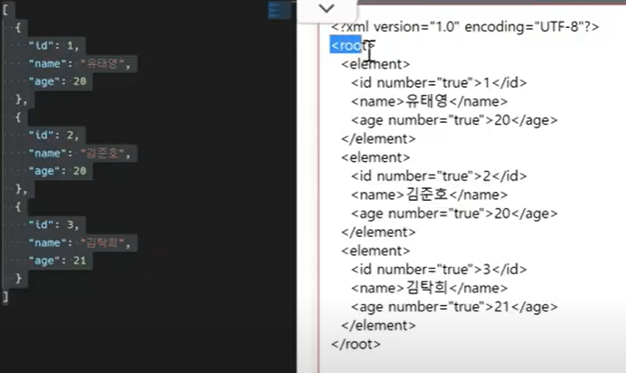

# javascript3

## AJAX

Asynchronous JavaScript and xml(비동기식 javascript와 xml)

서버와 통신하기 위해 XMLHttpRequest 객체를 활용

JSON, XML, HTML 그리고 일반 텍스트 형식 등을 포함한 다양한 포맷을 주고 받을 수 있음

[JSONTOXML 변환](https://www.utilities-online.info/jsontoxml)



AJAX 특징

페이지 전체를 reload 하지 않고서도 수행되는 '비동기성'

1. 페이지 새로 고침 없이 서버에 요청

   예를 들어, 글자 하나씩 검색할 때 그 글자에 관련된 연관검색어가 나옴

2. 서버로부터 데이터를 받고 작업을 수행


XMLHttpRequest 객체

서버와 상호작용하기 위해 사용되며 전체 페이지의 새로 고침 없이 데이터를 받아올 수 있음

사용자의 작업을 방해하지 않으면서 페이지 일부를 업데이트 할 수 있음

주로 AJAX 프로그래밍에 사용

이름과 달리 XML뿐만 아니라 모든 종류의 데이터를 받아올 수 있음

생성자: XMLHttpRequest()    // XHR

```javascript
const request = new XMLHttpRequest()  //탭열고
const URL = 'https://jsonplaceholder.typicode.com/todos/1/' //url로 가져와서 

request.open('GET', URL)
request.send()  // url로 보낸다!

const todo = request.response
console.log(`data: ${todo}`)

JSON.parse(todo) // todo는 string이라 파싱해야 가져올 수 있음
```

[데이터 쉽게 받아올 수 있는 곳](https://jsonplaceholder.typicode.com/)


## Asynchronous JavaScript

동기식

순차적, 직렬적 task 수행

요청을 보낸 후 응답을 받아야만 다음 동작이 이루어짐(blocking)

버튼 클릭후 alert 메시지의 확인 버튼을 누를때까지 문장이 만들어지지 않음

즉, alert 이후의 코드는 alert의 처리가 끝날때까지 실행되지 않음(single threaded)


비동기식

병렬적 task 수행

요청을 보낸 후 응답을 기다리지 않고 다음 동작이 이루어짐 (non-blocking)

요청을 보내고 응답을 기다리지 않고 다음 코드가 실행됨

결과적으로 변수 todo에는 응답 데이터가 할당되지 않고 빈 문자열이 출력

(이것도 single threaded??)

```javascript
const request= new XMLHttpRequest()
const URL = 'https://jsonplaceholder.typicode.com/todos/1/'

request.open('GET', URL)
request.send()  // xmlhttprequest요청

const todo = request.response //빈응답값을 todo에 할당 ,아직 위의 코드를 완성하지 못함
console.log(`data: ${todo}`)  //console.log실행
```


왜 비동기를 사용하는가?

사용자 경험

데이터를 요청하고 응답 받는 동안, 앱실행을 함께 진행함

데이터를 불러오는 동안 지속적으로 응답하는 화면을 보여줌으로써 **더욱 쾌적한 사용자 경험**을 제공


threads

프로그램이 작업을 완료하기 위해 사용할 수 있는 단일 프로세스

각 threads는 한 번에 하나의 작업만 수행할 수 있음

컴퓨터 cpu는 여러 코어를 가지고 있기 때문에 한번에 여러가지 일을 처리할 수 있음


javascript는 single threaded 이다

컴퓨터가 여러개의 cpu를 가지고 있어도 main thread라 불리는 단일 스레드에서만 작업 수행

즉, 이벤트를 처리하는 call stack이 하나인 언어라는 의미

이문제를 해결하기 위해 javascript는

1. 즉시 처리하지 못하는 이벤트들을 다른 곳(web api)으로 보내서 처리하도록 하고
2. 처리된 이벤트들을 처리된 순서대로 대기실(tast queue)에 줄을 세워놓고
3. call stack이 비면 담당자(event loop)가 대기 줄에서 가장 오래된 이벤트를 call stack으로 보냄


concurrenct model

: event loop를 기반으로 하는 동시성 모델

1. call stack

   요청이 들어올 때마다 해당 요청을 순차적으로 처리하는 stack(LIFO) 형태의 자료 구조

2. web api

   JAVAScript 엔진이 아닌 브라우저 영역에서 제골하는 api

   ajax로 데이터를 가져오는 시간이 소요되는 일들을 처리

3. task queue(event queue, message queue)

   비동기 처리된 callback함수가 대기하는 queue(FIFO)형태의 자료 구조

   main thread가 끝난 후 실행되어 후속 javascript 코드가 차단되는 것을 방지

4. event loop

   call stack이 비어있는지 확인

   비어있는 경우 task queue에서 실행대기 중인 callback 함수가 있는지 확인

   task queue에 대기 중인 call back 함수가 있다면 가장 앞에 있는 callback함수를 call stack으로 push


[javascript event loop visualizer](http://latentflip.com/loupe/?code=JC5vbignYnV0dG9uJywgJ2NsaWNrJywgZnVuY3Rpb24gb25DbGljaygpIHsKICAgIHNldFRpbWVvdXQoZnVuY3Rpb24gdGltZXIoKSB7CiAgICAgICAgY29uc29sZS5sb2coJ1lvdSBjbGlja2VkIHRoZSBidXR0b24hJyk7ICAgIAogICAgfSwgMjAwMCk7Cn0pOwoKY29uc29sZS5sb2coIkhpISIpOwoKc2V0VGltZW91dChmdW5jdGlvbiB0aW1lb3V0KCkgewogICAgY29uc29sZS5sb2coIkNsaWNrIHRoZSBidXR0b24hIik7Cn0sIDUwMDApOwoKY29uc29sZS5sb2coIldlbGNvbWUgdG8gbG91cGUuIik7!!!PGJ1dHRvbj5DbGljayBtZSE8L2J1dHRvbj4%3D)에서 값 넣으면

call stack, web apis, callback queue 시각적으로 볼 수 있음


```javascript
console.log('Hi')
setTimeout(function ssafy () {
    console.log('SSAFY')
}, 3000)

console.log('Bye')

// 생각해보면 Hi, 'SSAFY', BYE할 것 같은데
// 실제적으로는 HI, 3초동안 못기다려! BYE, SSAFY로 출력 
```


```
console.log('Hi')는 바로 call stack에 들어갔다가 출력을 진행

setTimeout(function ssafy () {
    console.log('SSAFY')
}, 3000)
은 call stack이 비어있는 것을 확인하고 call stack에 갔다가 Web API로 넘어간 후, 3초 후에
function ssafy () {
    console.log('SSAFY')
}
이 Task Queue로 넘어감

이 와중에 call stack이 비어있는 것을 확인하고 console.log('Bye')가 call stack에 들어가고 출력을 진행

task queue에 넘어간 function은 event loop에 의해 call stack이 비어있는 것을 확인한 후 call stack에 할당되어짐

그 후에 SSAFY은 출력!

결과적으로는 
'Hi'
'Bye'
'SSAFY'
가 출력
```


순차적인 비동기 처리하기

어떤 이벤트가 먼저 처리되느냐가 중요

이를 해결하기 위해 순차적인 비동기 처리를 위한 2가지 작성 방식

1. Async callback

   백그라운드에서 실행을 시작할 함수를 호출할 때 인자로 지정된 함수

   addEventListener()의 두번째 인자

2. promise-style

   modern web APIs에서의 새로운 코드 스타일

   XMLHttpRequest 객체를 사용하는 구조보다 조금 더 현대적인 버전


### call back function

다른 함수에 인자로 전달된 함수

외부 함수 내에서 호출되어 일종의 루틴 또는 작업을 완료함

동기식, 비동기식 모두 사용됨

비동기 작성비 완료된 후 코드 실행을 계속하는데 사용되는 경우를 비동기 콜백이라고 함

```javascript
//예시
const btn = document.querySelector('button')
btn.addEventListener('click', function () {
    alert('Completed!')
})
```


백그라운드 코드 실행이 끝나면 callback 함수를 호출하여 작업이 완료되었음을 알리거나, 다음 작업을 실행하게 할 수 있음

callback 함수를 다른 함수의 인수로 전달할 때, 함수의 참조를 인수로 전달할 뿐이지 즉시 실행되지 않고, 함수의 body에서 'called back'된다

비동기 로직을 수행할 때 callback 함수는 필수


callback hell

callback 함수 호출 -> 그다음 callback 함수 호출 -> 또 그 함수의 callback 함수 호출 -> 패턴이 지속적으로 반복

이런 일이 벌어진다면 디버깅, 코드 가독성을 통제하기 어려움

 

해결 할 방법

1. 코드의 깊이를 얕게 유지
2. 모듈화
3. 모든 단일 오류 처리
4. promise 콜백 방식 사용


### promise

비동기 작업의 최종 완료 또는 실패를 나타내는 객체

미래의 완료 또는 실패와 그 결과 값을 나타냄

미래의 어떤 상황에 대한 약속

* 성공에 대한 약속 -> .then()

```
이전 작업이 성공했을 때 수행할 작업을 나타내는 callback 함수
그리고 각 callback함수는 이전 작업의 성공 결과를 인자로 전달받음
따라서 성공했을 때의 코드를 callback 함수 안에 작성
```

* 실패에 대한 약속 -> .catch()

```
.then이 하나라도 실패하면 동작
이전 작업의 실패로 인해 생성된 error객체는 catch 블록 안에서 사용할 수 있음
```

** 반환 값이 반드시 있어야함

** 없다면 callback 함수가 이전의 promise 결과를 받을 수 없음

* promise 객체 반환 -> .finally(callback)

  결과와 상관없이 무조건 지정된 callback 함수가 실행

  어떠한 인자도 전달받지 않음(promise가 성공되었는지 거절되었는지 판단할 수 없기 때문)

  무조건 실행되어야하는 절에서 활용

  : .then()과 .catch() 블록에서의 코드 중복을 방지


```javascript
const myPromise = axios.get(URL)
myPromise.then(response => {
    return response.data
})

axios.get(URL).then(response => {
    return response.data
})
.then(response => {
    return response.title
})
.catch(error => {
    console.log(error)
})
.finally(function () {
    console.log('나는 마지막에 무조건 시행!')
})
```


promise가 보장하는 것

1. callback 함수는 javascript의 event loop가 현재 실행중인 callstack 을 완료하기 이전에는 절대 호출되지 않음

2. 비동기 작업이 성공하거나 실핸뒤에 .then() 메서드를 이용하여 추가한 경우에도 1번과 똑같이 동작

3. .then()을 여러번 사용하여 여러 개의 callback 함수를 추가할 수 있음 (chaining)

   -> 각각의 callback은 주어진 순서대로 하나하나 실행하게 됨

   

### Axios

promise based HTTP client for the browser

브라우저를 위한 promise 기반의 클라이언트

```javascript
axios.get('https://jsonplaceholder.typicode.com/todos/1/')
.then(..)
.catch(..)
```

```html
<script src = 'https://unpkg.com/axios/dist/axios.min.js'></script>
<script>
  const URL = 'https://jsonplaceholder.typicode.com/todos/1/'
  axios.get(URL)
    .then(function (response) {
      console.log(response)
      return response.data
  })
    .then(function (data) { //data에 response.data가 오게됨
      return data.title
  })
    .then(function (title) { //title에 data.title이 오게됨
      console.log(title)
  })
    .catch(function (error) {
      console.log(error)
  })
    .finally(function () {
      console.log('이건 무조건 실행됩니다')
  })
          
</script>
```


## async & await

기존 promise 시스템 위에 구축된 syntatic sugar

promise 구조의 then chaining을 제거

비동기 코드를 조금 더 동기 코드처럼 표현

syntatic sugar

- 더 쉽게 읽고 표현할 수 있도록 설계된 프로그래밍 언어 내의 구문
- 즉, 문법적 기능은 그대로 유지하되 사용자가 직관적으로 코드를 읽을 수 있게 만듦


`*`async-await을 사용하려면 함수로 묶어야한다

`**` 해당 함수 맨 앞에 async라는 키워드로 표시를 남긴다

`***`함수 블록 내부에, 비동기로 동작하는 함수들을 찾아서 앞에 await를 남긴다

```javascript
const URL = 'https://dog.ceo/api'

// **
async function fetchFirstDogImage() {
    const res = await axios.get(URL + '/breeds/list/all')
    // 이거 끝날때까지 기다렸다가 밑에 코드 실행
    const breedObj = res.data.message
    console.log(breedObj)
    const breedArray = Object.keys(breedObj)
    const breed = breedAway[0]
    // ***
    const images = await axios.get(URL + `/breed/${breed}/images`)
    console.log(images)
}
fetchFirstDogImage()
.catch(err => console.error(err.response))
```


csrf token 사용할 때

```javascript
axios.defaults.xsrfCookieName = 'csrftoken';
axios.defaults.xsrfHeaderName = 'X-CSRFTOKEN';
```

하고 axios가져올 떄 

```javascript
axios.post(`http://127.0.0.1:8000/articles/${articleId}/likes/`)
```

post로 가져오기
