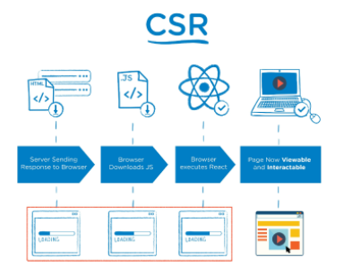
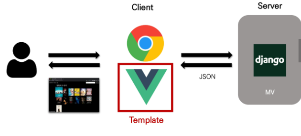
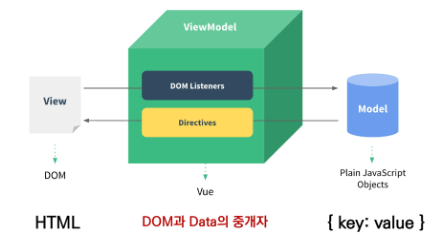

# vue

## front end development

html, css 그리고 javascript를 활용해서 데이터를 볼 수 있게 만들어줌

이 작업을 통해 사용자는 데이터와 상호작용할 수 있음

대표적인 프론트 엔드 프레임워크: vue.js, react, angular


## vue.js

사용자 인터페이스를 만들기 위한 진보적인 자바스크립트 프레임워크

현대적인 tool과 다양한 라이브러리를 통해 SPA를 완벽하게 지원


## SPA

single page application

단일 페이지 애플리케이션


과거 웹 사이트들은 요청에 따라 매번 새로운 페이지를 응답하는 방식이엇음(MPA)

스마트폰이 등장하면서  모바일 최적화의 필요성이 대두

이러한 문제를 해결하기 위해 Vue.js와 같은 프론트엔드 프레임워크가 등장 -> CSR, SPA의 등장


현재 페이지를 동적으로 렌더링함으로써 사용자와 소통하는 웹 애플리케이션

단일 페이지로 구성되며 서버로부터 최초에만 페이지를 다운로드하고, 이후에는 동적으로 DOM을 구성

연속되는 페이지 간의 사용자 경험UX을 향상

동작 원리의 일부가 CSR의 구조를 따름


## CSR

client side rendering

서버에서 화면을 구성하는 ssr방식과 달리 클라이언트에서 화면을 구성

즉, 처음엔 뼈대만 받고 브라우저에서 동적으로 DOM을 그림

SPA가 사용하는 렌더링 방식

* 장점: 
  * 서버와 클라이언트 간 트래픽 감소
  * 사용자 경험 향상
* 단점:
  * SSR에 비해 전체 페이지 최종 렌더링 시점이 느림
  * SEO(검색 엔진 최적화)에 어려움이 있음 - 최초 문서에 데이터 마크업이 없기 때문




## SSR

server side rendering

서버에서 클라이언트에게 보여줄 페이지를 모두 구성하여 전달하는 방식

js 웹 프레임워크 이전에 사용되던 전통적인 렌더링 방식


* 장점
  * 초기 구동 속도가 빠름
  * SEO에 적합
* 단점
  * 모든 요청마다 새로운 페이지를 구성하여 전달


```
실제 브라우저에 그려질 HTML을
서버가 만든다 -> SSR
 - Django에서 Axios를 활용한 좋아요/ 팔로우 로직의 경우 대부분은 server에서 완성된 html을 제공하는 구조
클라이언트가 만든다 -> CSR
 - ajax를 활용해 비동기 요청으로 필요한 데이터를 클라이언트에서 서버로 직접 요청을 보내 받아오고 js를 활용해 dom 조작
 
내 서비스 또는 프로젝트 구성에 맞는 방법을 적절하게 선택하는 것이 중요
```


vue.js의 역할

현대 웹페이지는 페이지 규모가 계속해서 커지고 있으며,

그만큼 사용하는 데이터도 늘어나고 사용자와의 상호작용도 많이 이루어짐

vanilla js 만으로는 관리하기가 어려움




유저가 닉네임을 변경하면, DB의 UPDATE와 별도로 

DOM 상의 100개의 작성자 이름이 모두 수정해야되서

모든 요소를 선택해서 이벤트를 등록하고 값을 변경해야하는 vanilla js와 달리 

vue.js는 dom과 data가 연결되어있고 data를 변경하면 이에 연결된 DOM은 알아서 변경

즉, 우리가 신경 써야 할 것은 오직 DATA에 대한 관리


## concepts of vue.js

[vue.js 시작하기](https://kr.vuejs.org/v2/guide/index.html)

MVVM patten(model - view - view model)



* Model : javascript object이다
  * object === {key:value}
  * 내부에서 data라는 이름으로 존재
  * 이 data가 바뀌면 view가 반응
* view: dom(html)이다
  * data의 변화에 따라서 바뀌는 대상
* viewModel: 모든 vue instance
  * view와 model 사이에서 data와 dom에 관련된 모든 일을 처리
  * viewmodel을 활용해 data를 얼마만큼 잘 처리해서 보여줄 것인지를 고민하는 것


## quick start of vue.js

vue.js의 코드 작성 순서
: data 로직 작성 -> dom 작성

```html
<script src="https://cdn.jsdelivr.net/npm/vue/dist/vue.js"></script>
```


* 선언적 렌더링

  ```vue
  <h2>
      선언적 렌더링
  </h2>
  <div id  = "app">  
     {{ message }}
  </div>
  
  <script>
  const app = new Vue({
    el: '#app',
    data : {
      message: '안녕하세요 Vue!'
    }
    })
  </script>
  ```

  

* 조건문

  ```vue
  <h2>
      조건문
  </h2>
  <div id = "app-3">
      <p v-if = "seen">
           이제 나를 볼 수 있어요
      </p>
  </div>
  
  <script>
    const app3 = new Vue({
        el : '#app-3',
        data: {
            seen:true
        }
    })
  </script>
  ```

  

* 반복문

  ```vue
  <h2>
      반복
  </h2>
  <div id = "app-4">
      <ol>
          <li v-for = "todo in todos">
            {{ todo.text}}
          </li>
      </ol>
  </div>
  
  <script>
    const app4 = new Vue({
        el : '#app-4',
        data: {
            todos: [
                {text: 'javascript 만들기'},
                {text: 'vue배우기'},
                {text: '무언가 멋진것을 만들기'}
            ]
        }
    })
  </script>
  ```

  

* 사용자 입력 핸들링

  ```vue
  <h2>
      사용자 입력 핸들링
  </h2>
  <div id = "app-5">
      <p>
           {{message}}
      </p>
      <button v-on:click = "reverseMessage">
          메시지 뒤집기
      </button>
  </div>
  
  <script>
    const app5 = new Vue({
        el: '#app-5',
        data: {
            message : '안녕하세요! vue.js!'
        },
        methods : {
            reverseMessage: function () {
                this.message = this.message.splie('').reverse().join('')
            }
        }
    })
  </script>
  ```

  ```vue
  <div id = "app-6">
      <p>
          {{ message }}
      </p>
      <input v-model = "message" type = "text">
      <button v-on:click = "reverseMessage">
          메시지 뒤집기
      </button>
  </div>
  
  <script>
    const app6 = new Vue({
        el: '#app-6',
        data: {
            message : '안녕하세요! vue.js!'
        },
        methods : {
            reverseMessage: function () {
                this.message = this.message.splie('').reverse().join('')
            }
        }
    })
  </script>
  ```

  

## basic syntax of vue.js

### vue instance

모든 vue 앱은 vue 함수로 새 인스턴스를 만드는것부터 시작

vue 인스턴스를 생성할 때는 options 객체를 전달해야함

여러 options들을 사용하여 원하는 동작을 구현

```vue
<script>
const app = new Vue ({

})
</script>
```

### options/dom - 'el'

css 선택자 문자열 혹은 html element로 작성

new를 이용한 인스턴스 생성때만 사용

```vue
<script>
const app = new Vue ({
  el: '#app'
})
</script>
```

### options/data - 'methods'

vue 인스턴스에 추가할 메서드 

vue template에서 interpolation을 통해 접근 가능

*화살표 함수를 메서드를 정의하는데 사용하면 안됨*

*화살표 함수가 부모 컨텍스트를 바인딩하기 떄문에 this는 vue인스턴스가 아님*

vue함수 객체 내에서 vue인스턴스를 가리킴

```vue
<script>
const app = new Vue ({
  el: '#app',
  data: {
      message: "Hello",
  },
  methods : {
      greeting: function (){
          console.log('hello')
      }
  }
})
</script>
```


## template syntax

디렉티스

v- 접두사가 있는 특수 속성

표현식의 값이 변경될 때 반응적으로 dom에 적용하는 역할을 함


v-text

```vue
<div id = "app">
<p>{{message}}</p>   
<p v-text = "message"></p>
</div>

<script>
  const app = new Vue({
      el : '#app',
      data: {
          message: 'hello'
      }
  })
</script>
```


v-html

```vue
<div id = "app">
    <p>{{ message }}</p>
    <p v-text = "message"></p>
    <p v-html = "message"></p>
</div>

<script>
const app = new Vue({
    el: "#app",
    data: {
        message: '<strong>hello</strong>'
}
})
</script>
```


v-show

조건부 렌더링 중 하나

단순히 엘리먼트에 display CSS 속성을 토글하는 것

```vue
<div id = "app">
    <p v-show = "isTrue">
        True
    </p>
    <p v-show = "isFalse">
        False
    </p>
</div>

<script>
const app = new Vue({
    el: '#app',
    data: {
        isTrue: true,
        isFalse: false,
    }
})
</script>
```


v-if

```vue
<div id = "app">
    <div v-if = "seen">
        seen이 true일때만 렌더링
    </div>
    
    <div v-if = "myType === 'A'">
        A
    </div>
    <div v-else-if = "myType === 'B'">
        B
    </div>
    <div v-else-if = "myType === 'C'">
        C
    </div>
    <div v-else>
        not A/B/C
    </div>
</div>

<script>
    const app = new Vue ({
        el: '#app',
        data: {
            seen: false,
            myType : 'A',
        }
    })
</script>
```


v-show와 v-if

* v-show(expensive initial load, cheap toggle)
  * 실제로 렌더링은 되지만 눈에서 보이지 않는 것이기 때문에 딱 한번만 렌더링이 되는 경우라면 v-if에 비해 상대적으로 렌더링 비용이 높음
  * 하지만 자주 변경되는 요소라면 한번 렌더링된 이후부터는 보여주는지에 대한 여부만 판단하면 되기 때문에 토글 비용이 적음
* v-if(cheap initial load, expensive toggle)
  * 전달인자가 false인 경우 렌더링 되지 않음
  * 화면에서 보이지 않을 뿐만 아니라 렌더링 자체가 되지 않기 때문에 렌더링 비용이 낮음
  * 하지만, 자주 변경되는 요소의 경우 다시 렌더링 해야하므로 비용이 증가할 수 있음


v-for

item위치의 변수를 각 요소에서 사용할 수 있음

객체의 경우 key

v-for 사용시 반드시 key 속성을 각 요소에 작성

v-if와 함께 사용하는 경우 v-for가 우선순위가 더 높음(동시에 사용하는 건 지양)

:key쓰는 것은 약간 의무적임! -> 어떤 값을 써야하냐 : 독립적인 문자열이나 숫자면 모두 ok

근데 :key = 'a'라고 하면 모든 fruit의 key가 a가 되므로 에러가 뜸

따라서 index, id가 가장 나음

```vue
<div id = "app">
    
    <div v-for = "fruit in fruits">
        {{fruit}}
    </div>
    
    <div v-for = "(fruit, index) in fruits" :key = "`fruit-${index}`">
        {{fruit}}
    </div>
    
    <div v-for = "todo in todos" :key = "todo.id">
        {{todo.title}} : {{todo.completed}}
    </div>
    
    <div v-for = "value in myObj">
        {{ value }}
    </div>
    <div v-for = "(value, key) in myObj">
        {{ key }} => {{ value }}
    </div>
</div>

<script>
  const app = new Vue({
      el: '#app',
      data: {
          fruits: ['apple','banana','coconut'],
          todos: [
              { id: 1, title: 'todo1', completed: true},
              {id: 2, title: 'todo2', completed: false},
              {id: 3, title: 'todo3', completed: true},
          ],
          myObj: {
              name : 'kim',
              age: 100,
          }
      }
  })
</script>
```


v-bind(약어:)

`:___ = "js표현식"`

html 요소의 속성에 vue의 상태 데이터를 값으로 할당

object 형태로 사용하면 value가 true인 key와 class 바인딩 값으로 할당

```vue
<div id = "app">
    <!--속성 바인딩-->
    
     /*축약*/
    <hr>
    
    <!--클래스 바인딩(active라는 class를 할당)-->
    <div :class = "{active:isRed}">
        클래스바인딩
    </div>
    <hr>
    
    <!--스타일 바인딩-->
    <p :style = "{fontSize: fontSize + 'px'}" >
        this is paragraph
    </p>
</div>

<script>
  const app = new Vue({
      el: "#app",
      data: {
          fontSize: 16, 
          altMsg: 'this is image',
          imageSrc: 'https://picsum.photos/200/300/',
          isRed: True
      }
  })
</script>
```


v-on(약어:@)

특정 이벤트가 발생했을 때, 주어진 코드가 실행됨

```vue
<div id = "app">
    <!--메소드 핸들러-->
    <button v-on:click = 'doAlert'>Button</button>
    <button @click = "doAlert">Button</button>
    <button @click = "onInputEnter('ssafy')">Button</button>
    
    <!--기본동작 방지-->
    <form action = "/articles/" @submit.prevent = "alertHello">
        <button>Submit</button>
    </form>
    
    <!--키 별칭을 이용한 키 입력 수식어-->
    <!--enter 쳐야만 함수 돌아간다!keyup.space도 가능!-->
    <input type = "text" @keyup.enter = "onEnter">
    {{message}}
    <button @click= "changeMessage">button</button>
</div>

<script>
  const app = new Vue({
      el: '#app',
      data: {
          message: 'Hello, Vue.js',
      },
      methods: {
          doAlert: function (){
              alert('hello!')
          },
          onEnter: function (event) {
              console.log(event)
              console.log(event.target.value)
          },
          onInputEnter: function(onInputValue){
              console.log(onInputValue)
          },
          changeMessage: function(){
              this.message = 'byebye'
          }
      }
  })
</script>
```


v-model

html form 요소의 값과 data를 양방향 바인딩

```vue
<div id = "app">
    <h2>
        1. Input -> Data
    </h2>
    <h3>
        {{myMessage}}
    </h3>
    <input type = "text" @input = "onInputChange">
    
    <h2>
        2. Input <-> Data
    </h2>
    <h3>
        {{myMessage2}}
    </h3>
    <input v-model = "myMessage2" type = "text">
        
    <h2>
        3. checkbox
    </h2>
    <input type="checkbox" id = "checkbox" v-model = "checked">
    <label for = "checkbox">{{ checked}}</label>
</div>
    
<script>
    const app = new Vue ({
        el: '#app',
        data: {
            myMessage : '',
            meMessage2: '',
            checked: true,
        },
        methods : {
            onInputChange: function(event) {
                this.myMessage = event.target.value
            },
        }
    })
</script>
```


computed와 method의 차이

* computed:

  종속된 대상이 변경되지 않는 한 computed에 작성된 함수를 여러번 호출해도 계산을 다시 하지 않고 계산되어있던 결과를 반환

* methods:

  렌더링을 다시 할때마다 항상 함수를 실행


```vue
<div id = "app">
    <p>
        {{num}}
    </p>
    <p>
        {{doubleNum}}
    </p>
</div>

<script>
  const app = new Vue({
      el: '#app',
      data: {
          num:2,
      },
      computed : {
          //data에 의존하는 계산된 값
          doubleNum: function (){
              return this.num *2
          }
      },
  })
</script>
```

computed 함수는 return 이 필수적임!


## lifecycle hooks

각 vue 인스턴스는 생성될 때 일련의 초기화 단계를 거침

그 과정에서 사용자 정의 로직을 실행할 수 있는 lifecycle hooks도 호출됨

```vue
<script>
  new Vue({
      data: {
          a:1
      },
      created: function() {
          console.log('a is: '+ this.a)
      }
  })
</script>
```

created hook은 vue인스턴스가 생성된 후에 호출됨


```vue
<div id = "app">
    
    
<script>
    const API_URL = 'https://dog.ceo/api/breeds/image/random'
    const app = new Vue({
        el:"#app",
        data:{
            imgSrc: '',
        },
        methods: {
            getImg: function() {
                axios.get(API_URL)
                .then(response => {
                    this.imgSrc = response.data.message
                })
            }
        },
        //vue 인스턴스가 생성되면
        //getImg() 함수를 호출해 처음부터 이미지 데이터를 불러옴
        //방법이 많은데 1. button을 만들어서 사진을 볼수 있게 함
        //2. 생애 주기 확인
        created: function(){
            this.getImg()
        }
    })
</script>
```


