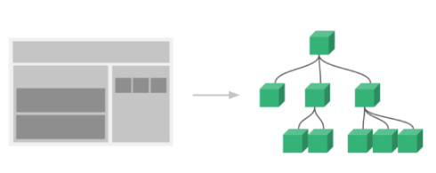
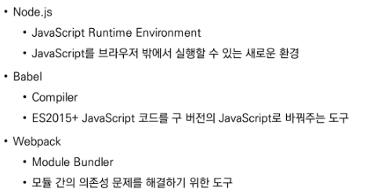

# vue02

## SFC

### component

기본 html 엘리먼트를 확장하여 재사용 가능한 코드를 캡슐화하는데 도움을 줌


SFC (single file component)

vue의 컴포넌트 기반 개발의 핵심 특징

하나의 컴포넌트는 .vue 확장자를 가진 하나의 파일 안에서 작성되는 코드의 결과물


단일 파일에서의 개발 

-> 코드의 양이 많아지면 변수 관리가 힘들어지고 유지보수에 많은 비용 발생


각 기능 별로 파일을 나눠서 개발

-> 변수 관리가 용이하며 기능 별로 유리 & 보수 비용 감소




vue component 구조 예시

한 화면 안에서도 기능 별로 각기 다른 컴포넌트가 존재

하나의 컴포넌트는 여러 개의 하위 컴포넌트를 가질 수 있음

vue는 컴포넌틑 기반의 개발 환경 제공


vue 컴포넌트는 `const app = new Vue({})`의 app을 의미하며 vue 인스턴스

```
vue 컴포넌트는 vue 인스턴스 이기도 함
vue 인스턴스는 .vue 파일 안에 작성된 코드의 집합
html, css, 그리고 javascript를 .vue라는 확장자를 가진 파일 안에서 관리하며 개발
```


## VUE CLI

node.js

자바스크립트를 브라우저가 아닌 환경에서도 구동할 수 있도록 하는 자바스크립트 런타임 환경

브라우저 밖을 벗어날 수 없던 자바스크립트 언어의 태생적 한계 해결

즉, 단순히 브라우저만 조작할 수 있던 자바스크립트를 SSR 아키텍처에서도 사용할 수 있도록 함


```BASH
$ node -v
$ node
```

node를 브라우저 밖에서도 조작 가능


NPM(node package manager)

자바스크립트 언어를 위한 패키지 관리자

python - pip / node.js - NPM


```bash
$ npm install -g @vue/cli
# g = global
# 공식문서에 g를 적으세요 라는 애들만 -g 설치
$ vue --version
```

```bash
# vscode terminal로 이동

# 프로젝트 생성
$ vue create my-first-app

#default ([Vue 2] babel, eslint) 선택

# 프로젝트 디렉토리 이동
$ cd my-first-app
# 서버 실행
$ npm run serve
```


## babel & webpack

babel

과거 자바스크립트의 파편화와 표준화의 영향으로 스펙트럼이 매우 다양

-> 이때문에 최신 문법을 사용해도 이전 브라우저 혹은 환경에서 동작하지 않는 상황이 발생

자바스크립트의 ecmascript 2015+ 코드를 이전 버전으로 번역/ 변환해주는 도구


webpack

모듈간의 의존성 문제를 해결하기 위한 도구

프로젝트에 필요한 모든 모듈을 매핑하고 내부적으로 종속성 그래프를 빌드함

모듈은 단지 파일 하나를 의미

과거에는 모듈 관련 문법없이 사용됨 

-> 복잡하고 크기가 커지자 전역 scope를 공유하는 형태의 기존 개발 방식의 한계점이 드러남

라이브러리를 만들어 필요한 모듈을 언제든지 불러오거나 코드를 모듈 단위로 작성하는 등의 다양한 시도가 이루어짐

여러 모듈 시스템 ex) **ESM**, AMD, CommonJS, UMD

모듈의 수가 많아지고 라이브러리 혹은 모듈간의 의존성이 깊어지면서 특정한 곳에서 발생한 문제가 어떤 모듈간의 문제인지 파악하기 어려움

-> 이 모듈간의 의존성 문제를 해결하기 위해 등장


모듈 의존성 문제를 해결해주는 작업을 bundling이라 함

이러한 일을 해주는 도구가 bundler이고, webpack은 다양한 bundler 중 하나

여러 모듈을 하나로 묶어주고 묶인 파일은 하나로 합쳐짐

`vue cli는 이러한 babel, webpack에 대한 초기 설정이 자동으로 되어있음`


**정리** 




vue 프로젝트 구조

1. node_modules

   node.js 환경의 여러 의존성 모듈

   git ignore가 미리 되어있음 (ㄱㅅ)

2. public/index.html - single page application

   vue 앱의 뼈대가 되는 파일

   실제 제공되는 단일 html 파일

3. src/assets

   webpack에 의해 빌드된 정적 파일

4. src/components

   하위 컴포넌트들이 위치

5. src/App.vue

   최상위 컴포넌트

6. src/main.js

   webpack이 빌드를 시작할 때 가장 먼저 불러오는 entry point

   실제 단일 파일에서 dom과 data를 연결했던 것과 동일한 작업이 이루어지는 곳

   vue 전역에서 활용할 모듈을 등록할 수있는 파일

7. babel.config.js

   babel 관련 설정이 작성된 파일

8. package.json

   프로젝트의 종속성 목록과 지원되는 브라우저에 대한 구성 옵션이 포함

9. package-lock.json

   node_modules에 설치되는 모듈과 관련된 모든 의존성을 설정 및 관리

   팀원 및 배포 환경에서 정확히 동일한 종속성을 설치하도록 보장하는 표현

   사용할 패키지의 버전을 고정

   개발 과정 간의 의존성 패키지를 충돌 방지

   

## PASS PROPS & EMIT EVENT

vue app은 자연스럽게 중첩된 컴포넌트 트리로 구성됨

컴포넌트간 부모 - 자식관계가 구성되며 이들 사이에 필연적으로 의사소통이 필요함

부모 -> 자식: 데이터 전달(pass props)

자식 -> 부모: 자신에게 일어난 일을 부모에게 알림 emit event

props는 아래로, events는 위로


컴포넌트 구조

1. 템플릿 html

   html 의 body 부분

   각 컴포넌트를 작성

2. 스크립트 javascript

   javascript가 작성되는 곳

   컴포넌트 정보, 데이터, 메서드 등 vue 인스턴스를 구성하는 대부분이 작성됨

3. 스타일 css

   css 가 작성되며 컴포넌트의 스타일을 담당


컴포넌트 등록 3단계

1. 불러오기(import)
2. 등록하기(register)
3. 보여주기(print)

```vue
<template>
  <div id = "app">
      
      <!--3. 보여주기 - 케밥 케이스-->
      <about></about>
      <!--3. 보여주기 - 카멜 케이스-->
      <About /> 
    </div>
</template>

<script>
  //1. 불러오기
    import About from './components/About.vue'
    
    export default {
        name:'App',
        components : {
            // 2. 등록하기
            About,
        },
    }
</script>
```


### props

하위 컴포넌트는 props 옵션을 사용하여 수신하는 props를 명시적으로 선언해야함

즉, 데이터는 props 옵션을 사용하여 자식 컴포넌트로 전달됨

prop-data-name = "value"

```vue
# app.vue
<template>
<div id = "app">
    
    <about my-message = "This is prop data"></about>
    </div>
</template>
```

수신 할 prop 데이터를 명시적으로 선언 후 사용

```vue
# about.vue
<template>
  <div>
    <h1>About</h1>
    <h2>{{myMessage}}</h2>
  </div>
</template>

<script>
export default {
    name: 'About',
    props: {
        myMessage:String,
    }
}
</script>
```


dynamic props

v-bind directive를 사용해 부모의 데이터의 props를 동적으로 바인딩

부모에서 데이터가 업데이트 될때마다 자식 데이터로도 전달 됨

```vue
# app.vue
<template>
<div id = "app">
    
    <about my-message = "This is prop data"
           : parent-data = "parentData"
           >
    </about>
    </div>
</template>
<script>
    import About from './components/About.vue'
    
    export default {
        name:'App',
        components : {
            About,
        },
        data: function (){
            return {
                parentData: 'This is parent Data by v-bind'
            }
        },
    }
</script>
```

```vue
# about.vue
<template>
  <div>
    <h1>About</h1>
    <h2>{{myMessage}}</h2>
    <h2>{{parentData}}</h2>
  </div>
</template>

<script>
export default {
    name: 'About',
    props: {
        // 여기서는 케밥 케이스 말고 카멜 케이스로 변환한 후에 작성해야됨
        // 자료형을 적어줌
        myMessage:String,
        parentData: String,
    }
}
</script>
```

 

* props 이름 컨벤션

  ```
  선언 시 - camelCase
  html에서 - kebab-case
  ```

template 안에는 반드시 하나의 element 만 있어야한다 

-> .vue 만들어주자마자 <div>작성하기


컴포넌트의 data는 반드시 함수여야함

기본적으로 각 인스턴스는 모두 같은 data객체를 공유하므로 새로운 data객체를 반환하여야함

data는 객체가 아니라 함수로 만들어야되고, 그 함수가 무언가 return하는 객체가 데이터의 객체가 되는 것임

따라서 다른 객체를 참조해야하기 때문에 return을 각자해줘야하기 때문에 함수여야함!

```vue
<script>
data : function () {
    return {
        myData: null,
    }
},
</script>
```


template에서 문자열이 아닌 변수의 이름으로 작성하고 싶다면

```vue
<template>
<TheAbout :my-message = "parentData"></TheAbout>
</template>
```

로 v-bind 작성해야 parentData 문자열이 아닌 

`parentData: 'This is parent Data by v-bind'`인 변수로 인지


### emit

모든 props는 하위 속성과 상위 속성 사이의 단방향 바인딩을 형성

부모의 속성이 변경되면 자식 속성에게 전달되지만, 반대 방향으로는 안됨

자식 요소가 의도치 않게 부모 요소의 상태를 변경하여 앱의 데이터 흐름을 이해하기 어렵게 만드는 일을 방지


emit event : listening to child components events

$emit(eventName)

현재 인스턴스에서 이벤트를 트리거

추가 인자는 리스너의 콜백 함수로 전달

- 부모 컴포넌트는 자식 컴포넌트가 사용된 템플릿에서 v-on을 사용하여 자식 컴포넌트가 보낸 이벤트를 청취

```vue
# about.vue
<template>
  <div>
    <h1>About</h1>
    <h2>{{myMessage}}</h2>
    <h2>{{parentData}}</h2>
      <input
             type = "text"
             @keyup.enter = "childInputChange"
             v-model = "childInputData">
  </div>
</template>

<script>
export default {
    name: 'About',
    data : function (){
        return {
            childInputData: null,
        }
    },
    props: {
        myMessage:String,
        parentData: String,
    },
    methods: {
        childInputChange: function (){
            console.log('Enter!', this.childInputData)
            // 부모 컴포넌트에게 "child-input-change"라는 이름의 이벤트 발생
            // 2번인자 데이터를 보냄
            this.$emit('child-input-change', this.childInputData)
        }
    }
}
</script>
```

```vue
# app.vue
<template>
<div id = "app">
    
    <about my-message = "This is prop data"
           : parent-data = "parentData"
           <!--밑에 methods의 이름 -->
           @child-input-change = "parentGetChange"
           >
    </about>
    </div>
</template>
<script>
    import About from './components/About.vue'
    
    export default {
        name:'App',
        components : {
            About,
        },
        data: function (){
            return {
                parentData: 'This is parent Data by v-bind'
            }
        },
        methods: {
            parentGetChange: function(inputData){
                console.log(`About으로 부터 ${inputData}를 받음!`)
            }
        }
    }
</script>
```


현재 인스턴스에서 $emit 인스턴스 메서드를 사용해 child-input-change 이벤트를 트리거

부모 컴포넌트는 자식 컴포넌트가 사용되는 템플릿에서 v-on directive를 사용하여 자식 컴포넌트가 보낸 이벤트(child-input-change)를 청취


## VUE ROUTER

```
router
: 위치에 대한 최적의 경로를 지정하며, 이 경로를 따라 데이터를 다음 장치로 전향시키는 장치
```

라우트에서 컴포넌트를 매핑한 후, 어떤 주소에서 렌더링할지 알려줌

spa(page가 한개뿐이라) 상에서 라우팅을 쉽게 개발할 수 있는 기능을 제공

```bash
# 주의) app 안에서 또 app을 만들면 안됨
# 프로젝트 생성 및 이동
$ vue creae my-router-app
$ cd my-router-app

# vue router plugin 설치
$ vue add router

# commit 여부, history mode 사용 여부 => y

#main.js, index.js, app.vue 가 나옴

```


```vue
# LottoView.vue
<template>
  <div>
      
    </div>
</template>

<script>
</script>
```

```vue
# app.vue
<template>
  <div id = "app">
      <nav>
      <!--사용자 네비게이션을 가능하게 하는 컴포넌트-->    
      <!--클릭 이벤트를 차단하여 브라우저가 페이지를 다시 로드하지 않도록 함-->  
      <router-link :to = "{name:'home'}">Home</router-link>
      <router-link :to = "{name:'about'}">About</router-link>
    </nav>
      <!--주어진 라우트에 대해 일치하는 컴포넌트를 렌더링하는 컴포넌트-->
      <router-view/>
    </div>
</template>
```

```js
//index.js
import AboutView from '../views/AboutView.vue'

Vue.use(VueRouter)

const routes = [
    {
        path:'/',
        name:'home',
        component: HomeView
    },
    {
        path:'/about',
        name: 'about',
        component: () => import('../views/AboutView.vue')
    }
]

const router = new
```


프로그래밍 방식 네이게이션

a 태그 말고 버튼을 눌러도 어디 페이지로 넘어가게끔 하는 아법

```vue
<template>
<div class = "about">
    <h1>
        This is an about page
    </h1>
    <button @click = "moveToHome">ToHome</button>
    </div>
</template>

<script>
export default {
    name: 'AboutView',
    methods: {
        moveToHome(){
            //$router.push(...)
            //<router-link :to= "..">과 같음
            this.$router.push({name:'home'})
        }
    }
}
</script>
```

```vue
<script>
// literal string path
router.push('home')
    
// object
router.push({path: 'home'})
    
// named route
router.push({name: 'user', params: {userId: '123'}})
    
// with query, resulting in /register?plan=private
router.push({path:'register', query:{plan: 'private'}})
</script>
```


## YOUTUBE PROJECT

