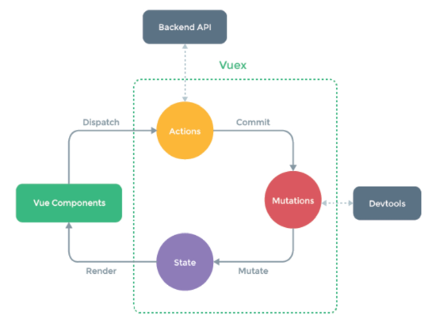
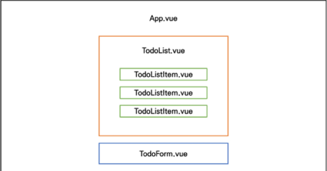

# vuex

## vuex

vue.js의 상태 관리 패턴 + 라이브러리

상태(state)를 전역 저장소로 관리할 수 있도록 지원하는 라이브러리

상태가 예측 가능한 방식으로만 변경될 수 있도록 보장하는 규칙 설정

애플리케이션의 모든 컴포넌트에 대한 **중앙 집중식 저장소** 역할


기존 pass props & emit event

각 컴포넌트틑 독립적으로 데이터를 관리

데이터는 단방향 흐름으로 부모 -> 자식간의 전달만 가능(불편)

규모가 커졌을 경우 상태 관리가 어려워짐

```
state: 앱을 작동하는 원본 소수
view: state의 선언적 매핑
action: view에서 사용자 입력에 대해 반응적으로 state를 바꾸는 방법(methods)
```

↓

vuex manager pattern

중앙 저장소(store)에 state를 모아놓고 관리

각 컴포넌트에서는 중앙 집중 저장소의 state만 신경 쓰면 됨

상태를 한 곳에 모두 모아놓고 관리 ! -> 해당 상태를 공유하고 있는 모든 컴포넌트는 변화에 반응


## vuex core concepts



1. state

```
= data, 해당 애플리케이션의 핵심이 되는 요소
중앙에서 관리하는 모든 상태 정보
state가 변화하면 해당 state를 공유하는 여러 컴포넌트의 DOM은 알아서 렌더링
각 컴포넌트는 이제 VUEX STORE에서 STATE 정보를 가져와 사용
mutations에 의해 변경됨
```

```
상태 관리 패턴:
컴포넌트의 공유된 상태를 추출하고 이를 전역에서 관리하도록함
컴포넌트는 커다란 view가 되며 모든 컴포넌트는 트리에 상관없이 상태에 액세스 하거나 동작을 트리거 가능
```


2. Mutations

```
실제로 state를 변경하는 유일한 방법
mutation의 핸들러 함수는 반드시 동기적이어야함!
첫번째 인자로 항상 state를 받음
actions에서 commit()메서드에 의해 호출됨
```


3. actions

```
state를 변경하는 대신 mutations를 commit() 메서드로 호출해서 실행
mutations와 달리 비동기 작업이 포함될 수 있음
context 객체 인자를 받음
context 객체를 통해 store/index.js 파일 내에 있는 모든 요소의 속성 접근 & 메서드 호출이 가능
컴포넌트에서 dispatch() 메서드에 의해 호출됨
state 변경 x
```

**actions를 통해 state도 조작 가능, 단, state를 올바르게 관리하기 위해서는 오로지 mutations를 통해서만 조작해야함**


4. getters

```
state를 변경하지 않고 활용하여 계산을 수행
computed를 사용하는 것처럼 getters는 저장소의 상태를 기준으로 계산
state를 특정한 조건에 따라 구분(계산)만함
```


## todo app with vuex

프로젝트 생성

```bash
$ vue create todo-vuex-app
$ cd todo-vuex-app

# add vuex plugin in vue cli
$ vue add vuex
```

-> store 디렉토리 생성 > index.js 생성

index.js = vuex core concepts가 작성되는 곳

```js
// index.js
import Vue from 'vue'
import Vuex from 'vuex'

Vue.use(Vuex)
export default new Vuex.Store({
    state:{
        todos: [
            {
                title:'할일1',
                isCompleted: false,
                date: new Date().getTime(),
            },
            {
                title:'할일2',
                isCompleted: false,
                date: new Date().getTime(),
            }
        ]
    }, 
    // state의 todo 데이터 조작
    mutations:{
        // 함수 이름은 상수로 작성하는 것을 권장
        CREATE_TODO: function (state, todoItem) {
            state.todos.push(todoItem)
        },
        DELETE_TODO: function (state, todoItem) {
            // 1. todoItem이 첫번째로 만나는 요소의 index 가져옴
            const index = state.todos.indexOf(todoItem)
            // 2. 해당 index 1개만 삭제하고 나머지 요소를 토대로 새로운 배열 생성
            state.todos.splice(index,1)
        },
        UPDATE_TODO_STATUS: function (state,todoItem) {
            state.todos = state.todos.map(todo => {
                // 선택된 todoItem과 현재 todos의 요소 todo가 서로 일치하면
                if (todo === todoItem){
                    return {
                        // title: todoItem.title,
                        // date: new Date().getTime()
                        // 어차피 그대로 불러올꺼니까(전개구문)
                        ...todo,
                        isCompleted: !todo.isCompleted
                    }
                } else {
                    // 일치하지 않으면 기존 배열 return
                    return todo
                }
            })
        }
    }, 
    // CREATE_TODO mutation 함수 호출
    actions:{
        // context: vuex store의 전반적인 맥락 속성 모두 포함하고 있음
        createTodo: function ({ commit }, todoItem) {
            commit('CREATE_TODO', todoItem)
        },
        deleteTodo: function ({ commit }, todoItem) {
            commit('DELETE_TODO', todoItem)
        },
        updateTodoStatus: function ({ commit }, todoItem) {
            commit('UPDATE_TODO_STATUS', todoItem)
        }
    }, 
    modules:{
    }, 
    getters : {
        // 완료된 todo 개수 계산
        completedTodosCount: function (state) {
            return state.todos.filter(todo => {
                return todo.isCompleted === true
            }).length
        },
        uncompletedTodosCount: function (state) {
            return state.todos.filter(todo => {
                return todo.isCompleted === false
            }).length
        },
        allTodosCount: function (state) {
            return state.todos.length
        },
    },
})
```

```
actions의 context는 { commit }
context.commit을 commit으로 할당 가능함
원래 위의 코드 변경 전:
actions:{
        createTodo: function (context, todoItem) {
            context.commit('CREATE_TODO', todoItem)
        }
    }, 
```




```vue
// components/TodoListItem.vue
// TodoList 컴포넌트의 자식 컴포넌트
<template>
  <div>
      <span @click="updateTodoStatus(todo)"
            :class="{ 'is-completed':todo.isCompleted }"
            >{{ todo.title }}</span>
      <button @click="deleteTodo">
          Delete
    </button>  
  </div>
</template>

<script>
export default {
    name: 'TOdoListItem',
    props: {
        todo: {
            type:Object,
        }
    },
    methods: {
        deleteTodo: function() {
            this.$store.dispatch('deleteTodo', this.todo)
        },
        updateTodoStatus: function(){
            this.$store.dispatch('updateTodoStatus', this.todo)
        }
    }
}
</script>

<style scoped>
    .is-completed {
        text-decoration: line-through;
    }
</style>
```


```vue
// components/TodoList.vue
// TodoListItem 컴포넌트의 부모 컴포넌트
<template>
  <div>
      <todo-list-item
        // vuex store의 state 접근($store.state)
        v-for="todo in todos"
        :key="todo.date"
        :todo="todo"
      >
      </todo-list-item>
  </div>
</template>

<script>
import TodoListItem from '@/components/TodoListItem'
export default {
    name: 'TodoList',
    components: {
        TodoListItem,
    },
    computed: {
        todos: function () {
            return this.$store.state.todos
        }
    }
}
</script>
```


```vue
// components/TodoForm.vue
<template>
  <div>
    <input type= "text"
           v-model.trim="todoTitle"
           @keyup.enter="createTodo"
           />
      <button @click="createTodo">
          Add
    </button>
  </div>
</template>

<script>
export default {
    name:'TodoForm',
    data : function(){
        return {
            todoTitle:'',
        }
    },
    methods: {
        createTodo: function (){
            const todoItem = {
                title:this.todoTitle,
                isCompleted: false,
                date: new Date().getTime(),
            }
            // createTodo메서드를 통해
            // createTodo Action 함수 호출(dispatch())
            if (todoItem.title){
                this.$store.dispatch('createTodo',todoItem)
            }
            this.todoTitle = ''
        },
    },
}
</script>
```


```vue
// App.vue
<template>
  <div id = "app">
    <h1>
        TodoList
    </h1> 
    <h2>
        All Todos: {{ allTodosCount }}
    </h2>
    <h2>
        Completed Todo: {{ completedTodosCount }}
    </h2>
    <h2>
        UnCompleted Todo: {{ uncompletedTodosCount }}
    </h2>
    <todo-list></todo-list>
    <todo-form></todo-form>
  </div>
</template>

<script>
import TodoList from '@/components/TodoList'
import TodoForm from '@/components/TodoForm'
    
export default {
    name:'App',
    components: {
        TodoList,
        TodoForm,
    },
    computed:{
        // getters 사용
        completedTodosCount: function (){
            return this.$store.getters.completedTodosCount
        },
        uncompletedTodosCount: function (){
            return this.$store.getters.uncompletedTodosCount
        },
        allTodosCount: function (){
            return this.$store.getters.allTodosCount
        },
    }
}
</script>
```


** vuex 상태 관리 흐름

1. `this.$store.dispatch('creatTodo', todoItem)`
2. `actions:`
3. `mutations:`


## component binding HELPER

JS Array Helper Method를 통해 배열 조작을 편하게 하는 것과 유사

mapState, mapGetters, mapActions, mapMutations

1. mapState

computed와 Store의 state를 매핑
