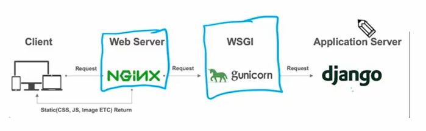

# vue pjt

영화 정보를 제공하는 SPA 제작

AJAX 통신과 JSON 구조에 대한 이해

Single File Component 구조에 대한 이해

vue-cli, vuex, vue-router등 플러그인 활용

## 배포

전개: 소프트웨어 시스템을 사용할 수 있도록 만드는 모든 활동

배포: 최종 사용자에게 소프트웨어를 전달하는 과정

무엇을: 서버 컴퓨터에서 요청과 응답을 처리할 프로그램

언제: 개발(분석, 계획, 설계, 개발, 테스트) ->|배포 시점|-> 운영(배포, 운영)

누가, 어디에: 사용자가 사용자컴퓨터에(native app), 제공자가 제공자 컴퓨터에(web app) - 클라우드(AWS, Azure, GCP)를 통해

어떻게: git -> jenkins -> 배포

flow

