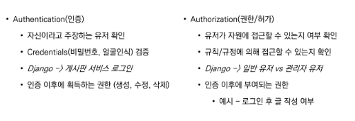
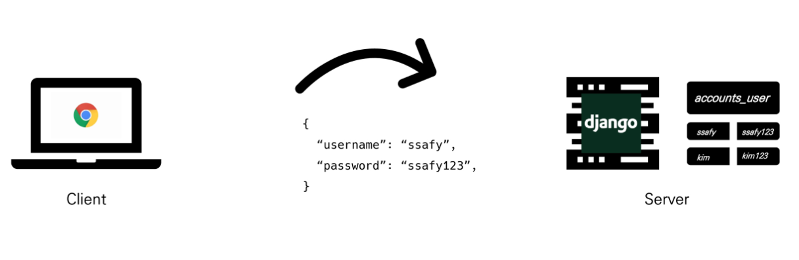
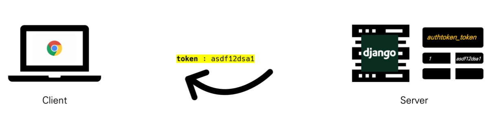
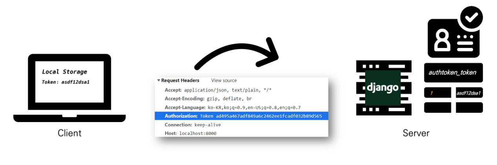
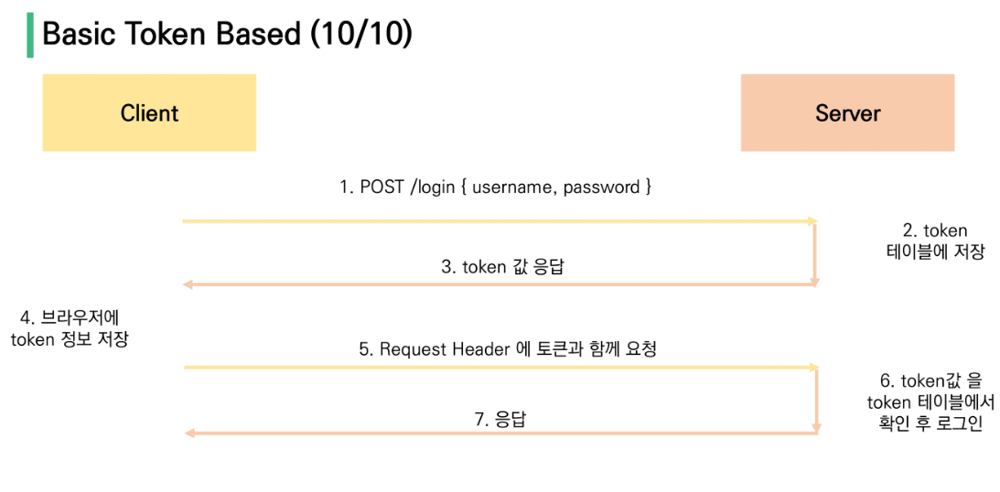

# vue + api 서버 활용

## server & client

* server
  * 클라이언트에게 '정보', '서비스'를 제공하는 컴퓨터 시스템

* client
  * 서버에게 그 서버가 맡는 서비스(올바른 요청- 알아들을수있게)를 요청
  * 서비스 요청을 위해 필요한 인자를 서버가 요구하는 방식에 맞게 제공
  * 서버로부터 반환되는 응답을 사용자에게 적절한 방식으로 표현하는 기능


`server는 정보제공, client는 정보요청&표현`


## startproject model+ serializer

```python
#settings.py
AUTH_USER_MODEL = 'accounts.User'
```

```python
# accounts/models.py
from django.contrib.auth.models import AbstractUser
class User(AbstractUser):
    pass
```

```python
# articles/models.py
from django.conf import settings
class Article(models.Model):
    user = models.ForeignKey(settings.AUTH_USER_MODEL, on_delete = models.CASCADE, related_name='articles')
    title = models.CharField(max_length=100)
    content = models.TextField()
    created_at = models.DateTimeField(auto_now_add=True)
    updated_at = models.DateTimeField(auto_now=True)
    like_users = models.ManyToManyField(settings.AUTH_USER_MODEL, related_name='like_articles')

class Comment(models.Model):
    user = models.Foreignkey(settings.AUTH_USER_MODEL, on_delete =models.CASCADE, related_name = 'comments')
    article = models.ForeignKey(Article, on_delete =models.CASCADE, related_name = 'comments')
    content = models.CharField(max_length=200)
    created_at = models.DateTimeField(auto_now_add=True)
    updated_at = models.DateTimeField(auto_now=True)
```

```python
# articles/serializers/article.py
from rest_framework import serializers
from ..models import Article
from django.contrib.auth import get_user_model
from .comment import CommentSerializer

User = get_user_model()

class ArticleSerializer(serializers.ModelSerializer):
    
    class UserSerializer(serializers.ModelSerializer):
        class Meta:
            model = User
            fields = ('pk', 'username')
            
    user = UserSerializer(read_only=True)
    comments = CommentSerializer(many= True, read_only=True)
    like_user = UserSerializer(read_only=True, many=True)
    
    class Meta:
        model = Article
        fields = ('pk','user','title','content','comments','like_users')

# articles/serializers/comment.py
from django.contrib.auth import get_user_model
from ..models import Comment
User = get_user_model()

class CommentSerializer(serializers.ModelSerializer):
    
    class UserSerializer(serializers.ModelSerializer):
        class Meta:
            model = User
            fields = ('pk', 'username')
            
    user = UserSerializer(read_only=True)
    
    class Meta:
        model = Comment
        fields = ('pk','user','content','article',)
        read_only_fields = ('article',)
```

```
이때 user, comments, like_users를 불러오면 그 사용자의 pk를 가져옴
계속해서 user의 pk를 요청해서 그 사람의 id를 가져와줘 하면 ux가 현저히 떨어짐
따라서 요청 한번으로 username을 바로 가져올 수 있게끔 해야함!
=> serializer 사용!

CUD => validation
R => data serializing -> read_only_fields
```


```python
# urls.py
urlpatterns = [
    path('admin/', admin.site.urls),
    path('api/v1/articles', include('articles.urls')),
    path('api/v1/accounts', include('accounts.urls')),
]
```

```python
# accounts/urls.py
from django.urls import path
from . import views
app_name = 'accounts'
urlpatterns = [
    
]
```


```python
# articles/urls.py
from django.urls import path
from . import views
app_name = 'articles'
urlpatterns = [
    
]
```


## CORS

* SOP(same-origin policy)
  * 동일 출처 정책
  * 특정 출처에서 불러온 문서나 스크립트가 다른 출처에서 가져온 리소스와 상호작용하는 것을 제한하는 보안방식
  * 잠재적으로 해로울 수 있는 문서를 분리 - 공격받을 수 있는 경로 ↓


* 출처(origin)

  * 두 url의 protocol, port, host가 모두 같아야 동일한 출처

  * `http://localhost:3000/`posts/3 

       ↓                    ↓             ↓

  * protocol/      host     /port/


* CORS(cross-origin resource sharing)
  * 교차 출처 리소스 공유
  * 어떤 호스트에서 자신의 컨텐츠를 불러갈 수 있는지 서버에 지정할 수 있는 방법
  * **추가 http header**를 사용(HOW TO USER CORS)
  * 특정 출처에서 실행중인 웹 애플리케이션이 다른 출처의 자원에 접근할 수 있는 권한을 부여하도록 브라우저에 알려주는 체제
  * 보안상의 이유로 **브라우저는 교차 출처 http 요청 제한(SOP)**
  * 다른 출처의 리소스를 불러오려면 **그 출처에서 올바른 CORS header를 포함한 응답을 반환해야함**


* CORS policy(↔SOP)
  * 교차 출처 리소스 공유 정책
  * 다른 출처에서 온 리소스를 공유하는 것에 대한 정책


* CORS 를 사용하는 이유
  * 브라우저 & 웹 애플리케이션 보호
    * 악의적인 사이트의 데이터를 가져오지 않도록 사전 차단
    * 응답으로 받는 자원에 대한 최소한의 검정
    * 서버는 정상적으로 응답/ 브라우저에서 차단
  * SERVER의 자원관리
    * 누가 해당 리소스에 접근할 수 있는 관리 가능


* Access-control-allow-origin 응답 헤더
  * 이 응답이 주어진 출처로부터 요청코드와 공유될 수 있는지를 나타냄
  * ex) Access-Control-Allow-Origin: *
  * 모든 도메인에서 잡근 할 수 있음을 의미


* `django-cors-headers` 라이브러리

  * 응답에 CORS header를 추가해주는 라이브러리

  * 다른 출처에서 보내는 django 애플리케이션에 대한 브라우저 내 요청을 허용함

  * django APP 이 header 정보에 CORS를 설정한 상태로 응답을 줄 수 있게 도와주며, 이 설정을 통해 브라우저는 다른 origin에서 요청을 보내는 것이 가능해짐

  * ```bash
    $ pip install django-cors-headers
    ```

  * ```python
    #settings.py
    INSTALLED_APPS = [
        'corsheaders',
    ]
    MIDDLEWARE = [
        'corsheaders.middleware.CorsMiddleware',
        'django.middleware.common.CommonMiddleware',
    ]
    CORS_ALLOWED_ORIGINS = [
        'https://localhost:8080',
    ]
    ```

    

## Authentication & Authorization

* authentication : 인증, 입증
  * 자신이라고 주장하는 사용자가 누구인지 확인하는 행위
  * 모든 보안 프로세스의 첫번째 단계
  * 401 unauthorized
* authorization: 권한부여, 허가
  * 사용자에게 특정 리소스 또는 기능에 대한 액세스 권한을 부여하는 과정
  * 보안 환경에서 권한 부여는 항상 인증을 따라야함
  * 인증이 되었어도 모든 권하는 부여받는 것은 아님
  * 403 forbidden



### DRF authentication

다양한 인증방식

1. SESSION based
2. **token based**
   1. basic token
   2. JWT
3. Oauth
   1. google
   2. facebook
   3. github 
   4. ....


* basic token authentication









## JWT

json web token

```
json 포맷을 활용하여 요소 간 안전하게 정보를 교환하기 위한 표준 포맷

암호화 알고리즘에 의한 디지털 서명이 되어있기 때문에 jwt 자체로 검증 가능

jwt 자체가 필요한 정보를 모두 갖기 때문에 이를 검증하기 위한 다른 검증수단이 필요없음
```


단점: 

```
토큰 탈취시 서버 측에서 토큰 무효화가 불가능(블랙리스팅 테이블 활용)
매우 짧은 유효기간(5min)과 refresh 토큰을 활용하여 구현
MSA 구조에서 서버간 인증에 활용
```


```bash
$ pip install django-allauth
$ pip install dj-rest-auth
```

```python
# settings.py
INSTALLED_APPS = [
    'rest_framework',
    'rest_framework.authtoken',
    'dj_rest_auth',
    'dj_rest_auth.registration',
    'allauth',
    'allauth.account',
    'django.contrib.sites',
    ...
]

SITE_ID = 1
REST_FRAMEWORK = {
    # 인증을 토큰으로 할 것이고
    'DEFAULT_AUTHENTICATION_CLASSES' :[
        'rest_framework.authentication.TokenAuthentication',
    ],
    # 인증된 사람만 들어와
    'DEFAULT_PERMISSION_CLASSES':[
        'rest_framework.permissions.IsAuthenticated',
        # 만약 모두 다 들어와 하고 싶으면
        # 'rest_framework.permissions.AllowAny',
    ]
}
```

```python
# urls.py
urlpatterns = [
    path('admin/', admin.site.urls),
    path('api/v1/accounts/', include('dj_rest_auth.urls')),
    path('api/v1/accounts/signup/', include('dj_rest_auth.registration.urls')),
]
```


로그아웃 할 때도(토큰 삭제)

post 방식으로 보낼때

`https://12------/accounts/logout/`

headers에 key: `authrization`에 value: `Token {api key}` 작성하면 됨


```python
# urls.py
from . import views
app_name = 'accounts'
urlpatterns = [
    path('profile/<username>/', views.profile),
]
```


```python
# views.py
from django.shortcuts import render
from django.contrib.auth import get_user_model
from rest_framework.decorators import api_view
from rest_framework.response import Response
from .serializers import ProfileSerializer
User = get_user_model()

@api_view(['GET'])
def profile(request, username):
    user = get_object_or_404(User, username= username)
    serializer = ProfileSerializer(user)
    return Response(serializer.data)
```


```python
# serializers.py
from rest_framework import serializers
from django.contrib.auth import get_user_model
from articles.models import Article

class ProfileSerializer(serializers.ModelSerializer):
    class ArticleSerializer(serializers.ModelSerializer):
        class Meta:
            model = Article
            fields = ('pk','title')
    like_articles = ArticleSerialzier(many = True)
    articles = ArticleSerializer(many=True)
    
    class Meta:
        model = get_user_model()
        fields = ('pk','username','email',)
```


