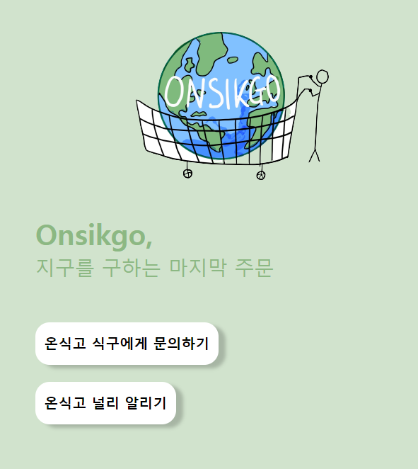

# 현재 url 복사하기



온식고 널리 알리기 버튼을 누르면 현재 url이 복사될 수 있도록


##  코드

1. template

   ```vue
   <template>
   	<button @click="copyLink">온식고 널리 알리기</button>
   </template>
   ```

2. script

   ```vue
   <script>
       methods: {
           copyLink () {
               let currentUrl = window.document.location.href;
   
               let t = document.createElement("textarea");
               document.body.appendChild(t);
               t.value = currentUrl;
               t.select();
               document.execCommand("copy");
               document.body.removeChild(t);
   
               alert("복사가 완료되었습니다");
           }
       }
   </script>
   ```

   

* copylink는 textarea, input에서 작성된 텍스트만 복사 가능!
  * 그렇기 때문에 보기 싫으면 remove해서 복사한후에 삭제하면 돼!