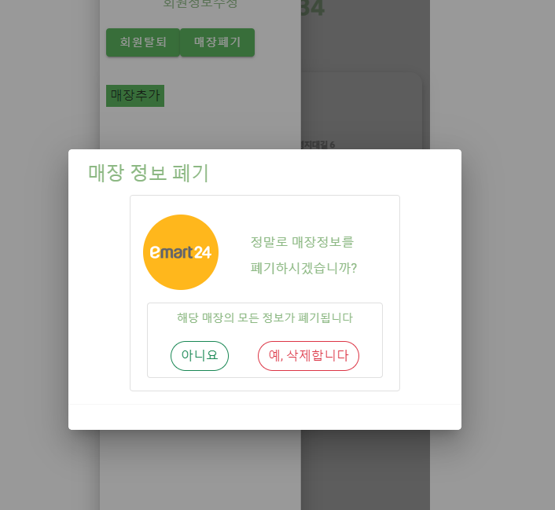
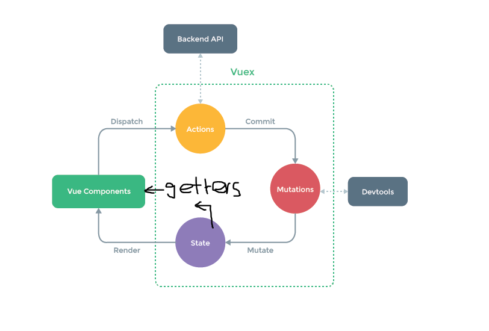

# VUEX 사용



매장 폐기를 할 경우 해당 매장의 이미지와 해당 매장의 이름을 받아와야한다. 

그러나 내가 해당 매장의 정보를 가지고 있는 것은 MypageOwnerView.vue이고

해당 매장의 정보를 보여주는 곳은 App.vue이기 때문에 vuex를 사용하는 것이 적절하다!


따라서 vuex를 공부해봐야겠다


## VUEX란

* 정의
  * 애플리케이션의 모든 컴포넌트에 대한 중앙 집중식 저장소 역할을 하며 예측 가능한 방식으로 상태를 변경 가능

* VUEX의 패턴



```
[State]

Vue component에서는 원본 소스 역할인 data로 볼 수 있습니다.

state는 mutation을 통해서만 변경이 가능합니다.


[Mutations]

유일하게 state를 변경할 수 있는 방법이며 메서드와 유사합니다.

commit을 통해서만 호출 할 수 있으며 함수로 구현됩니다.

API를 통해 전달받은 데이터를 mutations에서 가공하여 state를 변경합니다.


[Actions]

비동기 작업이 가능합니다.

mutation을 호출하기 위한 commit이 가능합니다.

action은 dispatch를 통해 호출할 수 있습니다.

axios를 통한 api 호출과 그 결과에 대해 return을 하거나 mutation으로 commit하는 용도로 사용됩니다.


[Getter]

Vue componet의 computed처럼 계산된 속성입니다.

state에 대해 연산을 하고 그 결과를 view에 바인딩 할 수 있습니다.

state의 변경 여부에 따라 view를 업데이트합니다.
```


* vuex의 흐름
  * vue component에서 dispatch를 통해 action 실행
  * action에서는 외부 api를 호출하는 등 비동기 로직 처리
    * 그 결과를 이용해 동기 로직인 mutations를 호출
  * mutation에서 state를 변경
    * state(data)를 변경할 수 있는 것은 오로지 mutations뿐!
    * filter, reduce 등 다양한 방법으로 데이터 가공 가능
  * getter를 이용하여 다시 component에 바인딩 돼 하면 갱신