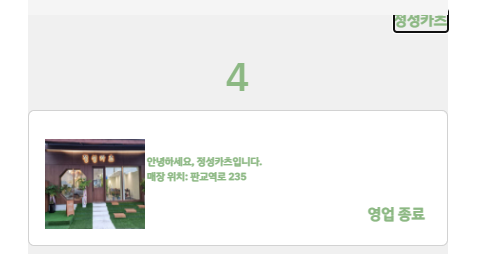

# 마이페이지 내에 해당 데이터 보여주기



마이페이지 안에 매장이 2개 이상인 점주에게는 위에 정성카츠 밑으로 자신의 가게를 셀렉할 수 있는 셀렉트 박스가 나온다

그렇다면 이 셀렉트 박스에 맞춰서 데이터를 따로따로 보여주는 

예를 들어, 정성카츠를 누르면 정성카츠에 대한 데이터가 보여지고 푸가게를 누른다면 푸가게에 대한 마이페이지 데이터가 보여짐

어떻게 실행할 수 있을까?


우선 고려해야 될 상황

1. 정성카츠를 클릭해야된다면 정성카츠에 대한 value를 전달하고 받는 component를 따로 만들어야한다

   즉, 마이페이지 내에 해당 데이터를 보여주는 component를 따로 만들어서 <></> 해줘야함

   나는 마이페이지 전체 뷰는 mypageOwnerView.vue로 지정하고

   안에 컴포넌트는 mypageOwnerComponent.vue로 지정함


2. mypageOwnerView.vue 먼저 살펴보기

   ```vue
   <template>
       <div>
       <!--셀렉트 박스 만들기-->
       <select
           id="dropdown1"
           style="border-color: #63bf68"
           @change="selectStore($event)"
         >
           <option
             :key="index"
             :value="store.storeId"
             v-for="(store, index) in stores"
           >
             {{ store.storeName }}
           </option>
         </select>   
       
       <!--해당 데이터의 마이페이지를 보여줄 모달 가져오기-->
       <div class="item-container">
         <mypage-owner-component :store="this.store"></mypage-owner-component>
       </div>
   	</div>
   </template>
   
   <script>
   import mypageOwnerComponent from "@/components/profile/mypageOwnerComponent.vue";
   import http from "@/util/http-common";
   export default {
       name: "MypageOwnerView",
       components: {
           mypageOwnerComponent
       },
       data () {
           return {
               storeId: Number,
               store: {},
               storeName : "",
           }
       },
       methods: {
           //셀렉트 박스가 선택되는 이벤트가 있으면 그 해당 버튼(event.target)의 value를 storeId에 넣고
           //changeStore라는 함수 실행
           async selectStore(event) {
         		this.storeId = event.target.value;
         		await this.changeStore();
       	},
           // 매장을 바꾸는 함수를 실행하여 그 해당하는 매장의 store 정보를 store와 storeName에 저장하여 
           // component인 mypageOwnerComponent에 props로 보내줌
           changeStore() {
             http.get(`/store/${this.storeId}`).then((response) => {
               this.store = response.data;
               this.storeName = response.data.storeName;
               console.log(response.data);
             });
           },
       } 
   }
   </script>
   ```

   ```
   이 때 주의사항
   1. 셀렉트박스에서 value를 storeId로 넣어줌 - store로 보내는 것보다 한결 편해짐
   2. props로 보낼 때 v-bind를 사용하여 컴포넌트에 보내줌
   ```

   

3. mypageOwnerComponent

   ```vue
   <template>
   	<div>
       <!--나머지는 갖고 오기 나름이고 데이터가 잘 전달되었다는 것만 확인하기 위해 !-->
       <h1>
       {{ store.storeId }}        
       </h1>
       </div>
   </template>
   <script>
   import http from "@/util/http-common";
   export default {
       name: "mypageOwnerComponent",
       props : {
           store: Object,
       },
   }
   </script>
   ```

   

아직 salelist는 완성되지 않았기 때문에 다음 포스팅에서 salelist를 보여주겠음