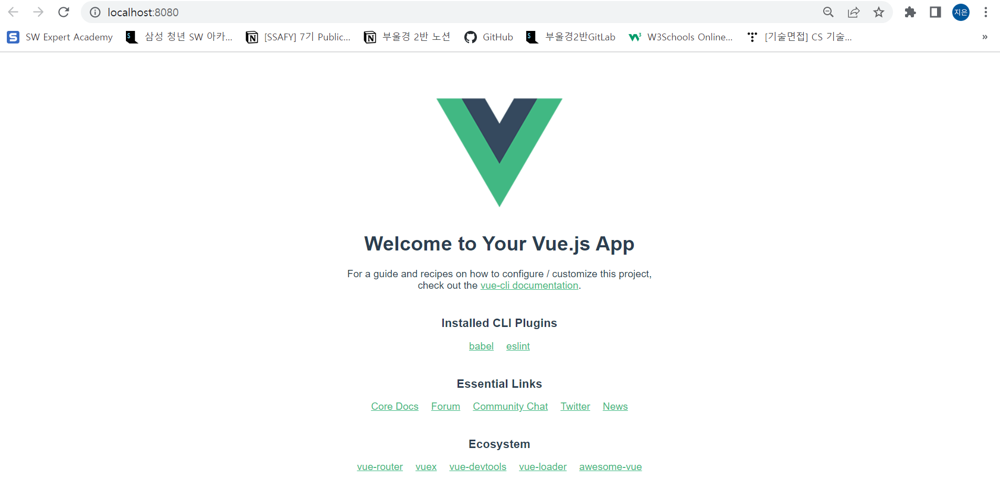
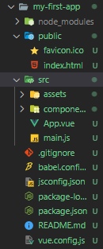
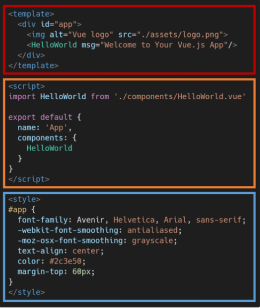
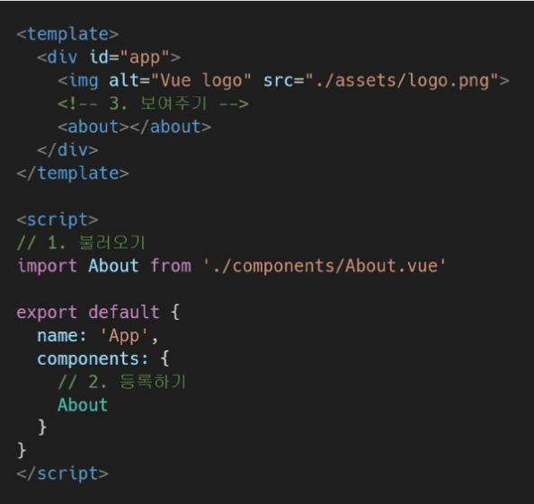
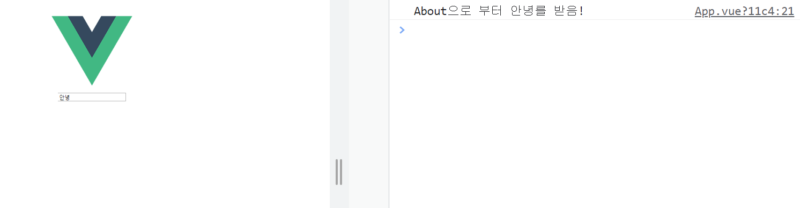

# vue

vue 프로젝트 작성하는 방법

* 설치

  * `$ npm install -g @vue/cli`
  * `$ vue --version`

* 프로젝트 생성

  * `$ vue create my-first-app`	
  * `$ cd my-first-app`

* 서버 실행

  * `$ npm run serve`

  

* vue 프로젝트 구조

  

  * node_modules
    * node.js 환경의 여러 의존성 모듈
  * public/index.html
    * 실제 제공되는 단일 html 파일
  * src/assets
    * webpack에 의해 빌드 된 정적 파일
  * src/components
    * 하위 컴포넌트들이 위치
  * src/App.vue
    * 최상위 컴포넌트
  * src/main.js
    * vue 전역에서 활용할 모듈을 등록할 수 있는 파일
  * babel.config.js
    * babel 관련 설정이 작성된 파일
  * package.json
    * 프로젝트의 종속성 목록과 지원되는 브라우저에 대한 구성 옵션이 포함
  * package-lock.json
    * node_modules에 설치되는 모듈과 관련된 모든 의존성을 설정 및 관리

  

* 컴포넌트 구조
  * 


* 컴포넌트 등록
  * 불러오기 -> 등록하기 -> 보여주기
  * 


## props

부모(상위) 컴포넌트의 정보를 전달하기 위한 사용자 지정 특성

자식(하위) 컴포넌트는 props 옵션을 사용하여 수신하는 props를 명시적으로 선언해야함

즉, 데이터는 props 옵션을 사용하여 자식 컴포넌트로 전달됨


* App.vue

  ```vue
  <template>
    <div id="app">
      
      <!--about.vue를 가져와!-->
      <about 
      my-message= "This is prop data"
      :parent-data = "parentData"
      >
      </about>
    </div>
  </template>
  
  <script>
  import About from './components/About.vue'
  
  export default {
    name: 'App',
    components: {
      About
    },
    // v-bind로 data 보내기
    data:function() {
      return {
        parentData: 'This is parent Data by v-bind'
      }
    },
  }
  </script>
  ```


* About.vue

  ```vue
  <template>
    <div>
      <h1>About</h1>
      <h2>{{ myMessage }}</h2>
      <h2>{{ parentData }}</h2>
    </div>
  </template>
  
  <script>
  export default {
    // should always be multi-word -> 합성어로 만들어야함
    name: 'About-a',
    // app.vue에 보내기 위해서는 props를 보내야함 / props 속성에 대해서 작성
    props: {
      myMessage: String,
      parentData: String,
    }
  }
  </script>
  ```

  

## emit

현재 인스턴스에서 이벤트를 트리거

추가 인자는 리스너의 콜백 함수로 전달

부모 컴포넌트는 자식 컴포넌트가 사용되는 템플릿에서 v-on을 사용하여 자식 컴포넌트가 보낸 이벤트를 청취(v-on을 이용한 사용자 지정 이벤트)


* App.vue

  ```vue
  <template>
    <div id="app">
      
      <about 
      @child-input-change="parentGetChange"
      >
      </about>
    </div>
  </template>
  
  <script>
  import About from './components/About.vue'
  
  export default {
    name: 'App',
    components: {
      About
    },
    methods: {
      parentGetChange: function (inputData) {
        console.log(`About으로 부터 ${inputData}를 받음!`)
      }
    }
  }
  </script>
  ```

  

* About.vue

  ```vue
  <template>
    <div>
      <input
      type = "text"
      @keyup.enter="childInputChange"
      v-model="childInputData"
      >
    </div>
  </template>
  
  <script>
  export default {
    name: 'About-a',
    data: function () {
      return {
        childInputData: null,
      }
    },
    methods: {
      childInputChange: function () {
        this.$emit('child-input-change', this.childInputData)
      }
    }
  }
  </script>
  ```

  




