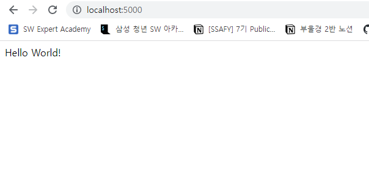

# 보일러 플레이트 코드

컴퓨터 프로그래밍에서  최소한의 변경으로 여러곳에서 재상용되며, 반복적으로 비슷한 형태를 띄는 코드


## nodejs와 expressjs

node.js가 나오기 전까지 javascript를 항상 브라우저에서만 쓸수 있었음

node,js가 나오고 난 후에는 javascript를 서버 사이드에서 사용할 수 있도록 하는 언어


node.js 다운로드 받고

[윈도우]+r 에서 cmd 눌러서 커맨드 창 띄우고

npm init 써서 package.json 다운 받음


visual code로 열기


index.js 파일 만들기


express 다운받기

```
terminal에서 npm install express --save 
```

그러면 node_module이라는 폴더가 생기는데 다운 받은 dependencies들은 다 이폴더에서 관리됨


index.js에서 기본적인 express js 앱 만들기

[기본적인 express 앱](https://expressjs.com/en/starter/hello-world.html)


index.js

```js
const express = require('express')
// 새로운 express 앱을 만듦
const app = express()
// 포트 수는 마음대로 해도됨
const port = 5000

// 루트 디렉토리에 hello world!가 출력될 수 있게 함!
app.get('/', (req, res) => {
  res.send('Hello World!')
})

// port가 들어올 떄 앱을 실행
app.listen(port, () => {
  console.log(`Example app listening on port ${port}`)
})
```

이후에


package.json에 

```json
{
  "name": "boiler-plate",
  "version": "1.0.0",
  "description": "",
  "main": "index.js",
  "scripts": {
    // 이부분 추가
    "start":"node index.js",
    //
    "test": "echo \"Error: no test specified\" && exit 1"
  },
  "author": "zzieun",
  "license": "ISC",
  "dependencies": {
    "express": "^4.18.1"
  }
}
```

start를 하면 index.js에 대해서 node 앱을 실행해라!


terminal에서

```bash
$ npm run start
```


그리고 chrome에서 

localhost:5000하면



완성~