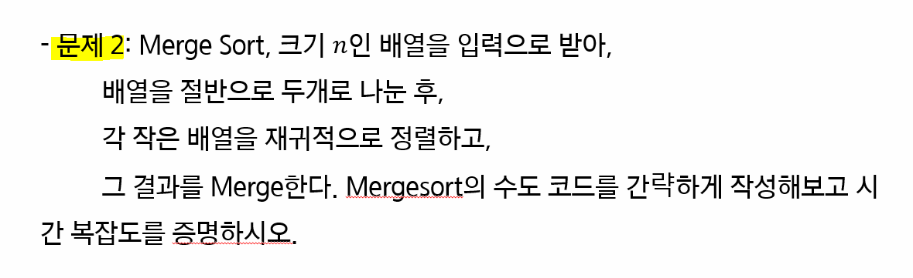

# 재귀

> 함께 학습하고 고민하고 설명하며 작은 부분 하나라도 '내 것'으로 만들어보세요. 😁

## 2번 - Merge Sort Time Complexity Proof

- Merge Sort가 진행되는 과정을 직접 그려보고 각 단계에서 어떤 일이 일어나는지 생각해보세요.
- 기초 수식에서 학습한 재귀식으로 표현하면 어떻게 되는지 같이 생각해보세요.

## 참고자료

http://www.bowdoin.edu/~ltoma/teaching/cs231/fall16/Lectures/02-recurrences/recurrences.pdf

https://www.cs.princeton.edu/courses/archive/spr07/cos226/lectures/04MergeQuick.pdf