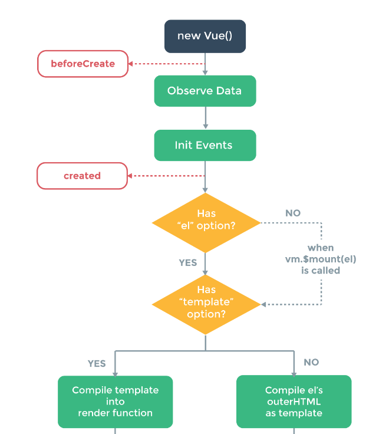
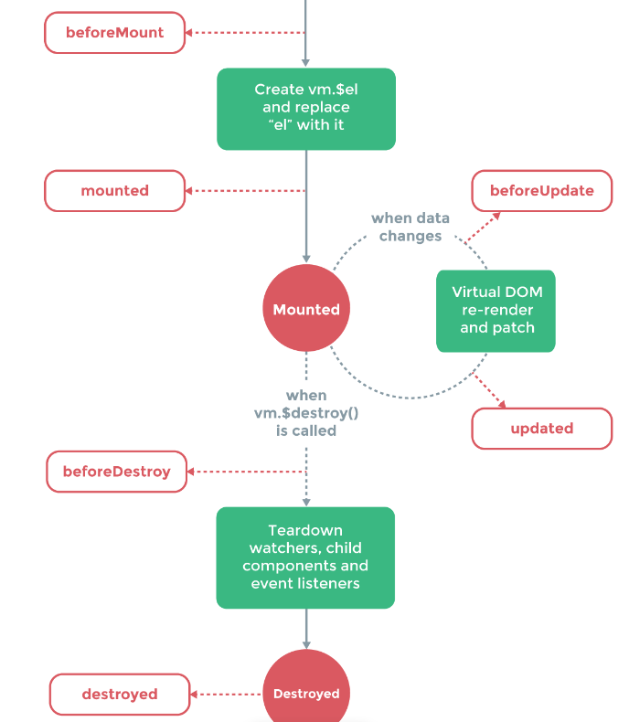

# vue 복습하기

## vue 란?

웹 프론트엔드 프레임워크

* component
  * 웹 페이지 내의 다양한 UI요소
  * 재사용 가능하도록 구조화한 것
* SPA
  * 단일 페이지 어플리케이션
  * 하나의 페이지 안에서 필요한 영역 부분만 로딩 되는 형태
  * 빠른 페이지 변환
  * 적은 트래픽 양


## project 생성 전 준비사항!

* vue cli 설치하기

  ```bash
  $ npm install -g @vue/cli
  ```

  * project 생성

    ```bash
    $ vue create <폴더명>
    ```

  * 폴더 안에 들어가기

    ```bash
    $ cd test
    ```

  * 실행

    ```bash
    $ npm run serve
    ```

* vue router 생성(웹페이지 간 이동)

  ```bash
  $ npm install vue-router --save
  ```

* vue bootstrap 사용하기

  ```bash
  $ npm install vue bootstrap-vue bootstrap
  ```

  main.js에 추가하기

  ```js
  import Vue from 'vue'
  import App from './App.vue'
  import router from './router'
  import { BootstrapVue, 
          IconsPlugin 
         } from 'bootstrap-vue'
  
  // Import Bootstrap and BootstrapVue CSS files (order is important)
  import 'bootstrap/dist/css/bootstrap.css'
  import 'bootstrap-vue/dist/bootstrap-vue.css'
  
  <!--app을 mount할 때 router를 쓸수 있게끔-->
  new Vue({
      router,
      render: h => h(App),
  }).$mount('#app')
  ```
  


## project start

* layout 만들기

  ```vue
  <!--test/src/components/layout/Header.vue-->
  <template>
    <!--bootstrap에서 navbar 가져오기-->
  </template>
  <script>
    export default {
        name: "header",
    };
  </script>
  ```

  ```vue
  <!--test/src/App.vue-->
  <template>
    <div id = "app">
        <!--navbar인 헤더 영역 설정-->
        <Header />
        <!--자주 바뀌는 컨텐츠 영역 설정
            장고에서 block content 같은 곳임-->
        <div id = "content" class = "content">
            <router-view></router-view>
        </div>     
    </div>
  </template>
  
  <script>
  import Header from "./components/layout/Header.vue";
  
  <!--갖고오려는 component를 가져오기-->
  export default {
      name:'App',
      components:{
          Header,
      },
  };
  </script>
  ```


* 페이지에 해당하는 컴포넌트 만들기

  test/src/views

  ```vue
  <!--views/Home.vue-->
  <template>
    <div>
      <h1>
          Welcome to {{title}}'s site!
      </h1>
      <!--밑에 있는 데이터와 바인딩-->
      <input type = "text" v-model= "input1" />
      <button type = "button" @click="getData">
          Get
      </button>
      <button type = "button" @click="setData">
          Set
      </button>
      <!--v-model을 통해 데이터 value를 바인딩할 수 있고
          아래의 option을 통해 선택 가능한 박스 만들 수 있음-->
      <select class = "form-control" v-model="region" @change="changeRegion">
          <option :key="i" :value="d.v" v-for="(d, i) in options">{{d.t}}</option>
      </select>
      <!--true일 경우에만 보일 수 있게-->
      <table class = "table table-bordered" v-if="tableShow">
      <!--<table class = "table table-bordered" v-show="tableShow"> 
       무조건 테이블을 보여주긴 하는데 화면에만 안보이게끔-->
          <!--행-->
          <tr :key="i" v-for="(d, i) in options">
            <td>{{d.v}}</td>
            <td>{{d.t}}</td>
          </tr>
      </table>
    </div>
  </template>
  <script>
  export default {
      <!--데이터 컨트롤-->
      data() {
          return {
              title: "지은이",
              input1: "abc",
              options : [
                  {v:"S", t:"Seoul"},
                  {v:"J", t:"Jeju"},
                  {v:"B", t:"Busan"}
              ],
              region: "J",
              tableShow: false,
          };
      },
      <!--정의한 데이터가 변경되는 것을 바로 알 수 있음-->
      watch: {
          <!--모니터링할 데이터 이름을 그대로 따온 function으로 만들면됨-->
          input1() {
              console.log(this.input1);
          }
      },
      methods: {
          getData() {
              <!--위에있는 데이터에 접근하기 위해서는 this 사용-->
              alert(this.input1);
          },
          setData() {
              this.input1 = "12345";
          },
          changeRegion() {
              alert(this.region);
          }
      },
      <!--라이프 사이클 hooks-->
      beforeCreate() {
          console.log("beforeCreate")
      },
      created() {
          console.log("created")
      },
      beforeMount() {
          console.log("beforeMount")
      },
      mounted() {
          console.log("mounted")
      },
      beforeUpdate() {
          console.log("beforeUpdate")
      },
      updated() {
          console.log("updated")
      },
      beforeDestroy() {
          console.log("beforeDestroy")
      }, 
      destroyed() {
          console.log("destroyed")
      },
  };
  </script>
  ```

  ```vue
  <!--views/About.vue-->
  <template>
    <div>
      <h1>
          About Page
      </h1>    
    </div>
  </template>
  <script>
  export default {
      
  }
  </script>
  ```


* router 만들기

  test/src/router.js

  ```js
  import Vue from "vue";
  import VueRouter from "vue-router";
  <!--컴포넌트 추가하기!-->
  import Home from "./views/Home";
  import About from "./views/About";
  
  <!--vue router 사용할게-->
  Vue.use(VueRouter);
  
  const router = new VueRouter({
      mode:"history",
      <!--url 주소 설정-->
      routes: [
          {path:"/", 
           component:Home},
          {path:"/about", 
           component:About}
      ]
  })
  ```

  라우터 사용하기 위해서는 main.js에 router 등록 해줘야함!


## 라이프 사이클





```
beforeCreate
created: 옵션들의 설정을 완료되는 시점
beforeMount: 실제 component가 dom에 추가되기 직전에 호출
Mounted: 실제 component가 dom에 추가되기 직후에 호출
beforeUpdate: 데이터가 바뀔 때 재 렌더링되기 직전에 호출
updated: 재 렌더링 된 후에 호출
beforeDestroy: 다른 component로 넘어갈 때 component를 삭제하기 직전에
destroyed: 다른 component로 넘어갈 때 component를 삭제하기 직후에
```

