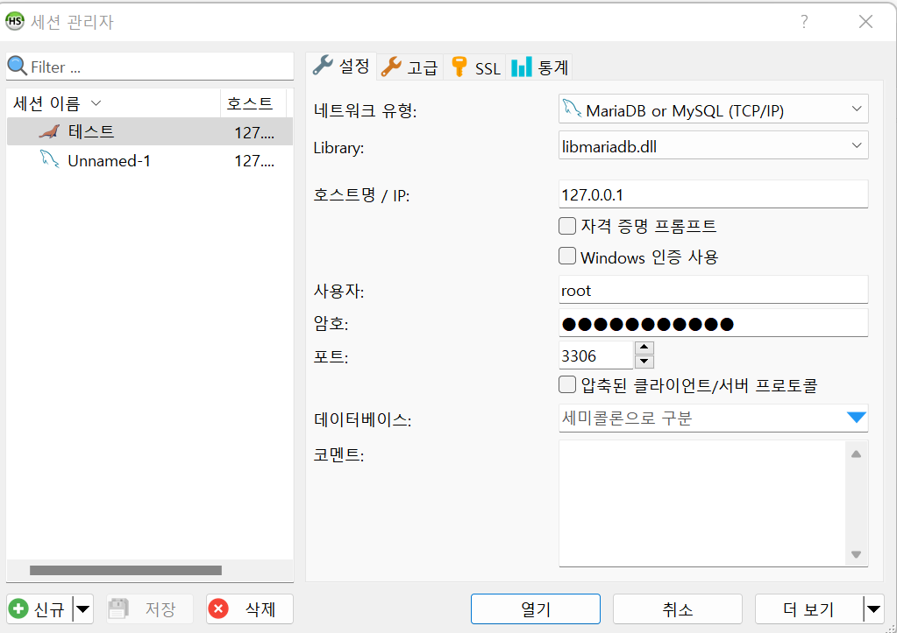
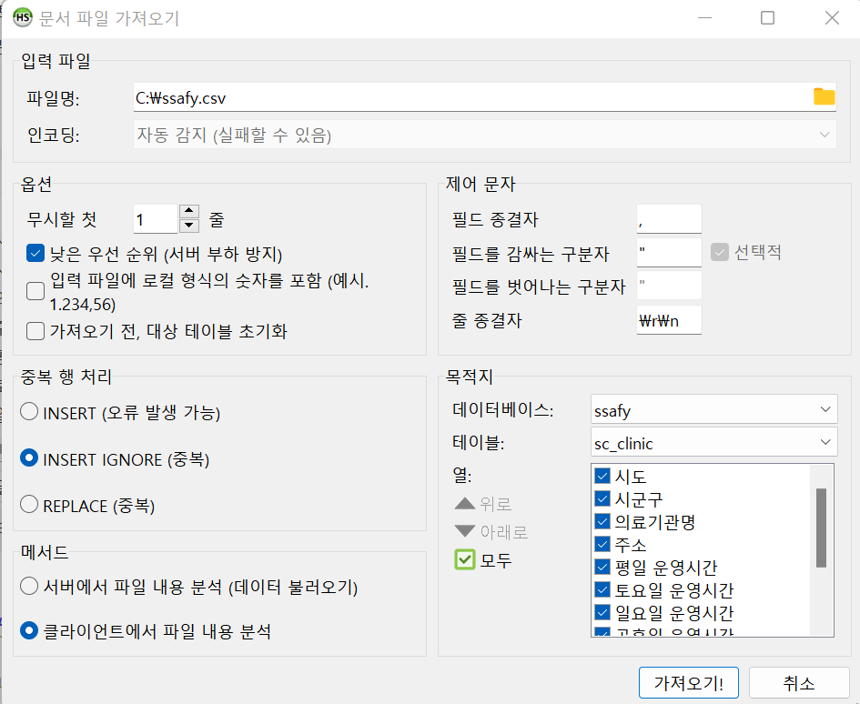

# MYSQL/MariaDB data processing

DB에 직접 데이터를 넣어보고 가공!


* 데이터 이행
  * 프로젝트 오픈시 실제 데이터를 운영 DB에 반영하는 작업
  * 대량 데이터의 경우 오픈 후에는 증분(신규/수정/삭제)데이터만 반영(스케줄 또는 API 연계 등)
* 데이터 적재 시점
  * 서버 DOWN 타임에 적재(운영서버가 다른 DB서버로 교체 불가인 경우)
  * 사전 적재(신규 서버 도입인 경우 미리 적재가 가능)
  * 서비스 오픈 후 적재(내부 오픈 등으로 외부 오픈일이 따로 있는 경우 운영자가 따로 정해진 시간에 적재)
* 적재방법
  * DB 백업본 restore(특정 시점 이전까지의 데이터 dump) 사용하여 데이터 이관 후 오픈 시점까지의 증분 데이터는 소급 반영
  * 텍스트 데이터 이관(다양한 형식의 텍스트 파일: csv, txt, json..)
  * DB TO DB 마이그레이션(DB 또는 솔루션 사용)
  * 정제된 텍스트 데이터를 DB에 직접 인서트
  * 정제되지 않은 데이터를 입력이 가능한 형태로 가공 및 인서트
  * 데이터 제공자 측에서 제공하는 restful API를 호출하여 데이터 인서트(외부망으로 연계가 가능해야 하며 주로 증분 데이터에만 사용)


## Mysql과 MariaDB 사용 이유

* DB 시장에서 사용할 수 있는 최초의 오픈 DB중 하나이며 가장 널리 사용되고 있는 관계형 데이터베이스 관리 시스템
* 오픈소스 라이선스를 따르기는 하지만 상업적 이용시 상업용 라이선스를 구입해야함
* MySQL의 창시자인 몬티 와이드니어가 만든 프로젝트가 MariaDB
* 두 DB의 성능 차이는 크게 없음
* MariaDB와 MySQL의 호환성은 매우 높다
* AWS의 Amazon Aurora와 교체 사용하기 용이하다
* 상용버전이 별도로 없음 - MariaDB
* 상대적으로 많은 레퍼런스들이 있음 - MySQL


# Maria DB data processing

데이터베이스 관리를 위해 필요한 데이터 처리에 대해서 과제를 해보자!


우선 heidi sql이라는 것이 MySql 보다는 다운로드도 빠르고 처리하기 쉽다고 들어서 heidi sql을 사용해보려고 한다. 

heidi sql을 사용하기 위해서는 Maria DB를 설치해야한다.

[Maria DB 설치](https://mariadb.org/) -> DOWNLOAD

[Heidi sql 설치](https://www.heidisql.com/download.php) -> DOWNLOAD


신규를 클릭하고 maria db 설치할 때 설정했던 암호를 입력한 후 저장을 하고 열기를 누르면 창이 뜬다!




그 이후에 데이터베이스를 생성하고 그 데이터 베이스 안에서 테이블을 생성한다


그 후 [도구] - [csv 파일 가져오기] 



```
파일명은 바탕화면에서 가져와도 꼬이길래 안전한 로컬 드라이브에서 가져옴!
인코딩은 utf8에서 가져옴
중복 행 처리에서는 중복 무시하고 가져오기로 함!
메서드에서 클라이언트에서 파일 내용 분석을 해야 가져올 수 있었다
필드 종결자는 csv 파일을 txt 파일에서 보면 어떤걸로 구분되는지 확인 가능
줄 종결자는 txt 파일로 열었을 때 csrf 이면 r,n 으로 바꾸고 lf면 n으로만!
목적지는 아까 설정한 데이터베이스와 테이블을 설정하면 되는데 테이블이 없는 상태에서 가져오려먼 <새 테이블>을 클릭하면 된다
가져올 열들을 클릭한 후 가져오기!를 누르면 됨!
```

가져오기!를 하면 완성


이전에 필요한 열들만 뽑아오기 위해 필요없는 열은 삭제!

```sql
ALTER TABLE `sc_clinic`
	DROP COLUMN `기준일`,
	DROP COLUMN `검체채취 가능`,
	DROP COLUMN `신속항원검사(RAT)
실시가능`,
	DROP COLUMN `관할보건소`,
	DROP COLUMN `관할보건소 전화번호`,
	DROP COLUMN `장애인 편의사항`;	
```


그 이후에 

```sql
ALTER TABLE sc_clinic ALTER COLUMN ssafy_nm SET DEFAULT '7기부울경_최지은';
ALTER TABLE sc_clinic ALTER COLUMN reg_dt SET DEFAULT current_timestamp;
```

sql문을 사용해서 원하는 ssafy_nm과 reg_dt 열 추가를 한다

그렇다면 데이터는 완성!(데이터 전처리 완성)


그 이후에 아무 데이터를 선택한 후 우클릭하면 [격자행 내보내기]를 누르면 csv 파일로 내보낼 수 있다!


## 느낀점

```
데이터 전처리 하는 것이 가장 어려웠지만 sql문으로 작성하는 것보다 heidi sql을 사용하면 더 편하게 된다는 것을 알 수 있었다! 그래도 기본적인 sql문을 알아야만 heidi sql을 사용할 수 있었기 때문에 sql문 데이터 전처리하는 것을 더 자세히 알아야 된 것같다!
```

