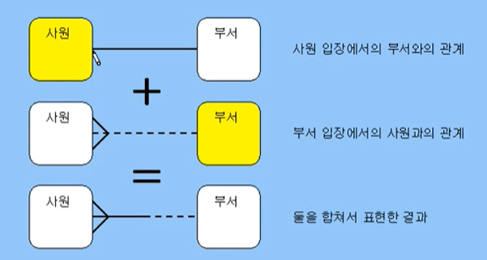

# Database 설계 및 SQL 작성

효율적인 database를 관리하기 위해서 db 설계 필수!

-> **파급효과**, 데이터 품질, **간결함**


* 파급효과
  * 시스템 구축에는 수많은 과정이 동반
  * 병행 또는 통합 테스트 단계에서 데이터 모델의 변경을 진행한다면 => 파국
* 간결함
  * 데이터 모델은 구축할 시스템의 요구사항과 한계를 가장 명확하게 표현하는 도구
  * 데이터 모델을 통해 많은 관련자들이 동일하게 이해하고 작업을 진행, 즉 설계도면
  * 데이터 모델을 통한 의사소통이 직관적이지 않다면 => 불편


## RDBMS

관계형 데이터 모델

실체(entity), 속성(attribute), 관계(relationship)으로 구성된 ER Diagram으로 표현

점선: 선택/ 실선: 필수

새발 모양: many/ 단 모양: one




## ERD(entity relationship diagram)

ERD를 통해서 협업하는 동료들과 프로젝트의 스펙을 커뮤니케이션 오류없이 이해할 수 있으며, 프로젝트의 스펙을 정의


## INDEX

인덱스란 추가적인 쓰기작업과 저장 공간을 활용하여 데이터베이스 테이블의 검색 속도를 향상 시키기 위한 자료구조


INDEX를 사용하지 않은 컬럼을 조회해야하는 상황이라면 전체를 탐색하는 FULL SCAN을 수행해야함. FULL SCAN은 전체를 비교하여 탐색하기 때문에 처리 속도가 떨어진다.


```
[ 인덱스(index)의 관리 ]
DBMS는 index를 항상 최신의 정렬된 상태로 유지해야 원하는 값을 빠르게 탐색할 수 있다. 그렇기 때문에 인덱스가 적용된 컬럼에 INSERT, UPDATE, DELETE가 수행된다면 각각 다음과 같은 연산을 추가적으로 해주어야 하며 그에 따른 오버헤드가 발생한다.

INSERT: 새로운 데이터에 대한 인덱스를 추가함
DELETE: 삭제하는 데이터의 인덱스를 사용하지 않는다는 작업을 진행함
UPDATE: 기존의 인덱스를 사용하지 않음 처리하고, 갱신된 데이터에 대해 인덱스를 추가함
```


### 인덱스의 자료구조

[해시테이블]

(Key, Value)로 데이터를 저장하는 자료구조 중 하나로 빠른 데이터 검색이 필요할 때 유용

key값을 이용해 고유한 index를 생성하여 그 index에 저장된 값을 꺼내오는 구조

```
해시가 등호(=) 연산에만 특화되었기 때문에 db인덱스에서 해시 테이블이 사용되는 경우는 제한적. 해시 함수는 값이 1이라도 달라지면 완전히 다른 해시 값을 생성하는데, 이러한 특성에 의해 부등호 연산(>, <)이 자주 사용되는 데이터베이스 검색을 위해서는 해시 테이블이 적합하지 않다.
```


[B+tree]


실제 쿼리가 INDEX를 타는지 확인하는 방법

```
COMMAND:EXPLAIN
```

B-tree

```sql
EXPLAIN
SELECT *
FROM SSAFY_STUDENT WHERE lastname = 'Doe';
```

key와 possible_keys가 나타나고, type은 ALL이 아님 ??


모든 쿼리에 인덱스를 태울 필요는 없다!(정답이 없어서 주체적으로 판단해야함)