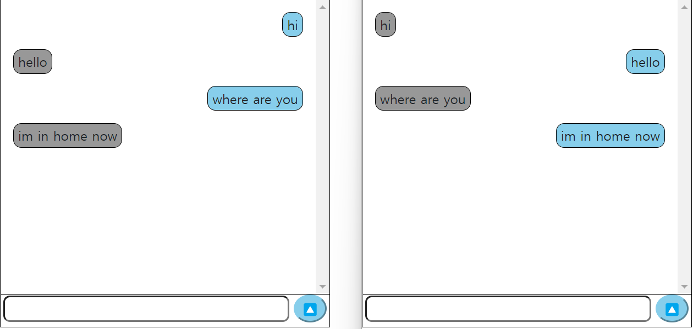

# PJT6

node.js와 soket.io를 활용한 채팅 server/client 구현


* node.js는 무엇인가?
  * 자바스크립트 런타임(실행환경)
  * 서버가 아니라 서버와 같은 네트워크 프로그램을 만들기 위한 sw 플랫폼
* 쓰는 이유
  * 브라우저 없이 javascript를 실행하려면 실행환경이 필요
* 특징
  * 단일 쓰레드 이벤트 루프 기반
  * 비동기 non-blocking I/O 처리
  * 이벤트 발생 시 서번에 메시지 형태로 전달
* 장점
  * javascript를 사용해서 서버를 만들 수 있다는 것이 가장 큰 장점
  * npm을 통한 다양한 모듈 제공
* 단점
  * 코드를 순차적으로 실행하는 것이 아니라 비동기 방식으로 이벤트를 보내고, 단일 쓰레드이기 떄문에 하나의 작업 자체가 많이 걸리는 서비스 형태의 경우에는 사용 불가능
* 사용하면 좋은 상황
  * 간단한 서버 로직
  * 빠른 응답시간 요구
  * 빠른 개발 요구
  * 비동기 방식에 어울리는 스트리밍 서비스, 채팅 서비스


[js 이벤트 제어]

event 모듈

이벤트를 대기하는 eventlistener 함수들이 옵저버 역할을 함

옵저버들이 이벤트를 기다리다가, 이벤트가 실행되면 이벤트를 처리하는 함수가 실행


이벤트 모듈을 사용하려면 require() 메소드를 이용하여 로드하고, 그 객체를 통해 eventemitter 클래스를 로드하여 사용하는 것이 일반적

```javascript
// events 모듈 사용
var events = require('events');

// event emitter 객체 생성
var eventEmitter = new events.EventEmitter();
```


이벤트 핸들러와 이벤트를 연동시키는 것

```javascript
eventEmitter.on('eventName', eventHandler);
```


프로그램 안에서 이벤트를 발생시킬 땐 다음 코드 사용

```javascript
eventEmitter.emit('eventName');
```


[event 객체 메소드]

addListener(event, listener): 이벤트 생성하는 메소드

.on(event, listener): 이벤트를 생성하는 메소드

.emit(eventName[,...args]): 이벤트를 발생


[event 생성]

```javascript
var EventEmitter = require('events');

var custom_event = new EventEmitter();

custom_event.on('call', function() {
    console.log('이벤트 콜');
});

custom_event.emit('call')
```


[event 제거]

```javascript
var EventEmitter = require('events');

var custom_event = new EventEmitter();

custom_event.on('call', function() {
    console.log('이벤트 콜');
});

custom_event.removeAllListeners();

custom_event.emit('call');
```


[socket.io]

채팅방에 특화된 라이브러리


<socket.io 송수신 메소드>

* 소켓 메세지 수신

  ```javascript
  // 접// 접속된 모든 클라이언트에게 메시지를 전송한다
  io.emit('event_name', msg);
   
  // 메시지를 전송한 클라이언트에게만 메시지를 전송한다
  socket.emit('event_name', msg);
   
  // 메시지를 전송한 클라이언트를 제외한 모든 클라이언트에게 메시지를 전송한다
  socket.broadcast.emit('event_name', msg);
   
  // 특정 클라이언트에게만 메시지를 전송한다
  io.to(id).emit('event_name', data);
  ```

* 소켓 메세지 송신

  ```javascript
  // 클라이언트와 소켓IO 연결됬는지 안됬는지 이벤트 실행. (채팅방에 누가 입장하였습니다/퇴장하였습니다 )
  io.on('connection/disconnection', (socket) => {
  });
   
  // 클라이언트에서 지정한 이벤트가 emit되면 수신 발생
  socket.on('event_name', (data) => {
  });
  ```


node.js  설치

'chat'이라는 폴더를 만든 후 cmd 창에서 그 폴더로 이동하고 

새로운 프로젝트를 만들기 위해

```bash
$ npm init -y
```

이후에 express, socket.io 설치

```bash
$ npm install express socket.io
```


이후 chat 폴더에서 visual code 오픈!

서버사이드인 server.js와 클라이언트 사이드인 index.html 만들기!


## server.js(서버사이드)

서버에서 수행할 로직들을 구성

```
on: 수신

emit: 발신

broadcast: 모두에게 보여줌
```


```js
var express = require('express');
var app = express();

var http = require('http');
var server = http.Server(app);

var socket = require('socket.io');
var io = socket(server);

// 포트 3000번으로 저장
var port = 3000;
// 채팅에 접속한 유저들의 소켓을 가지고 있을 배열변수 선언
var socketList = [];

// localhost:3000/ 으로 접속할 시 클라이언트에게 index.html 파일이 보이게 설정
app.use('/', function(req, resp) {
    resp.sendFile(__dirname + '/index.html');
});

io.on('connection', function(socket) {
  // 특정 소켓에서 connection 이벤트가 발생할 시 socketList에 push
  socketList.push(socket);  
  console.log('User Join');

  socket.on('SEND', function(msg) {
      console.log(msg);
      // 어떤 유저가 메세지를 보냈을 때 socketList에 저장된 socket의 id라는 속성값 비교
      // 메시지를 보낸 유저를 제외하고 나머지 유저들에 각각 메세지를 보내주는 로직
      socketList.forEach(function(item,i){
        console.log(item.id);
        if (item != socket) {
            item.emit('SEND', msg);
        }
      });
  });
    
  // 특정 소켓에서 disconnect 이벤트가 발생할 시 socketList에서 해당 socket을 삭제해줌
  socket.on('disconnect', function() {
    socketList.splice(socketList.indexOf(socket), 1);
  });
});

server.listen(port, function() {
    console.log('Server On !');
});

```


## index.html(클라이언트 사이드)

클라이언트가 사용할 채팅창 UI를 위주로 작성

```html
<!DOCTYPE html>
<html lang="ko">
<head>
    <meta charset="UTF-8">
    <meta name="viewport" content="width=device-width, initial-scale=1.0">
    <meta http-equiv="X-UA-Compatible" content="ie=edge">
    <title>Document</title>
    <style>
        #container {
            width: 400px;
            height: 400px;
            border: 1px solid black;
            background: white;
        }
        #chatView {
            height: 90%;
            overflow-y: scroll;
        }
        /* 지정해준 세로 길이를 벗어난다면 scroll화 될 수 있도록 설정 */
        #chatForm {
            height: 10%;
            border-top: 1px solid black;
            text-align: center;
        }
        #msg {
            width: 80%;
            height: 32px;
            border-radius: 8px;
        }
        #send {
            width: 16%;
            height: 34px;
            border-radius: 50px;
            background: black;
            color: white;
        }
        .msgLine {
            margin: 15px;
        }
        .msgBox {
            border: 1px solid black;
            background: skyblue;
            padding: 2px 5px;
            border-radius: 10px;
        }
        .msgBox_r {
            border: 1px solid black;
            background: rgb(152, 152, 152);
            padding: 2px 5px;
            border-radius: 10px;
        }
    </style>
</head>
<body>
    <div id="container">
        <div id="chatView">
        </div>
        <!--onsubmit: form 태그 안에서 form 전송을 하기 전에
        입력된 데이터의 유효성을 체크하기 위해 사용하는 이벤트-->
        <form id="chatForm" onsubmit="return false">
            <input type="text" id="msg">
            <input type="submit" id="send" value="전송">
        </form>
    </div>
    
    <!--JQuery라이브러리를 cdn link-->
    <script src="https://cdnjs.cloudflare.com/ajax/libs/jquery/3.3.1/jquery.min.js"></script>
    <script src="/socket.io/socket.io.js"></script>
 
    <script>
        // socket을 연결해줌
        var socket = io();

        // 유저가 메세지를 전송하면 서버가 메세지의 내용을 받아서 콘솔 화면에 출력하기
        var chatView = document.getElementById('chatView');
        var chatForm = document.getElementById('chatForm');
 
        chatForm.addEventListener('submit', function() {
            var msg = $('#msg');
            // 빈 메세지일 때는 return
            if (msg.val() == '') {
                return;
            // 메세지가 있을 때는
            } else {
                // SEND를 실행시킴!
                socket.emit('SEND', msg.val());
 
                var msgLine = $('<div class="msgLine">');
                var msgBox = $('<div class="msgBox">');
                 
                // 화면에 MSGBOX, MSGLINE을 띄우기
                msgBox.append(msg.val());
                msgBox.css('display', 'inline-block');

                msgLine.css('text-align', 'right');
                msgLine.append(msgBox);
 
                $('#chatView').append(msgLine);
                
                // .val()은 양식(form)의 값을 가져오거나 값을 설정하는 메소드
                msg.val('');
                // chatView가 overflow되었을 때, 메시지를 보낼때마다 스크롤의 위치를 가장 아래로 내려줌
                chatView.scrollTop = chatView.scrollHeight;
            }
        });

        socket.on('SEND', function(msg) {
          var msgLine = $('<div class="msgLine">');
          var msgBox = $('<div class="msgBox_r">');
          
          // 받은 메세지는 text-align right 속성만 없이 위에랑 동일하게 작성
          msgBox.append(msg);
          msgBox.css('display', 'inline-block');
          msgLine.append(msgBox);
          $('#chatView').append(msgLine);
 
          chatView.scrollTop = chatView.scrollHeight;
        });
    </script>
</body>
</html>

```


작성 완료 한 후

```bash
$ node server.js
```

로 해서 서버를 실행시키고

인터넷 창에서 localhost:3000/으로 접속

___


결과물 

