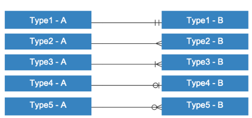

# database

erd-diagram 그리기!

쇼핑몰에서 쓸 수 있는 ERD를 그려보는 과제!

**관계선**

* **Identifying Relationship **
  * 모 테이블의 기본키 또는 복합키가 자식 테이블의 기본키 또는 복합키의 구성원으로 전이
  * **관계는 서로 종속**되게 된다.
* **Non-Identifying Relationship**
  *  자식 테이블의 일반 속성(Attribute) 그룹의 구성원으로 전이되는 비식별관계
  *  **부모는 자식의 부분적인 정보만을 표현함을 의미**

**관계선의 종류**

- 실선(Identifying): 식별관계

- - 부모테이블의 PK가 자식테이블의 FK/PK가 되는 경우
  - 부모가 있어야 자식이 생기는 경우

- 점선(Non-Identifying): 비식별관계

- - 부모테이블의 PK가 자식테이블의 일반속성이 되는 경우
  - 부모가 없어도 자식이 생기는 경우

**기호의 종류**(도형 혹은 식별자)

- ｜: 1개 / 실선은(dash) ‘1'을 나타낸다.
- ∈: 여러개 / 까마귀 발(crow’s foot or Many)은 ‘다수' 혹은 '그 이상'을 나타낸다.
- ○: 0개 / 고리(ring or Optional)은 ‘0'을 나타낸다.

**기호 예시**

* Type1(실선과 실선): 정확히 1 (하나의 A는 하나의 B로 이어져 있다.)

- Type2(까마귀발): 여러개 (하나의 A는 여러개의 B로 구성되어 있다.)
- Type3(실선과 까마귀발): 1개 이상 (하나의 A는 하나 이상의 B로 구성되어 있다.)
- Type4(고리와 실선): 0 혹은 1 (하나의 A는 하나 이하의 B로 구성되어 있다.)
- Type5(고리와 까마귀발): 0개 이상 (하나의 A는 0또는 하나 이상의 B로 구성되 있다.)

