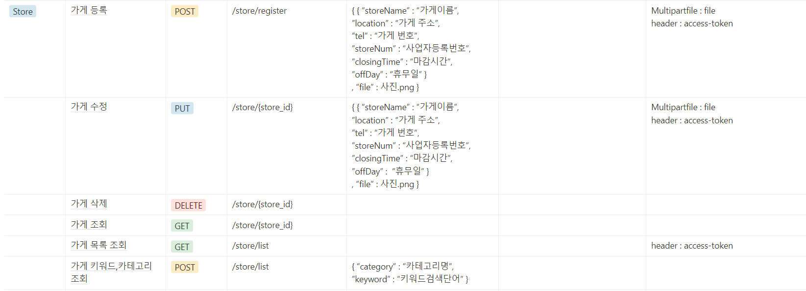

# axios 이용하여 데이터 불러오기

이 때 가장 중요한 것은 API 이용하여 불러오기!

API 명세서 참고!


* store쪽 API




1. header에 access-token이 필요한지 확인

   현재 사용자를 인증해야하는 곳에는 header에 access-token을 사용하여야함

   

2. 원래는 axios.메소드방식으로 사용하는데 http를 사용하는 이유!

   계속 axios와 content-type과 baseURL이 사용될 것 같아서 우리는 `@/util/http-common.js`에 

   ```js
   import axios from "axios";
   
   // axios 객체 생성
   export default axios.create({
     baseURL: "http://localhost:8080",
     headers: {
       "Content-type": "application/json",
     },
   });
   ```

   를 넣어놓고 import 해서 계속 불러옴!

   

3. 정해진 메소드방식으로 데이터 request 보내기

   ```
   1. post가 아닌 방식
   
   http.메소드방식("request 보낼 url 주소").then((response) => {
       	하고 싶은 것 
   	})
   
   ex)
   http.get("/user").then((response) => {
           console.log(response.data)
         });
   
   2. post 방식
   
   http.post("request 보낼 url 주소", {
   		request 보내야할 params
   	}).then((response) => {
   	    하고 싶은 것
   	})
   
   ex)
   http.post('/order', {
             saleItemId : this.currentItemId,
             count : this.count
           })
           .then((response) => {
             console.log(response)
           })
   ```

   

전체 코드!

```vue
<script>
import http from "@/util/http-common";

methods: {
    registStore () {
        // 원하는 함수를 만든 후 access-token 부여하기
        http.defaults.headers["access-token"] =
        localStorage.getItem("access-token");
        
        // 메소드 방식으로 데이터 request 보내기
        http.post("/user").then((response) => {
        if (response.data.role == "OWNER") {
          this.userState = 1;
        } else {
          this.userState = 0;
        }
      });
    }
}
</script>
```

