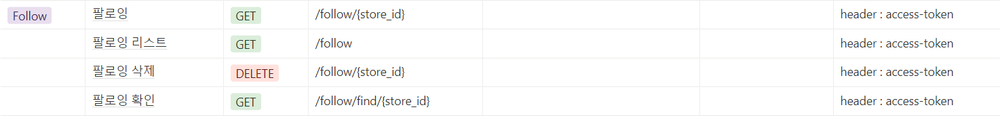

# 좋아요 버튼 기능 구현

1. template에 클릭할 좋아요 버튼 만들기
2. 스크립트에 만약 좋아요가 눌러있다면 좋아요 취소가 되고 좋아요가 눌러있지 않다면 좋아요라는 글이 떠야함
3. axios를 이용하여 내가 지금 이 매장으로 좋아요 하는지 확인하고
4. 데이터를 보내주어 리스트를 볼 수 있게 함


## API 명세서




## 코드 작성

* StoreView.vue

좋아요 버튼이 존재하는 페이지

매장 조회하는 페이지

```vue
<template>
<!--현재 팔로잉 하고 있다면 SUCCESS 현재 팔로우 하고 있지 않다면 FAIL-->
<button @click="like" v-if="isliking === 'fail'">좋아요</button>
<button v-else @click="unlike">좋아요 취소</button>
</template>

<script>
<!--원래 axios사용해서 import axios from 'axios' 쓰면 되는데 우리는 util에 http로 지정해놨음 -->
import http from "@/util/http-common";
export default {
    name:"StoreView",
    data: function () {
        return {
            storeId: Number,
            isliking: false,
        }
    },
    async created() {
        <!--처음 페이지가 딱 켜졌을 때 storeId 변수를 가져온다!-->
        this.storeId = this.$route.params.storeId;
        <!--처음 페이지가 딱 켜졌을 때 내가 이 매장을 like했는지 안했는지 확인하기 위함-->
        await this.likecheck();
        
    },
    methods: {
        <!--내가 이 매장을 좋아하는지 확인-->
        likecheck(){
      		http.defaults.headers["access-token"] =
        	localStorage.getItem("access-token");
            <!--GET 방식으로 현재 팔로우하고 있는지 확인하기-->
      		http.get(`/follow/find/${this.storeId}`)
                .then((res) => {
                <!--res.data를 isliking이라는 변수에 넣기-->
                this.isliking = res.data
        		})
    	},
        <!--아직 팔로우를 하지 않고 있다면 좋아하는 함수 실행-->
    	like () {
        	http.defaults.headers["access-token"] =
        	localStorage.getItem("access-token");
            <!--GET 방식으로 팔로우 하라고 api 보내기-->
        	http.get(`/follow/${this.storeId}`)
                .then((response) => {
                if(response.status == 200) {
                    alert("좋아요 눌렀음");
                }
            })
        },
        <!--팔로우를 하고 있다면 좋아요를 취소하는 함수 실행-->
    	unlike() {
      		http.defaults.headers["access-token"] =
        	localStorage.getItem("access-token");
            <!--delete 방식으로 팔로우 취소하라고 api 보내기-->
      		http.delete(`/follow/${this.storeId}`)
                .then((response) =>{
                if(response.status == 200) {
                    alert("좋아요 취소");
                }
            })
        },
    }
}
</script>
```


* regularList.vue

component안에 from 단골매장 리스트 데이터를 받아와서 regularList.vue에서 for 이용하여 데이터 보여주기

```vue
```


## 배운 내용

1. async-await


2. http.defaults.headers["access-token"] = localStorage.getItem("access-token");

```
사용자의 정보를 확인하기 위해서는 access-token이 필요함
따라서 access-token의 header에 현재 로컬 스토리지에서 저장된 access-token을 넣어야함

axios할 때마다 무조건 해야하는 거야!
```

